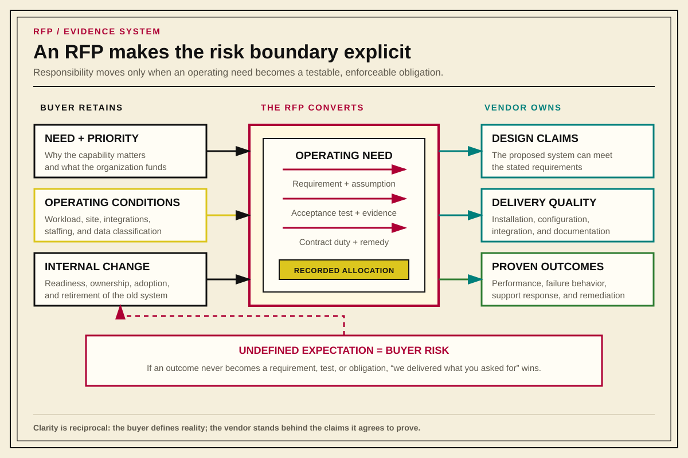
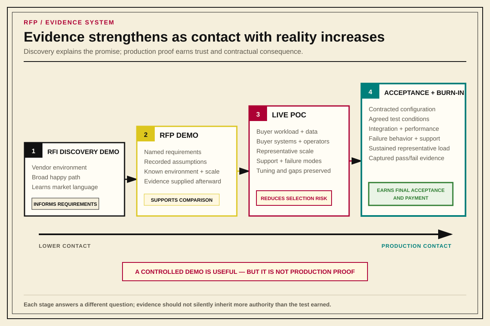
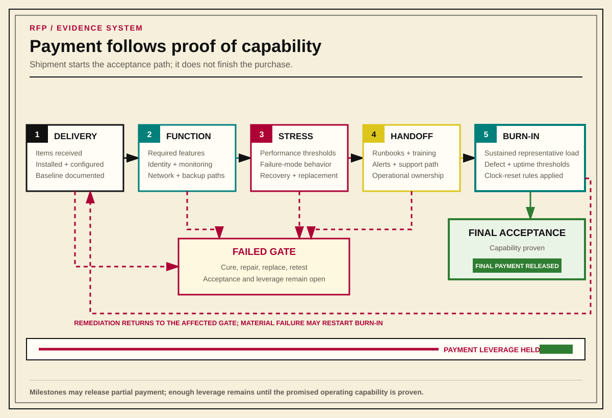

# RFPs and Vendor Selection as Evidence Systems

*The external-vendor form of a capability decision system: strict in its evidence obligations, tailorable in its ceremony and controls.*

## Thesis

An RFP records organizational need, vendor claims, evaluation criteria, assumptions, tradeoffs, and risk acceptance before money changes hands.

For high-risk technology purchases, procurement is complete when the purchased capability has been proven fit for production use under agreed conditions.

Many expensive technology failures occur even when the selected product can be made to work. Vague expectations, missing acceptance criteria, informal vendor promises, weak implementation gates, unclear operational ownership, and payment structures that reward activity instead of proof prevent a viable product from becoming a reliable capability.

**The organization must define "done" before the vendor, the budget cycle, and production pressure redefine "done" as "too late to object."**

The RFP process turns operational risk into visible requirements, testable evidence, enforceable obligations, and recorded decisions. It gives the organization a way to say what it needs, how it will decide, what it believes the vendor has promised, what evidence will count, and which risks it knowingly accepted.

The same process applies when the candidates are commercial products, managed services, open-source systems, a substantial internal redesign, or continued investment in the current system. The decision boundary changes while the logic remains: every capability decision needs a resolvable Current State, a Desired Outcome, Requirements, alternatives and claims, proportionate proof, a recorded decision, Acceptance Conditions, and later reconciliation.

Ceremony and controls should scale with consequence and reversibility. This model borrows from federal-style acquisition thinking while allowing neutral facilitation, sealed scoring, vendor-participation rules, contractual remedies, document length, POC depth, and burn-in duration to change with the decision. Every tier retains the evidence obligations.

---

## Why RFPs Exist

Organizations need formal RFPs because important purchases create commitments the organization will have to live with after the sales cycle ends.

A technology purchase can commit the organization to:

- an architecture
- an operating model
- a support relationship
- a security posture
- a migration path
- a cost structure
- a staffing model
- a vendor roadmap
- a failure mode
- an exit problem

Those commitments often last longer than the people who approved the purchase. If the original reasoning is not preserved, later teams inherit a system without the answer key. They may know what was bought, but not why it was chosen, what alternatives were rejected, what risks were accepted, what claims were made, or what outcomes the organization expected.

Lost reasoning causes organizations to retest rejected solutions and rediscover the same disqualifying facts. _If you don't write things down, you're just playing games._

The RFP exists to prevent that loss of context.

At its best, an RFP does five jobs:

1. It defines the operational capability the organization needs.
2. It forces requirements, constraints, and decision criteria into the open before vendor preference hardens.
3. It turns vendor claims into records that can be verified later.
4. It ties selection, implementation, acceptance, and payment to evidence.
5. It leaves behind a decision record the organization can reconcile against actual outcomes.

The same closed-loop pattern applies to work items, architecture decisions, process improvement, coaching, and talent development. The organization records a judgment when it is made, preserves the evidence and assumptions around it, routes the artifact through the people who must rely on it, then reconciles the original claim against what actually happened.

An RFP is that loop applied to external capability acquisition.

---

## The Failure Mode: Buying Activity Instead of Capability

Weak procurement processes tend to optimize for purchase completion:

- quote received
- budget approved
- purchase order cut
- contract signed
- hardware delivered
- license provisioned
- vendor installed it
- dashboard green for one afternoon

The purchase sequence can appear successful while leaving the organization with an unproven production system. Delivered equipment, labor, or access establishes activity; the buyer still needs evidence that the capability works in its production environment.

Common shallow completion signals include visible storage disks and a working admin UI, one successful HPC job and an impressive vendor benchmark, authentication in a lab tenant, or a single completed backup job.

The operational question is different:

**Does the system deliver the agreed capability, under agreed conditions, with known failure behavior, known support paths, known operating procedures, and evidence strong enough to trust it in production?**

A stronger RFP process optimizes for production readiness. It defines what must be true before selection, implementation, payment, handoff, and final acceptance can proceed.

The vendor should be accountable for the operational outcome those parts were purchased to create.

---

## RFP as Operational Risk Transfer

Every technology purchase leaves some risk with the buyer and transfers some risk to the vendor. A mature RFP process makes that allocation explicit.

Some risks should remain internal:

- the business need
- the priority of the capability
- internal stakeholder alignment
- internal operating model choices
- site readiness
- data classification
- internal staffing
- internal change management
- organizational willingness to retire old systems

Some risks may be transferred to the vendor:

- whether the proposed design can meet stated requirements
- whether the product can achieve agreed performance targets
- whether integration assumptions are valid
- whether installation and configuration follow agreed standards
- whether support paths work under defined severity conditions
- whether failures trigger remediation, replacement, credit, or rejection

An RFP is how the organization decides which risks sit where.

If the buyer only asks for a bill of materials, most risk stays with the buyer. The vendor can say, "We delivered what you asked for." If the system later fails to meet throughput, resilience, operability, or support expectations, the organization may discover that those expectations were never converted into obligations.

If the buyer defines operational outcomes, acceptance tests, implementation gates, burn-in criteria, remedies, and support obligations, the risk picture changes. The buyer retains responsibility for defining its workload, preparing its site, assigning operators, and approving required network changes. The vendor remains accountable for the claims it made and the outcomes it agreed to deliver.

**Operational risk transfer converts uncertain future pain into testable, enforceable vendor obligations before the system becomes too embedded to reject.**

Good vendors benefit from clear requirements, explicit assumptions, known acceptance criteria, and realistic buyer obligations. Ambiguity helps weak sales motions more than strong delivery teams.

{#fig-rfp-risk-allocation-boundary}

---

## Before the RFP

The RFP process starts before the RFP document exists.

The organization first needs to define the problem well enough that vendors are responding to the same need. Without that pre-work, the vendor market will define the problem for the buyer. Sometimes that reveals useful information. Sometimes it turns a real operational need into a contest between sales narratives.

Before issuing an RFP, capture:

- the problem statement
- current-state pain
- target capability
- stakeholders and accountable reviewers
- non-goals
- constraints
- dependencies
- operating model
- integration assumptions
- security and compliance requirements
- performance expectations
- support expectations
- migration expectations
- reversibility or exit strategy
- budget and timeline realities
- known risks
- decision gates
- evidence needed for acceptance

The pre-work records what the organization believed it needed before vendors had a chance to reshape the question.

Every RFP requires Current State. An authoritative architecture package and explicit delta can provide it without repeated prose. The RFP may identify that Current-State Baseline by revision and describe only the changes since it was accepted. The baseline must remain available to every legitimate respondent and reviewer, and the delta must say what was added, removed, upgraded, reconfigured, or newly measured. “See the old RFP” without an authoritative revision and explicit delta is an invitation to make different assumptions.

A Current-State Baseline should identify: component roles and ownership, dependency and trust boundaries, usage and workload profiles, capacity and performance evidence, retention or lifecycle rules, known failure behavior, support boundaries, and the parts of the operating model the new capability must preserve or deliberately change.

Market research and RFIs reveal what the market can provide, where similar deployments fail, which assumptions matter, what vendors will and will not guarantee, and which tests they consider meaningful.

A vendor refusing to guarantee something can be more useful than a vendor promising everything. The refusal tells the buyer where risk may remain internal, where the requirement may be unrealistic, or where the contract needs sharper language.

---

## RFP Document Anatomy

A strong infrastructure RFP usually looks something like this:

1. Executive summary
2. Department or business-unit overview
3. Current environment
4. RFP response instructions
5. Vendor qualifications
6. Hardware requirements
7. Networking requirements
8. Capacity requirements
9. Data-center requirements
10. Software and client requirements
11. Data protection requirements
12. Benchmark requirements
13. Documentation requirements
14. Warranty and support requirements
15. Acceptance test
16. Attachments

The current-environment section should be specific enough for vendors to design against reality. For a storage platform, that may include descriptions of the existing hardware configuration, observed performance, storage profile, and the procurement context for the replacement.

The buyer defines the rules of engagement in the RFP response instructions. That section should cover:

- general terms
- eligibility to participate
- formal contact information
- proposal submission
- electronic proposal requirements
- large-file, hard-copy, or physical-media submission rules
- ownership and confidentiality of proposals
- clarity expectations
- supporting material
- vendor briefing
- proposal response requirements
- proposal-validity period
- language and measurement
- vendor responsibility
- required documentation
- options and alternates
- evaluation methodology
- partial or noncompliance
- vendor contact information
- target schedule and delivery
- definitions
- requirements structure

The technical requirements should then be organized by the operating surfaces the buyer must live with after the completion of work. For a storage RFP, that means storage hardware, networking, capacity, data center, software and clients, data protection, benchmarks, documentation, support, and acceptance. Other domains use different headings within the same sequence: describe the environment, define how vendors must respond, then state the requirements in the categories operators will later use to validate and run the system.

The definitions section needs review and approval from the company's legal department. The RFP must define terms such as "available," "supported," "integrated," "real time," "high performance," "production ready," "turnkey," and "accepted": many industries consider themselves latency sensitive, but relatively few are sensitive to picoseconds of latency. Undefined language and measurement allow each vendor response to supply its own interpretation.

The response format is also a control surface. Vendors should be told how to answer requirements, how to identify exceptions, how to attach assumptions, how to price options, how many alternates they may submit, and which claims require supporting evidence.

The formal contact should usually be detached from the project team. Technical staff may continue speaking with vendors, while official questions, answers, schedule changes, requirement clarifications, and addenda flow through a controlled channel available to the full field.

---

## Requirements

An RFP must define the language that distinguishes facts, obligations, and options before using that language to state requirements. Controlled language determines what kind of claim a sentence makes, and the sentence itself describes a condition that can be evaluated.

### Requirements Structure

Every RFP should define its requirements language before the first numbered requirement. One useful notation distinguishes facts, requirements, and goals through the governing verb:

- `will` statements describe current facts, buyer constraints, or environmental conditions
- `shall` statements define mandatory requirements that must be met and verified
- `should` statements define goals, preferences, or non-mandatory provisions that vendors must address but that may not be formally verified

Controlled notation distinguishes each kind of obligation and gives evaluators a stable reference. For example, `Requirement 7[3]` identifies the third `shall` statement in section 7; `Option 7[2]` identifies the second `should` statement in that section.

Examples:

- The proposed platform `will[1]` be installed in the buyer's primary production data center.
- The buyer `will[2]` provide rack space, network drops, power, and identity-provider access according to the site-readiness plan.
- The vendor `shall[1]` provide a concise architecture summary that identifies each major component, its role, and its relationship to the rest of the system.
- The vendor `shall[2]` include any auxiliary systems required for user access, orchestration, management, monitoring, or normal operation.
- The proposed design `shall[3]` allow routine service of individual components without interrupting the full platform, except where an exception is explicitly identified and accepted.
- The proposal `shall[4]` identify the model, configuration, firmware or software baseline, and support status of all major components.
- The vendor `shall[5]` provide current administrator documentation, troubleshooting documentation, configuration guidance, and update procedures electronically.
- The vendor `shall[6]` describe the warranty, maintenance, escalation, and software-update model for the full proposed solution.
- The vendor `should[1]` describe any design option that would improve resilience, observability, serviceability, or long-term expansion without changing the core scope of the purchase.

### Writing Requirements

RFP requirements should describe what must be true in production. Equipment and product specifications belong where they express a real constraint on that capability.

Insufficient:

> Provide a storage cluster with N nodes and X capacity.

Capability requirement:

> Provide a storage capability that supports this list of workloads, throughput and latency requirements, failure modes, recovery expectations, protocol requirements, operational integrations, and acceptance tests.

Constraints must be included in the requirements. Vendor solutions must account for real-life constraints like physical space, or a facility's heating and cooling capabilities, or available electrical capacity, and so forth.

Useful requirement categories include:

- functional requirements
- non-functional requirements
- operational requirements
- security requirements
- integration requirements
- reporting and audit requirements
- performance requirements
- resilience requirements
- support and lifecycle requirements
- migration requirements
- exit requirements
- documentation and training requirements
- acceptance requirements

---

## Process Stages

A high-risk technology purchase should move through stages. Each stage produces evidence and gives the organization a chance to correct course before exposure increases.

A strict model looks like this:

1. Problem definition
2. Market research or RFI
3. Acquisition strategy
4. Requirements package
5. Evaluation model
6. RFP release
7. Vendor questions and clarifications
8. Response intake
9. Compliance screening
10. Scored evaluation
11. Demonstrations or proof of concept
12. Vendor claim register review
13. Selection decision record
14. Contracting and statement of work
15. Design review
16. Site-readiness review
17. Delivery
18. Installation
19. Baseline configuration
20. Integration
21. Functional validation
22. Performance validation
23. Failure-mode validation
24. Burn-in testing
25. Operational handoff
26. Final acceptance
27. Warranty and support lifecycle
28. Post-implementation review
29. Lessons learned

As risk lowers, stages can be combined, an existing Current-State Baseline can be reused, a short option comparison can replace formal scoring, and ordinary validation can replace a dedicated POC when the consequence and reversibility justify it. The underlying obligations remain, though.

### Controlled Vendor Communication

The vendor-facing schedule should establish when the RFP is issued, when vendors may ask questions, when the buyer will publish answers or addenda, when briefings or site visits will occur, which RFP revision governs the response, and when proposals are due. Internal evaluation and award dates may remain estimates, but every vendor needs the same authoritative planning baseline.

A practical sequence before the RFP closes is:

1. RFP issued
2. vendors submit an initial round of written questions
3. vendor briefing or site visit held so vendors can understand the buyer's environment
4. buyer publishes all material answers in a shared FAQ or addendum
5. vendors submit a final round of written questions
6. buyer publishes the final answers and any resulting RFP revision
7. vendors acknowledge the applicable addenda and prepare proposals against the final revision
8. RFP closes

The vendor briefing helps vendors understand the environment well enough to respond accurately. Any fact, clarification, or changed instruction that another vendor would need to prepare a comparable proposal enters the shared record through an FAQ, addendum, or revised RFP.

Fairness requires every vendor to prepare its proposal from the same authoritative buyer information. Vendors may ask different questions, expose different assumptions, and discuss proprietary aspects of their proposed designs; the buyer's material facts and clarifications remain available to the full field.

### Proposal Intake and Clarification

Each proposal should be recorded against the exact RFP revision and addenda it answers. Compliance screening then determines whether the proposal satisfies the mandatory submission and requirement gates before brand familiarity, presentation quality, price, or evaluator preference begins influencing comparative judgment.

Clarification is limited to the proposal that was submitted: resolving an ambiguity, identifying where an answer appears, or confirming how the vendor interpreted a requirement. Replacing the architecture, curing a failed mandatory requirement, introducing a new commercial offer, or rewriting material portions of the response requires a controlled revision round.

A vendor that misunderstands the requirements after ample opportunity for questions presents a substantial implementation risk.

If the buyer discovers that the requirement itself must change, or decides that vendors should be allowed to submit materially revised proposals, the buyer should open a controlled revision round for every affected vendor. The new information, submission rules, and deadline enter the authoritative record for the full field.

### Evaluation Sequence

Evaluation should preserve the difference between the vendor's claim, the evaluator's initial judgment, and evidence produced later. A practical sequence is:

1. compliance screening against mandatory gates
2. independent initial evaluation against the published criteria
3. recorded clarification of material ambiguities
4. initial comparative scoring
5. demonstrations, benchmarks, or POCs against declared scenarios and success conditions
6. vendor claim register and risk review updated from the resulting evidence
7. final scoring and documented evaluator rationale
8. selection decision recorded against the requirements, evidence, residual uncertainty, and accepted risk

A polished demonstration leaves a weak proposal weak, and a successful POC supports only claims within the tested boundary. Evidence produced after submission should remain linked to the claim it tested, the conditions under which it was produced, and any judgment it changed. Any permitted proposal revision occurs as a declared stage with a new authoritative record.

### When the Strict Model Applies

For foundational infrastructure, the strict model is often appropriate because late discovery becomes expensive precisely when the organization has become least willing to reconsider its favorite. Storage, HPC, virtualization, backup, identity, and network core purchases can reshape operations for years; an unresolved requirement or unsupported claim can become a long-lived operating constraint after selection, contracting, and implementation create pressure to proceed.

Quote comparisons and vendor lunches may produce useful market information. Shared requirements, controlled comparison, verified evidence, and a durable account of accepted risk require the larger process.

---

## Scoring and Evaluation Principles

The evaluation model must exist before responses are scored.

People form preferences early: a persuasive vendor, familiar brand, strong incumbent relationship, impressive demo, or attractive price can become the answer before the organization has agreed on the question. Once that happens, evaluation criteria often become decoration.

The scorecard should be visible to evaluators before vendor responses arrive. It should identify must-have gates, disqualifiers, weighted criteria, and risk factors.

### Separate musts from wants.

Musts are pass/fail conditions. If a vendor cannot meet them, the proposal is noncompliant or the organization must explicitly rewrite the requirement and notify the field. Wants are comparative criteria. They distinguish acceptable proposals from stronger ones.

A failed hard requirement remains disqualifying regardless of a beautiful demo, discount, or pile of attractive extras. A preference has comparative weight and no disqualifying force.

Useful evaluation categories include:

- technical fit
- requirement compliance
- implementation credibility
- performance evidence
- operational support model
- migration plan
- integration complexity
- acceptance-test credibility
- similar deployment history
- security and supply-chain posture
- lifecycle cost
- staffing impact
- operational burden
- support burden
- warranty and support terms
- vendor maturity
- roadmap risk
- reversibility
- contractual accountability
- commercial risk

Price is unavoidable and belongs alongside lifecycle cost, operational burden, support quality, implementation risk, and the cost of being wrong.

For high-stakes decisions, the weights themselves should be decided before scoring and stress-tested for outliers. One useful method is a lightweight Band Delphi:

1. Evaluators privately assign each criterion a weight, such as 1-5.
2. A neutral facilitator gathers the weights.
3. Outliers on either side explain their reasoning.
4. Evaluators revote after hearing the rationale.
5. The final weights are recorded before vendor scores are applied.

Neutrality requires detachment from which solution wins. In many organizations, that means a facilitator from a governance function whose job is to protect process integrity. If a systems engineering team is buying a storage cluster, the CTO and the director of front-end engineering may each contribute useful judgment, but each is attached to the operating, political, or architectural consequences of the decision.

The same pattern can be used for value scores to surface judgment before vendor preference hardens.

A simple scoring model can then separate technical merit from cost:

- score each vendor against the weighted criteria
- total the weighted merit score
- normalize merit across vendors
- normalize cost across vendors
- combine normalized merit and normalized cost using the agreed formula
- preserve any narrative override or accepted risk in the decision record

The highest combined score should create a strong presumption. The final written decision records material risks outside the model and explains why the result remains acceptable.

Where possible, separate scoring from narrative judgment. The scorecard records how the vendor performed against known criteria. The narrative records the material risks, evidence, and judgments the score cannot express.

Narrative judgment should capture risks the scorecard misses. A vendor may count an automated ticket reply or a message that someone is looking into the issue as satisfying a two-hour first-response SLA, while the buyer must still escalate incidents through the sales team to obtain useful action. That support behavior directly affects stability and availability risk.

---

## Vendor Demonstrations and Proofs of Concept

RFI, RFP, and POC work often get compressed into one ambiguous word: demo.

A vendor-controlled path through a happy-case environment with no realistic load, no buyer data, no integration pressure, no failure mode, and no operational handoff can be useful during discovery (RFI), but remains insufficient for the RFP process.

Before a demo, define what it is supposed to prove. An undefined proof objective places the organization in the RFI phase.

In an RFI, a broad vendor demo can be legitimate discovery. It helps the buyer learn the market, sharpen language, and understand what a category of products can do. In an RFP, the demo should be evidence against stated requirements. In a POC, the demonstration should give way to direct contact with the buyer's workload, environment, operators, and failure modes.

Stage confusion changes the meaning of the evidence. A discovery demo can inform requirements; production readiness requires proof under declared production conditions.

At minimum, record:

- which requirements the demo addresses
- which requirements it does not address
- what environment the demo uses
- what data, workload, or scale is represented
- which assumptions the vendor is making
- who must attend
- who is responsible for capturing claims
- what questions must be answered
- what would count as a concern
- what evidence must be supplied afterward

A proof of concept should apply declared workloads, conditions, and success criteria to specific vendor claims.

Any meaningful platform, vendor, or open-source selection should include a live proof of concept unless the cost of doing so is clearly disproportionate to the decision. Research narrows the field. Demos explain the promise. POCs expose the operating reality.

For serious technology selections, the organization should prefer competing live POCs over paper comparison alone. If research identifies three plausible candidates, stand up the candidates, drive representative workload through them, observe how they behave, and record the tradeoffs. Contact against reality replaces sales motion, popularity, and assumption; a perfect laboratory is unnecessary.

A POC should define:

- what claim it is testing
- what success means
- what failure means
- what inconclusive means
- what data and scale are realistic
- what representative workload, data volume, or workflow will be exercised
- who runs it
- who observes it
- which buyer systems are involved
- which vendor systems are involved
- what support model is exercised
- what assumptions remain afterward

The closed-loop rule is that demonstrations and POCs produce evidence against pre-stated claims.

If the vendor says a storage platform can sustain a required workload, the POC should preserve what workload was tested, what scale was used, what results were observed, what tuning was required, and what remains unproven.

If the vendor says an HPC cluster can support a workload profile, the POC should distinguish a vendor benchmark from a buyer workload benchmark. The buyer workload benchmark must exercise the scheduler, filesystem, identity integration, monitoring, and user environment together.

If the organization is replacing an internal system, the POC should test the candidate against the operating burden that caused replacement to be considered in the first place. Evaluate a metrics platform replacement with representative metrics volume, retention expectations, query patterns, ingestion behavior, operational architecture, failure modes, and the team's ability to run it. The selected solution may still require redesign later; evidence makes the remaining risk explicit enough to learn from.

For a metrics platform, “representative volume” should resolve into recorded measurements: sustained and burst samples per second, active-series cardinality, series churn, bytes ingested and stored by retention tier, label and tenant concentration, query concurrency and range, dashboard and alert-query latency distributions, rule-evaluation duration and misses, collector backlog, data loss during failure, recovery duration, and operator effort for backup, restore, upgrade, capacity expansion, and incident diagnosis. Unknown measurements enter Discovery and must be resolved before the buyer declares a baseline.

The demonstration should never become the whole evaluation. It is one evidence source.

{#fig-rfp-evidence-escalation}

### Benchmark and Workload Selection

Benchmarks are useful only when they match the decision being made. A benchmark that proves one kind of capability can be noise, or even misdirection, for another.

The buyer should also ask vendors for their own system-exercise tools. If the vendor has a burn-in harness, diagnostic suite, workload generator, or validation procedure, the RFP should require it to be disclosed and made available for acceptance testing when appropriate. The vendor's preferred test reveals what the vendor believes stresses the system; the buyer determines whether additional tests are required.

### Application to Open Source Tooling
Open-source selection carries the same evidence obligations as vendor selection. A free license can still commit the organization to an operating model, staffing profile, integration burden, support path, upgrade lifecycle, state-management problem, and future migration cost. Popularity, adoption, marketing, and prevalence in large companies provide market evidence; architectural fit still requires proof against the buyer's environment.

Every substantial redesign should therefore include an Implementation Currency Check. The team should inspect current authoritative guidance, releases, deprecations, maintained alternatives, and known failure modes before extending a homegrown component whose original differentiation may have disappeared. If a maintained external capability now provides the ordinary solution, retiring the bespoke burden can be the more responsible engineering decision. That is how an organization builds without volunteering to maintain every mechanism forever.

Tool adoption should distinguish between reducing accidental complexity and relocating it. A tool that replaces bespoke automation may still impose a new operating model, hiring profile, workflow, state-management burden, and ecosystem dependency. Ask what complexity the tool removes, what complexity it introduces, and whether the organization is prepared to operate the model it requires.

Jane Street's Mailcore story is a useful example. The firm had been using a widely deployed open-source mail server that could perform the required work, but its bespoke configuration language made critical compliance behavior hard to reason about, hard to test in smaller units, and dependent on specialist knowledge. The replacement decision rested on operability, staffing, testability, and change safety. The replacement still required evidence: they shadowed the old and new systems, diffed real mail behavior for months, found classes of mismatches, and migrated users gradually.

---

## The Vendor Claim Register

Every important vendor claim should become a durable row.

Vendor claims often arrive through calls, emails, slide decks, hallway comments, demos, sales engineering sessions, contract redlines, and support conversations. If those claims are not captured, the organization later has to reconstruct what it thought it heard.

A vendor claim register should record:

- vendor
- claim
- date and source
- who heard or received it
- requirement or risk related to the claim
- condition or assumption attached to the claim
- evidence supplied
- verification method
- owner responsible for verification
- status: unverified, verified, contradicted, accepted risk, or not tested
- later implementation result

Every claim that influences the purchase must be verified, converted into a contract obligation, or explicitly accepted as risk.

The claim register is the RFP equivalent of an evidence ledger. It connects selection to implementation and implementation to post-implementation review.

---

## Decision Records

The final selection should leave behind a Selection Decision Record.

The decision record should preserve:

- why this vendor was selected
- why the other vendors were not selected
- which requirements were fully met
- which requirements were partially met
- which tradeoffs were accepted
- which risks were accepted
- which assumptions must be revisited
- which vendor claims became commitments
- which vendor claims remained unverified
- what the organization expects to be true after implementation
- who owns follow-up
- when the decision should be reviewed

A durable claim record gives future operators something to reconcile. If Vendor A later fails on support, the organization knows which assumption broke. If Vendor B later ships the missing integration, the next evaluation starts smarter. If Vendor C proves reliable elsewhere, the organization can revisit whether its concern was correct.

Without the decision record, later teams inherit folklore.

---

## Acceptance, Burn-In, and Payment

Acceptance criteria are the buyer's defense against ambiguity.

Define how success will be tested before the vendor can redefine success around whatever was delivered.

Plan acceptance before award and finalize it before implementation.

Useful acceptance layers include:

- delivery acceptance: the contracted items arrived
- installation acceptance: the system is racked, cabled, powered, installed, and configured according to the statement of work
- functional acceptance: the system performs required basic functions
- integration acceptance: required connections to identity, monitoring, backup, network, ticketing, logging, or other systems work
- performance acceptance: the system meets agreed performance targets under agreed test conditions
- failure-mode acceptance: expected component, path, node, controller, or dependency failures behave within agreed limits
- operational acceptance: documentation, runbooks, escalation paths, monitoring, alerting, training, and support handoff are complete
- production acceptance: the system survives a defined burn-in period under real or representative load

For infrastructure purchases, a minimal acceptance sequence often has three practical phases:

1. Validate connectivity and required integrations.
2. Validate the agreed benchmarks or workload tests.
3. Run burn-in under sustained load and resolve defects before final acceptance.

The details depend on the system. A storage platform may need protocol, multipath, metadata, throughput, rebuild, failover, and client-behavior tests. A GPU or HPC platform may need HPL, GPU burn, scheduler integration, filesystem behavior, thermal observation, and power observation under load. A network or latency-sensitive platform may need jitter testing, failover timing, packet-loss behavior, and clock-synchronization validation.

The acceptance plan should state who runs each test, what evidence is captured, who signs off, what constitutes failure, how failed hardware is replaced, and whether replacement or remediation restarts any portion of burn-in.

A burn-in period is the bridge between "it passed the demo" and "we trust it in production."

The burn-in period should define:

- duration, such as 30, 60, or 90 days depending on criticality
- workload type: real, synthetic, or representative
- performance thresholds
- defect severity levels
- uptime expectations
- allowed maintenance windows
- environmental observations such as heat, power, and throttling under load
- what resets the burn-in clock
- what defects delay acceptance
- what failures trigger vendor-funded remediation
- what failures trigger replacement, credit, rejection, or termination

Final payment should follow final acceptance.

Delivery invoicing can reflect receipt of the contracted items. Payment for the completed capability waits for final acceptance.

Payment structure is one of the strongest ways to assign risk. For well-defined infrastructure purchases, milestone-based payment is often more appropriate than paying the full amount when equipment arrives.

Milestones may include:

- design accepted
- equipment delivered
- installation complete
- baseline configuration complete
- integration complete
- functional acceptance passed
- performance acceptance passed
- operational handoff complete
- burn-in complete
- final acceptance signed

The contract should also define remedies when the vendor fails to deliver the promised thing. Possible remedies include a cure period, escalation path, withheld payment, service credits, vendor-funded remediation, replacement obligations, extended warranty or support, delayed final acceptance, right to reject, right to terminate, refund terms, and post-acceptance defect obligations.

The exact remedy language belongs with procurement and legal counsel. The operating principle belongs in the RFP: the organization should know what happens if the promised capability does not arrive.

{#fig-rfp-acceptance-payment-gates}

---

## What to Scale Under Lower-Risk Conditions

Risk determines the depth of ceremony and controls.

The lightweight process consciously compresses the strict process. Every tier retains a resolvable Current-State Baseline, need and Desired Outcome, Requirements, reasonable alternatives, verification, a decision record, Acceptance Conditions, and a reconciliation point. At lower tiers, one short record may satisfy several of those obligations.

### Tier 1: Low-Risk Purchase

Examples include small non-critical tools, easily reversible purchases, and purchases where failure creates limited operational impact.

Minimum process:

- identify the Current-State Baseline and material delta
- define the need and Desired Outcome
- confirm basic Requirements
- compare reasonable options, including the current system
- document the decision and accepted uncertainty
- verify Acceptance Conditions
- set the reconciliation point
- preserve receipts, terms, and renewal dates

Usually stripped down:

- formal RFI
- formal RFP
- weighted scorecard
- detailed vendor claim register
- proof of concept
- staged payment
- long burn-in
- separate post-implementation-review ceremony

The decision still needs a record, but the record can be short.

### Tier 2: Moderate-Risk Technology Purchase

Examples include team-level infrastructure, non-critical storage, monitoring tools, limited-scope platforms, and tools that affect a bounded user group.

Minimum process:

- identify the Current-State Baseline and material delta
- define the operational capability and Desired Outcome
- document requirements
- compare commercial, open-source, internal, and status-quo options that are genuinely available
- define acceptance criteria
- require an implementation plan
- verify integration
- complete a short burn-in
- document handoff
- record the selection decision
- reconcile the accepted capability against live operation

Usually stripped down:

- broad market RFI (in practice, this is frequently senior+ engineers researching capabilities)
- highly formal source-selection procedure
- extensive contract remedies
- 60- or 90-day burn-in
- heavy executive governance

The buyer should still preserve vendor claims that materially affect the decision.

### Tier 3: High-Risk Foundational Infrastructure

Examples include production storage clusters, HPC clusters, virtualization platforms, backup systems, identity platforms, major network infrastructure, and systems whose failure would create business continuity, security, or large operational risk.

Use the strict model:

- acquisition planning
- market research or RFI
- formal RFP
- scored evaluation
- vendor claim register
- milestone-based payment
- design review
- site-readiness gate
- implementation gates
- functional acceptance
- performance acceptance
- failure-mode testing
- operational handoff
- 30- to 90-day burn-in
- final acceptance
- remedies for failure
- post-implementation review
- lessons learned

The stricter process exists because late discovery is expensive. Once a foundational system is wired into production, rejected alternatives become harder to recover, vendor leverage changes, and the organization may start accepting defects because backing out feels impossible.

---

## Common Failure Modes

### The Organization Cannot State the Need

The RFP starts with a preferred product, architecture, or vendor rather than a capability need. Vendors respond to the buyer's guessed solution instead of the operating problem.

### Requirements Are Written as Preferences

The buyer turns familiar mechanisms into requirements without proving they are non-negotiable. This can exclude better solutions or hide the real constraint.

### Evaluation Criteria Arrive Too Late

The organization decides what matters after it already knows which vendor it wants. The scorecard becomes a justification artifact instead of a selection tool.

### Demos Are Mistaken for Evidence

The vendor demonstrates a happy path in a controlled environment, and the organization treats that as proof of production readiness.

### Consensus Replaces Live Proof

Credible people agree that a credible tool is the right choice, but nobody proves the tool against representative workload, real operating constraints, or the team's ability to run it. The organization mistakes agreement for evidence.

### Adoption Gravity Is Mistaken for Fit

The selected tool is popular, common in large companies, or strongly recommended by vendors and peers, so the organization assumes it is architecturally fit. Fit still requires evidence against the buyer's workload, skill base, operating model, and failure modes.

### Vendor Claims Are Not Preserved

Important promises remain trapped in meetings, emails, slide decks, and memory. During implementation, nobody can prove what was claimed, what was assumed, or what was accepted as risk.

### Procurement, Engineering, Security, Finance, and Operations Evaluate Different Realities

Each function focuses on a different part of the purchase. Procurement sees terms, engineering sees technical fit, security sees control gaps, finance sees cost, and operations sees future toil. The RFP process fails when those realities are never reconciled into one decision.

### Delivery Becomes Acceptance

The organization treats arrival, installation, or initial login as success. The vendor exits before performance, resilience, monitoring, documentation, training, and support paths are proven.

### Payment Rewards Activity Instead of Proof

The contract pays for shipment, installation, or effort without holding enough leverage for acceptance, burn-in, and remediation.

### Operational Burden Is Left Out of the Decision

The selected tool works, but only by creating staffing load, alert fatigue, manual maintenance, upgrade risk, or support complexity that was not included in the evaluation.

### No One Owns Reconciliation

The purchase is approved, implemented, and forgotten. Nobody compares actual outcomes against the original problem statement, scorecard, vendor claims, cost model, implementation plan, and operator experience.

Without reconciliation, every RFP starts from organizational amnesia.

---

## Post-Implementation Review

The post-implementation review closes the loop.

After implementation, compare actuals against:

- original problem statement
- RFP requirements
- evaluation scorecard
- vendor claim register
- demonstration and POC findings
- implementation plan
- cost model
- support model
- reliability expectations
- operability expectations
- user experience
- operator experience
- accepted risks
- final acceptance criteria

The post-implementation review makes the next RFP smarter while preserving an honest record of the selection team's judgment.

Useful questions:

- Did the system solve the problem we said it would solve?
- Which requirements mattered most in practice?
- Which requirements were unnecessary?
- Which vendor claims were verified?
- Which vendor claims failed, shifted, or became irrelevant?
- Which assumptions were wrong?
- Which risks were accepted knowingly?
- Which risks appeared without being captured?
- Did the support model work?
- Did the implementation plan match reality?
- Did the operating burden match the evaluation?
- Did the payment and acceptance structure preserve enough leverage?
- What should the next RFP do differently?

Feed the review findings into requirement templates, scorecards, contract language, demo rules, POC design, acceptance criteria, and the vendor claim register.

The organization is allowed to learn. The system should make learning hard to lose.

---

## Appendix: Lightweight Templates

These intentionally plain templates show the shape of the evidence. Existing forms, master purchase agreements, universal terms and conditions, NDAs, insurance requirements, approval workflows, and legal language remain under procurement, legal, finance, security, and contract specialists.

### Sample Vendor Claim Register

| Vendor | Claim | Source | Related Requirement | Assumption or Condition | Evidence Required | Verification Owner | Status | Implementation Result |
|---|---|---|---|---|---|---|---|---|
| Vendor A | Platform supports required client OS versions. | Written proposal | Client compatibility | Buyer maintains supported patch levels. | Compatibility matrix and test result | Engineering | Unverified | TBD |
| Vendor A | System can meet target throughput under representative workload. | Demo and proposal | Performance | Workload profile matches supplied test plan. | Benchmark report and buyer-run POC | Engineering | Verified | TBD |
| Vendor B | Support responds within required severity window. | Contract response | Support | Buyer uses named escalation path. | SLA language and reference check | Operations | Accepted risk | TBD |
| Vendor C | Migration can complete within planned window. | Proposal | Migration | Required network changes complete first. | Migration plan and dependency list | Project owner | Unverified | TBD |

Useful status values include: unverified, verified, contradicted, accepted risk, not tested, superseded, and converted to contract obligation.

### Sample Selection Decision Record

Use this as a lightweight decision record.

- Decision title:
- Date:
- Decision owner:
- Evaluators:
- Procurement or process facilitator:
- Business need:
- Operational capability being purchased:
- Vendors considered:
- Vendors rejected before scoring and why:
- Must-have gates:
- Scored criteria:
- Selected vendor:
- Why this vendor was selected:
- Why the other finalists were not selected:
- Major tradeoffs accepted:
- Major risks accepted:
- Vendor claims converted to obligations:
- Vendor claims accepted without verification:
- Required implementation gates:
- Acceptance criteria:
- Payment or invoicing dependencies:
- Follow-up owner:
- Review date:

The decision record should be short enough that people will actually write it and specific enough that future operators can reconcile the choice against reality.

### Sample Evaluation Scorecards

The numbers below are examples. Criteria, weights, and gates should be changed for the purchase in front of the organization.

**Storage Cluster**

| Criterion | Type | Example Weight |
|---|---|---:|
| Meets required capacity and growth profile | Must | Pass/fail |
| Meets required protocol and client support | Must | Pass/fail |
| Fits data-center power, cooling, and rack constraints | Must | Pass/fail |
| Meets security and authentication requirements | Must | Pass/fail |
| Performance under representative workload | Want | 5 |
| Failure-mode behavior and rebuild impact | Want | 5 |
| Operational support model | Want | 4 |
| Management, alerting, and reporting quality | Want | 3 |
| Migration plan credibility | Want | 4 |
| Lifecycle cost | Want | 4 |
| Vendor maturity and references | Want | 3 |
| Exit or expansion flexibility | Want | 2 |

**HPC or GPU Compute Platform**

| Criterion | Type | Example Weight |
|---|---|---:|
| Meets required accelerator, CPU, memory, and interconnect constraints | Must | Pass/fail |
| Integrates with scheduler, identity, storage, and monitoring | Must | Pass/fail |
| Fits data-center power, cooling, and serviceability constraints | Must | Pass/fail |
| Meets support geography and response requirements | Must | Pass/fail |
| Performance on representative workloads | Want | 5 |
| Latency, jitter, NUMA, or cache behavior where relevant | Want | 4 |
| Burn-in and hardware replacement plan | Want | 4 |
| Management and firmware lifecycle | Want | 3 |
| User environment compatibility | Want | 3 |
| Operational handoff quality | Want | 4 |
| Lifecycle cost | Want | 4 |
| Comparable deployments and references | Want | 3 |

**Lower-Risk SaaS Tool**

| Criterion | Type | Example Weight |
|---|---|---:|
| Meets security, privacy, and data-handling requirements | Must | Pass/fail |
| Supports required identity and access model | Must | Pass/fail |
| Meets budget and purchasing constraints | Must | Pass/fail |
| Satisfies core workflow requirement | Must | Pass/fail |
| Ease of adoption | Want | 4 |
| Administrative burden | Want | 4 |
| Reporting and auditability | Want | 3 |
| Support quality | Want | 3 |
| Integration effort | Want | 3 |
| Renewal and exit terms | Want | 4 |
| Total cost over expected use period | Want | 4 |

### Sample Conditions of Vendor Participation

Procurement and legal should review this section before use and supply the applicable contract language. These examples make the participation rules explicit.

**General terms**

- The RFP is a request for proposals, not an offer to contract.
- The buyer is not obligated to reimburse vendors for proposal preparation costs.
- Submitted materials become the property of the buyer and may be copied or retained for RFP-related purposes.
- Proposal statements, supplemental submissions, and negotiation materials may be treated as binding on the selected vendor if incorporated into the final agreement.
- Price changes after award require documented justification and may be considered during renewal or extension review.
- The selected vendor must satisfy required insurance, compliance, and contracting conditions before execution.
- If contract documents conflict, the final agreement takes precedence over the RFP, and the RFP takes precedence over purchase-order or invoice terms unless the agreement says otherwise.
- The vendor acts as an independent contractor, not as an employee, agent, or managed extension of the buyer.

**Eligibility and formal contact**

- State who is eligible to participate.
- Require non-invited vendors to request permission through the formal contact.
- Reserve the buyer's right to decide whether to invite additional vendors.
- State that adding a vendor does not automatically change deadlines.
- Require all official questions, clarifications, addenda, and submission issues to flow through the formal contact.

**Proposal submission**

- State the closing date, closing time, timezone, and submission destination.
- Make vendors responsible for ensuring complete proposals are received before the deadline.
- State whether late proposals may be rejected without review.
- State the maximum number of proposals, alternates, or options a vendor may submit.
- Define electronic submission requirements.
- Define large-file, physical-media, or hard-copy submission requirements if needed.
- State that corrupted, unreadable, unavailable, or incorrectly linked materials may be excluded from evaluation if not corrected promptly on request.

**Ownership, confidentiality, and clarity**

- State that RFP materials are confidential and may be used only to prepare a response.
- Require vendors to mark any confidential portions of their proposal.
- State whether the buyer may copy and distribute proposal materials internally for evaluation.
- Make vendors responsible for removing ambiguity from their responses.
- State that the buyer is not responsible for discovering or correcting unclear vendor language.
- Require supporting material to be directly relevant, clearly referenced, and tied to the formal proposal.

**Vendor briefing**

- State whether the briefing is optional or mandatory.
- Require preregistration through the formal contact.
- State whether summaries, recordings, or written addenda will be provided afterward.
- Publish authoritative clarifications in written addenda or shared FAQ form available to the full field.

**Proposal response**

- State how long proposals must remain valid.
- State when and how proposals may be withdrawn.
- Require responses, attachments, and supporting materials to use the required language and measurement system.
- Make vendors responsible for understanding the RFP and promptly seeking clarification when requirements are unclear.
- State how RFP amendments will be acknowledged.
- Require vendors that decline to bid to notify the formal contact if that matters to the process.

**Required documentation**

Typical required documents include:

- formal proposal addressing the requirements
- line-item costs detailed enough to support a negotiated larger or smaller purchase
- administration, operations, and support documentation for the proposed solution
- RFP acknowledgment or intent-to-bid form
- comments or redlines to the master agreement, if requested
- confidentiality or NDA documents, if required
- company background survey
- exceptions, assumptions, and noncompliance list

**Options and alternates**

- Require options to be clearly identified as options.
- Require the vendor to state the benefit of each option.
- Require each option to meet the scope and functional intent of the relevant requirement.
- Require pricing, assumptions, and acceptance impact to be explicit for each option.

**Evaluation**

- Identify the review group or evaluation authority at the right level of abstraction.
- Reserve the buyer's right to reject noncompliant proposals.
- Reserve the buyer's right to accept or reject responses even when stated requirements are met.
- Disqualify attempts to bypass the formal contact or privately influence evaluators.
- State how and when vendors will be notified of selection status.
- State whether the selected vendor, scores, or evaluation details will be disclosed.

**Partial or noncompliance**

- Require proposals to address the entire RFP.
- State that partial or noncompliance may make a proposal ineligible.
- Require conditional, partial, alternate, or noncomplying responses to be identified explicitly.
- Require vendors to explain why an alternate approach satisfies the intent of a requirement.

**Target schedule and delivery**

The schedule should identify, at minimum:

- RFP issued
- intent to bid due
- confidentiality documents due, if required
- initial questions due
- vendor briefing
- final questions due
- RFP closes
- demonstrations or POCs for shortlisted vendors
- preferred vendor notified
- target delivery date

The buyer can provide the schedule in good faith without promising that every date is immovable. The selected vendor should still be required to nominate a firm delivery date once the implementation plan is known.

**Definitions and requirement notation**

Useful definitions include business day, closing time, timezone, measurement conventions, byte-versus-bit notation, acceptance period, and formal contact. The RFP should also define how requirement statements are interpreted, especially if it uses `will`, `shall`, and `should` notation.

### Sample Acceptance Test Structure

Acceptance testing should prove that the buyer received the contracted capability represented by the delivered equipment. The exact test belongs in the RFP, statement of work, or implementation plan, but a useful acceptance structure often looks like this:

- The selected vendor shall submit an acceptance-test plan that maps each test to the agreed requirements.
- The buyer shall approve, reject, or request changes to the plan using the stated acceptance criteria.
- Release of final payment should be tied to successful completion of the approved acceptance test.
- The buyer should execute, witness, or control acceptance testing, with vendor support available during the test window.
- The acceptance test shall demonstrate that all delivered equipment, software, licenses, services, and supporting components needed for normal operation are functional and reliable.
- Phase 1 shall validate integration with the buyer environment, including required network, identity, management, monitoring, logging, and support-path dependencies.
- Phase 2 shall validate that the system meets or exceeds the proposed performance under the agreed workload or benchmark conditions.
- Phase 3 shall validate stability under sustained real or representative load for the agreed burn-in period.
- The vendor shall provide tools, procedures, or workload generators sufficient for the buyer to exercise the system during stability testing.
- The stability period will begin when the system is operational and ready for buyer testing, subject to the site-readiness assumptions in the implementation plan.
- The acceptance plan shall define what failures pause, extend, or restart the test window.
- The acceptance plan shall define what failed hardware, failed software, missing licenses, unavailable components, or unstable dependencies mean for acceptance.
- The agreement should define the buyer's remedy if acceptance is not completed within the agreed cure period.

Availability language should be precise. If one failed component makes another component unusable, degraded, or unstable, the acceptance plan should say whether both count as unavailable. If site infrastructure failure, buyer-caused misconfiguration, planned maintenance, or approved vendor remediation is excluded from uptime calculations, those exclusions should be written down before testing begins.

### Sample Company Background Survey

Scale the company survey to the purchase, risk level, and contracting process. A low-risk SaaS purchase requires less company evidence than foundational infrastructure.

**About the respondent**

1. Provide your name, company address, email address, phone number, and role.
2. Are you the primary contact for technical questions? If not, identify the appropriate technical contact or contacts.
3. Are you the primary contact for commercial, contracting, or legal questions? If not, identify the appropriate contact or contacts.

**About the company**

1. Provide the full legal company name.
2. Provide the location of company headquarters.
3. Provide relevant business registry, tax, or commercial credit identifiers, if applicable.
4. State the company's fiscal year.
5. State whether the company is publicly traded. If so, provide the exchange symbol and most recent public annual report.
6. State whether the company is a subsidiary, division, or brand of a larger entity. If so, describe the ownership structure.
7. Provide the current number of full-time-equivalent employees for the relevant division and the overall company.
8. List current office locations, excluding partner offices.
9. List planned office locations or major geographic expansions, if relevant.
10. Provide revenue for the last three fiscal years, if disclosure is permitted.
11. Provide annual revenue for the relevant product or service category, if disclosure is permitted.
12. Describe projected growth over the next three years.
13. Describe experience with customers similar to the buyer in scale, operating model, regulatory posture, technical complexity, or mission criticality.
14. Provide three relevant customer references, including contact name, organization, phone number, and email address.
15. Identify comparable deployed systems, customers, or public reference architectures that demonstrate experience with this class of solution.
16. Identify any recognized benchmark lists, certification programs, reference programs, or industry validations relevant to this purchase category.
17. State how many customers currently use the proposed solution category, distinguishing between production deployments, pilots, and discontinued deployments where possible.

### Organizational Ownership Boundary

An RFP should name the interfaces where the purchase depends on other parts of the organization.

For many purchases:

- procurement owns the purchasing process, supplier intake, bid handling, policy compliance, and commercial process integrity
- legal owns contract language, liability, indemnity, IP, data-use terms, NDAs, and enforceable remedies
- security owns security requirements, risk review, data classification, identity, access, auditability, and supply-chain concerns
- engineering owns technical fit, architecture, performance, integration, and implementation feasibility
- operations owns runbooks, monitoring, support paths, incident response, handoff, maintenance, and day-two burden
- finance owns budget availability, capitalization or expense treatment, payment timing, renewal exposure, and long-term cost visibility
- executive sponsors own priority, risk acceptance, funding escalation, and organizational commitment

The RFP should prevent the purchase from passing silently through gaps among these functions by naming the required interfaces, owners, and decisions.
