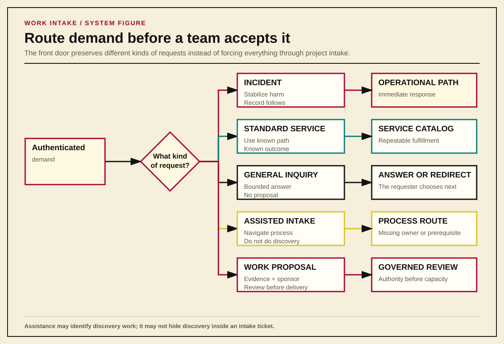
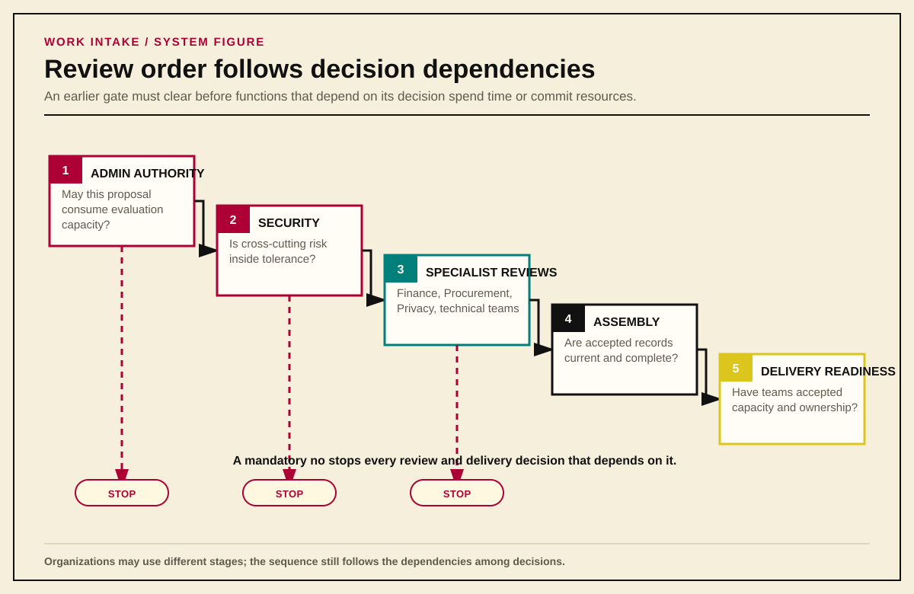
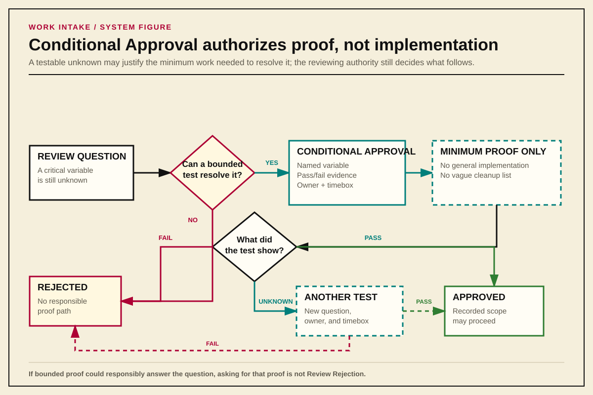
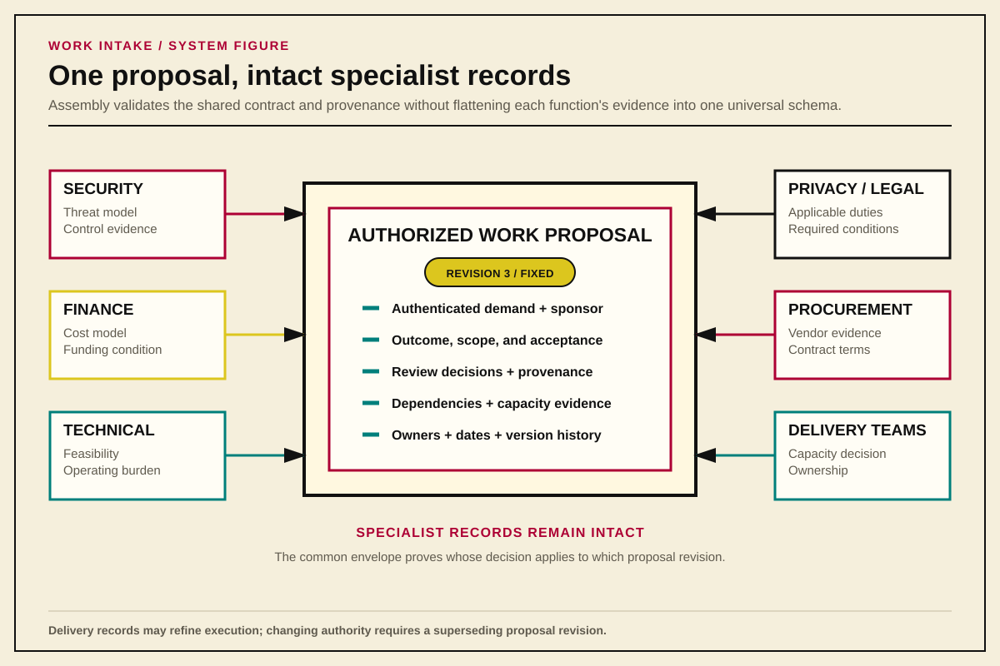
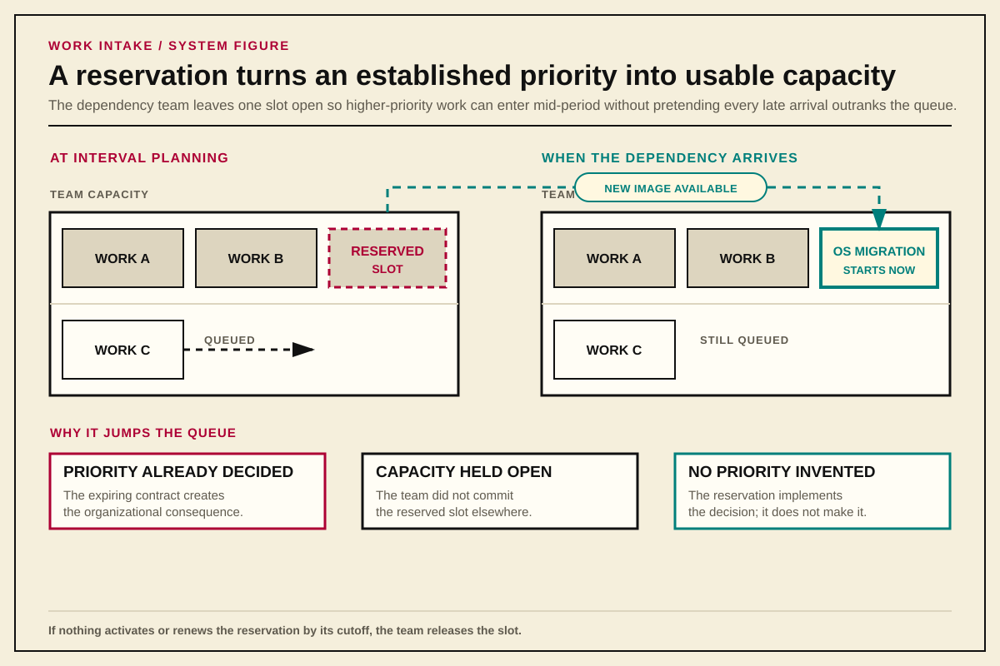
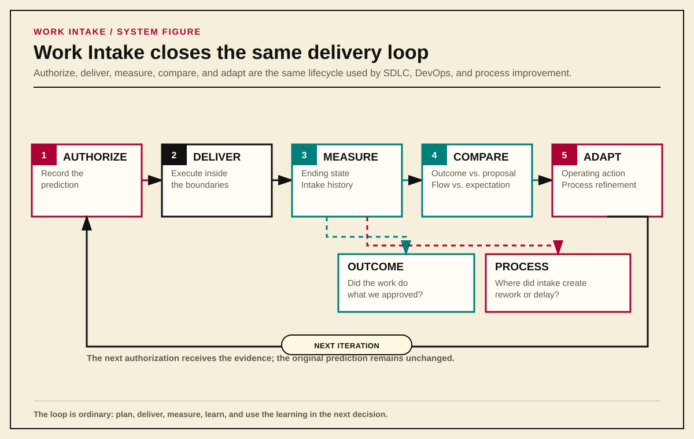

# Work Intake Is an Organizational System

*A framework for turning demand into authorized work without making receiving teams invent the organization around it.*

## Thesis

Most work-intake processes begin too late.

They begin when a request reaches a team: Systems Engineering, Network Engineering, Security, Platform Operations, Finance, or another function expected to turn somebody else's need into work. The receiving team adds a form, renames its queues, publishes new ticket types, and declares that intake has improved. The labels change. The underlying problem does not.

The team still has to determine whether the request is real, who asked for it, who approved it, where it ranks against other work, which risks the organization will accept, which teams must participate, and what outcome would justify the cost. Those are not team-level intake questions. They are organizational questions that happen to become visible when the work reaches a team.

This is why so many intake reforms produce half-measures. They start with the place where demand lands instead of the system that created, authorized, and routed the demand.

Work intake is not merely a form or a queue. It is the organizational system that turns an authenticated request into one of three things:

1. a known service delivered through an existing path;
2. bounded help or discovery that produces an answer; or
3. an authorized change with evidence, ownership, review, capacity, and a later reconciliation point.

---

## The Receiving-Team Trap

A football team does not ask a quarterback to decide whether the game should be played, whether the opponent is worth playing, how much the organization should spend on the trip, which risks the front office will accept, and whether the roster can support the plan. The player is responsible for executing within a role, recognizing what changes on the field, and escalating when the play no longer fits reality. The organization around the player supplies the authority, resources, and decision structure.

Technology organizations routinely reverse that arrangement. A business area asks for a change, then the receiving engineering team is expected to:

- recover the actual need from a proposed solution;
- determine whether the requester has authority;
- locate a sponsor;
- discover hidden dependencies;
- decide whether the work is important;
- estimate work other teams have not accepted;
- identify security, financial, legal, and operational consequences;
- negotiate those consequences informally; and
- absorb the work if the organization never resolves them.

The team is then blamed for moving slowly, asking too many questions, or inventing process. Yet the questions exist whether the team asks them or not. Skipping them does not make the work simpler. It moves uncertainty out of the planning and pre-planning phases, and into the implementation (execution) phase, where discovery is more expensive and the pressure to accept a bad answer is much higher.

Local intake still matters. A team should have a clear channel, published services, readiness standards, capacity rules, and a defensible way to reject work it cannot responsibly accept. What local intake cannot do is manufacture missing organizational authority. A Systems Engineering queue cannot decide enterprise priority, accept another function's risk, commit another team's capacity, or prove that the business still wants an outcome after the original requester disappears.

The right team-level answer therefore begins one level higher: define how the organization creates authorized work, then let each team implement its part of that model.

---

## Start With the Front Door

Not every request is a proposal. Treating every contact as project intake creates ceremony around ordinary service work and teaches requesters to avoid the official path.

The first decision is categorical:

### Incident or Break/Fix

Something is broken, degraded, unsafe, or actively failing. Response begins through the operational path. An incident does not wait for proposal review. When delaying the first stabilizing action would increase harm, response may begin before a work record exists; the record follows once the immediate danger is controlled.

### Standard Service Request

The organization already provides the capability through a documented, repeatable path. The outcome, required inputs, acceptance conditions, and normal operating procedure have already been decided. The requester supplies the facts needed to instantiate the service.

### General Inquiry

The requester needs time-bounded expert assistance because they do not yet know whether a capability exists or which path applies. The servicing function decides how much inquiry work it can provide under current capacity.

A General Inquiry may end with an answer, facilitation, or directions to another workflow. It does not become a Work Proposal, and it does not prepopulate one. The customer must knowingly initiate the new request because authorship and accountability are part of the evidence.

### Assisted Intake

The request appears to involve real change, but the customer cannot complete the intake path without help interpreting the process. Assisted Intake answers questions such as: Does this requirement apply? What kind of evidence will satisfy it? Which decision should already have been made? Which function owns the next step?

This is process navigation, not discovery work. Assisted Intake may explain a requirement, identify a missing prerequisite, or redirect the requester to Security, Architecture, Finance, or another responsible function. It may not perform the research, architecture, design, testing, product comparison, or sustained coordination needed to answer the requester's underlying question.

The distinction matters because receiving teams routinely inherit decisions that nobody actually made. A request for a one-terabyte PostgreSQL server is not yet a Systems Engineering provisioning problem merely because somebody submitted it that way. Assisted Intake first asks who approved the platform choice, capacity requirement, operating model, and organizational cost. If those decisions do not exist, the request returns to the workflow that owns them. Systems Engineering does not convert an unsupported implementation assumption into an approved architecture by explaining how it might be built.

When the missing answer requires substantive work, Assisted Intake has reached its stop condition. The requester must knowingly initiate sponsored discovery through the appropriate path, with a decision-critical question, committed capacity, a timebox, and an expected artifact. Assisted Intake may identify that path, but it does not remain open for months as the container for vendor meetings, technical investigation, or cross-team design. That would make discovery invisible and prevent the organization from distinguishing legitimate research demand from a broken intake question.

Assisted Intake should record why assistance was necessary: unclear requirement, disputed applicability, missing prerequisite, incorrect route, or discovery needed. If many requesters fail at the same question, the organization should inspect the question, its order, and the level at which it is being applied. Repeated confusion is evidence about the process; it should not be converted into permanent demand for more intake assistance.

### Work Proposal

The requester seeks to evaluate or deliver a change that cannot be fulfilled through an existing service request path. The request requires sponsorship, evidence, review, capacity, and an explicit decision before implementation begins.

These paths should remain separate because they preserve different facts. Converting an inquiry into a proposal or asking a receiving team to submit on a customer's behalf may feel efficient, but it destroys the cleanest evidence of who knowingly asked the organization to act.

{#fig-front-door-routing}

---

## Provenance Before Convenience

Every request needs an immutable, authenticated record of who initiated it and when. A reporter field that anyone can edit is not authorship. A copied chat message is not approval. A ticket created by the receiving team is evidence that the team created a ticket, not that the customer accepted responsibility for the demand it contains.

This rule is stricter than common practice because common practice routinely creates fictional accountability. A team member tries to be helpful, translates a conversation into a request, names the customer in a mutable field, and begins work. Months later, the customer disputes the scope, the sponsor says they never approved it, or leadership asks why the team chose this work over something else. The record cannot answer because it never captured the original act of asking.

Receiving teams may create child work, review modules, implementation records, and other artifacts derived from an authentic parent request. Those records do not pretend to be new customer submissions.

> A team may derive work from authenticated demand. It may not manufacture the demand itself.

---

## What a Work Proposal Must Prove

A Work Proposal is not a project charter in miniature, nor a solution description with approval fields attached. It records enough about the proposed change to support a responsible decision.

At minimum, it must establish:

- **Current State:** what capability, constraint, failure, cost, or operating condition exists now;
- **Desired Outcome:** what should become true;
- **Required Difference:** the material gap between the current and desired states;
- **Requirements:** what the result must do or preserve;
- **Acceptance Conditions:** what observable evidence will show that the outcome is real;
- **Non-Goals:** what the proposal deliberately does not solve;
- **Dependencies:** which systems, teams, vendors, decisions, and external events affect the work;
- **Known Uncertainty:** what remains unknown, why it matters, and how the organization expects to resolve it;
- **Timing Evidence:** the event or date that matters and the consequence of missing it;
- **Operational Ownership:** who will operate, support, and maintain the result; and
- **Sponsorship:** who accepts the proposal's priority claim and organizational tradeoffs.

{#fig-work-proposal-evidence}

The proposal must govern exactly one top-level outcome. That outcome may require one Epic or an Initiative containing several independently valuable Epics. The hierarchy follows the completion condition, not the amount of effort: an Initiative is complete when its organizational outcome becomes true, not merely when every child ticket closes.

### Sponsorship Is an Act

A Work Sponsor is not a manager copied on the request. Sponsorship means knowingly authorizing the proposal to consume evaluation or discovery capacity and accepting responsibility for its priority claim and organizational tradeoffs.

That acceptance must be durable and tied to a specific proposal revision. The organization may capture it through an authenticated workflow action, a retained comment, correspondence, or another record allowed by policy. The tool is negotiable. The evidence is not.

A sponsor who is also the requester may satisfy both roles through the same authenticated submission when the record explicitly accepts the sponsor obligation. Merely putting a leader's name in a field proves nothing.

---

## Discovery and Implementation Are Different Commitments

One of the easiest ways to corrupt intake is to treat learning and building as the same authorization.

Pure discovery exists to produce decision-ready knowledge: an inventory, taxonomy, comparison, architecture, threat model, decision record, or another artifact that reduces uncertainty. It does not authorize implementation. Reviewing existing systems, reading current authoritative guidance, interviewing operators, or comparing external products should not require the entire implementation-governance sequence when the discovery itself creates no comparable operational risk.

Discovery still needs boundaries. It requires a sponsor, a decision-critical question, an expected artifact, a timebox, and a decision when the timebox ends. If the work touches production, exposes sensitive data, commits material spend, or creates another real consequence, the activity is no longer risk-free merely because somebody called it research.

Implementation is different. An implementation-ready proposal arrives with architecture and design evidence already available. The organization is no longer deciding what it should believe: it is deciding whether to commit money, technical capacity, operational ownership, and risk to making the proposed change real.

This produces two distinct readiness states:

- **Proposal Readiness:** enough is known to justify evaluation or bounded discovery. Material unknowns may remain, but they are visible.
- **Delivery Readiness:** dependencies, ownership, design, risk, capacity, and acceptance responsibilities are confirmed well enough to authorize implementation.

{#fig-discovery-vs-implementation}

Sponsorship does not create Delivery Readiness. Architecture does not create budget. Approval does not commit another team's capacity. Each decision has its own owner because each decision spends or risks something different.

The [Personal Decision Framework](./personal-decision-framework.md) supplies the lighter discovery framing. The [platform architecture framing guide](./framing-questions-for-platform-architecture-and-design.md) supplies the architecture and design questions that must be answered before implementation commitments are made. Work intake owns the transition between them; it should not copy either document into a larger form.

---

## Requesters Supply Facts; the System Derives Consequences

Requesters know their current condition, desired outcome, constraints, affected users, timing pressure, and business consequences. They are not necessarily qualified to classify the work those facts create.

A requester should not select:

- project size;
- enterprise priority;
- required reviewers;
- risk class;
- employee grade;
- named delivery staff; or
- another team's capacity commitment.

Those choices create organizational consequences. The intake system should derive them from structured facts using published, auditable rules, then present the result for human review.

This deterministic core controls classification, required fields, routing, state changes, clocks, escalation, and readiness. AI may help a person write clearly, inspect a rule, or implement an approved workflow change. It should not decide whether a governed condition is true. A probabilistic model is useful when the task tolerates interpretation; it is a poor authority for deciding whether Security Review is mandatory or whether an overdue review clock should escalate.

### Keep Unlike Questions Separate

One universal "project score" collapses unlike concerns and produces false confidence. Intake should preserve at least four separate views:

- **Delivery Capacity Profile:** expected labor, elapsed duration, and coordination burden;
- **Delivery Size Class:** the highest XS-through-XL band reached by any capacity dimension;
- **Financial Commitment Class:** money committed or placed at risk;
- **Work Proposal Risk Profile:** likelihood, consequence, blast radius, criticality, reversibility, and affected authority boundaries.

Priority is separate again. The requester and sponsor provide the priority claim and its evidence. The accountable portfolio authority assigns queue position against existing commitments and available capacity.

Uncertainty should widen an estimate's range and lower confidence. It should not automatically make work "large," nor should lower dimensions average away one material burden. A proposal that consumes little labor but creates a difficult enterprise coordination problem is not small merely because the spreadsheet average says so.

The sizing model should use one published organizational matrix so portfolio comparisons mean the same thing across teams. An organization may recalibrate the thresholds as it learns, but it should version the rule and preserve the historical classification that governed the original decision.

---

## Review Is Ordered, Modular, and Decisive

An implementation proposal should not explode into an all-reviewer meeting where every function reads the same document at once and waits for somebody else to identify the missing evidence or decision.

Every participating function should know which decision it owns, what evidence it needs, and which upstream decisions must be complete before its review begins. The organization publishes that sequence. The exact stages differ because companies distribute authority differently, but the order follows the dependencies among the decisions:

1. administrative authority decides that the proposal may consume evaluation capacity;
2. the Security Review Board evaluates cross-cutting organizational risk;
3. financial and technical functions review the proposal after the earlier gates clear; and
4. accepted review records assemble into the authoritative proposal artifact.

{#fig-ordered-review}

Not every review can or should run in parallel. Finance should not spend time constructing a budget for work that Security will reject the next day. Systems Engineering and Network Engineering should not design delivery around a proposal that lacks organizational authority. A rejection at an earlier gate prevents dependent review from beginning.

### Authority and Clocks

Every review needs someone responsible for moving it and someone authorized to decide it. The **Review Facilitator** assembles the right reviewers, tracks unknowns and objections, prevents unresolved questions from disappearing, and records the result. The **Decision Owner** has the competence and organizational authority to make the decision across the boundaries under review. One person may perform both jobs, but facilitating the review never grants decision authority.

Reviews also need published targets for acknowledgement and decision. When a review misses its target, the facilitator escalates it to a named owner or records an extension with a reason and new date. Reassignment, research, and scheduling difficulty inside the reviewing function do not restart the clock. When the review depends on information from somewhere else, the record identifies the missing input, who must supply it, what they must produce, and when it is due.

Silence authorizes nothing, and the escalation path prevents it from becoming a permanent veto.

### The Security Review Board

Security is often broader than application security. Depending on the organization, its remit may include information security, physical security, continuity, logistics, environmental threats, fraud, supply-chain exposure, and other risks capable of harming the company or the people who depend on it.

Security's position in the sequence follows from the authority it carries. It decides whether the proposal has identified, evidenced, and acceptably treated the risks within its charter before later functions commit money or design delivery around it. When Security decides that the risk exceeds the organization's tolerance, preference from Finance, Architecture, or an executive does not reverse that decision.

Security does not receive a separate intake packet. It reviews the same Work Proposal, using the architecture, system boundaries, data flows, applicable standards, control evidence, exception requests, threat model, testable mitigations, and operating responsibilities that its charter requires. Its decision returns to that proposal so downstream teams can verify what Security examined and what it decided.

The exact questions belong in a companion guide built from the organization's risk model and authoritative sources. [NIST Cybersecurity Framework 2.0](https://www.nist.gov/publications/nist-cybersecurity-framework-csf-20), [NIST's Risk Management Framework](https://csrc.nist.gov/pubs/sp/800/37/r2/final), [system security planning guidance](https://csrc.nist.gov/pubs/sp/800/18/r2/final), [OWASP SAMM](https://owaspsamm.org/model/verification/architecture-assessment/), and verification standards such as [OWASP ASVS](https://owasp.org/www-project-application-security-verification-standard/) can inform that guide; they do not define this organizational workflow.

### One Contract, Different Review Records

Each review function keeps the specialist record its decision requires. Security may need a threat model and control evidence; Finance may need a cost model and funding conditions. Forcing both into one universal schema would erase information that only one function is qualified to interpret.

The intake system still needs a small set of shared facts so it can identify:

- what the review examined;
- which proposal revision it examined;
- who had authority to decide;
- the decision and its timestamp;
- the evidence and assumptions that mattered;
- which boundaries the review did not cover;
- any required next action; and
- whether the record has been superseded.

Those shared facts allow the system to prove that a decision belongs to the correct proposal revision, came from someone authorized to make it, and has not been replaced by a later decision. The specialist record remains intact.

---

## Review Decisions

Every reviewing function must return a state that tells dependent teams whether they may proceed, perform a bounded test, or stop. The common model has three decisions.

### Approved

The proposal satisfies the function's requirements for the decision under review. Approval applies only to the recorded proposal revision and the facts, evidence, assumptions, and boundaries the function actually examined.

### Conditional Approval

A critical variable cannot be known until later, but the concern is specific and testable. Conditional Approval authorizes only the bounded discovery work needed to produce the missing evidence.

The condition must state:

- the variable being tested;
- the evidence that counts as passing or failing;
- the work permitted to produce that evidence;
- the owner and timebox; and
- the decision that follows each possible result.

Conditional Approval is not approval with cleanup attached. The review remains unresolved, and general implementation remains unauthorized. After the test, the original reviewing authority approves, rejects, or authorizes another bounded test with a new question, expected result, owner, and timebox.

{#fig-conditional-approval}

### Review Rejection

The current proposal revision fails a governing standard, risk decision, requirement, or other mandatory condition. Reviews and delivery decisions that depend on the rejected result stop. Other approvals cannot offset it.

A request for more testing is not Review Rejection. If bounded proof could responsibly resolve the question, the correct state is Conditional Approval.

### The Proposer Carries the Evidence

The proposer must identify applicable standards, supply evidence of conformance, or explain why a standard does not apply and why an exception should be granted.

If the proposal supplies no credible compliance case, the reviewing function may reject it categorically. The reviewer is not responsible for proving every possible failure or building the proposal on the requester's behalf.

Specific evidence changes the reviewer's obligation. If the proposer claims one control satisfies several requirements, the reviewer must identify why that control does not satisfy them. If the proposal maps some requirements but omits another, the reviewer must identify the material omission. The required specificity follows the case actually presented:

> If no compliance case exists, categorical rejection is enough. Once the proposer makes a specific case, the reviewer must identify a specific defect.

This is not a courtroom. The organization is deciding whether to spend money and capacity, and whether to accept the risk. The burden belongs to the person asking it to act.

---

## Preparation Buys Execution Freedom

Upfront review gives downstream teams the decisions they need to execute without reopening the proposal. When an authorized request reaches Infrastructure, "Did Security approve this?" should be answered by inspecting the artifact, not by scheduling another round of meetings. The same is true of architecture, finance, procurement, ownership, and every other prerequisite represented in the approved state. The receiving team verifies the record; it does not relitigate the decisions that produced it.

That trust applies only within the approved boundaries. Materially changing the outcome, requirement, risk, or operating model still requires the appropriate new decision. Inside those boundaries, however, the organization should be able to move. Requirements do not need to be re-proven at every handoff, downstream teams do not have to reconstruct the history from chat messages, and implementation does not repeatedly double back to answer questions that belonged in discovery.

This does not repeal Murphy's Law. Estimates will change, dependencies will fail, implementation will expose new constraints, and people will still make mistakes. Work Intake cannot guarantee smooth execution. It prevents a different class of failure: predictable cycles of requirements reverification, accidental scope expansion, and late discovery that a supposedly settled decision was never actually made.

A security-tool replacement, for example, can complete its technical migration and still fail its users because a dashboard from the old system was never captured as a requirement. "No one thought to ask the question" is not merely an implementation problem when the missing question changes whether the replacement satisfies the original need. It is evidence that discovery and review did not follow the consequence tree far enough before the organization committed to an answer.

Golf makes the same point with less paperwork: a tiny change in the clubface angle at contact can separate a shot down the fairway from one deep in the woods. The visible failure happens far from the original deviation, but that does not mean the deviation was unimportant. Early questions work the same way: a small correction before commitment can change the entire downstream tree.

{#fig-clubface-consequence}

Developing a process that consistently produces authorized, implementation-ready work takes effort. Enforcing it takes more. Developing a swing that consistently finds the fairway also takes effort. The organization has to decide what game it is playing: **are we playing for beers, or are we playing for Majors?**

---

## From Proposal to Authorized Work

Human review should produce durable records, not a trail of comments that somebody later summarizes from memory.

An accepted review record enters the final Work Proposal only after the system verifies that it belongs to the correct proposal revision, carries an approved decision, and has not been altered or duplicated. Assembly preserves the specialist conclusion as written. It does not replace disagreements with an AI-generated consensus that no reviewer approved.

Once every required review has cleared, the proposal becomes an **Authorized Work Proposal**. That revision does not change. It governs one top-level outcome and records the scope, constraints, acceptance authority, review decisions, and organizational commitments that govern delivery. When the top-level outcome is one Epic and every Delivery Readiness condition has already been satisfied, implementation may begin. When the top-level outcome requires an Initiative, authorization permits its child delivery records to be developed within the approved boundaries; it does not make every child ready.

{#fig-authorized-work-assembly}

Delivery records refine execution. They do not rewrite authority.

An Epic, story, work package, task, sprint backlog, or implementation plan may change the sequence, approach, estimate, or local decomposition as evidence improves. None may silently change the approved outcome, boundary, constraint, or acceptance condition. Those changes require an approved superseding proposal revision.

Initiative approval is not blanket implementation permission for every child Epic. Each child reaches Delivery Readiness only when its design, dependencies, operational ownership, acceptance responsibility, specialized approvals, and named capacity within a Planning Interval are confirmed. Only then may implementation begin. This permits adaptive delivery without converting "Agile" into an exemption from planning or authority.

### From an Authorized Initiative to a Delivery-Ready Epic

Initiative authorization settles the organizational outcome and the boundaries within which delivery planning may proceed. It may also preserve forecasts, sequence assumptions, dependency reservations, and an overall capacity strategy. Those records make later delivery possible, but they do not commit a receiving team to implement a child Epic that has not yet been defined and accepted.

Every candidate Epic identifies the exact Authorized Work Proposal revision from which it derives. The Epic states the independently valuable result it will produce, the approved requirements and acceptance conditions it advances, and the boundaries it must not cross. Work Intake then derives which earlier decisions still apply and which decisions the child must obtain for itself. A cross-cutting review may remain valid when the Epic stays inside the facts and boundaries that review examined; a new data flow, vendor, operating model, risk, or other material difference returns to the authority that owns the affected decision.

Delivery Readiness is assembled from those decisions; it is not granted by a generic readiness approver. For each child Epic, the authoritative record must establish:

- traceability to the governing Initiative revision;
- child scope and acceptance evidence that remain inside the approved outcome;
- architecture and design evidence sufficient for implementation;
- dependencies with named owners and actual commitments or valid reservations;
- every specialized approval triggered by the child's facts;
- the expertise, staffing, operational ownership, and support model the work requires;
- acceptance by the receiving team's capacity owner of the named work within a Planning Interval; and
- the person authorized to accept the delivered result.

The system marks the Epic Delivery Ready only after each required decision owner has supplied an accepted record. The Review Facilitator may coordinate the evidence and unresolved questions, but facilitation does not allow one person or committee to substitute a broad approval for the decisions of Security, Finance, Architecture, delivery teams, or another responsible function. A missing condition returns to its owner; a testable unknown may receive Conditional Approval for bounded discovery; silence does not move the Epic forward.

Initiative-level capacity records must describe what they actually represent. A forecast estimates likely demand. A Conditional Dependency Reservation preserves one possible slot. A staffing strategy identifies how the organization expects to source expertise. None commits a delivery team to a child Epic. The capacity condition becomes true only when the receiving team accepts the named Epic and its required ownership within a Planning Interval. At that point, the organization records the Approved Delivery Baseline and implementation may begin.

### Authorization Must Remain Active

An approval does not keep work alive by itself. The sponsor and the authoritative record must remain identifiable throughout delivery.

If the sponsor leaves or withdraws, discretionary work does not continue forever through momentum. The existing rules determine whether a replacement sponsor accepts the work, the work pauses, or delivery ends. Anything left running must have an owner and an exit plan under [Managed Runoff](./Managed-Runoff-for-Deprecated-Services.md).

The authoritative source belongs in a central, version-controlled repository. Ticket attachments, rendered pages, dashboards, and published copies link back to it. Accepted artifacts should be readable across the organization by default. Restricted work must identify why access is limited, who owns the restriction, when it will be reviewed, and what coordination information can be published safely.

---

## Capacity Is an Acceptance Decision

Routing work to a team does not commit that team's capacity.

A dependency may be known without being planned. Discovery may require a team to provide access or expertise without committing it to later implementation. Delivery begins only when the receiving team accepts named work, ownership, and capacity within a Planning Interval.

Where an approved Initiative cannot provide an exact handoff date, a dependency team may place a Conditional Dependency Reservation on one work slot for a defined Planning Interval. The team plans around leaving that slot open. If the reserved work becomes ready during the interval and has higher priority than the team's other queued work, it enters the workstream immediately instead of waiting for the next planning cycle. If upstream work does not activate or renew the reservation by its cutoff, the team releases the slot.

An operating-system migration makes the purpose concrete: if a million-dollar contract for the old operating system is about to renew, Systems Engineering must deliver the replacement image before downstream teams can migrate. Those teams may not know exactly when the image will be ready, but a reservation allows the first downstream work to begin as soon as it arrives. The reservation does not decide priority; it gives a dependency team a way to honor a priority the organization has already established.

{#fig-conditional-dependency-reservation}

If leadership instead directs a team to drop committed work for something new, that choice must be visible. The record identifies who made it, what got displaced, why the normal queue was bypassed, and which delay or consequence they accepted. This is an **Accountable Priority Override**.

Routing work to a team does not mean that any available engineer can do it. The team's technical reviewer decides what expertise, ownership, and support the work requires; the capacity owner decides whether the team can provide them.

If the team cannot provide what the work requires, the organization must change the staffing, schedule, scope, or source of expertise. It cannot pretend the work became easier because the right people were unavailable.

The [Career Progression Guide](./DevOps-SRE-Career-Progression-Guide.md) explains how the team makes the staffing decision. The [work-item guide](<./Writing Work Items - Epics, Stories, and Tasks.md>) explains how the approved outcome becomes Epics, stories, work packages, and tasks. Work Intake only needs the answers: has the team accepted the staffing and capacity, and does the delivery work still match what was approved?

---

## Delivery Changes the Forecast, Not the Past

When implementation is approved, the organization records the estimate it used to commit capacity. That becomes the **Approved Delivery Baseline**: a record of what everyone believed when the decision was made.

As the team learns more, it updates the **Delivery Forecast**. The baseline records what the organization thought then; the forecast records what it thinks now. Keeping both allows the organization to plan honestly without erasing whether its original assumptions were any good.

{#fig-baseline-and-forecast}

If the new forecast requires substantially more capacity, someone with authority over the affected priorities must accept the larger commitment. If the desired outcome, scope, requirement, boundary, or acceptance condition changes, the proposal must change.

The delivery team may change how it builds the approved thing. It may not quietly decide to build a different thing.

---

## Close the Loop

Authorization is a prediction. The organization is saying that the proposed change is worth making, the design can work, the risks are acceptable, the required capacity is available, and everyone will be able to recognize success when they see it.

Completion should test those predictions.

{#fig-close-the-loop}

### Did the Work Do What We Approved?

When delivery ends, compare the state at the end with the state at the beginning. Did the desired outcome become true? Did the result meet its requirements and remain inside its approved boundaries? How did the actual labor, time, and coordination compare with the original estimate and later forecasts? Which assumptions held, which risks appeared, and what operating burden remains?

Do not rewrite the approved proposal to make the original decision look better. Preserve it, then attach a record of what happened, what the organization learned, and what should change before similar work is approved again.

### Is Work Intake Working?

Every proposal also produces evidence about the process that handled it. Record where requests were returned, which questions caused confusion, which reviews discovered missing information, how much rework followed, and which exceptions kept recurring.

A repeated problem from one submitter calls for a different response than the same problem appearing across many submissions. When failures remain concentrated around one submitter after guidance, education or additional review may be appropriate. When many people fail at the same point, the process often needs refinement.

Suppose an application team submits evidence as JSON documents, but Compliance requires the data in XML, so a compliance analyst manually transforms every request. The compliance review may be mandatory; manually translating the same fields for every request is not. The organization could preserve the control while changing the interface, automating the conversion, or collecting the evidence in the required format from the beginning. Until someone separates the requirement from the handoff, every request carries the same avoidable delay.

Recurring rework is not merely the cost of doing business. Fix the confusing step, automate the mechanical part, remove the unnecessary requirement, or make an explicit decision that the remaining effort is worth its cost.

---

## Relationship to Established Practice

Work Intake sits at the intersection of several established bodies of practice:

- from **ITIL**, the distinction among events, incidents, service requests, catalogs, and request management;
- from **PMI-style project governance**, sponsorship, formal authorization, estimation, change control, decision records, and closure;
- from **Lean and Six Sigma**, visible waste, defect evidence, feedback loops, and process correction;
- from **Agile**, adaptive execution and shorter evidence-producing loops;
- from **Scrum and Scrumban**, possible Planning Interval implementations rather than universal intake requirements;
- from **NIST**, risk governance, accountable authorization, security planning, control evidence, and reauthorization after meaningful change; and
- from **OWASP**, threat modeling, architecture assessment, and testable security requirements.

Each discipline addresses part of the problem. This model connects them around the Work Proposal so that authorization, architecture, risk, funding, capacity, delivery, and acceptance do not become separate conversations whose conclusions disappear before the next team begins its work.

This document defines the shared structure of review: which function must decide, when it must decide, what evidence it receives, what its decision authorizes, and how that decision reaches the teams that depend on it. Each specialist function owns its questions, standards, and evidence. Work Intake connects those reviews through one traceable decision process; it does not make their expertise interchangeable.

---

## Common Failure Modes

### The New Form Is the Old Process

The organization renames request types and adds required fields, but the same team still reconstructs sponsorship, priority, architecture, risk, and dependencies after submission.

### The Receiving Team Creates the Request

A helpful engineer converts a conversation into customer demand. Authorship disappears, and the team inherits responsibility for a need it did not create.

### Requesters Select Consequential Labels

The form asks for project size, urgency, required reviewers, or staff grade. Preference becomes classification.

### Approval Is Treated as Readiness

A sponsor supports the outcome, so implementation begins around unresolved dependencies, design questions, ownership, or acceptance conditions.

### Every Review Starts at Once

The organization creates an all-reviewer firehose. Downstream functions spend time on work an earlier gate later rejects.

### Security Is Added at Go-Live

The work becomes operationally and politically expensive before the organization asks whether the risk is acceptable. Review still occurs, but leverage has disappeared.

### Conditional Approval Becomes Soft Approval

The team begins general implementation while a vague condition remains open. The minimum proof step quietly becomes sunk cost.

### Review Rejection Becomes a Vote

Several approvals are treated as enough to outweigh one mandatory no. The organization averages unlike authorities until it gets the answer it wanted.

### Dependencies Are Mistaken for Commitments

A proposal lists another team, so planning assumes that team's capacity. The receiving team discovers the promise only when the handoff arrives.

### Delivery Records Rewrite Authority

Backlog refinement, implementation learning, or a stakeholder comment changes the outcome or boundary without a superseding proposal revision.

### Nobody Reconciles the Outcome

The project closes, the original prediction disappears, and the next proposal begins with the same organizational amnesia.

---

## Starting With One Team

A single team cannot create the missing parts of an organization's governance system, but it can stop pretending that missing decisions have been made. Systems Engineering can enforce the conditions under which it will accept work without claiming the authority to decide priorities, approve architectures, accept security risk, commit funding, or promise another team's capacity.

A local process can begin with six rules:

1. **Require an authenticated request.** A conversation may clarify what someone needs, but it does not authorize planned work. The customer must create the record that asks the team to act.
2. **Route the request before evaluating it.** Incidents belong in the operational path, repeatable services belong in the service catalog, and bounded questions belong in General Inquiry. A Work Proposal is reserved for a proposed change, irrespective of whether the change requires formal CAB processes.
3. **Require enough information to make a decision.** The proposal identifies the current condition, the desired outcome, the evidence that will demonstrate success, the known dependencies and uncertainties, and the sponsor asking the organization to spend capacity on it.
4. **Return missing decisions to their owners.** If priority, architecture, security approval, funding, or another team's commitment is unresolved, Systems Engineering records the gap and routes it to the function authorized to decide. The team does not infer approval from silence or create it on someone else's behalf.
5. **Publish what the team needs before it will accept work.** Requesters should be able to see which standards apply, what evidence Systems Engineering reviews, who must accept operational ownership, and how the team decides whether it has capacity.
6. **Record exceptions without rewriting the history.** If someone with the necessary authority orders the team to bypass a condition, the record identifies who made the decision, which work they displaced, which risk they accepted, and what Systems Engineering declined to certify as true.

Assisted Intake also requires experienced ownership. IC5 engineers should be able to recognize properly approved work, identify missing decisions, and explain the route back to them. Late-IC4 engineers may participate in bounded cases under guidance. IC6 engineers should be able to explain and coordinate the process across team and sub-organizational boundaries because those boundaries are part of the work they are expected to navigate.

A team that quietly reconstructs missing context makes the organizational failure disappear into engineering labor. Leadership sees a slow delivery team, not the missing sponsor, unmade decision, or unresolved dependency that consumed the time. Recording the gap, its owner, and its consequence preserves evidence that the organization can use to repair the larger process.

> This process governs what Systems Engineering can responsibly accept. It does not authorize Systems Engineering to make decisions assigned to other functions.

Claiming more would recreate the original failure: Systems Engineering would once again be inventing the organization around the request.

---

## Appendix: Scope and Related Documents

This document defines the architecture of Work Intake:

- front-door classification;
- submission provenance;
- sponsorship;
- proposal and delivery readiness;
- deterministic classification and routing;
- ordered, modular review;
- common review decisions;
- artifact assembly and authority;
- capacity acceptance; and
- outcome and process reconciliation.

It does not define every function's internal procedure.

- [Framing Questions for Platform Architecture and Design](./framing-questions-for-platform-architecture-and-design.md) owns architecture and design framing.
- [RFPs and Vendor Selection as Evidence Systems](./RFPs-and-Vendor-Selection-as-Evidence-Systems.md) owns external capability acquisition, vendor claims, proofs of concept, acceptance, and operational risk transfer.
- [Personal Decision Framework](./personal-decision-framework.md) owns lightweight discovery framing and early intent categories.
- [Career Progression Guide](./DevOps-SRE-Career-Progression-Guide.md) owns operating levels, technical-review expectations, and Staff+ responsibilities.
- [Writing Work Items](<./Writing Work Items - Epics, Stories, and Tasks.md>) owns delivery hierarchy and work-item construction.
- [Managed Runoff](./Managed-Runoff-for-Deprecated-Services.md) owns deprecated systems and live remnants after discretionary investment ends.

Security, Finance, Procurement, Privacy, Legal, and technical-delivery functions may require companion guides and templates. Those guides should use the same Work Proposal and add their decisions to it. They should not recreate intake as a collection of disconnected departmental forms.
