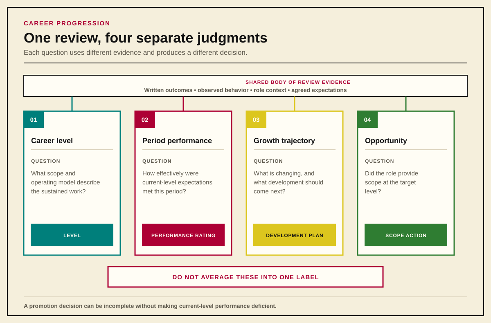
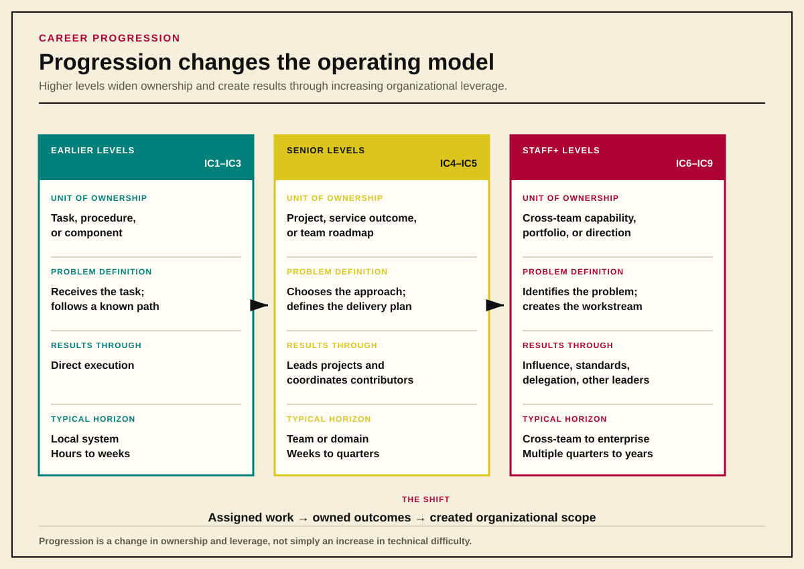
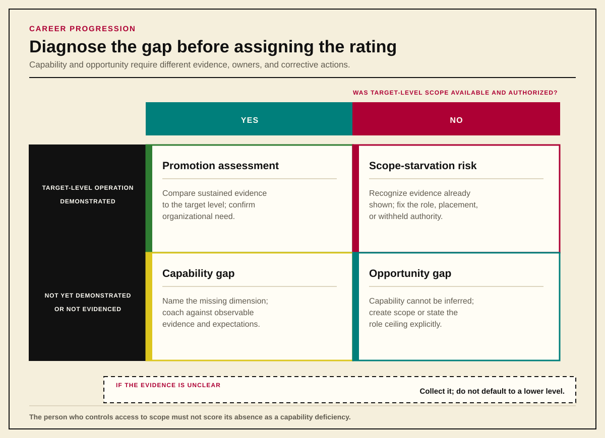
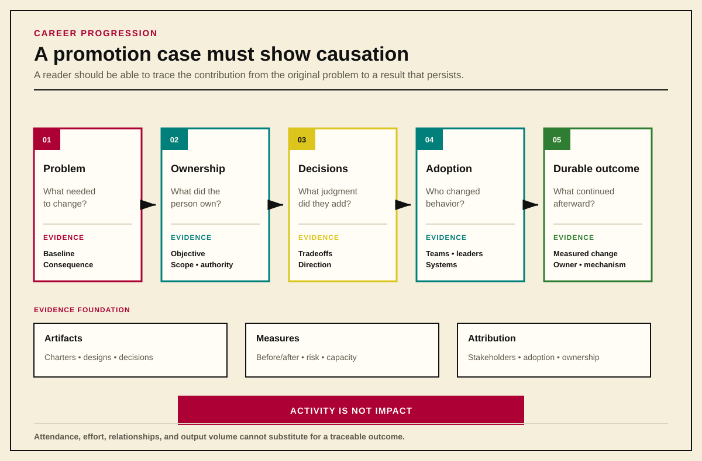

# Appendix D: Career Progression Reference

*Part Appendices*

This preview includes the book-level portions of the career framework: the progression model, scope and opportunity distinctions, management crosswalk, calibration operating model, and promotion evidence. The complete level-by-level ladder remains available as a companion source document.

> **Preview note — future edition**
>
> A future assembly decision will determine whether the full IC1–IC9 and MGR4–EX11 ladder belongs inside the book or remains a separately published companion reference. This preview keeps the narrative moving while preserving the framework needed to understand the people chapters.

## Purpose

This guide translates an IC1–IC9, MGR4–MGR8, and EX9–EX11 grade scale into observable expectations that can be applied across roles.

The grade reflects the **scope, ambiguity, autonomy, influence, and durable impact** of the work a person consistently performs. It is not determined by tenure, ticket volume, technical trivia, or title.

Higher levels are not simply “more difficult engineering.” Progression increasingly means:

- moving from assigned tasks to independently defined outcomes;
- moving from one system to multiple teams, domains, or business functions;
- moving from solving incidents to preventing classes of problems;
- moving from personal execution to standards, systems, and decisions that multiply the work of others;
- moving from technical correctness to business-relevant technical judgment.

The example titles and technical situations are deliberately systems-engineering focused. Other specializations may adapt them without changing the grade expectations.

This document is a **shared scope-and-impact ladder across roles**, not a universal technical-skills checklist. Each specialization should maintain a concise competency appendix for its own tools, practices, and domain knowledge while preserving the common grade boundaries. People at the same grade may demonstrate different technical or functional depth, but they should operate at comparable scope, autonomy, influence, and impact.

---

## Executive Summary

The full guide is reference material. The points below are the operating system. A reader who absorbs only this section should still calibrate consistently with the rest of the document.

**Four separate judgments, never one label.** Career level (the scope and operating model expected of the role), period performance (how effectively the person met current-level expectations), growth trajectory (direction and pace of development), and opportunity (whether the role provides scope at the target level). Collapsing these into a single rating produces the most common calibration failures.

{#fig-four-separate-judgments}

**Seven dimensions of level.** Every calibration question, every promotion packet, and every escalation reduces to: scope, complexity, autonomy, impact, influence, leverage, durability. The progression model, scope horizons, and evaluation rubrics elsewhere in this guide are views of these same seven dimensions applied to different questions.

**IC5 is a complete career level.** Progression beyond IC5 is optional and reflects an organizational need for cross-team technical leadership, scope creation, and leverage through other engineers. It is not the default reward for sustained excellence at IC5.

**Promotion is lagging recognition.** The next level should already describe how the person normally operates. Promotion does not authorize attempting next-level work; demonstration precedes recognition. Scope must be agreed in advance and evidence must be sustained.

**Calibrate against the ladder, not against people.** Read the written case before discussion. Compare evidence to documented expectations. Record which expectations were demonstrated, which were not, and whether the remaining gap is capability, opportunity, or organizational need.

**Common failure modes.** Tenure inflation, execution substitution, scope-by-headcount, manager-advocacy bias, invisible-work erasure, network-blindness, scope starvation, level-performance conflation, and curve enforcement. The full list with definitions is in *Common Miscalibrations*.

**The promotion packet must show causation.** Activity, attendance, relationships, and effort are not impact. The packet must make the causal narrative legible to a calibration group that has never observed the candidate's daily work.

---

## How to Use the Ladder

A person should be calibrated at the level where the expectations below describe their **normal, sustained contribution**, not their best isolated project.

Career level, period performance, and growth trajectory are separate judgments:

- **Career level** describes the scope and operating model expected of the role.
- **Performance** describes how effectively the person met the expectations of their current level during a defined review period.
- **Trajectory** describes the direction and pace of development, including whether appropriate growth opportunities exist.

These should not be collapsed into one label. Exceptional performance at the current level deserves recognition but is not automatically evidence of the next level. Likewise, one next-level assignment does not erase weak or incomplete performance in the person’s established responsibilities.

Promotion requires repeated evidence that the person is already operating at the next level. Potential, effort, tenure, and indispensability may support a development plan, but they do not substitute for demonstrated scope and impact.

No single artifact proves a level. Strong calibration weighs the **seven dimensions of level** used throughout this guide:

| Dimension | Calibration question | Useful evidence |
|---|---|---|
| Scope | How many systems, teams, functions, or business processes were affected? | Ownership maps, project charters, architecture diagrams, stakeholder lists |
| Complexity | Was the work routine, variable, ambiguous, novel, or strategically uncertain? | ADRs, incident analyses, tradeoff documents, design proposals |
| Autonomy | Who defined the problem, objective, approach, and success criteria? | Initiative briefs, planning records, decision history |
| Impact | What changed in reliability, cost, speed, risk, capacity, or customer experience? | Before/after metrics, SLOs, savings, reduced toil, reduced failure rate |
| Influence | Did other engineers, teams, or leaders adopt the direction? | Standards, approvals, roadmap changes, cross-team adoption |
| Leverage | Did the work make others more effective? | Reusable tooling, self-service, documentation, mentoring, paved roads |
| Durability | Did the result survive beyond the initial implementation or individual? | Operational ownership, maintenance model, follow-up results, handoff evidence |

These seven dimensions are the canonical vocabulary of this ladder. The tables that follow—the progression model, the scope horizons, and the candidate-scope evaluation—are views of these same dimensions applied to different questions, not separate or competing criteria.

### Career level versus leadership level

IC5 is a complete, successful career level for a fully autonomous senior engineer. Sustained, high-quality contribution at IC5 is a legitimate end-state career, not a holding pattern.

Progression beyond IC5 is optional and represents a change in operating model—not simply greater technical difficulty, longer tenure, or higher current-level performance. IC6+ roles require recurring organizational need for cross-team technical leadership, scope creation, and leverage through other engineers. If the organization has no such recurring need, IC6+ promotions should not be invented to retain or reward strong IC5 performers; the right response in that case is compensation, recognition, or scope expansion within the IC5 role.

Conversely, when the organization does have that need and a person is already operating at the higher level, withholding the promotion on the basis that "IC5 should be enough" is a form of scope-starvation rather than principled calibration.

### Promotion is recognition, not permission

Promotion is a **lagging recognition** that the next level already describes the person’s normal operating model. It should not be granted merely because someone appears ready to attempt next-level work.

The evidence period must be long enough to show repeatability through planning, delivery, production operation, and follow-through. Lower-level progression may be demonstrated through one complete work cycle; higher-level progression generally requires multiple outcomes, broader stakeholder evidence, and proof that the influence survives beyond a single project.

A manager and employee should align on the intended scope and expected evidence **before** the work begins. Perfect execution of current-level assignments does not become next-level performance merely through volume or effort.

### The progression model

The clearest distinction between levels is the unit of ownership and how the engineer creates results. This table is the canonical dimensions read across tiers—each row maps to one of the seven (shown in parentheses):

{#fig-operating-model-progression}

| Dimension | Earlier levels | Senior levels | Staff+ levels |
|---|---|---|---|
| Unit of ownership *(Scope)* | Task, procedure, or component | Project, service outcome, or team roadmap | Cross-team capability, strategic portfolio, or enterprise direction |
| Problem definition *(Autonomy)* | Receives the task and follows a known path | Chooses the approach and defines the delivery plan | Identifies the problem, establishes why it matters, and creates the workstream |
| Execution model *(Influence)* | Completes assigned work | Leads projects and coordinates contributors | Achieves outcomes through influence, delegation, standards, and other leaders |
| Production responsibility *(Impact and Durability)* | Makes the requested change safely | Owns health, observability, lifecycle, and follow-up | Changes the mechanisms by which multiple teams operate reliably |
| People leverage *(Leverage)* | Learns from others | Mentors engineers and raises team practice | Develops senior engineers and multiplies organizational technical leadership |

### Typical scope horizon

These horizons are descriptive—not quotas or promotion checklists. A project can be higher-level because of ambiguity, complexity, business consequence, or influence even when its calendar duration is shorter.

| Grade | Typical unit of ownership | Typical reach and horizon |
|---|---|---|
| IC1 | A step or routine task | One procedure; hours to days |
| IC2 | A defined task or small change | One component; days to weeks |
| IC3 | A complete service change or small project | One service or known dependency set; several weeks |
| IC4 | A bounded technical initiative | A subsystem or team; weeks to a quarter |
| IC5 | A team/domain outcome or roadmap of related initiatives | A team and its dependencies; one or more quarters |
| IC6 | A major cross-team capability or workstream | Multiple teams and engineers; multiple quarters |
| IC7 | A critical organizational capability spanning several domains | Several domains or functions; multi-year consequences |
| IC8 | A strategic technical roadmap | Multiple functions or business units; multi-year direction |
| IC9 | Enterprise technical direction | Company-wide and externally consequential; long-range strategy |

### Time-in-level guidance

Time is neither necessary nor sufficient for promotion. The guardrails below are illustrative anchors at the larger operating-model shifts (entering the senior, Staff+, and strategic tiers), not a complete schedule; the omitted levels follow the same principle and are not exempt from it:

- **IC4:** commonly follows roughly two years of demonstrated IC3-level work, or equivalent competency.
- **IC6:** commonly follows roughly three years of demonstrated senior-level work across IC4–IC5, or equivalent competency.
- **IC8:** commonly follows roughly five years of demonstrated Staff/Senior Staff-level scope, or equivalent competency.

Exceptional evidence may justify faster progression. Long tenure without next-level evidence does not.

---

## Individual Contributor Ladder at a Glance

| Grade | Level | Example title | Center of gravity |
|---|---|---|---|
| IC1 | Entry | Junior DevOps Engineer | Learns and safely performs routine work with close guidance |
| IC2 | Developing | DevOps Engineer I | Independently completes defined tasks using established procedures |
| IC3 | Proficient | DevOps Engineer II | Owns complete service changes, including delivery and production health |
| IC4 | Skilled | Senior DevOps Engineer I | Leads bounded projects and solves unfamiliar problems within a domain |
| IC5 | Advanced | Senior DevOps Engineer II | Owns team/domain outcomes, roadmaps, and team-level technical influence |
| IC6 | Expert | Staff DevOps Engineer | Creates cross-team scope and delivers major outcomes through influence |
| IC7 | Advisor | Senior Staff DevOps Engineer | Resolves critical business-facing technical issues and broad design matters |
| IC8 | Strategist | Principal DevOps Engineer | Owns a strategic technical roadmap across multiple teams or functions |
| IC9 | Thought Leader | DevOps Engineering Fellow | Shapes company-wide technical direction with VP-equivalent impact |

---

## Staff+ Operating Archetypes

The IC6–IC9 expectations define **scope, impact, autonomy, and influence**; they do not require every Staff+ engineer to perform the same kind of work. Staff+ contributions commonly cluster into several operating archetypes. An archetype is a work pattern, not a grade or title: engineers below IC6 may display some of these behaviors, and the same archetype can exist at different grades depending on reach and consequence.

| Archetype | Primary contribution | Strong evidence | Common failure mode |
|---|---|---|---|
| **Tech Lead** | Guides the technical approach and execution of a team or focused cluster of teams; carries context, coordinates dependencies, and delegates complex work. | A coherent team roadmap, stronger execution through other engineers, resolved dependencies, and improved production outcomes. | Becoming a project coordinator or remaining the coding hero instead of increasing team leverage. |
| **Architect** | Owns the direction, quality, and evolution of an enduring technical domain by integrating business needs, user needs, and technical constraints. | Adopted principles, standards, migration paths, and decisions that create coherence across multiple systems or teams. | Producing designs in isolation without adoption, implementation partnership, or operational accountability. |
| **Solver** | Goes deep on a critical, unusually complex, or execution-risky problem until a credible path forward exists. | The problem is contained or resolved, uncertainty is reduced, knowledge is transferred, and durable ownership is established. | Serial rescue work that leaves the underlying mechanism, documentation, or ownership unchanged. |
| **Right Hand** | Extends a senior leader’s attention across problems where technology, business, people, process, and organizational design intersect. | Important decisions accelerated, ambiguous problems reframed, execution delegated to the right owners, and senior leadership capacity expanded. | Treating executive proximity, meeting access, or borrowed authority as impact; operating out of alignment with the leader being extended. |
| **Connector** | Operates at the intersection of business, technology, and execution: connecting teams, removing friction, securing commitment, preventing duplication, and accelerating critical work. | Blocked decisions resolved, virtual teams or programs formed, duplicated investment avoided, adoption accelerated, or cross-functional lead time reduced. | Vague “glue work,” introductions, or meeting volume without a demonstrable causal effect on outcomes. |

### Archetype and grade

- **IC6** commonly operates as a team-cluster Tech Lead, domain Architect, organizational Solver, or cross-team Connector.
- **IC7** performs these patterns across critical organizational capabilities and may operate as a Right Hand when the organization is large and complex enough to require one.
- **IC8** usually blends several archetypes while owning a strategic domain and portfolio.
- **IC9** operates at enterprise scale and should not be constrained to a single archetype.

The Right Hand pattern is structurally uncommon in smaller organizations because there may be insufficient executive scope to extend. The Architect pattern likewise requires a domain that is both enduring and central enough to justify dedicated strategic ownership. The ladder should not invent Staff+ roles where the organization has no recurring need for them.

### Making invisible work legible

Connector and Right Hand work often occurs before a project appears in a delivery system: shaping the problem, aligning incentives, obtaining funding, preventing duplicated effort, selecting owners, or unblocking a stalled decision. That work is legitimate, but it still requires evidence. The promotion case should identify the causal chain from intervention to result, using measures such as decision time reduced, work avoided, investment redirected, risk retired, adoption increased, or an initiative successfully chartered and transferred to durable owners.

Meeting attendance, access to executives, broad relationships, and being “helpful everywhere” are not sufficient by themselves. The evidence must show that the organization moved differently and achieved a better outcome because of the contribution.

---

## Finding and Creating Next-Level Scope

Execution quality and scope are separate dimensions. An engineer can perform exceptionally while remaining within the same level because the work does not require the scope, complexity, autonomy, or influence of the next grade.

### Two sources of scope

**Top-down scope** begins with an acknowledged organizational priority. Managers and senior leaders identify a major problem, and the engineer is entrusted to frame and lead the response. This path has early alignment on importance, but it still requires the engineer to define a credible approach and deliver the outcome.

**Bottom-up scope** begins with technical evidence or domain insight. The engineer discovers a structural problem or opportunity, demonstrates why it matters, builds support, and creates the workstream. This path carries more risk because the engineer must establish both the value of the problem and the solution—but it is especially strong evidence of Staff+ scope creation.

### Evaluating candidate scope

A proposed workstream should be assessed against the same seven dimensions of level, now phrased as forward-looking questions about the work being scoped. These are not a checklist; exceptional strength in one dimension may outweigh a smaller footprint in another.

| Dimension | Questions |
|---|---|
| Scope | Is the outcome confined to one component, or must multiple teams, functions, or leaders change behavior? |
| Complexity | Does the work require judgment or expertise beyond what normally exists on the immediate team, and is the solution known or must the engineer first define the problem, objective, and decision framework? |
| Autonomy | Does the outcome require the engineer to create a roadmap, sustain coordination, and direct meaningful work by other engineers, rather than execute a defined plan? |
| Impact | Does it materially affect reliability, risk, cost, capacity, delivery, customers, or company strategy? |
| Influence | Does success depend on aligning teams or leaders and securing adoption the engineer cannot mandate? |
| Leverage | Does the result make many other people or systems more effective? |
| Durability | Will the outcome persist through ownership, standards, tooling, and developed successors? |

### Capability gaps and opportunity gaps

A person may be capable of next-level work while their assigned role contains no next-level scope. Managers and calibration groups must distinguish:

- a **capability gap**, where the person has access to appropriate work but has not yet demonstrated the required operating model; and
- an **opportunity gap**, where the organization has not provided or permitted work at the required scope.

{#fig-scope-gap-diagnostic}

An opportunity gap should lead to a concrete scope plan, role redesign, transfer, or an explicit acknowledgment that the current position cannot support further progression. It should not be disguised as an indefinite performance deficiency.

---

## Management and Executive Track Crosswalk

The management track is parallel to the IC track. Moving into management is a change in profession—from leading primarily through technical work to leading through people, organizational systems, resources, and accountability. It is not the default reward for technical excellence.

| Grade | Management / executive level | Example title | Primary accountability |
|---|---|---|---|
| MGR4 | Team Lead | DevOps Engineering Lead | Output, coordination, and development of a defined team or sub-team |
| MGR5 | Manager | Manager, DevOps Engineering | Results, staffing, priorities, and processes for a team or department |
| MGR6 | Senior Manager | Senior Manager, DevOps Engineering | Multiple teams or departments; strategy, staffing, cost, and execution |
| MGR7 | Director | Director, DevOps & SRE | A broad function through managers; planning, budget, methods, and outcomes |
| MGR8 | Senior Director | Senior Director, DevOps & SRE | Multiple functional or service areas through senior managers; policy and strategy |
| EX9 | Vice President | Vice President of DevOps & SRE | Vision, investment, and results for a complete function |
| EX10 | Senior Vice President | Senior Vice President of Technology / Platform | Multiple significant functions or business units led by executives |
| EX11 | C-Level | Chief Technology Officer | Company-wide technology vision and strategy for the highest corporate priorities |

The example titles deliberately broaden with grade: the DevOps/SRE function named at MGR-level scope widens to Technology/Platform and ultimately company-wide technology at the executive tiers. The domain rename reflects expanding accountability, not a change in track.

### Grade alignment

| Grade | IC track | Management equivalent |
|---|---|---|
| 4 | Senior DevOps Engineer I | Team Lead |
| 5 | Senior DevOps Engineer II | Manager |
| 6 | Staff DevOps Engineer | Senior Manager |
| 7 | Senior Staff DevOps Engineer | Director |
| 8 | Principal DevOps Engineer | Senior Director |
| 9 | Engineering Fellow | Vice President |

Equivalent grade does not mean identical authority, compensation mechanics, or daily work. It indicates broadly comparable organizational scope and expected impact.

A move to management should require evidence of coaching, judgment, prioritization, conflict resolution, accountability, and team development—not merely being the strongest engineer. Conversely, an IC should not need direct reports to demonstrate organization-level leadership.

---

### Technical Lead, Team Lead, and Hybrid TLM Roles

A **technical lead** is an IC responsibility, not automatically a management grade. The person owns technical direction, coordination, delivery, and development of other engineers, but does not necessarily conduct performance management or hold formal people authority. The appropriate IC grade depends on the scope of the work.

A **MGR4 Team Lead** is a formal supervisory role. It includes accountability for work assignment, feedback, performance, development, and team results under established management processes. Being the strongest engineer is not sufficient evidence for this role.

A hybrid **Tech Lead Manager (TLM)** role combines a substantial IC workload with a small number of direct reports. It should be used deliberately rather than as an ambiguous default. Every hybrid role must define:

1. the primary career track and promotion bar;
2. expected time allocation between IC and management work;
3. the number of direct reports and who owns formal performance decisions;
4. which outcomes will be credited as IC impact versus management impact;
5. the intended duration and exit path into a full IC or management role; and
6. capacity expectations that do not assume full-time output in both professions.

Without that clarity, hybrid roles tend to create hidden workload, confused accountability, and inconsistent calibration.

---

## Performance Management and Calibration Operating Model

The ladder is the foundation of the performance system, but it is not the entire system. A usable process combines explicit level expectations, period-specific performance judgments, written evidence, and calibration across teams.

### Review inputs

A complete review should use several perspectives:

1. **Self-review:** compares the person’s work directly with the expectations of their current level and, when relevant, the proposed next level. A continuously maintained evidence or “brag” document is preferable to reconstructing the year from memory.
2. **Peer review:** captures cross-team influence, mentoring, technical leadership, and collaboration that the direct manager may not observe.
3. **Upward review:** for people managers, captures the experience and outcomes of the people they lead.
4. **Manager review:** synthesizes the evidence, distinguishes activity from impact, and makes the written case against the ladder.

The manager review should not become a substitute for missing evidence. Stakeholder reputation and manager advocacy may guide investigation, but they should not determine the result.

### Calibration method

Calibration should follow these rules:

- **Read, do not pitch.** Reviewers should read the written case before discussion. The candidate’s outcome should not depend primarily on the manager’s skill at live advocacy.
- **Describe behavior, not character.** Evidence and discussion should stay on observable behavior and its impact against the expectation, never on inferred personality, motive, or disposition. “Merged changes with failing tests three times without flagging them” is calibratable; “careless” or “not detail-oriented” is a verdict on the person that cannot be demonstrated, disputed, or developed. Trait language is also where bias most easily enters, so the behavioral standard is a fairness control as well as an accuracy one.
- **Compare against the ladder, not against coworkers.** Relative comparisons create false equivalencies and make the standard drift with the available population.
- **Treat calibration as shared inquiry.** The goal is the most accurate and consistent judgment, not defending the provisional rating brought into the room.
- **Inspect distributions; do not force them.** Differences across teams can reveal inconsistent interpretation, but fixed curves and stack ranking should not override evidence.
- **Record the rationale.** The final decision should identify which expectations were demonstrated, which were not, and whether the remaining gap is capability, opportunity, or organizational need.
- **Use the written ladder as the source of truth.** If a decision requires unwritten precedent or tribal knowledge, the ladder should be revised so the distinction is explicit for the next person.

Performance designation and promotion should be discussed together when useful but decided separately. A person can be performing exceptionally at their current level without meeting the next-level scope, or can demonstrate some next-level behaviors while still needing to improve consistency at their current level.

### Cadence and feedback

Formal reviews commonly occur annually or twice yearly, but feedback and career coaching must be continuous. Managers should not wait for a performance cycle to surface weak performance, changed expectations, or a scope problem. The formal cycle is a consistency backstop, not the first delivery mechanism for consequential feedback.

When the process or ladder changes, managers and calibrators should complete a practice round using sample or prior cases. The system should then remain stable long enough for people to learn it; changing the rules every cycle creates apparent precision without consistent application.

---

## Promotion Calibration Rules

### Promotion recognizes demonstrated performance

As established under *Promotion is recognition, not permission*: the next level should already describe how the person normally operates. Promotion recognizes demonstrated capability and impact; it is not a license to begin attempting that work afterward.

### Align scope before execution

The employee, manager, and—where practical—the calibration body should agree in advance that the proposed work can demonstrate the target level. This both prevents someone from learning after delivery that the assignment was never considered large enough and prevents routine work from being retroactively inflated into next-level scope.

### Evidence should be sustained

A single major incident, migration, or successful project can demonstrate capability, but promotion should reflect a repeated pattern. Evidence should cover enough of the work lifecycle to show planning, execution, adoption, production results, and follow-through. The burden of evidence should increase as levels become broader and more ambiguous.

### Current-level excellence is not next-level scope

Exceptional quality, velocity, or volume on current-level work merits recognition, but it does not by itself prove the broader ownership, influence, scope creation, or leverage required at the next level.

### Scope must be real

Participation in a cross-team meeting is not cross-team impact. Advising leadership is not the same as changing a decision. Writing a roadmap is not the same as securing adoption and producing outcomes.

### Impact matters more than activity

Ticket counts, code volume, meeting volume, and hours worked are weak evidence by themselves. Strong evidence shows that the work improved reliability, delivery capacity, security, cost, risk, customer experience, or organizational effectiveness.

### Influence does not require authority

Higher-level ICs are expected to create alignment without direct control. Their evidence should show that others adopted the direction because it was credible, useful, and connected to shared goals.

### Heroics are not the goal

Repeatedly rescuing fragile systems may demonstrate expertise, but the higher-level contribution is eliminating the dependency, reducing the failure mode, and making the capability operable by others.

### Opportunity and organizational need matter

As distinguished under *Capability gaps and opportunity gaps*, a person may be capable of higher-level work while their current role does not provide sufficient scope; development planning should separate the two and act on an opportunity gap rather than recording it as a performance deficiency. IC8–IC9 roles additionally require an enduring organizational need for that level of strategic technical ownership.

---

## Common Miscalibrations

- **Tenure inflation:** assuming years of experience automatically imply seniority.
- **Volume inflation:** equating more tickets, changes, code, or hours with greater level.
- **Execution substitution:** treating flawless current-level delivery as proof of next-level scope.
- **Hero inflation:** rewarding repeated emergency intervention without durable prevention.
- **Title inheritance:** treating a previous employer’s title as proof of current scope.
- **Knowledge inflation:** equating deep technical knowledge with organization-level impact.
- **Meeting inflation:** treating attendance with senior leaders as evidence of influence.
- **Coordination inflation:** equating scheduling, status collection, or meeting facilitation with technical leadership of an outcome.
- **Project inflation:** treating one high-profile project as sustained next-level performance.
- **Scope-by-headcount:** assuming a project is higher-level merely because many people participated.
- **Management bias:** assuming people management is inherently above technical leadership.
- **Hybrid-role double counting:** expecting full IC output and full management output from the same allocation of time.
- **Indispensability bias:** rewarding undocumented ownership that creates organizational dependency.
- **Scope starvation:** withholding next-level opportunities and then using the lack of evidence as proof that the person is not ready.
- **Archetype rigidity:** expecting every Staff+ engineer to look like the same Tech Lead or Architect regardless of the organization’s needs.
- **Invisible-work erasure:** ignoring consequential alignment, problem framing, or cross-functional acceleration because it did not appear as a ticket or code change.
- **Network-blindness:** assuming an engineer is not creating organizational influence because the calibrating manager does not personally observe the working relationships. Distinct from invisible-work erasure: invisible-work erasure dismisses a category of work; network-blindness is a vantage-point limitation that should be addressed by collecting stakeholder evidence from outside the manager's direct line of sight, not by defaulting to a lower level.
- **Connector inflation:** crediting relationships, facilitation, or meeting volume without proving that they changed decisions or outcomes.
- **Manager-advocacy bias:** allowing the strongest live presenter to secure a better result than the strongest written evidence supports.
- **Peer-comparison drift:** judging candidates against whichever coworkers happen to be in the room rather than against the documented level.
- **Curve enforcement:** forcing ratings or promotions into a predetermined distribution rather than investigating why distributions differ.
- **Level-performance conflation:** treating high performance at the current level as automatic promotion, or treating an incomplete promotion case as evidence of poor current-level performance.
- **Character substitution:** rating the person instead of the evidence—replacing observed behavior and impact with conclusions about personality, motive, or disposition (“abrasive,” “not strategic,” “a natural leader”). Such claims are unfalsifiable, uncoachable, and the most common vector for affinity and demographic bias; the corrective is to restate them as specific behavior measured against the ladder, or to drop them.

---

## Promotion Packet Template

A promotion case should be concise, causal, and evidence-based. The sections below organize the same evidence the calibration table in *How to Use the Ladder* calls for (scope, complexity, autonomy, impact, influence, leverage, durability) into the form a calibration group reads:

1. **Proposed grade and role**
2. **Operating pattern, when useful** — the Staff+ archetype or blend of archetypes that best explains how the person creates value; this is descriptive, not a separate promotion criterion
3. **Agreed target scope** — what work was expected to demonstrate the proposed level and when that expectation was established
4. **Current scope** — systems, teams, functions, and business processes affected
5. **Three to five representative outcomes**, each showing:
   - the original problem and why it mattered;
   - how the candidate defined or shaped the objective;
   - the candidate’s decisions, leadership, and unique contribution;
   - the engineers, teams, or leaders influenced;
   - the delivered result and measurable business or operational consequence;
   - adoption, durability, and what continued after the candidate stepped away
6. **Autonomy evidence** — who defined the problem, success criteria, and approach
7. **Influence evidence** — decisions, teams, standards, operating mechanisms, or roadmaps changed
8. **People-leverage evidence** — engineers mentored, ownership distributed, and capability created in others
9. **Invisible-work evidence, when applicable** — blocked decisions resolved, duplication prevented, investment secured, ownership established, or lead time reduced
10. **Stakeholder evidence** — concise feedback from people who observed the work from outside the immediate reporting chain
11. **Level comparison** — why the evidence exceeds the current level and matches the proposed level’s operating model
12. **Remaining gaps** — expectations not yet demonstrated and whether they reflect capability, opportunity, or organizational need

{#fig-promotion-evidence-chain}

The packet should make this causal narrative legible. A calibration group unfamiliar with the candidate’s daily work should be able to understand the scale and consequence of the contribution without relying on reputation, advocacy, or raw activity counts.

### What stakeholder and influence evidence looks like

Influence and network creation are among the most frequently misunderstood expectations in this ladder. Calibrating managers commonly say they are "not sure if the person creates networks" or "cannot tell whether senior leaders relied on the engineer's judgment." That uncertainty almost always reflects a gap in the evidence collected, not a gap in the engineer's actual contribution.

Strong influence and network evidence is **specific, attributable, and causal**. It identifies who the stakeholder was, what decision or outcome was at stake, what the engineer contributed, and what changed as a result. Examples of evidence that meet this bar:

- A named senior leader (director, VP, executive, or peer-organization owner) requested the engineer's involvement on a consequential decision, and a written record exists of the request, the engineer's input, and the resulting decision or direction.
- A standard, framework, runbook, architecture, or operating model authored by the engineer was formally adopted outside the home team, with an attributable adoption decision and a record of who adopted it.
- A funded program, charter, or cross-team initiative exists primarily because the engineer framed the problem, secured commitment, or established ownership; a calibration reader can trace the program to the engineer's framing.
- A senior leader changed an investment, prioritization, sequencing, or risk decision after the engineer presented technical evidence or judgment, and the leader will confirm the causal connection in written feedback.
- The engineer is the requested or de facto owner of a capability that crosses team boundaries, with documented working relationships in two or more functional organizations.
- Peer or upward feedback from outside the home team confirms specific instances of decision influence, problem reframing, or program acceleration—not general praise.

Examples of evidence that **do not** meet this bar, even though they are sometimes presented as if they do:

- Attendance at meetings with senior leaders, however frequent.
- Broad relationships, friendly working dynamics, or general visibility.
- "The engineer is well-respected across the organization" without an attached decision or outcome.
- Roadmaps, designs, or proposals authored by the engineer that were not adopted.
- Volume of cross-team conversations, introductions, or facilitation without a documented change in decisions or outcomes.

Calibration groups and managers should request the specific, attributable form when they are uncertain. The absence of stakeholder evidence in a packet is more often a failure of evidence collection than a failure of the engineer; the correct response is to gather it, not to default to a lower level.

<!-- Preview assembly source: Career-Progression-Guide.md, selected reference sections; detailed grade descriptions omitted from preview -->
