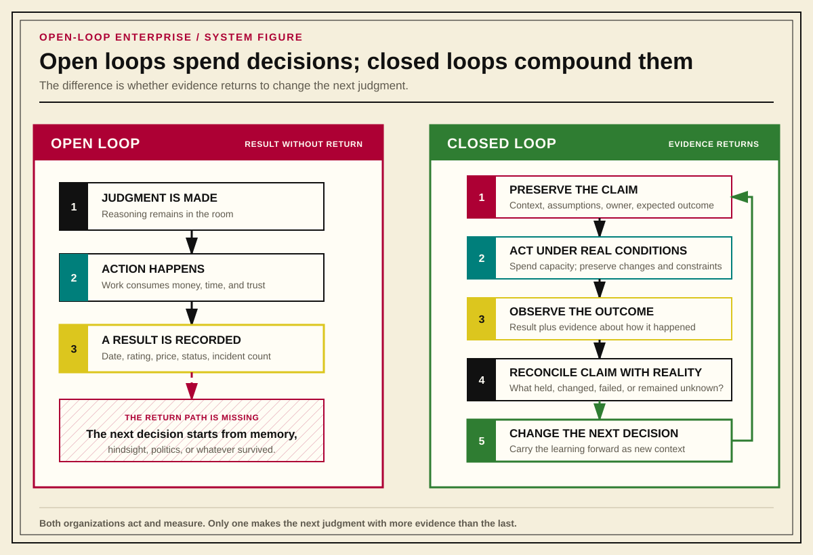
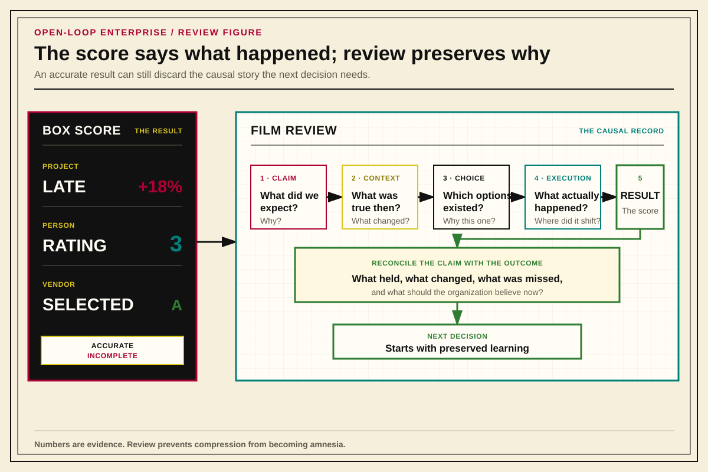

# The Open-Loop Enterprise

## What is an Open-Loop Enterprise?
An open loop enterprise is a company that cannot tell its own good judgment from its own luck, because it never wrote down enough to differentiate them.

Most enterprises run open-loop. They make requests, forecasts, hiring decisions, architecture calls, vendor selections, and performance judgments, and then they let the reasoning behind those calls evaporate. The decision is made, the moment passes, and the organization moves on carrying only the outcome: a ship date, a rating, a purchase, an incident count. It keeps no durable record of what it expected to happen, why, or what it would have accepted as proof that it was wrong.

An organization works as one connected system. If someone want to deploy a new management tool, they need somewhere to run it, a way for it to communicate with other systems, and a way to keep it from creating unnecessary risk. One work request minimally creates work for three teams: systems, networking, and security all have work to do before anyone can use the tool. 

Similar dependencies exists wherever people share time, money, equipment, or responsibility; yet, organizations routinely make decisions as though the consequences will stay inside the department that made them.

“Open-loop” describes what happens to the organization's learning. Departments affect one another whether anyone records those effects or not. Closing the loop requires the organization to bring evidence of those effects back to the people making decisions, so they can compare what they expected with what their decisions actually caused.

Learning from that work requires the organization to preserve the reasoning throughout the inquiry:

1. Record the judgment or prediction when it is made, not after the fact.
2. Preserve the context, assumptions, constraints, and expected outcome that produced it.
3. Route the resulting artifact somewhere it must actually be read.
4. Reconcile the original claim against what actually happened.
5. Feed what was learned back into the next decision.

Most organizations already perform these practices informally, inconsistently, or only after something goes wrong enough to force a postmortem. They belong throughout the work: while a team investigates a problem, tests an approach, delivers a change, and examines the result. Applying them to ordinary decisions gives the organization a dependable way to learn when the stakes are high.

Diagram 1.1 shows the difference between keeping an outcome and keeping enough of the decision to learn from it.

{#fig-open-vs-closed-loop}

All proposed work carries an assumption about how the world works. A team that automates a recurring task assumes that the automation will save effort while preserving the required behavior. A manager who assigns a developmental project assumes that the work, support, and feedback will help the employee build a particular capability. In all cases, the scientific method can be used to examine the assumption: question, research, hypothesize, experiment, analyze, and communicate.

Diagram 1.2 shows the inquiry from the initial observation through the use of what was learned. Observation gives rise to the question; communicating the findings lets someone use them in a later decision. Each activity can send the team back to earlier work when it discovers something its original explanation cannot account for.

{#fig-canonical-organizational-method height=6.2in}

Each component has to work, the components have to work together, and the finished thing has to achieve its purpose. An office building can pass every inspection, finish ahead of schedule, and sit empty because nobody wants office space in that location. The builders did their jobs well; the investment still failed.

The owner might recover the investment by converting the building to housing. That requires a new project, with more work, more money, and another assumption about demand. A successful conversion still leaves the original decision worth examining: why did the company expect tenants for those offices?

Reviewing that decision gives the company a chance to improve the next one. Someone needs to compare what it expected with what happened, investigate the difference, and write down what they learned. That knowledge becomes useful to the organization when the people making the next investment read it.

Diagram 1.3 follows three examples through the same six activities. A hiring process may separate interviews, selection, onboarding, and review into several steps because different people make those decisions using different evidence. A maintenance procedure may group its work more tightly. The number of steps changes with the detail needed to carry out the work; every version still needs a question, a reason to expect an answer, and an examination of what happened.

{#fig-organizational-method-domain-crosswalk}

A business depends on learning to keep making money as its customers, competitors, and costs change. Employees learn from that work individually, but the organization needs a way to retain what they learned when they change jobs or leave. Someone must write down the experience in enough detail for a person who was absent to understand it. Someone else must be able to find and read that record when it can inform a decision. Otherwise, the next team inherits the same uncertainty and pays to resolve it again.

## Reviewing Work Or: How People Actually Grow

> **Coaches never skip film review.**

We can think of sports box scores as roughly equivalent to organizational/team KPIs and OKRs. They track the data and metadata of the game being played. In the NFL, for example, a box score will tell you the final score of a game, along with the measurements that track individual performance: yards gained or lost, passer completion percentage, dropped passes, touchdowns (scores), and turnovers. As with KPIs and OKRs, the box score of a sports match can only tell you whether the target was met or not: it cannot tell you the context that led to the target being unmet.

In sports, this is an accepted fact of life, and, as such, there has never been a winning coach in the history of sports who relied on the box score to help them determine the corrective actions to implement before the next game. The box score says what happened, and the film shows how it happened: which read was missed, where the structure broke down, when execution stopped matching intent, what changed on the field, and how it felt to lose control of a game the team thought it had. A team that only ever looks at the box score is optimizing for a number it does not understand. Yet businesses routinely dismiss this step as unnecessary administrative overhead, seemingly because it is too difficult to put a dollar value in the ledger that justifies the work.

The organizational equivalent of film review is reconciliation after a decision or an outcome. A budget variance, a project status, a performance rating, an uptime number, a vendor score: every one of these is an item in a box score. Each can be perfectly accurate and still be radically incomplete, because the score preserves the result and discards the causal story: the original claims, the assumptions that seemed reasonable at the time, the constraints nobody chose, the decisions that were actually available, and the evidence the organization had and ignored.

Imagine a quarterback throwing a ball that hits his receiver's hands uncontested, and the receiver fails to catch the ball, which sends the ball sailing into the hands of a defender: the box score attributes the interception to the quarterback; the film shows the truth. An organization that tracks metrics without reviewing the decisions and conditions that produced those metrics has kept the score and thrown away the film.

{#fig-box-score-and-film}

Written records give a later readers the means to review a decision: who made it, what they knew, what they expected, and how they planned to check. The organization needs to assign that review to someone and give them time to do it. A record that nobody reads leaves the next decision dependent on whichever participants happen to remember the difficulties produced by the last one.

Every request consumes time and attention from people whose obligations may already exceed what they can do in a given period. Before committing them to another piece of work, the organization needs to decide which demands deserve that commitment.