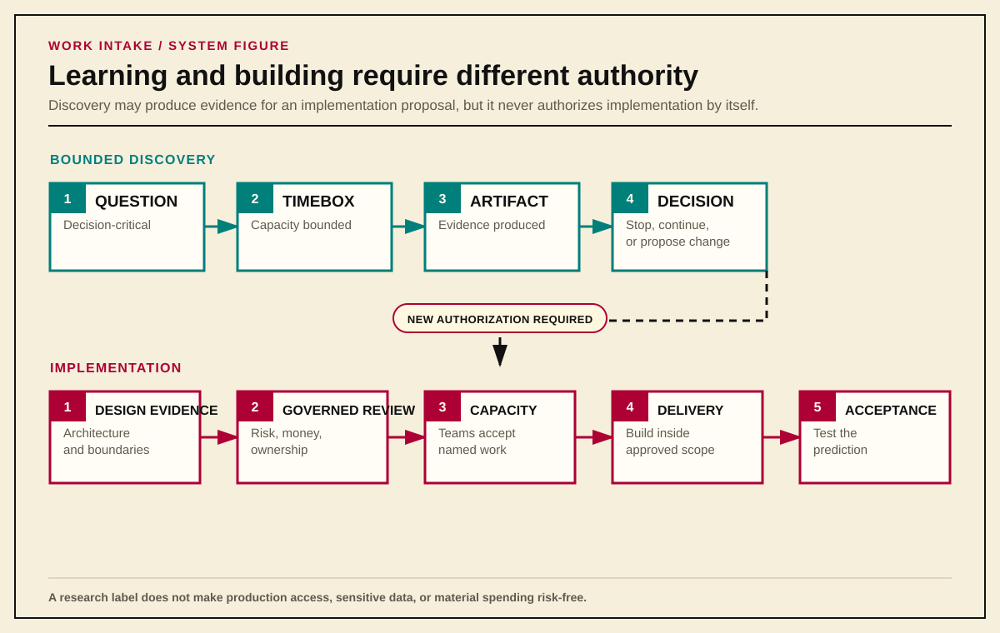
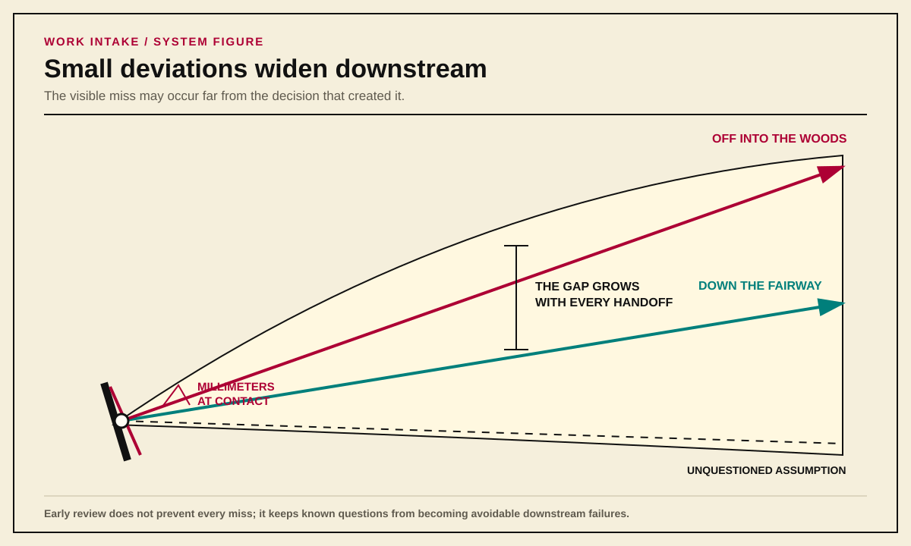
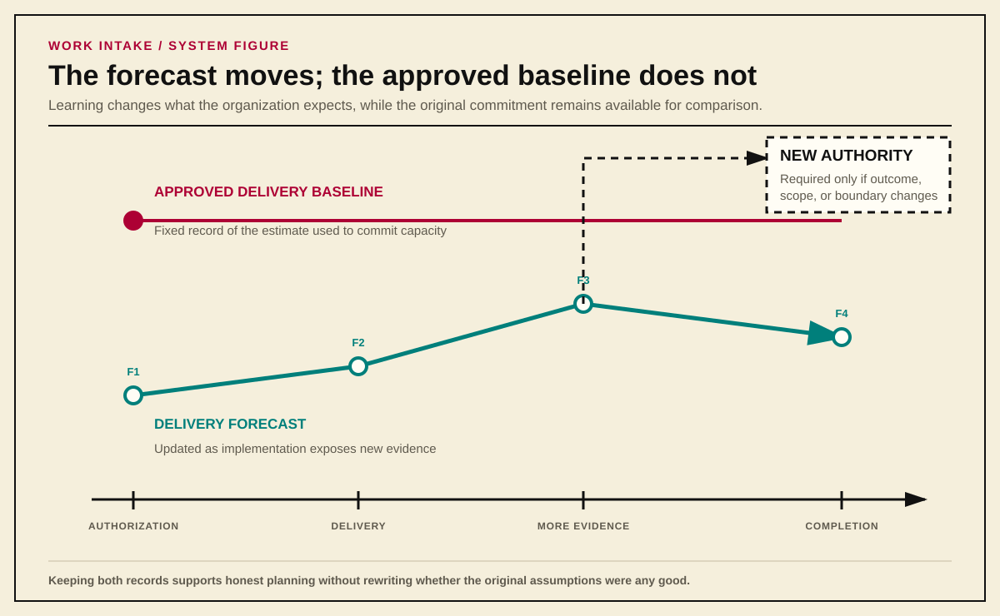

# Make the Commitment Legitimate

*Part III — Framing and Authorizing Work*

A good frame can still enter a bad governance process. Review bodies can average unlike authorities, conditional approval can become soft permission to build, and delivery teams can inherit dependencies that were listed but never committed. Authorization is legitimate only when each decision remains attached to the actor allowed to make it and when the assembled record states exactly what may happen next.

> **Preview note — future edition**
>
> A future version will generalize decision-record rules beyond Work Intake, RFPs, and Managed Runoff. It will explain how reversibility changes the evidence burden, who owns later reconciliation when decision and delivery ownership differ, and when a domain record should supersede rather than duplicate the general decision record.

## Discovery and Implementation Are Different Commitments

One of the easiest ways to corrupt intake is to treat learning and building as the same authorization.

Pure discovery exists to produce decision-ready knowledge: an inventory, taxonomy, comparison, architecture, threat model, decision record, or another artifact that reduces uncertainty. It does not authorize implementation. Reviewing existing systems, reading current authoritative guidance, interviewing operators, or comparing external products should not require the entire implementation-governance sequence when the discovery itself creates no comparable operational risk.

Discovery still needs boundaries. It requires a sponsor, a decision-critical question, an expected artifact, a timebox, and a decision when the timebox ends. If the work touches production, exposes sensitive data, commits material spend, or creates another real consequence, the activity is no longer risk-free merely because somebody called it research.

Implementation is different. An implementation-ready proposal arrives with architecture and design evidence already available. The organization is no longer deciding what it should believe: it is deciding whether to commit money, technical capacity, operational ownership, and risk to making the proposed change real.

This produces two distinct readiness states:

- **Proposal Readiness:** enough is known to justify evaluation or bounded discovery. Material unknowns may remain, but they are visible.
- **Delivery Readiness:** dependencies, ownership, design, risk, capacity, and acceptance responsibilities are confirmed well enough to authorize implementation.

{#fig-discovery-vs-implementation}

Sponsorship does not create Delivery Readiness. Architecture does not create budget. Approval does not commit another team's capacity. Each decision has its own owner because each decision spends or risks something different.

The [Framing Technical Work Before Design](./Framing-Technical-Work-Before-Design.md) guide supplies the early intent categories, discovery-package structure, and architecture and design questions that must be answered before implementation commitments are made. Work intake owns the transition from framed demand to authorized work; it should not copy the framing guide into a larger form.

---

## Requesters Supply Facts; the System Derives Consequences

Requesters know their current condition, desired outcome, constraints, affected users, timing pressure, and business consequences. They are not necessarily qualified to classify the work those facts create.

A requester should not select:

- project size;
- enterprise priority;
- required reviewers;
- risk class;
- employee grade;
- named delivery staff; or
- another team's capacity commitment.

Those choices create organizational consequences. The intake system should derive them from structured facts using published, auditable rules, then present the result for human review.

This deterministic core controls classification, required fields, routing, state changes, clocks, escalation, and readiness. AI may help a person write clearly, inspect a rule, or implement an approved workflow change. It should not decide whether a governed condition is true. A probabilistic model is useful when the task tolerates interpretation; it is a poor authority for deciding whether Security Review is mandatory or whether an overdue review clock should escalate.

### Keep Unlike Questions Separate

One universal "project score" collapses unlike concerns and produces false confidence. Intake should preserve at least four separate views:

- **Delivery Capacity Profile:** expected labor, elapsed duration, and coordination burden;
- **Delivery Size Class:** the highest XS-through-XL band reached by any capacity dimension;
- **Financial Commitment Class:** money committed or placed at risk;
- **Work Proposal Risk Profile:** likelihood, consequence, blast radius, criticality, reversibility, and affected authority boundaries.

Priority is separate again. The requester and sponsor provide the priority claim and its evidence. The accountable portfolio authority assigns queue position against existing commitments and available capacity.

Uncertainty should widen an estimate's range and lower confidence. It should not automatically make work "large," nor should lower dimensions average away one material burden. A proposal that consumes little labor but creates a difficult enterprise coordination problem is not small merely because the spreadsheet average says so.

The sizing model should use one published organizational matrix so portfolio comparisons mean the same thing across teams. An organization may recalibrate the thresholds as it learns, but it should version the rule and preserve the historical classification that governed the original decision.

---

## Review Is Ordered, Modular, and Decisive

An implementation proposal should not explode into an all-reviewer meeting where every function reads the same document at once and waits for somebody else to identify the missing evidence or decision.

Every participating function should know which decision it owns, what evidence it needs, and which upstream decisions must be complete before its review begins. The organization publishes that sequence. The exact stages differ because companies distribute authority differently, but the order follows the dependencies among the decisions:

1. administrative authority decides that the proposal may consume evaluation capacity;
2. the Security Review Board evaluates cross-cutting organizational risk;
3. financial and technical functions review the proposal after the earlier gates clear; and
4. accepted review records assemble into the authoritative proposal artifact.

{#fig-ordered-review}

Not every review can or should run in parallel. Finance should not spend time constructing a budget for work that Security will reject the next day. Systems Engineering and Network Engineering should not design delivery around a proposal that lacks organizational authority. A rejection at an earlier gate prevents dependent review from beginning.

### Authority and Clocks

Every review needs someone responsible for moving it and someone authorized to decide it. The **Review Facilitator** assembles the right reviewers, tracks unknowns and objections, prevents unresolved questions from disappearing, and records the result. The **Decision Owner** has the competence and organizational authority to make the decision across the boundaries under review. One person may perform both jobs, but facilitating the review never grants decision authority.

Reviews also need published targets for acknowledgement and decision. When a review misses its target, the facilitator escalates it to a named owner or records an extension with a reason and new date. Reassignment, research, and scheduling difficulty inside the reviewing function do not restart the clock. When the review depends on information from somewhere else, the record identifies the missing input, who must supply it, what they must produce, and when it is due.

Silence authorizes nothing, and the escalation path prevents it from becoming a permanent veto.

### The Security Review Board

Security is often broader than application security. Depending on the organization, its remit may include information security, physical security, continuity, logistics, environmental threats, fraud, supply-chain exposure, and other risks capable of harming the company or the people who depend on it.

Security's position in the sequence follows from the authority it carries. It decides whether the proposal has identified, evidenced, and acceptably treated the risks within its charter before later functions commit money or design delivery around it. When Security decides that the risk exceeds the organization's tolerance, preference from Finance, Architecture, or an executive does not reverse that decision.

Security does not receive a separate intake packet. It reviews the same Work Proposal, using the architecture, system boundaries, data flows, applicable standards, control evidence, exception requests, threat model, testable mitigations, and operating responsibilities that its charter requires. Its decision returns to that proposal so downstream teams can verify what Security examined and what it decided.

The exact questions belong in a companion guide built from the organization's risk model and authoritative sources. [NIST Cybersecurity Framework 2.0](https://www.nist.gov/publications/nist-cybersecurity-framework-csf-20), [NIST's Risk Management Framework](https://csrc.nist.gov/pubs/sp/800/37/r2/final), [system security planning guidance](https://csrc.nist.gov/pubs/sp/800/18/r2/final), [OWASP SAMM](https://owaspsamm.org/model/verification/architecture-assessment/), and verification standards such as [OWASP ASVS](https://owasp.org/www-project-application-security-verification-standard/) can inform that guide; they do not define this organizational workflow.

### One Contract, Different Review Records

Each review function keeps the specialist record its decision requires. Security may need a threat model and control evidence; Finance may need a cost model and funding conditions. Forcing both into one universal schema would erase information that only one function is qualified to interpret.

The intake system still needs a small set of shared facts so it can identify:

- what the review examined;
- which proposal revision it examined;
- who had authority to decide;
- the decision and its timestamp;
- the evidence and assumptions that mattered;
- which boundaries the review did not cover;
- any required next action; and
- whether the record has been superseded.

Those shared facts allow the system to prove that a decision belongs to the correct proposal revision, came from someone authorized to make it, and has not been replaced by a later decision. The specialist record remains intact.

---

## Review Decisions

Every reviewing function must return a state that tells dependent teams whether they may proceed, perform a bounded test, or stop. The common model has three decisions.

### Approved

The proposal satisfies the function's requirements for the decision under review. Approval applies only to the recorded proposal revision and the facts, evidence, assumptions, and boundaries the function actually examined.

### Conditional Approval

A critical variable cannot be known until later, but the concern is specific and testable. Conditional Approval authorizes only the bounded discovery work needed to produce the missing evidence.

The condition must state:

- the variable being tested;
- the evidence that counts as passing or failing;
- the work permitted to produce that evidence;
- the owner and timebox; and
- the decision that follows each possible result.

Conditional Approval is not approval with cleanup attached. The review remains unresolved, and general implementation remains unauthorized. After the test, the original reviewing authority approves, rejects, or authorizes another bounded test with a new question, expected result, owner, and timebox.

{#fig-conditional-approval}

### Review Rejection

The current proposal revision fails a governing standard, risk decision, requirement, or other mandatory condition. Reviews and delivery decisions that depend on the rejected result stop. Other approvals cannot offset it.

A request for more testing is not Review Rejection. If bounded proof could responsibly resolve the question, the correct state is Conditional Approval.

### The Proposer Carries the Evidence

The proposer must identify applicable standards, supply evidence of conformance, or explain why a standard does not apply and why an exception should be granted.

If the proposal supplies no credible compliance case, the reviewing function may reject it categorically. The reviewer is not responsible for proving every possible failure or building the proposal on the requester's behalf.

Specific evidence changes the reviewer's obligation. If the proposer claims one control satisfies several requirements, the reviewer must identify why that control does not satisfy them. If the proposal maps some requirements but omits another, the reviewer must identify the material omission. The required specificity follows the case actually presented:

> If no compliance case exists, categorical rejection is enough. Once the proposer makes a specific case, the reviewer must identify a specific defect.

This is not a courtroom. The organization is deciding whether to spend money and capacity, and whether to accept the risk. The burden belongs to the person asking it to act.

---

## Preparation Buys Execution Freedom

Upfront review gives downstream teams the decisions they need to execute without reopening the proposal. When an authorized request reaches Infrastructure, "Did Security approve this?" should be answered by inspecting the artifact, not by scheduling another round of meetings. The same is true of architecture, finance, procurement, ownership, and every other prerequisite represented in the approved state. The receiving team verifies the record; it does not relitigate the decisions that produced it.

That trust applies only within the approved boundaries. Materially changing the outcome, requirement, risk, or operating model still requires the appropriate new decision. Inside those boundaries, however, the organization should be able to move. Requirements do not need to be re-proven at every handoff, downstream teams do not have to reconstruct the history from chat messages, and implementation does not repeatedly double back to answer questions that belonged in discovery.

This does not repeal Murphy's Law. Estimates will change, dependencies will fail, implementation will expose new constraints, and people will still make mistakes. Work Intake cannot guarantee smooth execution. It prevents a different class of failure: predictable cycles of requirements reverification, accidental scope expansion, and late discovery that a supposedly settled decision was never actually made.

A security-tool replacement, for example, can complete its technical migration and still fail its users because a dashboard from the old system was never captured as a requirement. "No one thought to ask the question" is not merely an implementation problem when the missing question changes whether the replacement satisfies the original need. It is evidence that discovery and review did not follow the consequence tree far enough before the organization committed to an answer.

Golf makes the same point with less paperwork: a tiny change in the clubface angle at contact can separate a shot down the fairway from one deep in the woods. The visible failure happens far from the original deviation, but that does not mean the deviation was unimportant. Early questions work the same way: a small correction before commitment can change the entire downstream tree.

{#fig-clubface-consequence}

Developing a process that consistently produces authorized, implementation-ready work takes effort. Enforcing it takes more. Developing a swing that consistently finds the fairway also takes effort. The organization has to decide what game it is playing: **are we playing for beers, or are we playing for Majors?**

---

## From Proposal to Authorized Work

Human review should produce durable records, not a trail of comments that somebody later summarizes from memory.

An accepted review record enters the final Work Proposal only after the system verifies that it belongs to the correct proposal revision, carries an approved decision, and has not been altered or duplicated. Assembly preserves the specialist conclusion as written. It does not replace disagreements with an AI-generated consensus that no reviewer approved.

Once every required review has cleared, the proposal becomes an **Authorized Work Proposal**. That revision does not change. It governs one top-level outcome and records the scope, constraints, acceptance authority, review decisions, and organizational commitments that govern delivery. When the top-level outcome is one Epic and every Delivery Readiness condition has already been satisfied, implementation may begin. When the top-level outcome requires an Initiative, authorization permits its child delivery records to be developed within the approved boundaries; it does not make every child ready.

{#fig-authorized-work-assembly}

Delivery records refine execution. They do not rewrite authority.

An Epic, story, work package, task, sprint backlog, or implementation plan may change the sequence, approach, estimate, or local decomposition as evidence improves. None may silently change the approved outcome, boundary, constraint, or acceptance condition. Those changes require an approved superseding proposal revision.

Initiative approval is not blanket implementation permission for every child Epic. Each child reaches Delivery Readiness only when its design, dependencies, operational ownership, acceptance responsibility, specialized approvals, and named capacity within a Planning Interval are confirmed. Only then may implementation begin. This permits adaptive delivery without converting "Agile" into an exemption from planning or authority.

### From an Authorized Initiative to a Delivery-Ready Epic

Initiative authorization settles the organizational outcome and the boundaries within which delivery planning may proceed. It may also preserve forecasts, sequence assumptions, dependency reservations, and an overall capacity strategy. Those records make later delivery possible, but they do not commit a receiving team to implement a child Epic that has not yet been defined and accepted.

Every candidate Epic identifies the exact Authorized Work Proposal revision from which it derives. The Epic states the independently valuable result it will produce, the approved requirements and acceptance conditions it advances, and the boundaries it must not cross. Work Intake then derives which earlier decisions still apply and which decisions the child must obtain for itself. A cross-cutting review may remain valid when the Epic stays inside the facts and boundaries that review examined; a new data flow, vendor, operating model, risk, or other material difference returns to the authority that owns the affected decision.

Delivery Readiness is assembled from those decisions; it is not granted by a generic readiness approver. For each child Epic, the authoritative record must establish:

- traceability to the governing Initiative revision;
- child scope and acceptance evidence that remain inside the approved outcome;
- architecture and design evidence sufficient for implementation;
- dependencies with named owners and actual commitments or valid reservations;
- every specialized approval triggered by the child's facts;
- the expertise, staffing, operational ownership, and support model the work requires;
- acceptance by the receiving team's capacity owner of the named work within a Planning Interval; and
- the person authorized to accept the delivered result.

The system marks the Epic Delivery Ready only after each required decision owner has supplied an accepted record. The Review Facilitator may coordinate the evidence and unresolved questions, but facilitation does not allow one person or committee to substitute a broad approval for the decisions of Security, Finance, Architecture, delivery teams, or another responsible function. A missing condition returns to its owner; a testable unknown may receive Conditional Approval for bounded discovery; silence does not move the Epic forward.

Initiative-level capacity records must describe what they actually represent. A forecast estimates likely demand. A Conditional Dependency Reservation preserves one possible slot. A staffing strategy identifies how the organization expects to source expertise. None commits a delivery team to a child Epic. The capacity condition becomes true only when the receiving team accepts the named Epic and its required ownership within a Planning Interval. At that point, the organization records the Approved Delivery Baseline and implementation may begin.

### Authorization Must Remain Active

An approval does not keep work alive by itself. The sponsor and the authoritative record must remain identifiable throughout delivery.

If the sponsor leaves or withdraws, discretionary work does not continue forever through momentum. The existing rules determine whether a replacement sponsor accepts the work, the work pauses, or delivery ends. Anything left running must have an owner and an exit plan under [Managed Runoff](./Managed-Runoff-for-Deprecated-Services.md).

The authoritative source belongs in a central, version-controlled repository. Ticket attachments, rendered pages, dashboards, and published copies link back to it. Accepted artifacts should be readable across the organization by default. Restricted work must identify why access is limited, who owns the restriction, when it will be reviewed, and what coordination information can be published safely.

---

## Capacity Is an Acceptance Decision

Routing work to a team does not commit that team's capacity.

A dependency may be known without being planned. Discovery may require a team to provide access or expertise without committing it to later implementation. Delivery begins only when the receiving team accepts named work, ownership, and capacity within a Planning Interval.

Where an approved Initiative cannot provide an exact handoff date, a dependency team may place a Conditional Dependency Reservation on one work slot for a defined Planning Interval. The team plans around leaving that slot open. If the reserved work becomes ready during the interval and has higher priority than the team's other queued work, it enters the workstream immediately instead of waiting for the next planning cycle. If upstream work does not activate or renew the reservation by its cutoff, the team releases the slot.

An operating-system migration makes the purpose concrete: if a million-dollar contract for the old operating system is about to renew, Systems Engineering must deliver the replacement image before downstream teams can migrate. Those teams may not know exactly when the image will be ready, but a reservation allows the first downstream work to begin as soon as it arrives. The reservation does not decide priority; it gives a dependency team a way to honor a priority the organization has already established.

{#fig-conditional-dependency-reservation}

If leadership instead directs a team to drop committed work for something new, that choice must be visible. The record identifies who made it, what got displaced, why the normal queue was bypassed, and which delay or consequence they accepted. This is an **Accountable Priority Override**.

Routing work to a team does not mean that any available engineer can do it. The team's technical reviewer decides what expertise, ownership, and support the work requires; the capacity owner decides whether the team can provide them.

If the team cannot provide what the work requires, the organization must change the staffing, schedule, scope, or source of expertise. It cannot pretend the work became easier because the right people were unavailable.

The [Career Progression Guide](./Career-Progression-Guide.md) explains how the team makes the staffing decision. The [work-item guide](<./Writing Work Items - Epics, Stories, and Tasks.md>) explains how the approved outcome becomes Epics, stories, work packages, and tasks. Work Intake only needs the answers: has the team accepted the staffing and capacity, and does the delivery work still match what was approved?

---

## Delivery Changes the Forecast, Not the Past

When implementation is approved, the organization records the estimate it used to commit capacity. That becomes the **Approved Delivery Baseline**: a record of what everyone believed when the decision was made.

As the team learns more, it updates the **Delivery Forecast**. The baseline records what the organization thought then; the forecast records what it thinks now. Keeping both allows the organization to plan honestly without erasing whether its original assumptions were any good.

{#fig-baseline-and-forecast}

If the new forecast requires substantially more capacity, someone with authority over the affected priorities must accept the larger commitment. If the desired outcome, scope, requirement, boundary, or acceptance condition changes, the proposal must change.

The delivery team may change how it builds the approved thing. It may not quietly decide to build a different thing.

---

Authorization preserves the organizational decision. Delivery planning must now translate that decision into executable work without quietly changing its outcome, boundary, or acceptance conditions.

<!-- Preview assembly source: Work-Intake-Is-an-Organizational-System.md: Discovery and Implementation through Delivery Changes the Forecast -->
