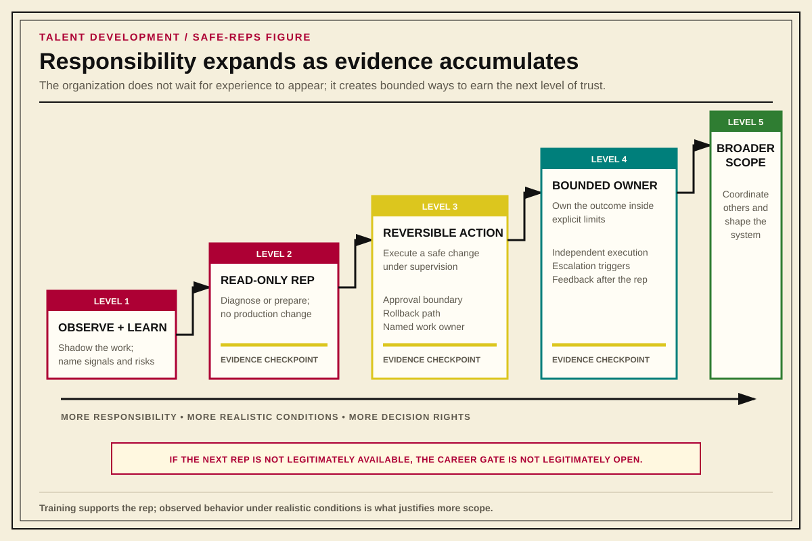

# Create Safe Reps and Allocate Opportunity

*Part V — Developing and Acquiring Capability*

Development becomes real when the organization changes work allocation. Preference, stretch, and career direction only produce capability when they lead to legitimate practice under boundaries that protect both the person and the system.

## Principle 1: Preference Is Evidence, Not a Perk

Employee preference is operational signal.

What work energizes this person? What work drains them? What do they seek out without being asked? What do they avoid even when they are competent at it? What kind of problem causes their curiosity to turn on?

Those answers matter because preference predicts:

- quality of output
- durability of motivation
- learning rate
- burnout risk
- cost of forced stretch
- likely long-term fit
- where the organization can get disproportionate return from the person

Preference is not veto power. Sometimes the work is the work. A person on a team that owns both on-prem systems and cloud may need to support Terraform competently even if they hate writing it. Baseline competence matters, and nobody gets a role made entirely out of favorite tasks.

But sustained misalignment is waste. If the same person is happiest and strongest writing Ansible, Python, Bash, or working on-prem, a wise manager should bias their long-term assignment mix toward that fit when the business allows it. The goal is not indulgence. The goal is better output from the talent the organization already has. Some necessary work will still be unpleasant; preference is signal, not exemption.

Employees should be encouraged to discuss these preferences openly with their managers. Managers should treat the information as planning input, not as complaining.

Managers should also use disliked work as a learning opportunity when the exposure is genuinely necessary. If an engineer strongly prefers one tool or operating model over another, the coaching question is not only "can you do the required work?" It is also "can you explain why reasonable people prefer the alternative?" The point is not to force false enthusiasm. The point is to build the ability to operate from another perspective when the business context requires it.

A person who dislikes Terraform may still need to understand what Terraform users value: provider breadth, declarative workflow, common hiring market, ecosystem support, and familiar patterns across cloud teams. That same person may still prefer Ansible, Pulumi, Python, or another model after doing the work. That is fine. The development value is in learning to understand the opposing case well enough to apply the right tool in the narrow context where it is strongest, not in pretending every preference is equally aligned with every situation.

### Small Wins and Enjoyment Are Signal

Trying to have fun with the work is not childish, unserious, or separate from performance. Enjoyment is one way people stay connected to the work long enough to improve at it.

Managers should notice whether people still celebrate each other's wins. A resolved incident, a removed source of toil, a clean handoff, a useful runbook, a fast recovery, a better test, or a small automation improvement may not look like a major business milestone. But small wins compound into large outcomes, and celebration reinforces the behaviors that create them.

Lack of celebration is also signal. It may mean the team is exhausted, afraid to show enthusiasm, disconnected from the outcome, too siloed to notice each other's contributions, or operating in a culture where visible enjoyment is treated as unprofessional. That is a management problem. The goal is not performative cheerleading. The goal is a team that recognizes progress, learns from it, and wants to keep playing well together.

---

## Principle 2: Forced Stretch Has an Elastic Limit

Stretch work is necessary. Forced stretch work is sometimes necessary. But stretch is not free.

There is an elastic limit: the boundary between healthy forced stretch and damaging misalignment. Inside that boundary, the person can recover, learn, and become more capable. Beyond it, the organization creates brittleness, burnout, reduced elasticity, or failure.

The important distinction is not "liked work" versus "disliked work." The distinction is short-term exposure for baseline competence versus sustained assignment against durable strengths and preferences.

A useful test:

**Is this assignment helping the person become more capable, or is it consuming their capability faster than it builds it?**

If the answer is not clear, the manager needs more context before calling the assignment development.

---

## Principle 3: Diagnose Utilization Before Judging Performance

When performance regresses, do not start with the assumption that the person changed. Start like a systems engineer investigating degradation.

Did this used to work? What changed? Did load increase? Did priority conflict increase? Did a hidden workstream appear? Did another leader create side-channel work? Did the person lose support? Did the system around the person change while the visible assignment stayed nominally the same?

That diagnostic step is the **Talent Utilization Review**.

Use it proactively before major assignments and reactively when output drops below expectation.

The loop:

1. Map current assignments.
2. Expose hidden work.
3. Compare stated priorities.
4. Inspect constraints and dependencies.
5. Gather the person's context.
6. Reassess the visible performance signal.
7. Decide what changes: the person, the work, the priorities, the support, or the system around them.

In team-sport terms, the organization should ask whether it is putting the player in a position to succeed. Too many disparate assignments of equal priority will invariably lead to delayed outputs, reduced quality, or both. 

The sports-franchise mentality is to create conditions where talent can produce, not to conclude that the talent failed while the organization was asking it to win from an impossible position.

---

## Principle 5: Every Career Transition Gate Needs a Safe-Reps Path

The hardest jumps in a technical career are often not knowledge jumps. They are operating-mode jumps.

Common gates:

| From | To |
|---|---|
| Seeing a problem | Reporting it clearly |
| Reporting a problem | Helping fix it |
| Fixing a problem | Preventing its recurrence |
| Preventing one recurrence | Building reusable automation or standard work |
| Owning a task | Owning an outcome |
| Owning one outcome | Creating leverage for others |

If the organization requires experience before granting opportunity, it must also provide bounded ways to gain that experience. Otherwise early and mid-career development depends on luck, off-book initiative, or unusually generous coworkers.

A **Safe-Reps Path** is a bounded way to practice the next operating mode without unacceptable risk.

Competency language is useful only when it becomes this kind of gate. A rubric that says someone needs "strategic thinking," "ownership," or "cross-functional influence" does not help much by itself. The useful version names observable stages: awareness, routine execution, independent execution, broader coordination, and system-level ownership. Then the organization can ask which stage the person has demonstrated, which stage the next role requires, and what bounded work would let them practice the difference.

Examples:

- A helpdesk employee spends four hours a week migrating low-risk scripts from Python 2 to Python 3.
- A junior operator shadows incident remediation, then owns a read-only diagnostic step, then owns a reversible fix under supervision.
- A systems administrator refactors repetitive conditional logic into a data structure with tests and review.
- A cloud-curious on-prem engineer contributes to a Terraform 0.x to 1.x migration in a constrained module.
- A strong implementer writes the runbook, then the checklist, then the automation for a recurring issue.

The point is not the specific technology. The point is legitimate reps across the gate.

Development plans should make those reps visible. A useful plan does not treat training completion as proof of readiness. Training is input. Readiness comes from observed behavior under realistic conditions.

| Development Need | Real Work Rep | Feedback Source | Formal Support | Evidence |
|---|---|---|---|---|
| What the person is trying to build | The bounded assignment where the skill will be practiced | Manager, mentor, peer, work owner, or community | Course, reading, lab, certification, or reference material | What will show that the person has actually improved |

{#fig-tda-safe-reps-path}

---

## Stretch Proposals

A **Stretch Proposal** is an employee-initiated request for a bounded development opportunity that moves them toward a desired skill, responsibility, or domain.

It should be normal career-development language, not an exception or a favor.

A good Stretch Proposal answers:

- What do I want to learn or practice?
- What real problem would this help solve?
- Who owns the work?
- How much time am I asking for?
- What is the expected value?
- What is explicitly out of scope?
- What can I do read-only?
- What actions require approval before I make changes?
- What is the risk if I make the situation worse?
- What evidence will show whether this was useful?

For cross-team proposals, manager-to-manager coordination is required. The employee's manager, the receiving team's manager, and the work owner should agree on time box, priority impact, supervision, risk boundaries, and success criteria.

This matters because self-directed stretch work is often how people become capable of the next thing. But unmanaged stretch work can become hidden risk. The formal version should preserve initiative while making the work visible, bounded, and legitimate.

---

## The Internal Farm System

The sports-franchise analogy is strongest here. Strong franchises do not merely acquire talent. They scout, draft or sign, assign level-appropriate reps, coach specific skills, observe performance, move people through levels of competition, and build succession pipeline before a role becomes urgent. In MLB, this is called a team's "farm system." Players develop through Minor League A, AA, and AAA, and the most capable eventually get called up to the major-league roster. The corporate equivalent is the rare Fellow-level individual contributor role.

**Businesses need the same pattern.**

An *Internal Farm System* is the practice of coordinating small, useful stretch assignments across teams so people can develop toward real organizational needs.

It creates three kinds of value at once:

1. The employee gets meaningful reps in a desired skill or domain.
2. The receiving team gets real work done.
3. The organization builds succession pipeline before it is forced to need it.

This should not depend on a heroic employee finding after-hours work and hoping someone says yes. Employees should be encouraged to talk to people on other teams, compare patterns, and notice where one team's approach might apply to another team's problem. But when the work becomes real, it should move onto the books.

Four hours a week can matter. It can be enough to give someone a path from support into systems work, from systems work into automation, from implementation into design, or from team-local work into cross-team influence.

The farm system also needs a portable internal talent packet. That packet should not be a self-marketing deck or a popularity contest. It should help managers and receiving teams discuss readiness, fit, supervision, and risk from shared evidence:

- current role and scope
- demonstrated accomplishments
- current operating level
- desired next operating mode
- strengths to preserve
- gaps to close
- experiences needed
- systems or domains to learn
- proposed assignments
- manager or panel assessment

---

## Career Pathing Needs Architecture

"Own your career" is useful advice only when the organization exposes enough map for the employee to navigate. Without guidance on actual departments, roles, skill sets, decision rights, and available development paths, career ownership becomes guesswork.

A real career map explains more than promotion. People need several kinds of movement:

- **Move upward:** increased scope, responsibility, complexity, or decision rights.
- **Move sideways:** broader experience at a similar level.
- **Build in place:** new responsibility inside the current role.
- **Discover:** short-term exposure used to test interest, fit, and usefulness.

A generic career tool does not solve that. If a "career compass" produces abstract advice, points toward roles that do not exist, or suggests paths the organization has not actually made available, it is not a development system. It is career-pathing theater: the organization appears to offer mobility while leaving employees to invent the path themselves.

That creates several risks:

- employees leave to get the experience the organization could have helped them build
- employees form shadow development networks to discover work the official system does not surface
- stretch work happens through side channels instead of visible coordination
- people try unsafe tooling shortcuts to create opportunities for themselves
- managers lose sight of where capability and interest already exist inside the company

The Internal Farm System is the formal answer. Employees should absolutely talk to people on other teams, compare patterns, and notice where their interests might create value. But the organization has to turn that curiosity into visible, bounded, legitimate work. A competent development system does not merely tell people to pave their own career. It shows them the roads that exist, the roads the company needs built, and the safe-reps paths for helping build them.

---

## Career-Stage Development

TDA should reuse the Career Progression Guide's existing tiers rather than inventing a second leveling model.

### Earlier and Mid-Career

The development focus is safe reps across transition gates.

The organization should ask:

- What next operating mode is this person trying to learn?
- What bounded work would let them practice it?
- What support or supervision keeps the risk acceptable?
- What evidence would show readiness for more responsibility?

This is where development culture matters most. Coaching, practice, feedback, and bounded stretch should be normal expectations of the company, not special events. Continuing the sports analogy, people in this stage of their career are the team's most recent draft class. Successful sports teams have staff dedicated to developing draft picks. Many companies will not staff this as a dedicated role, so it must be an explicit portion of any people manager's time.

### Senior

The development focus is scope fit, durable ownership, and leverage.

The organization should ask:

- Is this person assigned work that matches their durable strengths?
- Are they owning outcomes rather than only tasks?
- Are they building systems, standards, runbooks, automation, or practices that outlast their direct effort?
- Are they being given scope that can demonstrate the next level if the organization needs that level?

Senior development is not just harder tickets. It is better placement against outcomes.

### Staff+

The development focus is cross-team capability, succession, strategic placement, and organizational leverage.

The organization should ask:

- What capability is missing across teams?
- Who can create it?
- Who can be developed behind them?
- What work creates leverage through other engineers?
- Is the missing capability developable internally, or does the organization need free-agent hiring?

External hiring becomes more like sports free-agency as you move higher up the ladder, especially when the company lacks principal or Staff+ capability in-house. That is not a failure by itself. It is a different tool. The failure is pretending external hiring is a substitute for a development culture at every level.

---

## Leadership Discovery and Development

Leadership is a distinct craft. Technical excellence, ambition, seniority, visibility, reliability, and willingness to accept a promotion do not prove that someone wants to develop people.

The first leadership-development question is therefore not "could this person manage?" It is "does this person actually want to be accountable for other people's growth and success?"

Leadership discovery should use the same architecture as any other career transition:

> interest → exposure → education → bounded leadership practice → feedback → evidence → informed decision

Useful discovery reps may include mentoring, facilitation, project leadership, temporary leadership assignments, participation in planning or calibration, and carefully bounded exposure to coaching, hiring, and people-development work.

The process must allow someone to conclude, "I enjoy technical leadership, systems leadership, or project leadership, but I do not want people management." That is successful discovery, not failure. A permanent, respected IC path is what makes the answer honest. Without that path, leadership discovery becomes a forced march toward the only promotion the organization appears to value.

### Development Is Recursive

Managers should be developed by their own managers and leadership chain through the same underlying model they are expected to provide for everyone else. The work is self-similar:

- **70 percent real work:** coaching people, allocating developmental reps, handling calibration, facilitating decisions, and learning through actual management responsibility
- **20 percent learning from others:** mentoring, observation, peer discussion, and structured exploration with other leaders
- **10 percent formal support:** reading, courses, case studies, and other structured study

The ratios are still design guidance rather than accounting. The important point is that managers need real practice, useful feedback, and deliberate opportunities to update their own mental models. Promotion into management does not complete leadership development. It creates a new development obligation one layer up.

### Socratic Leadership Seminar

The **Socratic Leadership Seminar** is one mechanism for the leaders' 20 percent. A voluntary group of current or prospective leaders reads credible leadership and management research, then meets periodically to explore what the material reveals, where it contradicts experience, and which questions remain unresolved.

The seminar is not a class, a change initiative, or a disguised planning meeting. Facilitation rotates so participants practice selecting material, asking useful questions, making disagreement productive, and holding a room without forcing it toward the facilitator's preferred conclusion. The discussion produces no required action items. Its purpose is to create a recurring place where leadership thinking happens.

That makes the seminar a deliberately unmeasured input. Attendance and worksheets would prove compliance, not learning. Its downstream effects may eventually appear in better coaching, better allocation of developmental reps, stronger mental-model updates, and leaders voluntarily returning to ideas from earlier sessions. The seminar itself should not claim credit for those outcomes.

See the [Socratic Leadership Seminar implementation guide](docs/Socratic-Leadership-Seminar.html) for cohort design, source selection, facilitation, meeting structure, the use of ELMO, and the limited role of the whiteboard.

---

## Organizational Learning From Talent Evidence

Individual development evidence becomes organizationally useful when recurring patterns can be seen without stripping away the context that made the evidence honest.

The loop is:

> individual evidence → recurring pattern → organizational visibility → accountable leader decision

Patterns worth surfacing may include:

- the same capability gap appearing across many teams
- high performers repeatedly lacking appropriate scope
- promotion evidence existing without matching roles
- employees repeatedly seeking a career path the organization has not created
- some managers routinely developing internal talent while others rely on external hiring
- strong people repeatedly leaving the same management chain
- invisible work accumulating around a small number of people
- managers being unable to identify safe developmental assignments
- developmental reps being concentrated among already-visible or well-connected employees

TDA should make those patterns visible. It should not pretend to own every response. A repeated capability gap may require training, hiring, role redesign, or a strategic decision. Uneven access to stretch work may require management intervention. Promotion evidence without available scope may require workforce planning or organization design. The evidence should reach someone accountable for the decision instead of disappearing because the response belongs to another discipline.

Not every useful input can or should receive a direct metric. **Unmeasurable is not unfalsifiable.** Some practices, including the Socratic Leadership Seminar, are better evaluated through downstream behavior and revealed preference than through an activity score. The goal is not to measure everything. It is to know what is measured, what is deliberately unmeasured, and where evidence should eventually appear if the system is healthy.

---

Internal development is one answer to a capability gap. External hiring is another. The organization needs to know which capability it lacks, whether it can create that capability in time, and what evidence should survive whichever path it chooses.

<!-- Preview assembly source: Talent-Development-Architecture.md: preference, forced stretch, utilization, safe reps, opportunity systems, career stages, and organizational learning -->
