# Closing the Loop

## A Guide to Organizational Excellence

*Preview manuscript assembled from the current organizational-philosophy corpus.*

> **Preview note — future edition**
>
> This is a structural preview, not a finished edition. Visible future-edition notes mark missing source material, unresolved chapter seams, or synthesis the current articles do not yet support. The source articles remain independently usable; this manuscript is a book-specific cut.

## Contents

- [About the Author — Future Edition](frontmatter/about-the-author.md)
- [Working Glossary](frontmatter/working-glossary.md)
- [Part I: Learning to See the Loop](parts/part-1.md)
- [The Open-Loop Enterprise](chapters/01-open-loop-enterprise.md)
- [Part II: Deciding What Deserves Organizational Attention](parts/part-2.md)
- [The Front Door](chapters/02-front-door.md)
- [Future Edition: Portfolio Judgment](chapters/03-portfolio-judgment.md)
- [Part III: Framing and Authorizing Work](parts/part-3.md)
- [Frame the Work Before Designing It](chapters/04-frame-before-design.md)
- [Make the Commitment Legitimate](chapters/05-legitimate-commitment.md)
- [Turn Decisions Into Executable Work](chapters/06-executable-work.md)
- [Part IV: Operating, Improving, and Retiring the System](parts/part-4.md)
- [Make the Operating System Visible](chapters/07-visible-operating-system.md)
- [Turn Recurrence Into Engineering Work](chapters/08-convert-recurrence.md)
- [Future Edition: Operating Cadence](chapters/09-operating-cadence.md)
- [Managed Runoff](chapters/10-managed-runoff.md)
- [Part V: Developing and Acquiring Capability](parts/part-5.md)
- [Development Is an Organizational Architecture](chapters/11-development-architecture.md)
- [Management Is Evidence Infrastructure](chapters/12-management-evidence.md)
- [Create Safe Reps and Allocate Opportunity](chapters/13-safe-reps-and-opportunity.md)
- [Future Edition: Hiring Capability](chapters/14-hiring-capability.md)
- [Selecting External Capability](chapters/15-selecting-external-capability.md)
- [Proving and Accepting External Capability](chapters/16-proving-external-capability.md)
- [Part VI: Reconciling the Enterprise](parts/part-6.md)
- [Future Edition: Reconciling the Enterprise](chapters/17-reconciling-enterprise.md)
- [Future Edition: AI, Context, and Organizational Leverage](chapters/18-ai-context-leverage.md)
- [An Implementation Roadmap](chapters/19-implementation-roadmap.md)

- [Reusable Instruments and References](appendices/00-appendices.md)
- [Appendix A: Framing and Work-Item Tools](appendices/a-framing-and-work-item-tools.md)
- [Appendix B: Conversation Planner](appendices/b-conversation-planner.md)
- [Appendix C: Talent Development Workbook](appendices/c-tda-workbook.md)
- [Appendix D: Career Progression Reference](appendices/d-career-reference.md)
- [Appendix E: Vendor-Selection Tools](appendices/e-rfp-tools.md)
- [Appendix F: Socratic Leadership Seminar](appendices/f-socratic-seminar.md)


\newpage

# About the Author — Future Edition {.unnumbered}

This section will be written from two kinds of evidence: the author's CVs and cover letters, which preserve the professional record, and a focused interview, which will establish why that record produced this book.

The finished version should not read like a résumé converted into paragraphs. It should explain the relevant lineage: early practical exposure to Lean thinking; applying flow, motion, and waste concepts to information systems; formal work with Six Sigma, ITIL, and Agile; participation in service-management, reporting, ticketing, call-flow, infrastructure, and organizational-change work; and the repeated observation that sound methods fail when the surrounding organization does not preserve evidence or return results to decisions.

The interview will also separate documented facts from retrospective interpretation. Dates, roles, certifications, employers, and project claims will come from the record. The author will supply the connecting argument: what he learned, what he rejected, how the methods relate, and which failures made this book necessary.

> **Preview note — future edition**
>
> The author-source review and interview have not yet been completed. The editorial interview brief lives beside this preview so the biography and preface can be developed without inventing a polished origin story from scattered manuscript remarks.

<!-- Preview assembly source: Planned synthesis from author CVs, cover letters, and a recorded editorial interview -->


\newpage

# Working Glossary {.unnumbered}

\markboth{Working Glossary}{Working Glossary}

The book uses ordinary words as operating terms. Several are related but not interchangeable. This glossary records the current distinctions so later chapters can apply them without quietly redefining them.

The definitions are specific to this book. They are not claims that every cited discipline uses the same word in exactly the same way.

## The decision lifecycle {.unnumbered .unlisted}

| Term | Meaning here |
|---|---|
| **Front door** | The visible entry point that classifies demand before every request becomes a project. |
| **Intake** | The organizational system that authenticates a need, preserves its provenance, gathers evidence, routes distinct decisions to their owners, and either rejects the request or turns it into an authorized commitment. An RFP is external intake. |
| **Admission** | The decision that a request is real and complete enough to compete for further attention. Admission is not priority, approval, or authorization. |
| **Selection / priority** | The comparative decision that one eligible claim should consume capacity or funding before another. It must preserve what the decision displaces. |
| **Review** | A bounded examination by an actor with a defined concern and decision right. A review produces a recorded decision or changed state, not merely discussion. |
| **Approval** | A decision owner concludes that the proposal satisfies the concern within that owner's authority. Approval by one authority does not spend another authority's money, risk, or capacity. |
| **Conditional approval** | Permission to perform only the minimum bounded work needed to resolve a testable unknown. It is not general permission to implement. The evidence must return to the original authority. |
| **Authorization** | The assembled organizational decision that defined work may proceed within stated scope, constraints, accepted risks, and review decisions. |
| **Capacity acceptance** | The delivery owner explicitly commits named capacity to authorized work. Organizational approval does not manufacture delivery capacity. |
| **Acceptance** | The authorized actor decides that a delivered result satisfies the previously defined proof and operating conditions. Delivery is evidence presented for acceptance, not acceptance itself. |
| **Reconciliation** | A later comparison of the original claim, assumptions, and expected outcome with what actually happened, followed by a decision about what changes next. |

## Claims, records, and evidence {.unnumbered .unlisted}

| Term | Meaning here |
|---|---|
| **Claim** | A statement the organization may later need to test: a need exists, a design will work, a person demonstrated a capability, a vendor can meet a requirement, or an outcome will justify a cost. |
| **Decision record** | The durable record of a decision, its owner, material context, alternatives, assumptions, accepted risks, and review condition. Domain records may carry this function without duplicating a generic form. |
| **Baseline** | The accepted account of what is true at a decision point. A baseline preserves the past; later changes do not rewrite it. |
| **Forecast** | The current best estimate of a future outcome, timing, cost, or capacity need. A forecast changes when evidence changes. |
| **Evidence** | Material strong enough to inform or challenge a claim. Its strength depends on provenance, conditions, relevance, and the decision it is meant to change. |
| **Evidence path** | The route from a claim, through observation or proof, to an actor required and authorized to read it. |
| **Claim register** | A structured record of externally or internally supplied claims, their source, proof condition, status, and later disposition. |
| **Evidence ledger** | A case-level, append-only record that preserves observations and context rather than reconstructing a summary from memory. |
| **Behavioral scoreboard** | A deliberately limited aggregate of patterns from individual evidence. It directs organizational attention but does not replace the case-level ledger. |

## Work and completion {.unnumbered .unlisted}

| Term | Meaning here |
|---|---|
| **Framing** | Classifying the kind of problem, stating constraints and non-goals, identifying the reasoning artifact required, and deciding whether the work is ready for discovery, design, or execution. |
| **Discovery** | Bounded work whose outcome is decision-ready knowledge. Discovery is legitimate company work even when the responsible result is not to implement. |
| **Implementation** | Work authorized to make a selected change real. It commits capacity, risk, ownership, and later acceptance obligations that discovery may not. |
| **Output** | An activity performed or artifact produced. Output is not proof that the intended change occurred. |
| **Incident** | An observed interruption or degradation that requires containment or service restoration. The incident is the manifestation; it is not necessarily the underlying defect. |
| **Defect** | A condition that causes a product, service, process, or control to violate an applicable requirement or accepted tolerance. A defect exists on the first occurrence; recurrence changes the evidence about exposure, not the classification. |
| **Corrective engineering** | Work that removes a defect or its cause so required behavior is restored and recurrence is prevented. This is quality work, not an optional improvement to a conforming system. |
| **Improvement** | Work that raises the target, capability, efficiency, or quality of a system already operating within its accepted requirements and tolerances. |
| **Accepted limitation / tolerance** | A bounded, owned decision not to correct a known condition because its consequence, exposure, support boundary, or correction cost does not justify action. Silence and backlog age do not create acceptance. |
| **Outcome / exit condition** | The observable change that justifies the work and determines whether the governing Epic or initiative can close. |
| **Acceptance criteria** | The item-specific conditions that prove a story, work package, requirement, or delivered capability did what it promised. |
| **Definition of Done** | A standing workmanship bar applied to every item of a given kind. It is not the item-specific acceptance criterion or the governing outcome. |
| **Work type** | A stable classification of the work's operating shape, such as incident, standard request, or proposed change. |
| **Investment class** | The rule governing what kind of capacity the work may receive: ordinary delivery, corrective engineering, improvement, discovery, managed runoff, or another explicitly defined class. |

## Actors and boundaries {.unnumbered .unlisted}

| Term | Meaning here |
|---|---|
| **Requester** | The actor asking the organization to consider a need or claim. The requester supplies facts and evidence but does not automatically own priority or approval. |
| **Sponsor** | The accountable actor who authenticates the organizational need, carries the proposal, and accepts the burden of supplying missing evidence. Sponsorship is an act, not a name in a field. |
| **Decision owner** | The actor with the competence and authority to decide the concern under review. |
| **Review facilitator** | The actor who assembles reviewers, preserves questions and evidence, tracks clocks, and records the result without acquiring decision authority merely by facilitating. |
| **Delivery owner** | The actor accountable for executing authorized work and maintaining the delivery forecast. |
| **Acceptance authority** | The actor authorized to decide whether the result satisfies the agreed proof and operating conditions. |
| **Internal intake** | Intake across a shared organizational boundary. Participants may disagree, but they remain obligated to the same enterprise outcome and should cooperate in producing a valid decision. |
| **External intake / RFP** | The same intake system across a commercial trust boundary. The counterparty benefits from selection and is therefore an interested claimant, not a neutral source of proof. |
| **Adversarial posture** | A control stance that makes incentive conflict explicit. It does not require hostility. It requires the buyer to own the need, proof conditions, evaluation, acceptance, and payment gates rather than treating sales claims as evidence. |
| **Closed loop** | A system that records a claim, preserves its context, routes evidence to an accountable reader, reconciles the claim with reality, and changes the next decision. |
| **Safe reps** | Bounded real work that lets a person practice the next operating mode without exposing the person or organization to unacceptable harm. |

<!-- Preview assembly source: Book assembly synthesis from repeated terminology across the current source corpus -->


\newpage

# Part I: Learning to See the Loop {.part .unnumbered}

The opening establishes the governing failure: organizations keep the score while discarding the reasoning, conditions, and evidence needed to understand how the result was produced.


\newpage

# The Open-Loop Enterprise

*Part I — Learning to See the Loop*

The book begins with a diagnosis: organizations preserve results more reliably than they preserve the judgments that produced them. The consequence is not merely weak documentation. It is an enterprise that cannot distinguish good reasoning from luck, cannot grade its own forecasts, and cannot make the next decision from anything better than institutional memory.

## Thesis

Most enterprises run open-loop. They make requests, forecasts, hiring decisions, architecture calls, vendor selections, and performance judgments, and then they let the reasoning behind those calls evaporate. The decision is made, the moment passes, and the organization moves on carrying only the outcome: a ship date, a rating, a purchase, an incident count. It keeps no durable record of what it expected to happen, why, or what it would have accepted as proof that it was wrong.

An open loop is not a company that lacks opinions. It is a company that cannot tell its own good judgment from its own luck, because it never wrote down enough to check.

Closing the loop means five things, done as a matter of course rather than as a special project:

1. Record the judgment or prediction when it is made, not after the fact.
2. Preserve the context, assumptions, constraints, and expected outcome that produced it.
3. Route the resulting artifact somewhere it must actually be read.
4. Reconcile the original claim against what actually happened.
5. Feed what was learned back into the next decision.

None of these steps is exotic. Most organizations already do some version of each one, just badly: informally, inconsistently, or only after something goes wrong enough to force a postmortem. The rest of this book is an argument that the same five-step loop belongs in how work gets written, how architecture gets decided, how people get coached and promoted, how vendors get selected, and how services get retired, and that an organization unwilling to close the loop in small things will not manage it when the stakes are high.

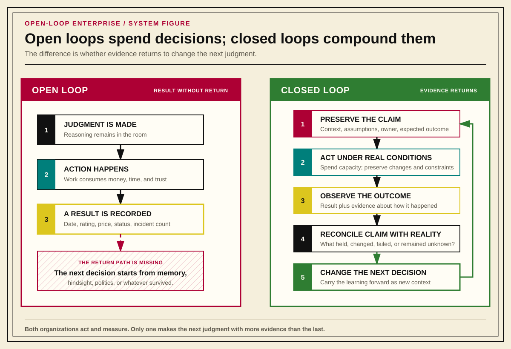{#fig-open-vs-closed-loop}

---

## Why This Book Makes Use of Sports Metaphors

A correct explanation that puts the reader to sleep before the causal structure becomes visible has not done its job. Systems theory, feedback loops, and evidentiary reasoning are simple ideas once you see them, but "once you see them" is exactly the problem: a reader has to get past the vocabulary first.

Sports solve that problem because they make systems concrete before they make them technical. The goal is visible. The constraints can be explained in a a sentences. Preparation and execution are different activities performed by different people. Roles carry real decision rights, not just titles. Feedback is immediate. Failure has consequences a reader has felt, at least at a smaller scale, in their own body. Nobody needs a graduate seminar to understand at a visceral level the disappointment a baseball pitcher probably feels after throwing a pitch that resulted in a walk-off grand slam to end game 7 of the World Series. All you need to know is that it's the pitcher's job to prevent the other team from getting points, a grand-slam is 4 points, and the World Series is what crowns that year's champion for the MLB (the highest level at which one can play baseball competitively). We can all empathize with seeing the most well-intended plans go terribly wrong, even if we never experience a moment quite that dramatic.

That is the job sports analogies aim to do in this book: make the organizational pattern easier to see. It is not used to prove anything. A reader who has never watched a football game and does not care to should still be able to follow every argument in this book using ordinary business language alone: the analogy is a way in, not a load-bearing wall.

Three sports do most of the work here, each for a different reason:

- **Football** makes operating context visible: field position, down, distance, clock, score, personnel, risk posture. It shows how a plan survives contact with reality only because qualified people are trusted to adjust it live.
- **Baseball** is the cleanest example of a metrics-heavy operating model. Almost every efficiency system dreams for its metrics to be as strong and durable as Sabermetrics: effectively, Moneyball is the desired end-state of any observability system, which makes it useful both as a model for structured development pipelines, and as a warning about how attractive clean numbers become when the underlying work is actually much messier than a box score.
- **Boxing** makes individual preparation under pressure visible: the difference between a person who has drilled the mechanics and a person who has only been told to be brave.

Other sports, and other domains entirely, earn a place in this book only when they make a point clearer than these three already do. The rule is the same every time: use the analogy when it makes a reusable organizational pattern legible, and drop it the moment it would require the reader to already know something about the sport to follow the argument. A metaphor that needs a glossary has stopped paying its way.

It is also fine if a sports analogy does not land for a particular reader. The goal underneath all of this is cross-domain pattern recognition, not sports appreciation. If someone reads a football comparison and thinks "this is really about theater production" or "this maps better to a video game raid" or simply "this metaphor is wrong, but I see the structure it's pointing at," the analogy has done its job. The point was never the game: the point was getting the reader to notice the same shape, or pattern, showing up in an unfamiliar place.

---

## Where "Closed Loop" Comes From

The closed-loop language in this book did not start in a systems-engineering textbook, nor anywhere near technology or organizational theory. It started with a discussion of the one system with which every reader of this book will undoubtedly be familiar: the human body. While giving a trainee a lifting cue, Mike Mentzer described the human body as a closed hydraulic system: approximately, the pressure created in one part of the body necessarily shows up somewhere else in the system. That wording is a remembered paraphrase, not a verified quotation: the origin of an idea, not a citation to defend.

The specific example was a heavy leg press. Gripping the handles as hard as possible, clenching muscles that had nothing to do with moving the weight, does not add force to the lift. It spends a finite resource on the wrong target while advertising the appearance of effort. The system does not care how hard the lifter grips the handles; it only cares how hard the legs are pressing against the sled.

Organizations do the equivalent constantly. A manager forced to carry a normal individual-contributor workload on top of managing people is not "doing more" in any way that helps either job; the effort is being spent somewhere other than the target, and something else in the system absorbs the pressure: unfunded management, unfunded execution, or a person quietly failing at both while getting blamed for prioritization. Hidden work, role compression, process added without removing anything, and activity performed to look busy rather than to move an outcome are all the same failure wearing different clothes: local effort spent on something other than the thing that was supposed to move.

That is the only piece of the idea this book needs up front. It recurs everywhere in what follows: the organization is one system, not a collection of independent boxes, and pressure applied in one place has to come from, or go to, somewhere else.

---

## Film Review: The Practice That Closes the Loop

If there is one habit that best explains what closing the loop actually looks like in practice, it is this one:

> **Coaches never skip film review.**

The point is not that every loss hides a clever tactical lesson waiting to be discovered. Sometimes a team gets dismantled because it had a bad day, and the film shows exactly that and nothing more elegant. The review still happens, because the team is not made only of tactics. Memory, confidence, preparation, and the felt experience of losing control all affect the next performance, and none of that is directly visible in the final score.

The box score says what happened, and the film shows how it happened: which read was missed, where the structure broke down, when execution stopped matching intent, what changed on the field, and how it felt to lose control of a game the team thought it had. A team that only ever looks at the box score is optimizing for a number it does not understand.

The organizational equivalent of film review is reconciliation after a decision or an outcome. A budget variance, a project status, a performance rating, an uptime number, a vendor score: every one of these is a box score. Each can be perfectly accurate and still be radically incomplete, because the score preserves the result and discards the causal story: the original claims, the assumptions that seemed reasonable at the time, the constraints nobody chose, the decisions that were actually available, and the evidence the organization had and ignored.

This is the failure mode worth naming precisely, because it gets mistaken for its opposite:

> The bean-counter failure is not the use of numbers. It is confusing the box score with the game.

Nobody who reviews film is anti-statistics. A completion percentage, a yards-per-carry average, and a turnover margin are all useful. What film review refuses to accept is the idea that the number is the whole story. Imagine a football quarterback throwing a ball that hits his receivers hands uncontested, but the receiver does not catch the ball, instead, he tips it into the air and a defender catches it: the stat sheet says the quaterback threw an interception, the film tells a very different story. An organization that tracks cost, schedule, and rating with genuine rigor, but never returns to the decisions and conditions that produced those numbers, has kept the score and thrown away the film.

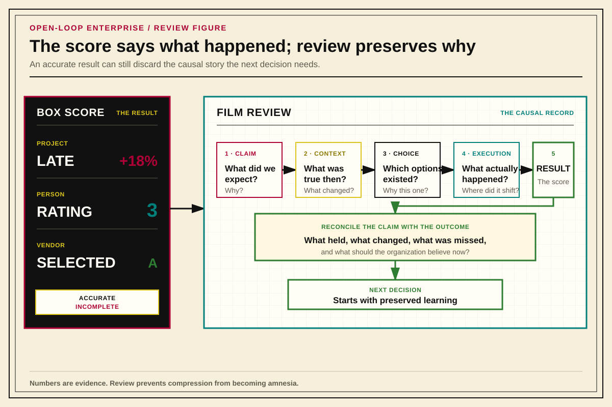{#fig-box-score-and-film}

---

## The Box Score Across the Enterprise

The same substitution of score for film happens in every function this book touches. Each domain below has an obvious number that gets recorded, and a much less convenient record that usually does not survive the review, if a review happens at all.

| Domain | Box score | Film the organization usually discards | Loop-closing review |
|---|---|---|---|
| People | Rating, promotion, resignation, or termination | Assignments, coaching, constraints, hidden work, and the evidence actually available at the time | Calibration and development reconciliation |
| Projects | On time, late, over budget, or canceled | Original forecast, assumptions, tradeoffs, changing conditions, and any reusable capability the work produced | Benefits-realization or post-implementation review |
| Vendors | Selected vendor, implementation date, purchase price | Claims made, alternatives rejected, proof conditions, accepted risks, and operational burden | Claim and acceptance reconciliation |
| Architecture | Shipped design, incident count | Problem framing, expected axes of change, complexity exported to other teams, and decision boundaries | Architecture decision review against live operation |
| Risk | Incident, avoided loss, or no visible event at all | Who noticed the risk, what evidence existed, how it was routed, and why action was or was not taken | Significant-risk review |
| Hiring | Hired, rejected, time to fill, later performance | CV context, interview claims, work-sample evidence, and the assumptions made about what the person would need after hire | Hiring-decision and post-hire reconciliation |

Take the people row on its own for a moment, because it is the one most likely to be treated as settled by the number. A rating looks like a fact. It is really a compressed opinion about a much longer record: what the person was actually assigned, what they were coached on and when, what was happening around them that made a stretch assignment harder or easier than it looked from outside, and what evidence existed that never made it into the file. Two people can receive the same rating for entirely different reasons, and an organization that only keeps the rating has no way to tell which reason applies to which person the next time a promotion, a layoff, or a difficult reassignment is on the table.

Or take projects. "Canceled" reads as a failure in the box score and often is treated as one in the room where headcount gets discussed. But a canceled project can still leave behind reusable automation, a clearer picture of a real constraint, a relationship worth having, or a sharper understanding of a failure mode the organization would otherwise have discovered in production. The box score has no column for that. Only a review that goes back to the original forecast and asks what actually changed can tell the difference between waste and a drive that failed to score but improved field position anyway.

The pattern repeats down every row in the table. The box score is not wrong. It is just not enough, and an organization that treats it as enough has quietly decided that the causal story behind its own decisions is not worth keeping.

---

## A Framework, Not an Answer Key

Everything that follows is an opinion about how to apply this loop. It is a well-considered opinion: the product of sixteen years and seven months of work, along with formal study of the methodologies referenced throughout this book. That experience earns the argument a hearing. It does not turn the argument into a universal implementation specification.

The ambition is universal applicability at the level of mechanism, not identical execution. Anyone who has ordered a "one-size-fits-all" item and received what is clearly the children's version already understands the problem with the label. Organizations differ in size, authority, regulation, risk, capability, and tolerance for ceremony. The form, review body, cadence, or metric that closes a loop in one environment may create waste or false confidence in another. What should survive the translation is the causal obligation: preserve the claim, identify the owner, define the evidence path, and return to the decision when reality has had a chance to answer it.

When a reader finds a gap, an oversight, or a difficult local case, the tempting questions are: "What specific thing should I do here, Mr. Dishpit?" or "Which KPIs will make my organization successful if I track them?" Those questions ask an external answer to replace the local judgment the organization is responsible for recording. A metric imported without the decision it is supposed to inform becomes another box score. A prescribed step copied without knowing which risk or assumption it controls can open a new loop while making the organization feel governed.

Ask instead: Does this create a new loop? What would close that loop before the project goes live? Who owns the claim, what evidence would change the decision, and when must somebody look at it? The book can supply patterns, examples, and warnings. It cannot absolve the reader's organization of translating them into its own operating conditions.

That is not permission to improvise without discipline. Adaptation should leave behind its own reasoning: why the local implementation differs, which consequence it controls, what proof will count, and when the choice will be reviewed. The standard is not whether an organization copied the example. The standard is whether it can later reconcile the decision it actually made.

---

## The Rule

Everything in this book applies one rule, stated once here so it need not be restated every time it recurs:

> Every important decision needs a durable claim, an owner, an expected outcome, an evidence path, and a review point.

A written record produced by that rule is not automatically bureaucracy. It is the answer key the organization needs when it eventually sits down to watch its own film. It will need to, because judgment is unavoidable. Every hire, every architecture call, every performance rating, every vendor selection is somebody's judgment call, made with incomplete information under real constraints. That is not a flaw to be engineered away. The flaw is judgment that goes unrecorded, because unrecorded judgment cannot be reconciled against what actually happened. It can only be defended, forgotten, or repeated.

The chapters that follow apply this same rule to a different part of the enterprise each time: how work gets written before it gets built, how architecture commitments get framed before they get made, how process improves without becoming theater, how people get coached and developed against evidence instead of impressions, how vendors get selected and held to their own claims, and how services get retired instead of merely abandoned. The domain changes. The loop does not.

The rest of the book follows the claim into the operating system. If every important decision needs an owner, expected outcome, evidence path, and review point, the next question is which demands deserve to become important decisions at all.

<!-- Preview assembly source: The-Open-Loop-Enterprise.md, complete article -->


\newpage

# Part II: Deciding What Deserves Organizational Attention {.part .unnumbered}

The next problem is admission and selection: which demands are real, which deserve comparison, and who owns the consequences when one claim on capacity displaces another.


\newpage

# The Front Door

*Part II — Deciding What Deserves Organizational Attention*

A receiving team usually encounters organizational demand after the consequential decisions should already have been made. The request arrives without an authenticated owner, a stable problem statement, an accepted priority, or evidence that the organization intends to spend capacity on it. The team can either reconstruct those decisions in engineering labor or make the absence visible and return each decision to its owner.

## Thesis

Most work-intake processes begin too late.

They begin when a request reaches a team: Systems Engineering, Network Engineering, Security, Platform Operations, Finance, or another function expected to turn somebody else's need into work. The receiving team adds a form, renames its queues, publishes new ticket types, and declares that intake has improved. The labels change. The underlying problem does not.

The team still has to determine whether the request is real, who asked for it, who approved it, where it ranks against other work, which risks the organization will accept, which teams must participate, and what outcome would justify the cost. Those are not team-level intake questions. They are organizational questions that happen to become visible when the work reaches a team.

This is why so many intake reforms produce half-measures. They start with the place where demand lands instead of the system that created, authorized, and routed the demand.

Work intake is not merely a form or a queue. It is the organizational system that turns an authenticated request into one of three things:

1. a known service delivered through an existing path;
2. bounded help or discovery that produces an answer; or
3. an authorized change with evidence, ownership, review, capacity, and a later reconciliation point.

---

## The Receiving-Team Trap

A football team does not ask a quarterback to decide whether the game should be played, whether the opponent is worth playing, how much the organization should spend on the trip, which risks the front office will accept, and whether the roster can support the plan. The player is responsible for executing within a role, recognizing what changes on the field, and escalating when the play no longer fits reality. The organization around the player supplies the authority, resources, and decision structure.

Technology organizations routinely reverse that arrangement. A business area asks for a change, then the receiving engineering team is expected to:

- recover the actual need from a proposed solution;
- determine whether the requester has authority;
- locate a sponsor;
- discover hidden dependencies;
- decide whether the work is important;
- estimate work other teams have not accepted;
- identify security, financial, legal, and operational consequences;
- negotiate those consequences informally; and
- absorb the work if the organization never resolves them.

The team is then blamed for moving slowly, asking too many questions, or inventing process. Yet the questions exist whether the team asks them or not. Skipping them does not make the work simpler. It moves uncertainty out of the planning and pre-planning phases, and into the implementation (execution) phase, where discovery is more expensive and the pressure to accept a bad answer is much higher.

Local intake still matters. A team should have a clear channel, published services, readiness standards, capacity rules, and a defensible way to reject work it cannot responsibly accept. What local intake cannot do is manufacture missing organizational authority. A Systems Engineering queue cannot decide enterprise priority, accept another function's risk, commit another team's capacity, or prove that the business still wants an outcome after the original requester disappears.

The right team-level answer therefore begins one level higher: define how the organization creates authorized work, then let each team implement its part of that model.

---

## Start With the Front Door

Not every request is a proposal. Treating every contact as project intake creates ceremony around ordinary service work and teaches requesters to avoid the official path.

The first decision is categorical:

### Incident or Break/Fix

Something is broken, degraded, unsafe, or actively failing. Response begins through the operational path. An incident does not wait for proposal review. When delaying the first stabilizing action would increase harm, response may begin before a work record exists; the record follows once the immediate danger is controlled.

### Standard Service Request

The organization already provides the capability through a documented, repeatable path. The outcome, required inputs, acceptance conditions, and normal operating procedure have already been decided. The requester supplies the facts needed to instantiate the service.

### General Inquiry

The requester needs time-bounded expert assistance because they do not yet know whether a capability exists or which path applies. The servicing function decides how much inquiry work it can provide under current capacity.

A General Inquiry may end with an answer, facilitation, or directions to another workflow. It does not become a Work Proposal, and it does not prepopulate one. The customer must knowingly initiate the new request because authorship and accountability are part of the evidence.

### Assisted Intake

The request appears to involve real change, but the customer cannot complete the intake path without help interpreting the process. Assisted Intake answers questions such as: Does this requirement apply? What kind of evidence will satisfy it? Which decision should already have been made? Which function owns the next step?

This is process navigation, not discovery work. Assisted Intake may explain a requirement, identify a missing prerequisite, or redirect the requester to Security, Architecture, Finance, or another responsible function. It may not perform the research, architecture, design, testing, product comparison, or sustained coordination needed to answer the requester's underlying question.

The distinction matters because receiving teams routinely inherit decisions that nobody actually made. A request for a one-terabyte PostgreSQL server is not yet a Systems Engineering provisioning problem merely because somebody submitted it that way. Assisted Intake first asks who approved the platform choice, capacity requirement, operating model, and organizational cost. If those decisions do not exist, the request returns to the workflow that owns them. Systems Engineering does not convert an unsupported implementation assumption into an approved architecture by explaining how it might be built.

When the missing answer requires substantive work, Assisted Intake has reached its stop condition. The requester must knowingly initiate sponsored discovery through the appropriate path, with a decision-critical question, committed capacity, a timebox, and an expected artifact. Assisted Intake may identify that path, but it does not remain open for months as the container for vendor meetings, technical investigation, or cross-team design. That would make discovery invisible and prevent the organization from distinguishing legitimate research demand from a broken intake question.

Assisted Intake should record why assistance was necessary: unclear requirement, disputed applicability, missing prerequisite, incorrect route, or discovery needed. If many requesters fail at the same question, the organization should inspect the question, its order, and the level at which it is being applied. Repeated confusion is evidence about the process; it should not be converted into permanent demand for more intake assistance.

### Work Proposal

The requester seeks to evaluate or deliver a change that cannot be fulfilled through an existing service request path. The request requires sponsorship, evidence, review, capacity, and an explicit decision before implementation begins.

These paths should remain separate because they preserve different facts. Converting an inquiry into a proposal or asking a receiving team to submit on a customer's behalf may feel efficient, but it destroys the cleanest evidence of who knowingly asked the organization to act.

{#fig-front-door-routing}

---

## Provenance Before Convenience

Every request needs an immutable, authenticated record of who initiated it and when. A reporter field that anyone can edit is not authorship. A copied chat message is not approval. A ticket created by the receiving team is evidence that the team created a ticket, not that the customer accepted responsibility for the demand it contains.

This rule is stricter than common practice because common practice routinely creates fictional accountability. A team member tries to be helpful, translates a conversation into a request, names the customer in a mutable field, and begins work. Months later, the customer disputes the scope, the sponsor says they never approved it, or leadership asks why the team chose this work over something else. The record cannot answer because it never captured the original act of asking.

Receiving teams may create child work, review modules, implementation records, and other artifacts derived from an authentic parent request. Those records do not pretend to be new customer submissions.

> A team may derive work from authenticated demand. It may not manufacture the demand itself.

---

## What a Work Proposal Must Prove

A Work Proposal is not a project charter in miniature, nor a solution description with approval fields attached. It records enough about the proposed change to support a responsible decision.

At minimum, it must establish:

- **Current State:** what capability, constraint, failure, cost, or operating condition exists now;
- **Desired Outcome:** what should become true;
- **Required Difference:** the material gap between the current and desired states;
- **Requirements:** what the result must do or preserve;
- **Acceptance Conditions:** what observable evidence will show that the outcome is real;
- **Non-Goals:** what the proposal deliberately does not solve;
- **Dependencies:** which systems, teams, vendors, decisions, and external events affect the work;
- **Known Uncertainty:** what remains unknown, why it matters, and how the organization expects to resolve it;
- **Timing Evidence:** the event or date that matters and the consequence of missing it;
- **Operational Ownership:** who will operate, support, and maintain the result; and
- **Sponsorship:** who accepts the proposal's priority claim and organizational tradeoffs.

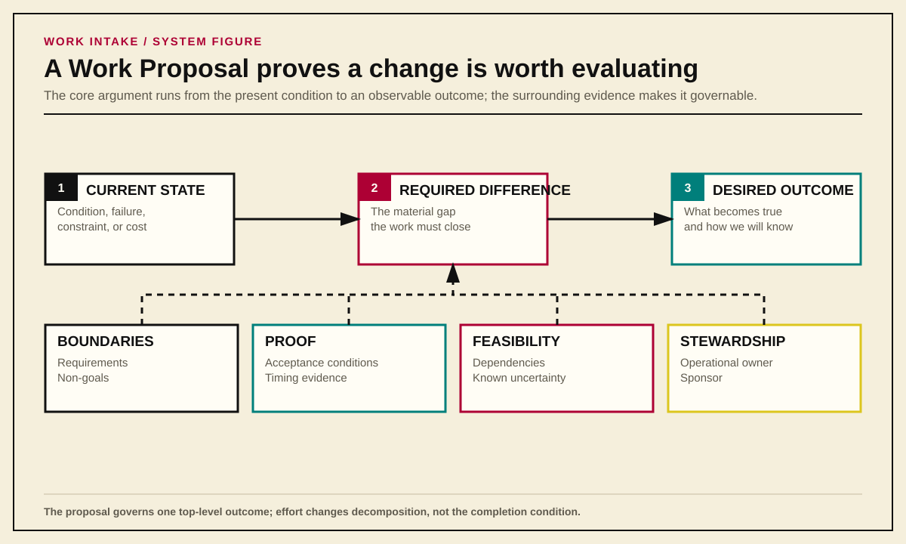{#fig-work-proposal-evidence}

The proposal must govern exactly one top-level outcome. That outcome may require one Epic or an Initiative containing several independently valuable Epics. The hierarchy follows the completion condition, not the amount of effort: an Initiative is complete when its organizational outcome becomes true, not merely when every child ticket closes.

### Sponsorship Is an Act

A Work Sponsor is not a manager copied on the request. Sponsorship means knowingly authorizing the proposal to consume evaluation or discovery capacity and accepting responsibility for its priority claim and organizational tradeoffs.

That acceptance must be durable and tied to a specific proposal revision. The organization may capture it through an authenticated workflow action, a retained comment, correspondence, or another record allowed by policy. The tool is negotiable. The evidence is not.

A sponsor who is also the requester may satisfy both roles through the same authenticated submission when the record explicitly accepts the sponsor obligation. Merely putting a leader's name in a field proves nothing.

---

A front door makes unlike demand visible and prevents receiving teams from manufacturing sponsorship. It does not decide which eligible proposal should displace another. That is a portfolio judgment, and the current corpus only partly defines it.

<!-- Preview assembly source: Work-Intake-Is-an-Organizational-System.md: Thesis through What a Work Proposal Must Prove -->


\newpage

# Future Edition: Portfolio Judgment {.unnumbered}

*Part II — Deciding What Deserves Organizational Attention*

Intake can establish that a request is real without establishing that the organization should do it. That distinction is easy to lose because both decisions may end with the same visible state: a proposal moves forward. The first decision admits a claim into consideration. The second spends scarce capacity and changes what other work can happen.

A portfolio decision needs more than a ranked list. It needs an accountable body or role, comparable evidence, a record of what was funded or displaced, and a condition that forces the decision back into review when assumptions change. Otherwise priority becomes a property attached to work rather than a judgment made by someone with authority over the consequences.

The current sources already supply several controls. Work Intake requires sponsorship, distinguishes routing from commitment, treats capacity as an acceptance decision, and records an Accountable Priority Override when leadership interrupts committed work. Process Improvement makes work and queue pressure visible. Writing Work Items shows how recurring demand can create roadmap work. Together they establish the evidence a portfolio process would need. They do not yet define the portfolio process itself.

> **Preview note — future edition**
>
> A future version will define the comparative decision: who ranks eligible proposals, which evidence must be comparable, how funding and named capacity enter the decision, how regulatory or urgent work changes the queue, what an approval displaces, and when a forecast change requires reprioritization.
>
> It will also separate portfolio governance from a generic steering committee. A meeting becomes part of a closed loop only when its decision rights, inputs, outputs, owners, and next review conditions are explicit.

## The minimum shape {.unnumbered .unlisted}

Until that operating model is complete, the manuscript can state the minimum obligations:

1. A proposal must earn admission before it competes for capacity.
2. Priority must be assigned by an actor who owns the displacement, not inferred by the receiving team.
3. The decision must preserve the evidence and assumptions used at the time.
4. Approval must identify which funding, expertise, and capacity it expects to consume.
5. A change in outcome, cost, dependency, risk, or forecast must return to the authority affected by that change.
6. Stopping work is a portfolio decision, not evidence that the original team failed.

These obligations are enough to expose a fake prioritization system. They are not yet enough to operate a good one.

Once the organization has selected a claim on its attention, the work is still not ready for implementation. Selection authorizes deeper judgment; it does not make the design true.

<!-- Preview assembly source: 0.Organizational-Excellence-Book-Gaps.md synthesis; mechanisms from Work Intake, Process Improvement, and Writing Work Items -->


\newpage

# Part III: Framing and Authorizing Work {.part .unnumbered}

Selected demand must become a bounded, reviewable commitment before implementation distributes unresolved judgment across a backlog.


\newpage

# Frame the Work Before Designing It

*Part III — Framing and Authorizing Work*

Selection gives a problem permission to consume discovery and design effort. It does not justify premature decomposition. Framing keeps the problem class, constraints, non-goals, expected reasoning artifact, and downstream decisions visible long enough for design to respond to reality rather than to the wording of the initial request.

> **Preview note — future edition**
>
> A future version will sharpen the diagnostic between the visible instance and the underlying problem class, add a full enterprise example of a locally defensible decision exporting incoherence across team boundaries, and name field vision more directly: preserving likely change paths without pretending to predict every future feature.

## Usage

### The Rule

- Do not decide details first.
- Decide what kind of thinking the work requires.

The questions in this chapter are not a checklist to complete after the design has already converged. If a design-gate question cannot be answered with confidence, the design should pause. Bounding the uncertainty is sufficient only when the bounds make the design decision, risk, and risk owner explicit.

Some questions are **Design Gates**: they must be addressed before architectural decisions or delivery commitments are made. Others are **Design Informing**: they should shape the design but do not need to block early exploration.

The distinction prevents premature convergence. It also makes constraints, operational costs, decision rights, and failure modes visible before the organization commits itself to a solution.

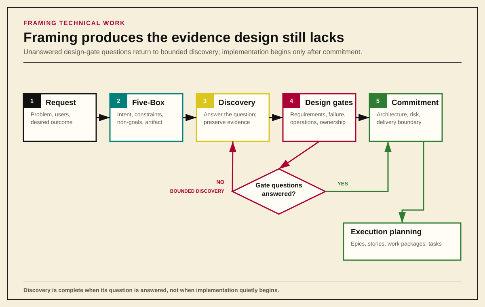{#fig-framing-to-execution}

---

## The Five-Box Framing Scaffold

When a new project appears, answer five questions in writing.

### What kind of problem is this?

Choose one primary intent:

- **Discovery:** reduce uncertainty;
- **Migration:** move state A to state B;
- **Redesign:** change structure;
- **Enablement:** remove blockers for others; or
- **Optimization:** improve efficiency or flow.

These are intent categories, not formal PMI categories. If the work is misclassified, it usually becomes harder to scope, sequence, explain, and review.

### What must be true before work starts?

List constraints, not solutions:

- Is security sign-off required?
- Are organizational boundaries fixed?
- Are timelines immovable?
- Must an upstream capability or decision exist first?

This prevents fantasy planning: a plan that is internally coherent only because it ignores the conditions required to execute it.

### What is explicitly not being solved?

Write the non-goals early. If they remain implicit, they will be reintroduced later as assumed scope.

### What reusable artifact must exist at the end?

Examples include:

- a taxonomy;
- a decision record;
- a capability list;
- a trust model;
- a requirements set; or
- a reference pattern.

If the answer is only "running code," this framing framework is probably no longer sufficient on its own. The work may already be in execution planning.

### What downstream work should never need to ask "why" again?

That is the success measure for framing. The artifact should preserve the reasoning downstream work depends on: what was decided, which evidence supported it, what remained outside the boundary, and which conditions would require the decision to be revisited.

---

## Determine Whether the Work Is Ready for Design or Execution

Not all problems benefit from the same planning approach. Some are well understood and can be designed largely up front. Others reveal their requirements, coupling, and constraints only through discovery.

Platform, infrastructure, and identity initiatives often fall into the second category. Attempting to specify the complete solution before understanding trust boundaries, operational realities, and failure modes creates rework while making the early plan look more certain than the evidence supports.

Framing should precede design commitments. Discovery produces evidence the design still lacks; design can proceed when its design-gate questions are answered and any remaining uncertainty is bounded. Implementation commitments should not convert unresolved decisions into tasks.

### Project phases still exist

This framework is compatible with PMI-style phase thinking: initiation, planning, execution, monitoring and controlling, and closing.

Agile and Scrum change how execution and feedback loops operate. They do not eliminate initiation, planning, scope control, or decision rights.

Reference: [PMI Process Groups Overview](https://projectbliss.net/pmi-process-groups/)

### Discovery packages and tasks

Early platform work is often better organized around outcomes than prescribed steps. This chapter uses **discovery package** as an adapted term for ambiguous, early-phase technical work.

It is intentionally not strict PMBOK terminology:

- In PMBOK and WBS language, a **work package** is the lowest level of a work breakdown structure.
- Discovery-heavy technical work needs a planning unit that remains outcome-oriented but is not ready to be decomposed into execution steps.
- A **discovery package** fills that gap.

The term does not replace PMBOK terminology. It makes early technical planning legible without pretending discovery work is already executable.

The relationship is:

- **PMBOK work package:** a formal planning unit inside a WBS;
- **Discovery package:** a pre-execution planning unit for complex or uncertain work; and
- **Story or task:** an execution unit after the ambiguity has been reduced.

| Tasks | Discovery packages |
| --- | --- |
| Describe actions | Describe outcomes |
| Ordered and prescriptive | Loosely ordered or parallel |
| Fragile when assumptions change | Stable when assumptions change |
| Easy to micromanage | Easy to delegate |
| Good for execution | Good for discovery and alignment |

If the team does not yet know the right steps, it is usually in discovery-package territory, not task territory.

### What a discovery package defines

A discovery package defines:

- the question being answered;
- the constraints under which it is explored; and
- the artifact produced when the work is complete.

This allows progress without committing prematurely to implementation details, sequencing, or tooling.

It also reflects how technical planning actually develops:

- Discovery reduces ambiguity.
- Design translates the resulting evidence into architecture.
- Execution decomposes the design into epics, stories, work packages, and tasks.

### Early classification heuristics

When the work is ambiguous and the team is tempted to begin design or execution, ask:

1. Do I already know what "done" looks like?
   - Yes: probably not Discovery.
   - No: Discovery.
2. Will doing this work constrain future options?
   - Yes: Redesign or Migration.
   - No: Discovery or Enablement.
3. Is the primary value learning, moving state, unblocking others, or improving flow?
   - Learning: Discovery.
   - Moving: Migration.
   - Unblocking: Enablement.
   - Improving: Optimization.

When unsure, default to **Discovery** first. Discovery packages do not lock in assumptions, are politically safer than premature design commitments, produce reusable artifacts, and justify a later redesign without treating earlier learning as failure.

If two categories still appear equally plausible, choose the one that produces an artifact rather than a system change.

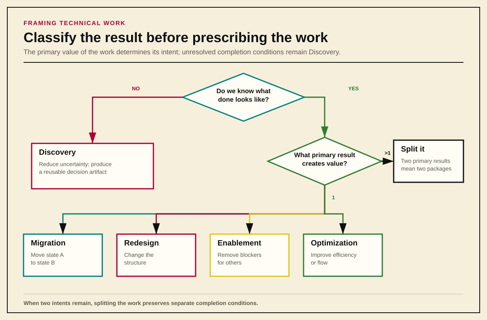{#fig-intent-classification}

---

## Design Gate: Well-Defined Requirements

No system can be designed well without explicit requirements. Vague requirements create accidental complexity, unstable scope, and operational pain.

Questions that must be answered include:

- What problem is this system solving?
- Who is it for?
- What scale must it support on day one?
- What scale must it tolerate later?
- What outcomes define success?

Requirements are not optimization. They define whether the system is fit for purpose.

At minimum:

- performance characteristics must be stated explicitly;
- reliability expectations must be stated explicitly; and
- requirements should be SMART where possible:
  - Specific;
  - Measurable;
  - Achievable;
  - Relevant; and
  - Time-bound.

Requirements must be precise enough to distinguish the target condition from nearby but misleading proxies. Specificity is not pedantry. It increases confidence that everyone is discussing the same behavior, population, operating conditions, and exception model.

"The DNS service must be fast" is not a requirement. A useful requirement defines the operating envelope: supported queries per second, steady-state and peak load, acceptable response time, and the conditions under which those thresholds must hold.

For example:

> The service must sustain 250,000 queries per second, tolerate burst traffic of 500,000 queries per second for 15 minutes, keep p99 response time under 2 ms for cached lookups and under 10 ms for uncached authoritative lookups within the same region, and continue serving authoritative responses during the loss of a single node.

That statement defines an actual design target.

"Fast enough" is not a requirement.

Further reading: [Eric Brandwine, AWS re:Invent 2018](https://www.youtube.com/watch?v=GXTvlQXVCOs&t=24m16s). The entitlement exercise demonstrates how vague goals become precisely bounded requirements.

---

## Design Gate: Performance, Failure, and Recovery

Performance, reliability, degradation, and recovery behavior are design-gate topics, not implementation details.

Questions to answer:

- How many requests per second must the system handle?
- What is the expected steady-state load?
- What is the peak load?
- What latency is acceptable?
- For what percentage of requests?
- Under which operating and failure conditions?
- What happens during partial degradation?
- Which service must remain available?
- What are the recovery expectations?
- What are the RTO and RPO expectations, if applicable?

Example answers:

- The system must handle 1,000,000 requests per second.
- 99% of requests must complete in under 1 ms.
- 100% of requests must complete in under 5 ms.

These thresholds determine design fitness. They are not optional tuning targets to be discovered after implementation.

---

## Design Gate: Operational Impact and Accountability

Before beginning a design, ask:

> What is the operational cost of this system?

Every system carries operational cost:

- human effort;
- cognitive load;
- process complexity;
- failure modes; and
- long-term maintenance.

Operational impact is a first-class design constraint.

Questions to answer:

- Who uses the system?
- Are those users equipped to operate it safely?
- Who operates the system day to day?
- How often must a person intervene?
- What happens when it fails at 02:00?
- Who owns incident response?
- Who owns uptime?
- Who owns ongoing maintenance?
- Who owns upgrades and dependency changes?
- Who creates the automation?
- Who maintains the automation?
- How expensive will the system be to change or extend?
- Can an operator determine the required response with near-zero cognitive load from the dashboards, alerts, and procedures?
- Do the monitoring views make it obvious whether action is required, by whom, and under which conditions?

Also establish whether the work creates:

- a net-new system;
- an upgrade; or
- a replacement.

A replacement design must account for the transition in day-to-day operations, support ownership, migration, and handoff. Replacing software without replacing the old operating model leaves the organization with two systems and one incomplete decision.

Further reading: [Eric Brandwine, AWS re:Invent 2018](https://youtu.be/GXTvlQXVCOs?t=2075) provides useful background on reducing cognitive load in operational dashboards and decisions.

---

## Manage Complexity Where People Can Afford It

In a necessarily complex design, decide where complexity can be tolerated and where it must be reduced.

Complexity can often be tolerated:

- inside automation;
- inside platform code owned by a small expert team; and
- in systems that are rarely touched after deployment.

Complexity should usually be avoided:

- in routine operational workflows;
- in emergency procedures; and
- in systems used by many teams with different skill levels.

If an action must be performed under pressure, it should be:

- boring;
- well documented; and
- highly repeatable.

Moving complexity behind an interface does not eliminate it. The owning team still pays to understand, test, operate, and change it. The design decision determines who pays and under which conditions.

---

## Evaluate Tooling and Flexibility as Operating Decisions

Ask:

- Does flexibility reduce risk, or increase support burden?
- Does standardization reduce incident-resolution time?
- How many APIs and programming languages must the organization support?
- Is variation creating useful capability, or reproducing the same operating problem several ways?
- Which choices must remain flexible because the requirements genuinely differ?

For a DNS platform, the organization might ask whether to deploy Infoblox virtual appliances into cloud environments or delegate to cloud-native DNS services.

The decision must be evaluated from both:

- an operational perspective; and
- an engineering perspective.

A flexible engineering model can impose recurring support and incident-response costs on operators; standardization can make the system unfit when requirements genuinely differ. The design must identify who receives each benefit and who owns each cost.

---

## Design Gate: Pre-Mortems

Before building a system, assume it has already failed.

Ask:

> Some time after launch, this system caused a major incident. What went wrong?

Use the pre-mortem to identify likely failure modes:

- capacity exhaustion;
- latency degradation;
- operational overload;
- poor ownership or unclear accountability;
- automation failure; and
- unexpected usage patterns.

Pre-mortems can expose hidden assumptions, surface operational risks that happy-path design misses, and test whether the system remains operable under stress.

They work best when they:

- include operators, not only designers;
- occur before major architectural decisions are fixed; and
- become design input rather than evidence that somebody completed a required meeting.

---

Framing produces the evidence a responsible design commitment requires. The organization still needs a legitimate authorization path: reviewers must exercise distinct authority, conditions must remain real, dependencies must become commitments, and delivery capacity must be accepted by the people who own it.

<!-- Preview assembly source: Framing-Technical-Work-Before-Design.md: sections 1–3 and 5–10 -->


\newpage

# Make the Commitment Legitimate

*Part III — Framing and Authorizing Work*

A good frame can still enter a bad governance process. Review bodies can average unlike authorities, conditional approval can become soft permission to build, and delivery teams can inherit dependencies that were listed but never committed. Authorization is legitimate only when each decision remains attached to the actor allowed to make it and when the assembled record states exactly what may happen next.

> **Preview note — future edition**
>
> A future version will generalize decision-record rules beyond Work Intake, RFPs, and Managed Runoff. It will explain how reversibility changes the evidence burden, who owns later reconciliation when decision and delivery ownership differ, and when a domain record should supersede rather than duplicate the general decision record.

## Discovery and Implementation Are Different Commitments

One of the easiest ways to corrupt intake is to treat learning and building as the same authorization.

Pure discovery exists to produce decision-ready knowledge: an inventory, taxonomy, comparison, architecture, threat model, decision record, or another artifact that reduces uncertainty. It does not authorize implementation. Reviewing existing systems, reading current authoritative guidance, interviewing operators, or comparing external products should not require the entire implementation-governance sequence when the discovery itself creates no comparable operational risk.

Discovery still needs boundaries. It requires a sponsor, a decision-critical question, an expected artifact, a timebox, and a decision when the timebox ends. If the work touches production, exposes sensitive data, commits material spend, or creates another real consequence, the activity is no longer risk-free merely because somebody called it research.

Implementation is different. An implementation-ready proposal arrives with architecture and design evidence already available. The organization is no longer deciding what it should believe: it is deciding whether to commit money, technical capacity, operational ownership, and risk to making the proposed change real.

This produces two distinct readiness states:

- **Proposal Readiness:** enough is known to justify evaluation or bounded discovery. Material unknowns may remain, but they are visible.
- **Delivery Readiness:** dependencies, ownership, design, risk, capacity, and acceptance responsibilities are confirmed well enough to authorize implementation.

{#fig-discovery-vs-implementation}

Sponsorship does not create Delivery Readiness. Architecture does not create budget. Approval does not commit another team's capacity. Each decision has its own owner because each decision spends or risks something different.

The [Framing Technical Work Before Design](./Framing-Technical-Work-Before-Design.md) guide supplies the early intent categories, discovery-package structure, and architecture and design questions that must be answered before implementation commitments are made. Work intake owns the transition from framed demand to authorized work; it should not copy the framing guide into a larger form.

---

## Requesters Supply Facts; the System Derives Consequences

Requesters know their current condition, desired outcome, constraints, affected users, timing pressure, and business consequences. They are not necessarily qualified to classify the work those facts create.

A requester should not select:

- project size;
- enterprise priority;
- required reviewers;
- risk class;
- employee grade;
- named delivery staff; or
- another team's capacity commitment.

Those choices create organizational consequences. The intake system should derive them from structured facts using published, auditable rules, then present the result for human review.

This deterministic core controls classification, required fields, routing, state changes, clocks, escalation, and readiness. AI may help a person write clearly, inspect a rule, or implement an approved workflow change. It should not decide whether a governed condition is true. A probabilistic model is useful when the task tolerates interpretation; it is a poor authority for deciding whether Security Review is mandatory or whether an overdue review clock should escalate.

### Keep Unlike Questions Separate

One universal "project score" collapses unlike concerns and produces false confidence. Intake should preserve at least four separate views:

- **Delivery Capacity Profile:** expected labor, elapsed duration, and coordination burden;
- **Delivery Size Class:** the highest XS-through-XL band reached by any capacity dimension;
- **Financial Commitment Class:** money committed or placed at risk;
- **Work Proposal Risk Profile:** likelihood, consequence, blast radius, criticality, reversibility, and affected authority boundaries.

Priority is separate again. The requester and sponsor provide the priority claim and its evidence. The accountable portfolio authority assigns queue position against existing commitments and available capacity.

Uncertainty should widen an estimate's range and lower confidence. It should not automatically make work "large," nor should lower dimensions average away one material burden. A proposal that consumes little labor but creates a difficult enterprise coordination problem is not small merely because the spreadsheet average says so.

The sizing model should use one published organizational matrix so portfolio comparisons mean the same thing across teams. An organization may recalibrate the thresholds as it learns, but it should version the rule and preserve the historical classification that governed the original decision.

---

## Review Is Ordered, Modular, and Decisive

An implementation proposal should not explode into an all-reviewer meeting where every function reads the same document at once and waits for somebody else to identify the missing evidence or decision.

Every participating function should know which decision it owns, what evidence it needs, and which upstream decisions must be complete before its review begins. The organization publishes that sequence. The exact stages differ because companies distribute authority differently, but the order follows the dependencies among the decisions:

1. administrative authority decides that the proposal may consume evaluation capacity;
2. the Security Review Board evaluates cross-cutting organizational risk;
3. financial and technical functions review the proposal after the earlier gates clear; and
4. accepted review records assemble into the authoritative proposal artifact.

{#fig-ordered-review}

Not every review can or should run in parallel. Finance should not spend time constructing a budget for work that Security will reject the next day. Systems Engineering and Network Engineering should not design delivery around a proposal that lacks organizational authority. A rejection at an earlier gate prevents dependent review from beginning.

### Authority and Clocks

Every review needs someone responsible for moving it and someone authorized to decide it. The **Review Facilitator** assembles the right reviewers, tracks unknowns and objections, prevents unresolved questions from disappearing, and records the result. The **Decision Owner** has the competence and organizational authority to make the decision across the boundaries under review. One person may perform both jobs, but facilitating the review never grants decision authority.

Reviews also need published targets for acknowledgement and decision. When a review misses its target, the facilitator escalates it to a named owner or records an extension with a reason and new date. Reassignment, research, and scheduling difficulty inside the reviewing function do not restart the clock. When the review depends on information from somewhere else, the record identifies the missing input, who must supply it, what they must produce, and when it is due.

Silence authorizes nothing, and the escalation path prevents it from becoming a permanent veto.

### The Security Review Board

Security is often broader than application security. Depending on the organization, its remit may include information security, physical security, continuity, logistics, environmental threats, fraud, supply-chain exposure, and other risks capable of harming the company or the people who depend on it.

Security's position in the sequence follows from the authority it carries. It decides whether the proposal has identified, evidenced, and acceptably treated the risks within its charter before later functions commit money or design delivery around it. When Security decides that the risk exceeds the organization's tolerance, preference from Finance, Architecture, or an executive does not reverse that decision.

Security does not receive a separate intake packet. It reviews the same Work Proposal, using the architecture, system boundaries, data flows, applicable standards, control evidence, exception requests, threat model, testable mitigations, and operating responsibilities that its charter requires. Its decision returns to that proposal so downstream teams can verify what Security examined and what it decided.

The exact questions belong in a companion guide built from the organization's risk model and authoritative sources. [NIST Cybersecurity Framework 2.0](https://www.nist.gov/publications/nist-cybersecurity-framework-csf-20), [NIST's Risk Management Framework](https://csrc.nist.gov/pubs/sp/800/37/r2/final), [system security planning guidance](https://csrc.nist.gov/pubs/sp/800/18/r2/final), [OWASP SAMM](https://owaspsamm.org/model/verification/architecture-assessment/), and verification standards such as [OWASP ASVS](https://owasp.org/www-project-application-security-verification-standard/) can inform that guide; they do not define this organizational workflow.

### One Contract, Different Review Records

Each review function keeps the specialist record its decision requires. Security may need a threat model and control evidence; Finance may need a cost model and funding conditions. Forcing both into one universal schema would erase information that only one function is qualified to interpret.

The intake system still needs a small set of shared facts so it can identify:

- what the review examined;
- which proposal revision it examined;
- who had authority to decide;
- the decision and its timestamp;
- the evidence and assumptions that mattered;
- which boundaries the review did not cover;
- any required next action; and
- whether the record has been superseded.

Those shared facts allow the system to prove that a decision belongs to the correct proposal revision, came from someone authorized to make it, and has not been replaced by a later decision. The specialist record remains intact.

---

## Review Decisions

Every reviewing function must return a state that tells dependent teams whether they may proceed, perform a bounded test, or stop. The common model has three decisions.

### Approved

The proposal satisfies the function's requirements for the decision under review. Approval applies only to the recorded proposal revision and the facts, evidence, assumptions, and boundaries the function actually examined.

### Conditional Approval

A critical variable cannot be known until later, but the concern is specific and testable. Conditional Approval authorizes only the bounded discovery work needed to produce the missing evidence.

The condition must state:

- the variable being tested;
- the evidence that counts as passing or failing;
- the work permitted to produce that evidence;
- the owner and timebox; and
- the decision that follows each possible result.

Conditional Approval is not approval with cleanup attached. The review remains unresolved, and general implementation remains unauthorized. After the test, the original reviewing authority approves, rejects, or authorizes another bounded test with a new question, expected result, owner, and timebox.

{#fig-conditional-approval}

### Review Rejection

The current proposal revision fails a governing standard, risk decision, requirement, or other mandatory condition. Reviews and delivery decisions that depend on the rejected result stop. Other approvals cannot offset it.

A request for more testing is not Review Rejection. If bounded proof could responsibly resolve the question, the correct state is Conditional Approval.

### The Proposer Carries the Evidence

The proposer must identify applicable standards, supply evidence of conformance, or explain why a standard does not apply and why an exception should be granted.

If the proposal supplies no credible compliance case, the reviewing function may reject it categorically. The reviewer is not responsible for proving every possible failure or building the proposal on the requester's behalf.

Specific evidence changes the reviewer's obligation. If the proposer claims one control satisfies several requirements, the reviewer must identify why that control does not satisfy them. If the proposal maps some requirements but omits another, the reviewer must identify the material omission. The required specificity follows the case actually presented:

> If no compliance case exists, categorical rejection is enough. Once the proposer makes a specific case, the reviewer must identify a specific defect.

This is not a courtroom. The organization is deciding whether to spend money and capacity, and whether to accept the risk. The burden belongs to the person asking it to act.

---

## Preparation Buys Execution Freedom

Upfront review gives downstream teams the decisions they need to execute without reopening the proposal. When an authorized request reaches Infrastructure, "Did Security approve this?" should be answered by inspecting the artifact, not by scheduling another round of meetings. The same is true of architecture, finance, procurement, ownership, and every other prerequisite represented in the approved state. The receiving team verifies the record; it does not relitigate the decisions that produced it.

That trust applies only within the approved boundaries. Materially changing the outcome, requirement, risk, or operating model still requires the appropriate new decision. Inside those boundaries, however, the organization should be able to move. Requirements do not need to be re-proven at every handoff, downstream teams do not have to reconstruct the history from chat messages, and implementation does not repeatedly double back to answer questions that belonged in discovery.

This does not repeal Murphy's Law. Estimates will change, dependencies will fail, implementation will expose new constraints, and people will still make mistakes. Work Intake cannot guarantee smooth execution. It prevents a different class of failure: predictable cycles of requirements reverification, accidental scope expansion, and late discovery that a supposedly settled decision was never actually made.

A security-tool replacement, for example, can complete its technical migration and still fail its users because a dashboard from the old system was never captured as a requirement. "No one thought to ask the question" is not merely an implementation problem when the missing question changes whether the replacement satisfies the original need. It is evidence that discovery and review did not follow the consequence tree far enough before the organization committed to an answer.

Golf makes the same point with less paperwork: a tiny change in the clubface angle at contact can separate a shot down the fairway from one deep in the woods. The visible failure happens far from the original deviation, but that does not mean the deviation was unimportant. Early questions work the same way: a small correction before commitment can change the entire downstream tree.

{#fig-clubface-consequence}

Developing a process that consistently produces authorized, implementation-ready work takes effort. Enforcing it takes more. Developing a swing that consistently finds the fairway also takes effort. The organization has to decide what game it is playing: **are we playing for beers, or are we playing for Majors?**

---

## From Proposal to Authorized Work

Human review should produce durable records, not a trail of comments that somebody later summarizes from memory.

An accepted review record enters the final Work Proposal only after the system verifies that it belongs to the correct proposal revision, carries an approved decision, and has not been altered or duplicated. Assembly preserves the specialist conclusion as written. It does not replace disagreements with an AI-generated consensus that no reviewer approved.

Once every required review has cleared, the proposal becomes an **Authorized Work Proposal**. That revision does not change. It governs one top-level outcome and records the scope, constraints, acceptance authority, review decisions, and organizational commitments that govern delivery. When the top-level outcome is one Epic and every Delivery Readiness condition has already been satisfied, implementation may begin. When the top-level outcome requires an Initiative, authorization permits its child delivery records to be developed within the approved boundaries; it does not make every child ready.

{#fig-authorized-work-assembly}

Delivery records refine execution. They do not rewrite authority.

An Epic, story, work package, task, sprint backlog, or implementation plan may change the sequence, approach, estimate, or local decomposition as evidence improves. None may silently change the approved outcome, boundary, constraint, or acceptance condition. Those changes require an approved superseding proposal revision.

Initiative approval is not blanket implementation permission for every child Epic. Each child reaches Delivery Readiness only when its design, dependencies, operational ownership, acceptance responsibility, specialized approvals, and named capacity within a Planning Interval are confirmed. Only then may implementation begin. This permits adaptive delivery without converting "Agile" into an exemption from planning or authority.

### From an Authorized Initiative to a Delivery-Ready Epic

Initiative authorization settles the organizational outcome and the boundaries within which delivery planning may proceed. It may also preserve forecasts, sequence assumptions, dependency reservations, and an overall capacity strategy. Those records make later delivery possible, but they do not commit a receiving team to implement a child Epic that has not yet been defined and accepted.

Every candidate Epic identifies the exact Authorized Work Proposal revision from which it derives. The Epic states the independently valuable result it will produce, the approved requirements and acceptance conditions it advances, and the boundaries it must not cross. Work Intake then derives which earlier decisions still apply and which decisions the child must obtain for itself. A cross-cutting review may remain valid when the Epic stays inside the facts and boundaries that review examined; a new data flow, vendor, operating model, risk, or other material difference returns to the authority that owns the affected decision.

Delivery Readiness is assembled from those decisions; it is not granted by a generic readiness approver. For each child Epic, the authoritative record must establish:

- traceability to the governing Initiative revision;
- child scope and acceptance evidence that remain inside the approved outcome;
- architecture and design evidence sufficient for implementation;
- dependencies with named owners and actual commitments or valid reservations;
- every specialized approval triggered by the child's facts;
- the expertise, staffing, operational ownership, and support model the work requires;
- acceptance by the receiving team's capacity owner of the named work within a Planning Interval; and
- the person authorized to accept the delivered result.

The system marks the Epic Delivery Ready only after each required decision owner has supplied an accepted record. The Review Facilitator may coordinate the evidence and unresolved questions, but facilitation does not allow one person or committee to substitute a broad approval for the decisions of Security, Finance, Architecture, delivery teams, or another responsible function. A missing condition returns to its owner; a testable unknown may receive Conditional Approval for bounded discovery; silence does not move the Epic forward.

Initiative-level capacity records must describe what they actually represent. A forecast estimates likely demand. A Conditional Dependency Reservation preserves one possible slot. A staffing strategy identifies how the organization expects to source expertise. None commits a delivery team to a child Epic. The capacity condition becomes true only when the receiving team accepts the named Epic and its required ownership within a Planning Interval. At that point, the organization records the Approved Delivery Baseline and implementation may begin.

### Authorization Must Remain Active

An approval does not keep work alive by itself. The sponsor and the authoritative record must remain identifiable throughout delivery.

If the sponsor leaves or withdraws, discretionary work does not continue forever through momentum. The existing rules determine whether a replacement sponsor accepts the work, the work pauses, or delivery ends. Anything left running must have an owner and an exit plan under [Managed Runoff](./Managed-Runoff-for-Deprecated-Services.md).

The authoritative source belongs in a central, version-controlled repository. Ticket attachments, rendered pages, dashboards, and published copies link back to it. Accepted artifacts should be readable across the organization by default. Restricted work must identify why access is limited, who owns the restriction, when it will be reviewed, and what coordination information can be published safely.

---

## Capacity Is an Acceptance Decision

Routing work to a team does not commit that team's capacity.

A dependency may be known without being planned. Discovery may require a team to provide access or expertise without committing it to later implementation. Delivery begins only when the receiving team accepts named work, ownership, and capacity within a Planning Interval.

Where an approved Initiative cannot provide an exact handoff date, a dependency team may place a Conditional Dependency Reservation on one work slot for a defined Planning Interval. The team plans around leaving that slot open. If the reserved work becomes ready during the interval and has higher priority than the team's other queued work, it enters the workstream immediately instead of waiting for the next planning cycle. If upstream work does not activate or renew the reservation by its cutoff, the team releases the slot.

An operating-system migration makes the purpose concrete: if a million-dollar contract for the old operating system is about to renew, Systems Engineering must deliver the replacement image before downstream teams can migrate. Those teams may not know exactly when the image will be ready, but a reservation allows the first downstream work to begin as soon as it arrives. The reservation does not decide priority; it gives a dependency team a way to honor a priority the organization has already established.

{#fig-conditional-dependency-reservation}

If leadership instead directs a team to drop committed work for something new, that choice must be visible. The record identifies who made it, what got displaced, why the normal queue was bypassed, and which delay or consequence they accepted. This is an **Accountable Priority Override**.

Routing work to a team does not mean that any available engineer can do it. The team's technical reviewer decides what expertise, ownership, and support the work requires; the capacity owner decides whether the team can provide them.

If the team cannot provide what the work requires, the organization must change the staffing, schedule, scope, or source of expertise. It cannot pretend the work became easier because the right people were unavailable.

The [Career Progression Guide](./Career-Progression-Guide.md) explains how the team makes the staffing decision. The [work-item guide](<./Writing Work Items - Epics, Stories, and Tasks.md>) explains how the approved outcome becomes Epics, stories, work packages, and tasks. Work Intake only needs the answers: has the team accepted the staffing and capacity, and does the delivery work still match what was approved?

---

## Delivery Changes the Forecast, Not the Past

When implementation is approved, the organization records the estimate it used to commit capacity. That becomes the **Approved Delivery Baseline**: a record of what everyone believed when the decision was made.

As the team learns more, it updates the **Delivery Forecast**. The baseline records what the organization thought then; the forecast records what it thinks now. Keeping both allows the organization to plan honestly without erasing whether its original assumptions were any good.

{#fig-baseline-and-forecast}

If the new forecast requires substantially more capacity, someone with authority over the affected priorities must accept the larger commitment. If the desired outcome, scope, requirement, boundary, or acceptance condition changes, the proposal must change.

The delivery team may change how it builds the approved thing. It may not quietly decide to build a different thing.

---

Authorization preserves the organizational decision. Delivery planning must now translate that decision into executable work without quietly changing its outcome, boundary, or acceptance conditions.

<!-- Preview assembly source: Work-Intake-Is-an-Organizational-System.md: Discovery and Implementation through Delivery Changes the Forecast -->


\newpage

# Turn Decisions Into Executable Work

*Part III — Framing and Authorizing Work*

Work decomposition is a translation step. An Epic, work package, story, or task should make one layer of completion legible without replacing the decision that authorized the work. When decomposition begins before the outcome, uncertainty, and boundaries are stable enough, the backlog does not reduce ambiguity; it distributes ambiguity across smaller containers.

## Why this exists

We keep hitting the same wall: **we cannot tell when an epic is done.** We close the child tickets, and then we stand around asking "...so, is it finished?" Nobody can answer, because nobody wrote down what *finished* means.

This is not a discipline problem or a writing-style problem. It is a **definition problem**, and it has a specific root cause:

> **We describe work by its *output* (the thing we build) instead of its *outcome* (the change the thing is supposed to cause).**

An **output** is an activity or artifact: *"build a base image,"* *"submit a PR."* An output is "done" when the activity stops - which is to say, never cleanly, because there's always more you *could* do.

An **outcome** is a change in the world, stated as a condition that is either true or false: *"all hosts provision from one image with zero manual steps,"* *"instances auto-register to the correct regional endpoint on first boot."* An outcome is done when the condition becomes true. You can *check* it.

### The one rule that fixes the headline problem

> **An epic is not done when its child tickets are closed.**

The child stories and tasks are a *bet* - our best current guess at the work that will produce the outcome. If every child is closed but the outcome didn't happen, **the epic is not done.** You write more stories, or you change the approach. Closing tickets is activity; achieving the outcome is the point.

Everything else in this chapter exists to make that rule operable.

### Worked example: what the Example Epic gets right and wrong

The Example Epic actually *has* a "Definition of Done." Here it is, paraphrased:

- image-based configs tracked in the image-build repo
- environment-specific configs do not run in environments where they do not apply
- startup configuration scripts modular and managed in code
- scripts have logging
- every config has a regression/validation test in a post-build step

Read that list again. **Not one item tells you when the *epic* is finished** - at best they're per-*child-task* quality bars. "Enabling and building a base image" is an activity with no end state - so it ends when we get tired of it, which is exactly the problem we're trying to kill.

(And only *at best*: two of these aren't even clean quality bars. "Environment-specific conditionals" misunderstands the epic - a *golden/base* image holds only what **all** systems need, so per-environment conditionals don't belong in it at all; environment divergence lives in image *layering* or runtime metadata, not baked-in `if-cloud` logic. "Modular... in code" dictates an *architecture*, which a Definition of Done has no business mandating. We dissect why in [the distinction among DoD, acceptance, and outcome](#three-things-people-confuse-dod-vs-acceptance-vs-outcome); for now just note that a sloppy DoD is hiding an *absent* outcome.)

What's missing is an **outcome / exit condition** for the epic itself. Something like:

> *A single base image provisions Linux hosts across two runtime types with zero manual post-build steps; >=20 consecutive automated builds pass post-build validation; the legacy build path is decommissioned.*

That sentence is checkable. Today's epic is not. We'll fix it properly in [the distinction among DoD, acceptance, and outcome](#three-things-people-confuse-dod-vs-acceptance-vs-outcome).

---

## The work hierarchy

We use four levels. **The level is decided by the *kind of completion condition* the work has - not by how big it feels or how many hours it takes.**

| Level | What it is | "Done" means... | Completion condition is... |
|---|---|---|---|
| **Epic** | A meaningful change in capability, reliability, risk, or cost | The **outcome / exit condition** is met | A measured change in the world (metric or verifiable end-state) |
| **Story / Work Package** | One coherent slice of user- or system-visible behavior | **Acceptance criteria** pass | Testable behavior - observable from outside |
| **Task** | A concrete deliverable contributing to a story | The deliverable **objectively exists** | Binary: it's merged / created / configured, or it isn't |
| **Sub-task** | A checklist step inside a task | The step is done | Binary, usually only meaningful to the assignee |

> **"Story" and "Work Package" are the same level**, named differently by different teams. Planned product-style work tends to say "Story"; operational and infrastructure work tends to say "Work Package." Pick one term per project and stick to it. This doc uses **Story/WP** interchangeably.

> **Who owns what (this matters for the rest of the chapter):** an epic is, in effect, a **broad-stroke request from the business** - and its **Outcome** and **Definition of Done are owned by the requester / standard-owner, not by the implementers.** The people choosing *how* to build it don't get to rewrite the bar they're measured against. The practical consequence shows up in [the distinction among DoD, acceptance, and outcome](#three-things-people-confuse-dod-vs-acceptance-vs-outcome): because the DoD isn't the implementers' to write, it can only hold things the business can legitimately demand - **substitutable, checkable invariants** ("works on both runtimes," "complies with our standards") - never *architecture choices* like "make it modular," which would be the requester reaching into the implementers' domain.

### Where to split - and at which layer

One mistake people make is trying to split an *epic* the moment its scope diverges. Usually that's wrong. **Epics are supposed to be divergent.** An epic aggregates work that serves *one capability* - and the pieces are often *expected* to span wildly different kinds of work.

> **Worked example - a metrics system epic.** "Ingest *X* metrics in time *t*," "render visualizations of *Y*-size queries in *t₂*," "enforce standard RBAC." Those three diverge enormously - different skills, different acceptance tests, different risk profiles. **It's still one epic**, because none of them delivers a usable metrics system on its own: ingestion with no visualization is invisible plumbing; visualization with no RBAC isn't releasable. They are worthless apart, so they cohere.

So the "I diverged widely across the *ands*" instinct is a **false alarm at the epic layer.** 

Apply two tests in order - one for whether a piece is its own epic, one for whether a work package is really two.

**Test A - the standalone-value test (decides: one epic or two?)**
> *If I shipped this slice and nothing else, would someone get real value from it - without the siblings shipping too?*
- **Yes** -> it stands alone; make it its **own epic.**
- **No - it's worthless or unreleasable without its siblings** -> **same epic.** (Metrics: ingestion, visualization, and RBAC each fail this, so all three stay together.)

**Test B - the single-intent test (decides: one work package or two?)**
Once you're inside an epic, each "and" becomes a **work package (story)**. Name its intent - pick exactly one:

- **Discovery** - reduce uncertainty; deliverable is a reusable artifact (taxonomy, decision record, capability list)
- **Migration** - move state A -> state B
- **Redesign** - change structure
- **Enablement** - remove blockers for others
- **Optimization** - improve efficiency

> *Can I name a single intent for this work package, or do I need two?*
- **One intent** -> it's one work package.
- **Two intents** (a *decision* **and** a *build*; a *build* **and** a *migration*) -> it's **two work packages wearing one ticket** - split it. The tell: an acceptance criteria that reads *"1. build and test X; 2. migrate Y to X"* is two work packages, and either half can keep the ticket alive forever.

So the metrics epic splits *downward* into work packages - "ingest pipeline," "query/visualization layer," "RBAC" - **not sideways into more epics.** (A decide-then-build is the same call: the Discovery and the build are two intents, so pull the Discovery out as its own work package whose done-condition is *"a decision is recorded,"* then build against the decision - see [splitting and sizing](#splitting--sizing).)

### Worked example: why the Example Task is mis-leveled

The Example Task is typed as a **Task**, but it bundles three different kinds of work, each with a different completion condition:

1. **A Discovery / decision** - *"This work item will identify a method for dynamically targeting the correct regional registration endpoint."* Done when a decision is recorded.
2. **An implementation** - the startup configuration script that uses metadata to fetch the regional secret. Done when it is merged and works.
3. **Infrastructure changes** - *"create the secret,"* *"grant the instance role access to the secret."* Done when those resources exist and grant access.

Three completion conditions = at least three items, and by **Test B** it fails immediately: it carries multiple intents - a *Discovery* ("identify the methodology") fused to a *Redesign/Enablement* build. This isn't one task; it's a **Discovery work package** (decide the approach) followed by a **Story/WP** to implement it, with child tasks for the secret and the access-policy change. It is not one task.

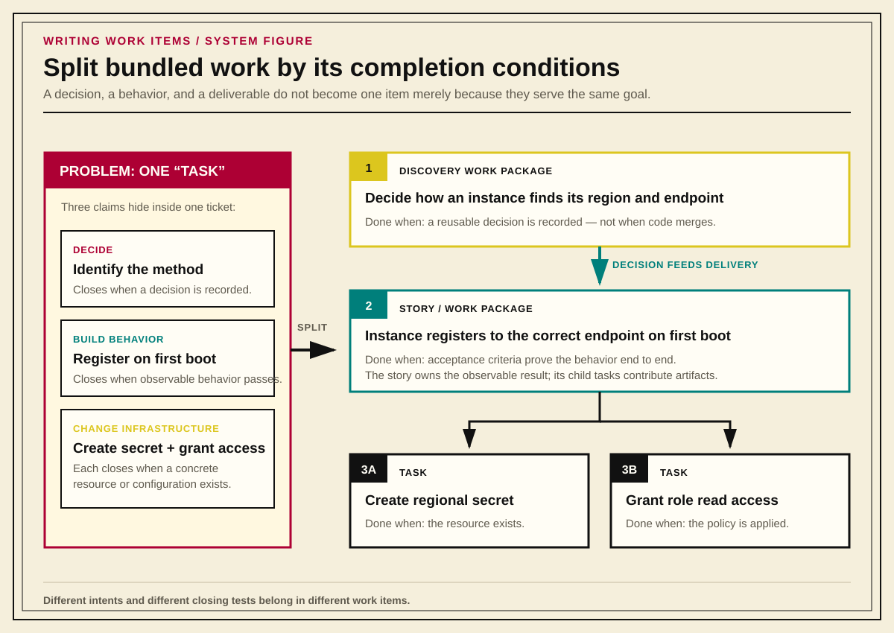{#fig-split-by-completion-condition}

---

## Writing outcomes (for epics)

> **Scope:** outcomes are a **roadmap-work** construct. Reactive demand items - incidents, standard requests - are *not* given outcome statements; they're governed by resolution and structured capture. This section is about the improvement epics we *choose* to run.

Every epic needs an **Outcome / Exit Condition** - at least one checkable condition, and often several bundled into the one field (the corrected Example Epic below combines three). Use one of these two forms for each condition.

**Quantitative (preferred when a metric exists):**
> We'll know this is done when **[metric/state]** moves from **[baseline]** to **[target]**, measured by **[method]**, by **[horizon]**.

**Qualitative (when the change is a capability or a removed risk):**
> When this is done, **[capability]** is now possible / **[failure mode]** is no longer possible, verified by **[specific check]**.

The qualitative form still has to be *checkable* - "verified by [check]" is not optional. "Improve reliability" is not an outcome; "no P1 incidents attributable to cause X for 30 rolling days, confirmed from the incident log" is.

> **The substitutability test - outcome vs. implementation.** The trap isn't vagueness; it's naming a *how*. An outcome must survive **swapping the implementation underneath it**: "ingest X metrics within *t*" stays true whether you use startup configuration, Telegraf, or anything else, so it's an outcome. "startup configuration scripts are modular" names a mechanism - swap startup configuration out and the clause is meaningless - so it's an *implementation detail*, not an outcome (and not a DoD invariant either; see [the distinction among DoD, acceptance, and outcome](#three-things-people-confuse-dod-vs-acceptance-vs-outcome)). Note the test is **not** "is it specific?" - "zero manual post-build steps" is brutally specific and names no *how*, so it passes. **Ask: does this clause name a mechanism? If yes, it doesn't belong in the outcome.**

### The ops outcome catalog

Much of this kind of work delivers value as **reduced risk or reduced toil**, which people find genuinely hard to phrase as an outcome ("how do I put 'we made it less likely to break' into a done-condition?"). Use these four patterns - many operational epics are one of them. **Phrase them additively, not subtractively**: leadership hears "capacity reclaimed," not "work avoided."

| Outcome type | Phrase it as... (additive) | Example |
|---|---|---|
| **Reliability / SLO** | A failure rate or availability target held over a window - or *zero-miss execution* | "Image-build success rate >= 99% over 30 days" |
| **Toil -> throughput** | **Capacity reclaimed**, measured `t × n` per period and redirected to roadmap | "Host provisioning requires 0 manual post-build steps (was 7); ~`t×n` hrs/period reclaimed for roadmap" |
| **Risk retirement** | A failure mode made impossible, or a single point of failure removed | "No host can register against the wrong regional endpoint; enforced by per-region secret and access-policy scoping" |
| **Capability at zero marginal cost** | New capability that scales **without added headcount** | "New regions' hosts stand up with no bespoke config - output grows, team size flat; proven in 2 regions" |

> **Quantifying toil:** `reclaimed = t × n` per period (t = time per occurrence, n = occurrences per period). When `t×n` is small, **lead with the reliability/zero-miss win, not the hours** - e.g. auto-sprint-creation saves ~2 hrs/yr but its real value is "the team always has a place to plan into; no one has to remember." Don't undersell a reliability win by reporting only its modest hours.

> **Automation Ladder** - for *Optimization / Enablement* outcomes, state the **level transition** rather than "automate X":
> **L0 Undocumented** (tribal) -> **L1 Documented** (runbook) -> **L2 Checklist** (verifiable, no shadowing) -> **L3 Semi-automated** (human runs + validates) -> **L4 Fully automated** (event-triggered, human notified).
> e.g. *"Move pipeline-X provisioning from L1 (runbook) to L3 (Ansible playbook)."* Not everything needs L4 - but **nothing should stay at L0**, because that's key-person risk written as a process.

### ❌ -> ✅ for the Example Epic

**❌ As written:** *"Epic to track work related to enabling and building a base image."* - an activity, no end state.

**✅ Outcome statement:**
> *When this is done, a single base image provisions Linux hosts across two runtime types with **zero manual post-build steps**, verified by **>=20 consecutive automated builds passing post-build validation**, and the **legacy build path is decommissioned** by end of Q3.*

That combines toil-reduction + reliability + risk-retirement, and every clause is checkable.

---

## Acceptance criteria (for stories / work packages)

Acceptance criteria (AC) define **done for a story** in terms of **observable behavior**. They are the contract: if the AC pass, the story is accepted - no debate.

Two formats. Use whichever fits; don't mix within one criterion.

**Given / When / Then** - best for behavior with conditions:
> **Given** an instance launches in region-X, **when** startup configuration runs on first boot, **then** it registers against the region-X endpoint using the region-X registration token, and the registration status check succeeds.

**Checklist** - best for a set of concrete, independent conditions:
> - [ ] Script determines region/region from instance metadata with no hard-coded values
> - [ ] Correct registration endpoint URL + registration token fetched from the per-region secret
> - [ ] First-boot registration verified in **at least 2 regions**
> - [ ] Failure to fetch the secret fails the build loudly (logged, non-zero exit)

### The "PR submitted" rule

> **Never write "PR submitted," "code written," or "script created" as an acceptance criterion.** Those describe an *output existing*, not a *behavior working*.

The Example Task's sole acceptance criterion was:

> ❌ *"PR submitted with startup configuration script that can dynamically determine registration endpoint URL and registration token."*

This is done the moment a PR exists - even if the script never successfully registers a single instance. The real done-condition is the ✅ Given/When/Then above: *an instance actually boots in a region and registers against the correct regional registration endpoint.* A PR is how the work arrives; it is not proof the work worked.

**Good AC are:** observable from outside, testable (pass/fail with no judgment call), and about *behavior or end-state* - never about the existence of an artifact.

---

## Three things people confuse: DoD vs. Acceptance vs. Outcome

This is the single biggest source of our "is it done?" confusion. These are **three different fields** that answer **three different questions**, and the Example Epic mixed them up.

| | **Definition of Done (DoD)** | **Acceptance Criteria** | **Outcome / Exit Condition** |
|---|---|---|---|
| **Answers** | "Is our *workmanship* up to standard?" | "Does *this specific item* do what it promised?" | "Did the *epic* achieve the change we wanted?" |
| **Scope** | Same checklist for **every item of its kind, team-wide** (e.g. every task) - authored once, not per ticket and **not per epic** | **Unique** to each story | **Unique** to each epic |
| **Example** | "Has tests, has logging, peer-reviewed, docs updated" | "Registers in 2 regions on first boot" | "Zero manual provisioning steps; legacy path retired" |
| **Lives on** | Team standard (applies to all stories/tasks) | The story/WP | The epic |

**The key insight applied to the Example Epic:** that epic's "Definition of Done" block was doing the **outcome's** job - it was the de-facto "are we finished?" list - while the actual outcome slot sat empty. That's the core error: a DoD was made to carry a burden it can't bear, because no outcome existed. Both fields should exist, and they're different:

- **Promote the *valid* items** - "tracked in version control," "has logging," "has a validation test" - to the **team's DoD**, so they apply to every task (probably every infra task we write).
- **Drop the items that were never DoD material.** Two of the five don't belong in *any* of these three fields:
  - *"Private-environment-only configs leak into the shared base image"* - incoherent for this epic. A **golden/base image contains only what every system needs**; environment divergence belongs in image **layering** or runtime metadata resolution, never as baked-in conditionals. This isn't a mis-slotted bar, it's a misunderstanding of how images compose.
  - *"startup configuration scripts are modular"* - an **architecture decision**, and (per the ownership model in [the work hierarchy](#the-work-hierarchy)) the DoD is the requester's bar, not the implementers'; it has no standing to mandate a design. Architecture quality is real and worth pursuing - it just lives in **design / code review**, not a DoD (see the note at the end of this section). *(Note "modular **and managed in code**" was also redundant: "managed in code" = version-controlled = the item we already kept.)*
- **Add** the missing **Outcome statement** from [writing outcomes](#writing-outcomes-for-epics).

Two different fields. We were writing one, calling it the other, and smuggling two non-bars into the mix.

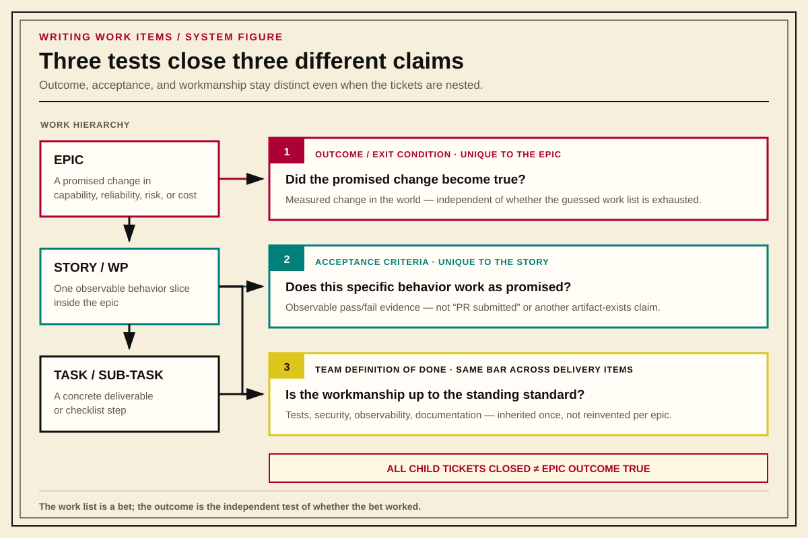{#fig-three-tests-of-done}

### Standing gates (the anti-weasel rule)

There's a failure mode the DoD exists to kill: someone ships something insecure (or undocumented, or untested) and defends it with *"it wasn't in the acceptance criteria."* That's a lame defense - but if our standard relies on each author *remembering* to write a security criterion every time, it will eventually win, because people forget and reviewers are busy.

The fix is **standing gates**: a small set of requirements baked into the team DoD that apply to **every** item **by default**, whether or not anyone wrote them on the ticket. The only way past a standing gate is a **documented, approved exception** - not silence.

> **Standing gates (apply to every story/WP unless an approved exception is linked):**
> - [ ] **Complies with existing security requirements, or has an approved and documented exception** (link it)
> - [ ] **Complies with the team's applicable governing standards, or links a documented non-applicability / exception determination**
> - [ ] Meets the team's testing/validation bar (see DoD)
> - [ ] Observability in place where applicable (logging/metrics)
> - [ ] Docs/runbook updated where behavior changed

> **The compliance gate is *parameterized* - bind it to your team's standard, don't hardcode one.** The portable part is the **mechanism** (default-on; the only way past is a *written* determination, never silence). The **specific standard is per-team configuration**: one team may bind to service-acceptance standards, another may bind to SaaS governance, and another may bind to image or registration standards. Hardcoding one team's standard into this doc would silently exclude every team it does not cover.
> **Why "or links a documented non-applicability determination" carries the load - not the word "applicable":** letting an author silently judge a standard "not applicable" reopens the exact "it wasn't in the AC" hole this section exists to close. The escape isn't an *assertion* that something doesn't apply; it's a **recorded determination** that it doesn't. Spell the opt-out out inline so "applicable" is just a pointer, never the thing doing the adjudicating.

Why this beats "train everyone to imagine how 'done' could be false": that habit (asking *"under what condition is this claim untrue?"*) is excellent and worth teaching - but it's a *personal* discipline, unevenly applied. A standing gate is *structural*: it doesn't depend on the author's diligence, and it converts *"it wasn't in the AC"* from an escape hatch into an admission that a required gate was skipped without an approved exception. Security as a default-on gate means nothing ships insecure *quietly*; if there's a real reason to defer, it gets written down and approved, which is exactly the audit trail you want.

> **Note the scope:** standing gates live in the **DoD column** (apply to everything), not the **Acceptance column** (unique per story). The whole point is that they're *not* something each author re-invents per ticket.

### Architecture quality has a home - and it isn't here

A DoD holds **binary, universal, substitutable invariants** - things that are pass/fail with no judgment call and stay true no matter which solution you pick. "Modular," "loosely coupled," "easy to change later" are none of those: they're **judgment calls**, they're **solution-dependent** (sometimes one tight script is the right answer), and the DoD is the requester's bar, not a place to grade engineering taste. So they don't go in the DoD, Acceptance, or Outcome.

That does **not** make them unimportant. Here we deliberately push back against building a monolithic, single-purpose solution for every narrow use case - **build for modifiability**, so the system flexes as markets (and threats) change unpredictably. That's a real and valued **engineering principle** - it just lives in **design review and code review**, where judgment-based quality is assessed by people, not auto-checked off a ticket. Keep the work-item fields for what's checkable; keep architecture where it can be argued.

---

## Demand-driven work is first-class

Many operations teams handle a large share of work that is **not roadmap work** - hardware failures, resource exhaustion, incidents, and a steady stream of standard requests, such as server builds or package signing. A planning standard that pretends everything is deliberate project work is useless to them. So this model names that work explicitly and gives it a place in the same reporting system.

Throughout this section, distinguish two things people lump together:

- **Roadmap-driven work** - improvement we *chose* to do. This is where the outcome, acceptance, and workmanship machinery above applies.
- **Demand-driven work** - work that *arrives*, whether we planned for it or not. It splits in turn into **reactive** (incidents - unpredictable) and **repeatable** (requests - predictable, same shape every time).

### The reporting-boundary principle

> **Once roadmap-driven and demand-driven work are reviewed by different people and at different cadences, putting them in one bucket can only produce confusion.** Give each its own reporting boundary.

Think of a ticketing boundary the way you'd think of a service boundary: separating two concerns that are owned, reviewed, and reported differently buys you clean signal; collapsing them buys you noise. (Sometimes one bucket genuinely *is* right - a small team with low interrupt volume. Deciding **where to draw your own boundaries** is outside the present argument; what follows assumes you've decided you need one.)

> **Example boundary.** One common setup is to split the boundary across two work queues: **roadmap** for roadmap-driven work, and **demand** for demand-driven work. The examples in this doc are roadmap items. Your organization will have its own names; the *pattern* is what is portable, not the queue labels.

> **A note on change management.** Changes are roadmap-driven by definition, and here a separate change/CAB system governs them - but that system is an **audit overlay**, not a third category of work: no central board can assess a change's impact independently of the experts who own it, so CAB exists to confirm the i's are dotted, not to own the work. It does not affect the roadmap-vs-demand split, which stays a clean **two-way** cut. (We borrow ITIL as a shared vocabulary for these ideas; we are not a strict ITIL shop, and nothing here requires ITIL compliance.)

### The work taxonomy

| Type | What it is | How we track it | Becomes an epic? |
|---|---|---|---|
| **Incident / break-fix** | Reactive response to something broken now | A distinct **work type** set at creation; cause from a **required, resolve-gated field**; time from the **worklog**. **Not** an epic. | No - a single incident *feeds* the data below |
| **Request** | A standard, repeatable ask with a known procedure (e.g. server build, package signing) | Its own **work type(s)**; governed by **acceptance criteria frozen into the type** (see [below](#repeatable-requests-the-machinery-frozen-into-a-form)) | No - it's steady-state demand, not improvement |
| **Recurring demand signal** | Repeated incidents, manual fixes, or requests sharing a cause | **Not a work type you create** - a **derived signal** from aggregating demand **by cause** | It may create corrective, standardization, automation, or improvement work after classification. A severe defect may require action on its first occurrence. |
| **Roadmap project work** | Deliberate corrective, improvement, or capability work we chose to do | Epics with outcomes and item-level proof | It already is one |

> **Surface recurring demand by work *type*, not by *tag* - and let that get harder, not easier, as you mature.** Two rungs:
> - **Rudimentary (one project):** make "incident," "request," etc. **distinct work types chosen at creation**, and have humans **reclassify** the occasional mistake. Do **not** use a removable *tag* or *label* for this. Reclassifying a work type and toggling a tag are nearly identical effort - but a tag is a manual setting that's trivially and *accidentally* removed (a config change living outside version control), whereas a work type is closer to an immutable choice: changing it is deliberate. That friction is a **feature** - it resists silent reclassification, and a misclassification you *have* to consciously fix is itself a **signal that intake (or the system being managed) needs attention**. Use the tool's real capabilities; technology won't fix a behavioral failing, but a proper work type buys you organization, audit trail, and clean aggregation that a tag never will.
> - **Advanced (separate boundary):** once demand-driven work has its own queue, **"recurring demand" stops being a type you file and becomes a pattern you compute** - aggregate demand items by their resolve-gated **cause** and rank by count and reclaimed hours. This is the [Automation Ladder](#the-ops-outcome-catalog) pointed at the planning process itself.

### The demand-to-engineering rule (this is the feedback loop)

> **Demand evidence routes a cause into planned engineering; it does not decide what kind of engineering the cause requires.**

A defect is a defect on the first observed failure. Its priority depends on consequence, exposure, detectability, containment, support boundary, and accepted tolerance—not on waiting for an arbitrary recurrence count. A frequency or effort threshold can surface a low-severity pattern for review, but it cannot convert required correction into optional improvement.

Legitimate repeatable demand is different. If the system is behaving as intended but the work remains manual, volume and cumulative effort can justify standardization or automation. If the system already conforms and the organization wants a higher target, that is improvement.

This is the mechanism that turns observed demand into planned engineering, and it's exactly the narrative leadership wants to see - note that it **crosses the boundary** (demand data in -> roadmap epic out -> outcome verified against the same demand data):

```
demand queue: incidents + requests
        │  cause + time captured structurally (work type, resolve-gated field, worklog)
        ▼
top demand drivers, ranked by count × hours
        │
        ▼
   spawn corrective or improvement epic
        │                                   │
        ▼                                   ▼
   reported as %                  outcome measured in demand data
 roadmap vs demand     ◄──────  did the driver's volume actually shrink?
```

So the reporting story to leadership becomes digestible and honest: *here's our roadmap-vs-demand ratio -> here are the top drivers of the demand half -> here are the epics retiring those drivers -> here's the outcome each one moved, read straight from the demand data.* That loop only works if (a) cause and time are captured **structurally**, and (b) the epics we spawn from it have **real outcomes** - which is the governing point of this chapter.

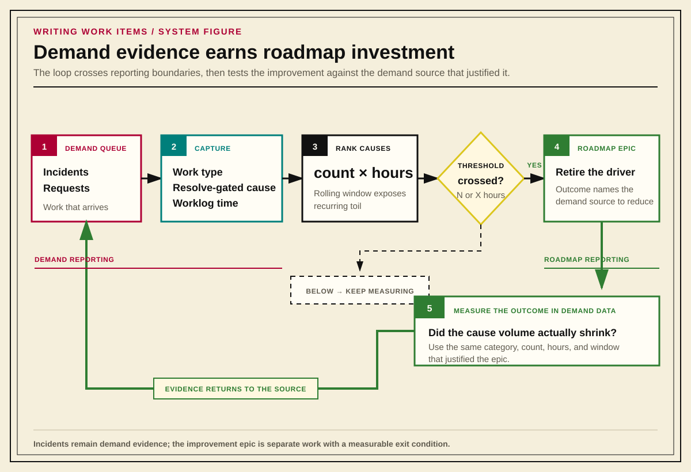{#fig-demand-to-roadmap-loop}

> **Worked example - the loop crossing the boundary.** Over a rolling 90 days, the demand queue shows **23 registration incidents** sharing the resolve-gated cause *"manual registration re-run after endpoint certificate rotation,"* totaling ~31 hours. The repeated evidence quantifies exposure and cost, while the failed automatic registration identifies a defect. It spawns a corrective Epic—not another demand incident:
> - **Roadmap epic outcome:** *"No host requires manual registration re-run after a certificate rotation; verified by zero demand incidents with this cause for 90 consecutive days post-rollout, and a successful automated re-registration observed across >=2 regional endpoints."*
> - The **baseline (23/quarter, ~31 hrs)** comes straight from demand data; the **outcome is measured back in the demand queue** (does the cause category go to zero?). The incident tickets themselves stay in demand as reactive work - they were never going to "become" the epic; they are the *evidence* that justified opening it.

### What the demand data is *for*

The point of capturing demand-driven work this carefully is two specific payoffs:

1. **A leading indicator.** Aggregated incidents should surface a systemic problem **before our customers feel it**. (We hold a deliberate, *non-zero* tolerance for customers noticing first today - but that tolerance is a stated baseline we intend to drive down, not an accepted permanent state.)
2. **A prioritization signal for the roadmap.** Demand data helps teams rank corrective and improvement work honestly: "this defect caused **17 incidents in the last 30 days**" or "this change reclaims **~`t` hours/month**." Consequence, exposure, detectability, containment, and accepted tolerance establish defect risk. Recurrence count and recorded effort quantify frequency and cost. Without both, prioritization is opinion.

> **The data is only as good as its weakest manual input.** This loop drives leadership reporting and epic prioritization, so it cannot rest on anyone *remembering* to classify a ticket - voluntary tagging fails often enough to make the totals untrustworthy, and unreliable data here is worse than none because it gets acted on. Push the capture into the structure: **work type** chosen at creation, a **cause** field made **required to resolve** (the same resolve-gate mechanism as the standing gates in [the distinction among DoD, acceptance, and outcome](#three-things-people-confuse-dod-vs-acceptance-vs-outcome)) and presented as a **closed dropdown** (not free text) so categories aggregate cleanly, and **time from the worklog** rather than a hand-typed estimate. Keep the human surface as small as possible, and treat any number that depends on optional input as an estimate, not a fact.

### Repeatable requests: the machinery frozen into a form

A **request** (server build, package signing) is the limit case of the work-definition model. The outcome, acceptance, and workmanship rules above are machinery for managing *uncertainty* - outcomes because epic completion is divergent, acceptance criteria because each story's behavior must be pinned down, a Discovery work package because you don't yet know "how." A request is the case where **variance from one instance to the next drops to nearly zero**: the outcome is the same every time, and the procedure is known.

So the rules don't disappear - they get **authored once into the request *type*** instead of re-written on every ticket:

| For bespoke roadmap work you... | For a request you... |
|---|---|
| Write an outcome per epic | Inherit a **fixed outcome** baked into the request type ("server built to spec, reachable, registered") |
| Write acceptance criteria per story | Reuse **identical AC** every instance - defined once on the type |
| Enforce a Definition of Ready as a checklist | Enforce DoR through **required form fields** |
| Pull out a Discovery WP when "how" is unknown | Have **no unknown** - the "how" is the standard procedure |
| Apply the single-intent test yourself | Get single-intent **guaranteed by the type** |

This is the same two ideas you've already met, taken to their limit: it's the [Automation Ladder](#the-ops-outcome-catalog) applied to *work definition* (a bespoke outcome is tribal/per-instance; a request type is encoded and verifiable without re-authoring), and it's the [standing-gates](#standing-gates-the-anti-weasel-rule) idea where *everything* is a standing gate and *nothing* is bespoke.

> **The precondition is a stable outcome, not just tidy fields.** Well-defined form fields are how you *encode* a repeatable request - they are not what *makes* it one. If two instances of the same request could legitimately have different success conditions, it isn't a request yet; it's bespoke work wearing a form, and you still need per-ticket outcome thinking. Fields are downstream of a stable outcome, never a substitute for one.

> **Where this lives:** requests are usually demand work types, governed this way - standard service-request handling applied where the model helps, without requiring full ITIL ceremony.

### The three modes, in one frame

Everything above resolves into three modes of work, and the right machinery follows from which mode you're in:

| Mode | Example | Completion is defined... | Governance |
|---|---|---|---|
| **Roadmap / bespoke** | A roadmap improvement epic | **Authored per item** (outcome -> AC -> DoD) | Full outcome, acceptance, and workmanship machinery |
| **Demand / reactive** | A demand incident | By **resolution + structured capture** (cause, time) | Light; its *value* is as the evidence base feeding roadmap prioritization |
| **Repeatable / request** | A server-build request | **Frozen into the work type** once | Authoring collapses to form-filling + field validation |

The portable claim - independent of queue names or tooling - is that **authoring effort should scale with uncertainty.** Bespoke work earns the full machinery; repeatable work amortizes it into a form; reactive work is governed just enough to stay countable.

---

## Splitting & sizing

### INVEST - the quick gut-check for a story/WP

A good story is:
- **I**ndependent - can be built without waiting on a sibling
- **N**egotiable - describes the *what*, leaves room on the *how*
- **V**aluable - delivers something observable to a user or system
- **E**stimable - the team can size it; if not, it's too vague or too big
- **S**mall - fits comfortably in a sprint
- **T**estable - has acceptance criteria that pass/fail

If it fails **E** or **S**, split it. If it fails **T**, you haven't defined done yet.

### Split by vertical slice, not by layer

Prefer slices that each deliver a working end-to-end sliver (*"register in one region, end to end"*) over horizontal layers (*"write all the access-policy,"* then *"write all the scripts,"* then *"test everything"*). Vertical slices each have a real acceptance criterion and can be called done independently. Horizontal layers can't be "done" until the last one lands.

### Separate the decision from the delivery

If you don't yet know *how*, the unknown is its own work. Pull it out as a **Discovery work package** described above that:
- has the done-condition **"a decision is recorded"** (e.g. a comment, a short doc, a chosen approach) - *not* "code merged";
- is deliberately **scoped small / time-boxed**;
- produces the information needed to write the *real* story's acceptance criteria.

**The Example Task should have been split:**
1. **Discovery WP** - "Decide how an instance determines its region and registration endpoint." Done when the approach is written down.
2. **Story** - "Instance auto-registers to the correct regional endpoint on first boot" (AC from [acceptance criteria](#acceptance-criteria-for-stories--work-packages)).
3. **Task(s)** - "Create per-region registration secret," "Grant instance role read access to the secret."

Three completion conditions, three (or more) items.

---

## Definition of Ready

The mirror image of "done." **Definition of Ready (DoR)** is the gate an item must pass *before* anyone starts it. This is what lets us **scope work before committing to it** - our stated short-term need before we can move from scramble to predictable flow.

> **Scope:** this DoR is for **roadmap work**. Reactive demand items don't pass through it - an incident has no parent improvement epic and can't wait on a readiness gate; a standard request is "ready" by virtue of its work type's required fields being filled. Applying the gate below to either would be a category error.

**A story/WP is Ready when:**
- [ ] It carries **one intent** described above - not a build *and* a migration in one ticket
- [ ] It has a clear **acceptance criteria** set - one line per measurable variable, and none say "PR submitted"
- [ ] **Non-Goals are written** - mandatory when the work touches anything cross-team
- [ ] **Pre-conditions are met** (or it's in `Blocked` with the unblock owner named)
- [ ] **Standing gates** are satisfiable - security/test/observability bar met or an approved exception linked
- [ ] It's a **vertical slice** that fits in a sprint
- [ ] Any genuine unknown has been pulled out into a **Discovery work package** and resolved first
- [ ] It links to its **parent epic**, and that epic has a real **outcome statement**

**An epic is Ready when:**
- [ ] It has an **Outcome / Exit Condition** - checkable, with a measure and a horizon (one or more conditions)
- [ ] The **team DoD** (the standing per-task quality bar) is linked/restated and is distinct from that outcome - you inherit it, you don't author one
- [ ] Its first slice of stories is drafted (you don't need them all up front)

> **The discipline:** nothing enters a sprint until it meets DoR. If we can't make it Ready, that's the signal we don't understand it yet - which is itself useful information, and far cheaper to learn now than mid-sprint.

---

Once work is executable, the organization needs an operating system that can see it, control how much is active, distinguish planned work from interruption, and turn repeated demand into evidence that the system itself should change.

<!-- Preview assembly source: Writing Work Items - Epics, Stories, and Tasks.md: sections 1–8; templates moved to Appendix A -->


\newpage

# Part IV: Operating, Improving, and Retiring the System {.part .unnumbered}

Authorized work enters an operating system that must control flow, learn from recurrence, respond to risk, and stop investing in assets that should disappear.


\newpage

# Make the Operating System Visible

*Part IV — Operating, Improving, and Retiring the System*

An organization cannot improve work it cannot see, and it cannot see work merely because tickets exist somewhere. Visibility requires a stable taxonomy, a common record, explicit work-in-progress policy, a baseline, and enough protection from interruption for planned improvement to survive contact with ordinary demand.

> **Preview note — future edition**
>
> A future version will add the Eight Wastes of Engineering before the improvement method. The gate will ask whether work should exist before helping a team execute it more efficiently, while preserving the distinction between genuine waste and necessary discovery, resilience, recovery, security, compliance, or documentation.

## Why Process Improvement

Process improvement is how to work better — a systematic approach to identify, analyze, and improve existing processes for more efficient, more predictable results.

### Business Case

- **Increase service level** — happier customers, faster resolution
- **Increase opportunities to innovate** — when operational toil is reduced, capacity opens for new services
- **Improve consistency** — repeatability of outcomes via standard work, automation, and clear procedures
- **Improve quality** — fewer manual errors, fewer repeat incidents
- **Increase efficiency** — do the same work with less effort, or more work with the same effort
- **Control the narrative** — at some point, senior leadership will come looking for metrics. If we have them ahead of time, we control the story from that point forward. If we don't, others will make headcount and capacity decisions based on incomplete data. We create the data now, or we get run over.

### Define the Problem First

Before changing process, define the problem clearly. Otherwise teams end up adopting ceremonies and tooling without proving that they are solving the right operational issue.

At minimum, establish:

- **Customer and stakeholders** — who experiences the problem, and who is affected by fixing it?
- **Problem statement** — what is failing, and why does it matter?
- **Baseline** — what is happening now, measured in current-state metrics
- **Scope** — what is included, and what is explicitly out of scope?
- **Target condition** — what outcome would represent a meaningful improvement?

This is the difference between process theater and process improvement.

### Applicability

This framework is not limited to infrastructure or software teams.

It applies anywhere work is:

- repeatable enough to standardize
- variable enough to require triage or prioritization
- interrupt-driven or queue-driven
- measurable in terms of time, quality, throughput, rework, or wait states

That includes environments such as:

- platform and infrastructure teams
- service desks and shared services
- warehouse and fulfillment operations
- logistics and distribution workflows
- customer support and back-office operations

The examples here lean toward IT and technical operations because that is where the framework was used most heavily, but the underlying model is broader than that.

## The Maturity Ladder

Most teams start at Level 0 or 1. The goal is steady, sustainable progress up the ladder — not a leap to the top.

| Level | What It Looks Like | Key Metric |
|-------|-------------------|------------|
| 0 — Reactive | Work arrives via email, Slack, hallway conversations. Gets done when it gets done. | No data |
| 1 — Visible | All work is tracked. A board exists. WIP limits are in place. | Cycle time is measurable |
| 2 — Measured | Flow metrics tracked weekly. Unplanned work ratio known. | Cycle time is improving |
| 3 — Managed | Standard work and automation exist for recurring work. Interrupt budget is explicit. | Manual work ratio declining |
| 4 — Optimizing | Retrospectives drive policy changes. Capacity planning is data-driven. | Predictable delivery |

C-levels don't care which framework you use. They care that Level 0 costs them money (slow, unpredictable, key-person risk) and Level 4 doesn't. The maturity ladder gives them a map without requiring them to understand ITIL.

ITIL, ISO 20000, and CMMI are bodies of knowledge that *inform* this approach — the bibliography, not the curriculum. You can adopt their concepts selectively without adopting the full framework.

## Work Taxonomy

### Delivery, Corrective Engineering, and Improvement Work

The same people may perform all three, but the investment classes answer different questions:

- **Delivery work** operates a conforming service or fulfills legitimate demand. Incident response may contain harm and restore service, but restoration alone does not remove the underlying defect.
- **Corrective engineering** removes a defect or its cause so the system returns to required behavior. It is part of producing and maintaining an acceptable system, not an optional improvement.
- **Improvement work** raises capability, quality, efficiency, or consistency after the system already meets its accepted requirements and tolerances.

Standardization and automation are mechanisms, not classifications. Automating a workaround around a defect may institutionalize bad behavior. Automating legitimate repeatable demand may be a useful improvement. The organization must first decide whether the observed work is conformance, correction, or advancement.

"This week, 60% of capacity operated the service, 25% corrected defects, and 15% improved a conforming system" is a sentence leadership can understand and act on.

### Work Types

Minimally, the team must understand and consistently classify its incoming work.

In ITSM environments, common categories are:

- **Incident** — something is broken or degraded. Restore service.
- **Request** — someone needs something done. Fulfill it.
- **Change** — we decided to modify something. Approve and execute it.

In other environments the equivalent categories may be things like:

- unplanned issue / exception
- standard request / order / intake
- planned process or system change

The exact names matter less than the consistency of classification. The point is to avoid throwing unlike work into one generic bucket and then wondering why the data is useless.

Ideally, the intake form or work record forces the submitter to categorize the work at entry time. Keep the taxonomy short. If the list of work types is too long, the team probably does not yet understand its service model clearly enough.

## Establishing the Foundation

### Problem Definition and Baseline

Before selecting tools, ceremonies, or boards, define the current state.

1. Identify the service or workflow being improved
2. Define the customer impact
3. Establish a baseline:
   - cycle time
   - error rate or repeat-incident rate
   - unplanned work ratio
   - queue depth, rework, or wait time
4. Define the target condition
5. Define what evidence will show that the change worked

This is the "Define" and "Measure" portion of the work. Without it, teams tend to confuse visible activity with improvement.

### Organizational Goals

1. Define organizational goals
2. Define and understand service offerings — what are we doing, and why?
3. Define Service Level Objectives (SLOs) and Service Level Agreements (SLAs)

### Way of Working (WOW)

There are many ways to meet any given objective. Establishing a WOW defines how the team works within an agreed-upon structure:

- Ensures everyone works the same way — helps stay organized
- Defines how and where we track time/effort (can be as simple as time estimates on work items)
- Defines project monitoring and control: understand progress, correct course, improve delivery time and quality
- Defines meeting cadence — frequency and format

**Framework recommendation:** For teams doing largely independent, continuous work, **Kanban** is usually the better operating model. It does not force artificial sprint boundaries onto work that continues to arrive every day. What you need:

1. **Visualize work** — a board with columns (Backlog, In Progress, Review, Done). This alone is transformative for teams that track work in a system of record but do not visualize flow.
2. **Limit WIP** — start with WIP = 1 per person, then tune.
3. **Measure flow** — cycle time, throughput (work items/week), aging (oldest in-progress item).
4. **Improve policies** — explicit rules for when work moves between columns.

Scrum may still appear in the environment because leadership often wants a two-week reporting rhythm, sprint reviews, or commitment checkpoints. That does not mean the underlying work must be managed as sprint-batch execution.

A practical hybrid model often works best:

- Use **Kanban** to manage the actual flow of work
- Use **sprint reviews or regular checkpoints** as reporting and stakeholder-alignment cadences
- Use **flow metrics** as the primary operational measurement system
- Treat sprint boundaries as communication boundaries, not as permission boundaries

If standups are used, consider async formats (board walk, written update, or chat thread) to avoid turning them into status meetings for people who are not collaborating on the same work.

### Work Intake

Two rules:

1. **No work gets done without a work record**, except extreme cases (for example, a critical outage or safety event where the paperwork follows the response).
2. **All new work requests flow through a single channel** (intake workflow, scrum master, or designated queue).

Framing for the team: "You know how management said you must have a record for everything, and you get a million side requests by message, hallway conversation, or drive-by interruption? This means you get to tell people: *please submit this through the intake channel.* If they have questions about the process or need something handled urgently, refer them to the sponsoring leader." Most people are not willing to escalate trivial work to senior leadership. This assumes leader-level buy-in on the intake model.

### Evaluate Existing Processes

Before improving anything, map what exists. Process mapping is one tool for this. Identify areas of opportunity — these become work projects.

## Handling Operational Reality

Many service, support, and fulfillment teams live in a world of interrupts. If we do not explicitly account for this, planned work will always lose to urgent work, and process improvement will be the first casualty.

### Interrupt Budget

Reserve a fixed percentage of team capacity for unplanned work. Measure the current ratio first by tracking planned versus unplanned work for at least two weeks. Many interrupt-driven teams land around 40-60% unplanned.

### Rotating Shield

One person per rotation (day or week, depending on volume) is the designated interrupt handler. Everyone else works planned items. The shield absorbs urgent requests, exceptions, escalations, and "hey can you help me" interruptions. This does not require everyone to be excellent; it requires everyone to take a turn.

### The 30-Minute Rule

If an interrupt takes less than 30 minutes, the shield handles it. If it takes more, it becomes a tracked work item. But **this only works with a feedback loop on the backlog**:

- **A defect routes to corrective engineering.** The first occurrence may justify immediate action when consequence, exposure, detectability, or containment makes the risk unacceptable. Recurrence strengthens the evidence; it does not create the obligation.
- **Legitimate repeatable demand routes to standard work.** Frequency and cumulative effort may then justify documentation, standardization, or automation.
- **A recurrence threshold is an alerting rule, not a quality standard.** A rule such as three similar records in a month can force review of low-severity patterns. The review still has to classify the cause and decide whether to correct, standardize, improve, accept within a narrow tolerance, or reject as unsupported.
- Anything that remains unresolved for 60 days returns to an accountable decision owner. Backlog age cannot silently turn a known defect into an accepted limitation.

> **Implementation note:** The work-management system should aggregate demand by cause and surface patterns for classification. The resulting route—corrective engineering, standardization, improvement, accepted limitation, or no action—must be recorded rather than inferred from a threshold.

### Standard-Work-First Response

When the shield handles an interrupt, step one is checking whether documented standard work exists. If yes, follow it. If no, handle it manually *and create the documentation as part of the resolution*. A legitimate repeated procedure is a standardization opportunity. When the interrupt exposes a defect, the procedure is containment; documenting or automating the workaround does not close the corrective obligation.

Visibility exposes recurrence. The organization can now distinguish legitimate repeatable demand from a defect, route required correction without waiting for a frequency threshold, and reserve improvement language for raising a system that already conforms.

<!-- Preview assembly source: Process-Improvement-Framework.md: sections 1–5 -->


\newpage

# Turn Recurrence Into Engineering Work

*Part IV — Operating, Improving, and Retiring the System*

Recurring work is not merely a queue-management problem. It is evidence about the operating model. Recurrence strengthens the evidence about exposure, cause, and economic cost; it does not determine what kind of work the response is. A defect routes to corrective engineering even when the first occurrence is the only occurrence. Legitimate repeatable demand may route to standard work or automation. Improvement raises a system that already conforms. A narrow accepted limitation requires an explicit, owned tolerance decision.

## Classify the recurrence before acting

The first question is not whether the pattern has crossed an arbitrary threshold. It is what the pattern represents:

| Observed condition | Required route |
|---|---|
| Required behavior failed or an accepted tolerance was violated | Contain the consequence, then correct the defect or its cause |
| Legitimate demand is being fulfilled through a repeatable manual procedure | Define standard work, then evaluate automation using frequency, cost, risk, and expected return |
| The system conforms, but a higher capability, quality, or efficiency target is worthwhile | Improvement |
| The condition is real but support, consequence, exposure, or correction cost does not justify action | Record a bounded, owned accepted limitation or tolerance |

A recurrence threshold can force a review before low-severity demand disappears into the queue. It cannot turn a defect into a defect, convert correction into optional improvement, or create acceptance through neglect.

## The Standardization and Automation Ladder

The long-term goal is that nothing done regularly should remain ad hoc. Some work should end up fully automated; some should end up as standardized checklists or documented procedures. The point is to move recurring work upward, incrementally.

| Level | Description | Example |
|-------|-------------|---------|
| 0 — Undocumented | "Ask the one person who knows how" | Tribal knowledge |
| 1 — Documented | Written procedure with clear steps | SOP, wiki page, runbook |
| 2 — Checklist | Step-by-step with verification at each stage | Checklist a new team member can follow |
| 3 — Semi-Automated | Tooling does the work, human runs it and validates | Script, macro, workflow, playbook |
| 4 — Fully Automated | Triggered by event, human notified of result | Scheduled job, system workflow, webhook-triggered process |

The goal is to move everything at least one level up. Not everything needs to be Level 4. Some things are fine at Level 3 forever. But **nothing should be Level 0** — that's key-person risk, and it's the argument that resonates at every level of the organization.

### Getting People to Automate

Modeling the behavior, showing results, and making it visible is necessary but not sufficient. If the barrier were awareness, watching someone else automate would be enough. It usually isn't. Common barriers and fixes:

**They don't know how.** For someone who came up through GUI-based administration, "just write a script" is like telling someone who's never cooked to "just make dinner." The fix isn't training classes — it's pairing. Pick one recurring manual task, sit with them for 90 minutes, co-author the first script together. Them driving, you navigating. They need the "I made the computer do the thing" moment firsthand. The first script is the wall; the second is dramatically easier.

**There's no incentive (and there might be a disincentive).** Automate a 2-hour weekly task and what happens? You get 2 more hours of other work. No reward, no recognition. Meanwhile, the person doing it manually looks busy and needed. Automation can feel like automating yourself out of relevance. The fix: make automation the valued output (see Celebrating Wins below).

**The ROI is invisible.** Building a tool or workflow takes 4 hours. Doing the task manually takes 20 minutes. The breakeven is 12 occurrences. But people do not think in breakeven — they think "I can do this in 20 minutes or spend my afternoon fighting with tooling." The fix: make cumulative cost visible. Track manual task time. When someone does something manually for the 10th time, the work record should show "total time spent on this task type: 3.3 hours." Now the 4-hour investment has a number next to it.

**Not everyone needs to write code.** People who move a task from Level 0 (undocumented) to Level 2 (checklist) are doing valuable work. That checklist is the artifact someone else can later automate or formalize further. Meet people where they are and move them one level up.

### Celebrating Wins

Behavior that gets celebrated gets repeated. Behavior that gets ignored doesn't. This isn't soft feel-good stuff — it's operant conditioning. Concrete mechanisms:

- **Demo slot** — 10 minutes at the end of a weekly meeting. Someone shows what they automated. Not a polished presentation — just "here's the thing, here's what it does, here's how much time it saves."
- **Automation scoreboard** — a visible counter (wiki page, team channel, whiteboard) tracking: task name, who improved it, estimated time saved per month. The number only goes up. People like making numbers go up.
- **"First script" recognition** — the first time someone who's never automated anything writes a working script, name it. "A teammate wrote their first playbook this week; it handles X and saves us Y hours a month." This creates social proof that automation isn't one person's thing.
- **Blameless failure** — if someone writes a script and it breaks, the response is "good, you tried, let's fix it together." One punishment kills a year of encouragement.

## Planning and Execution

### Current State Mapping

1. Map current processes
   1. Identify responsibilities and ownership (internal and external)
   2. Get the right people working on the right things (skills matrix, self-selection, or manager assignment — pick one and be explicit)
   3. Identify roadblocks and process impediments (wait time)
   4. Identify cycle time (work time + wait time)
   5. Identify value-added vs non-value-added activities. Example: are there things senior admins are doing that could be done by junior staff or automated entirely?
2. Map ideal state processes
   1. Identify process gaps and inefficiencies
   2. Identify skill gaps
   3. Identify tech debt (things we can do but don't because we deployed them hastily)
   4. Identify infrastructure gaps (things we can't do because we lack the infrastructure)

### Backlog Management

1. Enter all work required to move from current state to ideal state into the project backlog
2. Prioritize the backlog:
   1. **Themes** — project types aligned with business objectives
   2. **Initiatives** — large categories working toward business objectives
   3. **Epics** — workable projects (may span multiple cycles)
   4. **Stories** — small enough to complete within a normal review cadence
   5. **Tasks** — steps required to complete stories

If the work is still too ambiguous to estimate or sequence confidently, stop decomposing and create a discovery package first. Execution artifacts should not be used to disguise unresolved uncertainty.

### Execution

This is the hardest part. Everything before it is planning; everything after it is review. Key concerns during execution:

- **WIP limits are sacred.** Do not start new work until current work is done or explicitly blocked. Starting everything and finishing nothing is the default failure mode.
- **Scope changes get new work items.** If requirements shift mid-task, the original item stays scoped as-is. New scope = new item = goes through prioritization.
- **Blocked work gets flagged immediately**, not at the next standup. Blockers are the team lead's (or scrum master's, or manager's) problem to remove.
- **Dependencies between team members** are visible on the board. If your work item is blocked by someone else's work item, link them. The board should make this obvious.
- **When to escalate:** if a work item has been in progress for more than 2x its estimate with no path to completion, escalate. Do not let work quietly stall.

## Measuring Success

Establish at least one metric *before* starting, so the organization can tell whether the intervention changed the condition it was authorized to change.

### Leading Indicators (measure effort)

- **Automation coverage** — percentage of recurring tasks at each level of the automation ladder. Track monthly. Target: 0% at Level 0 within 6 months.
- **Unplanned work ratio** — unplanned work items / total work items per week. Track weekly. If this is not declining, the intervention is not reducing unplanned demand; revisit the classification, cause, or chosen mechanism.
- **Mean time to standard work** — when a new recurring task is identified, how long until a documented procedure exists? Target: by the end of the week it is first performed.

### Lagging Indicators (measure outcomes)

- **Cycle time** — median time from ticket creation to resolution. Segment by type (incident vs request vs project).
- **Repeat incident rate** — how often do we get paged for the same thing twice? If the corrective mechanism is working, this trends toward zero.
- **Time to production** — how long from "we decided to do this" to "it's in production." Captures the full cost of process overhead, approvals, and queuing.

### The Executive Number

Pick one metric for C-level reporting. **Cycle time** is the best single number. "Our average time to deliver a change went from X weeks to Y weeks" is a sentence any executive understands. Everything else is internal instrumentation that supports that one number.

### Forecasting and Sizing

If the organization requires sprint-level planning or periodic progress reporting, use a lightweight sizing approach for forecast conversations. Keep it secondary to flow metrics.

Guidelines:

- Primary operational measures should remain cycle time, throughput, aging, and unplanned work ratio
- Sizing should support planning conversations, not replace evidence
- If points are used, keep them internally consistent
- If time-box estimates are used, treat them as planning aids rather than promises

The goal is not to optimize for velocity theater. The goal is to create forecasting data that helps teams make better capacity decisions.

## Retrospectives

1. Review the outcomes of the cycle, sprint, or reporting window
2. Identify ways to improve outcomes in the next iteration:
   - What worked?
   - What didn't work?
   - Even better if...
3. Include domain-relevant operational metrics reports
   - High unplanned work utilization helps us understand shortcomings in planned work
   - Review the Delivery, Corrective Engineering, and Improvement capacity split — are we spending our time the way we intended?
4. Present the results of our work to key stakeholders

The distinction between a retrospective and a Sprint Review is documented by [Scrum.org — What is a Sprint Review](https://www.scrum.org/resources/what-is-a-sprint-review)

Classification determines the obligation; recurrence helps quantify its exposure and cost. Retrospectives, metrics, and recurring-demand evidence then create several review loops. Without a defined cadence and decision boundary, those loops tend to collapse into status meetings or operate as unrelated ceremonies.

<!-- Preview assembly source: Process-Improvement-Framework.md: sections 6–9 -->


\newpage

# Future Edition: Operating Cadence {.unnumbered}

*Part IV — Operating, Improving, and Retiring the System*

A cadence is the time structure that forces claims back into judgment. It determines when the organization reviews flow, risk, delivery forecasts, process defects, talent evidence, portfolio assumptions, and completed outcomes. The meeting is only the visible container; the operating mechanism is the recurring obligation to read a defined artifact and leave behind a decision, changed state, or explicit decision not to act.

The existing sources define several credible loops in isolation. Process Improvement supplies daily flow visibility, periodic retrospectives, and stakeholder review. Work Intake defines proposal review, delivery readiness, forecast changes, and outcome reconciliation. Managed Runoff defines lifecycle checkpoints. TDA puts development evidence into one-on-ones, quarterly reconciliation, and review cycles. RFPs add selection, acceptance, burn-in, and post-implementation review. The corpus does not yet define how these loops coexist without asking the same people to review the same evidence in several rooms.

> **Preview note — future edition**
>
> A future version will define a minimum viable cadence by decision rather than by inherited meeting name. It will state what must be reviewed daily, weekly, monthly, quarterly, and annually; which role or body may make each decision; which artifact enters; which state change must leave; and which urgent risks may bypass normal timing.
>
> It will also define what must not travel. Retrospectives and developmental conversations lose signal when they are converted into upward performance reports. Executive visibility requires selected operational evidence, not universal access to every learning record.

## The current design rules {.unnumbered .unlisted}

Until the full cadence exists, the distributed source material supports six rules:

1. Separate flow review, learning review, portfolio judgment, risk escalation, people development, and formal performance decisions.
2. Give each review a named decision right; a meeting that can only discuss status is not a control loop.
3. Identify the authoritative input and the state change or artifact the review must produce.
4. Route exceptions back to the authority that owns the affected risk, funding, priority, or capacity.
5. Expire exceptions and conditional approvals; time does not make an unmet condition true.
6. Aggregate only the evidence needed for the next decision. Preserve case-level context where aggregation would change its meaning.

These rules are sufficient to audit an existing meeting system. They are not a finished operating calendar.

Cadence keeps active systems under review. Lifecycle discipline answers a different question: what changes when the organization has decided that a system should no longer receive normal investment at all?

<!-- Preview assembly source: Gap-map synthesis from Process Improvement, Work Intake, Managed Runoff, TDA, and RFP source material -->


\newpage

# Managed Runoff

*Part IV — Operating, Improving, and Retiring the System*

Continuous improvement becomes incoherent when the organization keeps improving an asset it has already decided should disappear. Managed runoff changes the investment classification: the old path may still require safety, continuity, migration, knowledge extraction, and shutdown work, but it no longer receives ordinary product logic.

> **Preview note — future edition**
>
> A future version will add a lightweight decision record, examples beyond deprecated services, clearer exception authorities by risk type, and the connection between runoff decisions and broader architecture or portfolio records.

## Purpose

Organizations often make a clear strategic decision to move away from a service, process, platform, or design, then continue funding the old path as if it were still part of the future. The language changes before the operating model does. The old thing becomes "legacy," "deprecated," or "temporary," but it still consumes roadmap space, support attention, engineering time, exception handling, and political energy.

Managed runoff is the discipline that closes that gap.

Once a service has been deprecated, the organization should stop treating it as a normal investment object. The goal is no longer to make it better. The goal is to keep it safe enough, stable enough, and understandable enough to exit without creating unacceptable risk.

The thesis is simple: **after deprecation, improvement work is presumed waste unless it directly reduces exit risk, preserves continuity during migration, satisfies a safety, security, or compliance obligation, or accelerates retirement.**

Before deprecation, work on a service may be investment. After deprecation, work on that service is carrying cost until proven otherwise.

---

## The Core Distinction

Managed runoff is related to migration patterns, but it is not itself a migration pattern.

The Strangler Fig pattern answers this question:

**How do we incrementally move functionality away from the old system?**

Managed runoff answers a different question:

**How should the organization treat the thing being left behind?**

The distinction matters because organizations can execute a migration pattern while still failing the lifecycle decision. They build the replacement path, route new traffic to it, and reduce reliance on the old service, but they never change the governance model around the deprecated path. The old service keeps receiving enhancements, exceptions, documentation projects, integrations, and cleanup work that make it easier to keep.

A migration plan without runoff discipline is additive complexity. The organization now has two operating models: the target state it says it wants, and the deprecated path it continues to feed.

---

## Relationship to Existing Frameworks

Managed runoff is not meant to replace service retirement, application portfolio management, enterprise architecture migration planning, technical debt management, legacy-system decommissioning, the Strangler Fig pattern, or portfolio models such as tolerate, invest, migrate, and eliminate.

The useful move is to put those ideas into plain operational language:

**Is this still an investment asset, or is it now a managed-runoff liability?**

That question changes the conversation. If the old service is still an investment asset, normal improvement work may make sense. If it is a managed-runoff liability, the work should be limited to safety, continuity, compliance, migration enablement, knowledge extraction, risk reduction, and shutdown.

The framework is not ceremony for its own sake. It is a way to stop treating a system like a product after the organization has already decided it should not be part of the future.

---

## When Managed Runoff Applies

Managed runoff applies when the organization has decided that a service, process, design, platform, vendor path, or operational model is no longer the desired future state.

Common triggers include:

- a replacement platform has been approved
- a process has been formally deprecated
- a vendor product is being exited
- a legacy service has been neutralized as the primary path
- a design has been superseded by a target architecture
- an old operating model remains only for compatibility or unmigrated consumers
- a platform is being held only for read-only reference, fallback, or transition support
- a compliance, security, or lifecycle concern requires eventual removal

Managed runoff should not wait until the final shutdown project. It begins when the value classification changes. The important moment is not when the last consumer leaves. The important moment is when the organization decides that the deprecated thing is no longer where future value should accumulate.

That decision should be explicit. If the organization cannot name the deprecation date, replacement path, owner, allowed maintenance scope, and next review point, it has not actually put the service into managed runoff. It has merely expressed dissatisfaction with the current state.

---

## KO Is Not Kill

There are two different retirement states that organizations often confuse.

### KO

A KO means the old service has been neutralized as the primary path.

It may still exist as:

- fallback
- read-only reference
- emergency path
- compatibility layer
- support path for unmigrated consumers
- temporary bridge while consumers move to the target state

KO is useful progress, but it is not retirement. The old service may no longer be strategic, but it still has dependencies, obligations, and carrying cost.

### Kill

Kill means the old service has been removed from the operating model.

The kill state requires:

- no active consumers
- no normal support obligation
- no enhancement path
- no hidden dependencies
- no planning allocation
- no privileged exception status
- no reason for the service to keep appearing in roadmap discussions

The kill state is the actual retirement target.

Many organizations mistake KO for kill. The old service stops being the default path, so leadership psychologically moves on. But the service still exists. People still ask for changes. Teams still route exceptions through it. Auditors still find it. Engineers still get paged for it. Stakeholders still delay migration because the fallback is available.

That is not retirement. That is an unmanaged transition state.

---

## The Zombie Service Failure Mode

A zombie service is a deprecated service that continues to consume labor, planning attention, maintenance effort, and political oxygen after the organization has decided it should not be the future state.

Zombie services survive because the organization avoids forcing lifecycle decisions. Everyone knows the old path should go away, but nobody owns making it disappear.

Common symptoms:

- "We know this is going away, but..."
- "We just need to clean this up first."
- "We should document the old service better."
- "We need to make it more robust while we migrate."
- "We cannot remove it yet because someone might still need it."
- "Let's add this one feature to the legacy path."
- "We will revisit this next quarter."

Some of those sentences can be legitimate. A deprecated service may still need emergency repair, migration support, dependency discovery, or shutdown preparation. The failure is not touching the old path at all. The failure is touching it under the old investment logic.

Under managed runoff, every proposed change to the deprecated service has to answer a simple question:

**Does this help us exit safely, or does it make the old path more durable?**

If the work makes the old path more attractive, more usable, more integrated, or more politically comfortable without reducing exit risk, it is probably preserving the failure mode.

---

## Allowed, Questionable, and Disallowed Work

Managed runoff changes the default classification of work.

### Allowed Work

Work is allowed when it directly supports:

- safety
- security
- compliance
- continuity during transition
- migration enablement
- dependency discovery
- knowledge extraction
- shutdown readiness
- emergency repair
- data preservation or legally required retention
- rollback readiness for a defined cutover window

Allowed work should still be scoped tightly. The test is not "could this be useful?" The test is "what exit risk does this reduce?"

### Questionable Work

Work should be challenged when it involves:

- polishing the deprecated path
- improving user experience on the deprecated path
- improving performance beyond transition needs
- refactoring internals without migration benefit
- expanding documentation for a soon-to-die service
- creating new dashboards that normalize long-term operation
- cleaning up code or process because it is ugly rather than risky
- adding monitoring that does not connect to a transition obligation

Questionable work is not automatically forbidden. Sometimes the cheapest way to migrate safely is to clarify a confusing path, add temporary observability, or document a shutdown procedure. But the burden of proof belongs to the person asking for the work.

### Disallowed by Default

Work should generally be rejected when it:

- creates new consumers
- expands old functionality
- adds new integrations
- increases attachment to the deprecated service
- extends the retirement timeline without explicit approval
- makes the deprecated path more attractive than the replacement
- consumes capacity needed for the target-state work
- preserves ambiguity about the future state
- turns an exception path back into a normal path

The deprecated service should be maintained only enough to exit. Not enough to make it elegant. Not enough to make it feel modern. Not enough to make people comfortable staying there.

---

## Operating Model

Managed runoff needs an operating model, not just a label.

At minimum, each deprecated service should have:

- **Deprecation date:** when the organization decided the service is no longer the desired future state
- **Replacement path:** the target service, process, vendor, platform, or operating model
- **Runoff owner:** the person or team accountable for keeping the old service safe until exit
- **Retirement owner:** the person or team accountable for making the old service disappear
- **Allowed maintenance scope:** the kinds of work still justified
- **Forbidden maintenance scope:** the kinds of work no longer accepted
- **Dependency inventory:** the consumers, jobs, integrations, reports, runbooks, users, vendors, and controls still tied to the old path
- **Exit criteria:** what must be true before the service can be killed
- **Kill date or review date:** when the next lifecycle decision is forced
- **Exception policy:** which conditions justify touching the old path outside the planned runoff scope

The runoff owner and retirement owner may be the same person, but the responsibilities are different. Runoff ownership keeps the old service controlled during transition. Retirement ownership drives the organization toward kill criteria.

If nobody owns retirement, the deprecated service will tend to stabilize at KO. It will be less visible than before, but still alive.

---

## Process Shape

Managed runoff can be run as a lightweight lifecycle process.

### Declare the Deprecation

Record the decision in plain language:

- what is deprecated
- why it is deprecated
- what replaces it
- what no longer belongs on the old path
- when the next decision will be reviewed

This is where the investment classification changes. The old service exits the normal improvement portfolio and enters managed runoff.

### Freeze the Improvement Surface

Define what kinds of work are no longer accepted. Make the default visible to intake, planning, support, engineering, product, compliance, and stakeholder teams.

Requests should not disappear into informal negotiation. They should be classified:

- allowed runoff work
- migration work
- exception request
- rejected legacy improvement
- target-state backlog item

This classification prevents legacy demand from laundering itself through ordinary planning language.

### Inventory Dependencies

Find what still depends on the deprecated service.

The inventory should include technical dependencies, process dependencies, reporting dependencies, customer dependencies, data dependencies, access paths, scheduled jobs, human workarounds, audit controls, and emergency procedures.

The goal is not documentation for its own sake. The goal is to expose the work required to kill the service.

### Define Exit Criteria

Exit criteria describe the kill state in operational terms.

Useful criteria include:

- all consumers have migrated
- all data retention obligations have been satisfied
- all required records have been archived
- all integrations have been removed or redirected
- all runbooks have been retired or replaced
- all access paths have been closed
- all monitoring and alerting have been removed or transferred
- all support obligations have ended or moved to the replacement path
- rollback paths are no longer required
- accountable owners have signed off on removal

Exit criteria should be specific enough that the organization can tell the difference between "almost done" and "done."

### Operate the Runoff Backlog

The runoff backlog should be separate from normal improvement work, or at least explicitly labeled inside the same work system.

Every item should identify:

- the exit risk being reduced
- the affected dependency or consumer
- the owner
- the expected evidence of completion
- the decision checkpoint it supports
- the reason it belongs on the old path instead of the target path

This keeps runoff work from becoming a vague bucket for "legacy cleanup."

### Force Decision Checkpoints

Runoff work needs scheduled reviews because indefinite transition is the default failure mode.

At each checkpoint, the organization should ask:

- what dependencies remain?
- what work was completed since the last review?
- what work was added, and why?
- what exceptions were granted?
- what requests were rejected?
- what risks changed?
- what consumers are blocking retirement?
- is the kill date still credible?
- what decision is needed now?

The checkpoint should produce a decision, not only a status update.

---

## Decision Checkpoints

Managed runoff has several natural gates.

| Checkpoint | Decision |
|---|---|
| Deprecation | Is this service no longer part of the future state? |
| Runoff entry | What work is still allowed on the deprecated path? |
| Dependency baseline | Do we know who and what still depends on it? |
| Migration readiness | Can consumers move to the replacement path? |
| KO | Has the old service stopped being the primary path? |
| Exception review | Is this requested work justified under runoff rules? |
| Kill readiness | Are exit criteria satisfied? |
| Post-kill review | Did removal create unexpected fallout, and what should the organization learn? |

The KO checkpoint deserves special attention. It should be treated as progress, not victory. KO proves the old service can lose strategic primacy. Kill proves the organization can stop carrying it.

---

## Evidence and Artifacts

The organization should leave enough evidence to reconcile the lifecycle decision later.

Useful artifacts include:

- deprecation decision record
- replacement-path summary
- allowed and forbidden work policy
- dependency inventory
- consumer migration list
- exception register
- runoff backlog
- risk register
- exit criteria checklist
- cutover plan
- rollback or contingency plan for the defined transition window
- data retention and archive plan
- shutdown record
- post-kill review

Evidence should be durable, but it should not become a documentation vanity project. A deprecated service does not need a beautiful new knowledge base unless that knowledge base directly supports migration, continuity, compliance, or shutdown.

The artifact standard is practical:

**Could another accountable person understand why the old service was kept, touched, migrated, or killed?**

If yes, the evidence is probably sufficient. If no, the organization is relying on memory at exactly the point where memory tends to disappear.

---

## Risk and Exception Handling

Managed runoff is not negligence. It does not mean ignoring a vulnerable, unstable, or compliance-relevant system because the organization plans to remove it later.

It means exceptions are handled under explicit rules.

Exceptions may be justified for:

- active security exposure
- compliance obligation
- safety concern
- material availability risk during transition
- data loss or retention risk
- customer-impacting defect with no target-state workaround
- migration blocker
- emergency repair
- shutdown blocker

Each exception should record:

- what condition triggered the exception
- why the work must happen on the deprecated path
- what risk the work reduces
- what scope is explicitly excluded
- who approved it
- when the exception expires or returns for review
- whether the work changes the kill date

The most dangerous exception is the one that silently becomes a new normal. If an exception creates a new consumer, extends support obligations, or makes the deprecated path more attractive, it should trigger a lifecycle review rather than slip through as routine maintenance.

If the organization keeps granting exceptions, one of three things is true:

1. The replacement path is not ready.
2. The exit criteria were wrong.
3. The service has not actually been deprecated.

All three are management problems worth surfacing.

---

## What To Strip Down Under Lower-Risk Conditions

Not every deprecated service needs a heavy retirement program. Managed runoff should scale with risk.

For a low-risk internal process, a small tool with no sensitive data, or a service with a tiny consumer set, the organization can strip the model down to a few essentials:

- one named owner
- one sentence explaining why the service is deprecated
- one named replacement path
- a short list of known consumers
- allowed work limited to continuity, migration, and shutdown
- a simple exit checklist
- a review or kill date
- a lightweight exception log

The low-risk version should still preserve the core discipline: no new consumers, no new features, no polishing the old path, and no indefinite review cycle.

The point is not ceremony. The point is preventing the old service from re-entering the investment portfolio through habit, fear, or convenience.

---

## Common Anti-Patterns

### Replacement Without Runoff Discipline

The organization approves a replacement but never defines the lifecycle of the thing being replaced. The result is duplicated work, unclear ownership, inconsistent standards, and endless exceptions.

### Cleanup as a Substitute for Retirement

Teams keep improving the deprecated service because cleanup feels responsible. But cleanup without exit criteria often extends the life of the old path.

### Documentation as Attachment

The organization creates extensive new documentation for a soon-to-die service without connecting the work to migration, continuity, compliance, or shutdown. The documentation makes the old path easier to keep.

### Exception Drift

One justified exception becomes a second, then a pattern, then an unofficial support model. The deprecated path returns through side doors.

### KO Theater

Leadership celebrates that the old service is no longer primary, but nobody drives the final removal. The organization mistakes reduced visibility for retirement.

### Target-State Starvation

The replacement path is officially strategic, but the old path keeps consuming the people needed to finish it. The organization funds the future with words and the past with capacity.

### Hidden Consumer Veto

An unnamed or low-visibility consumer blocks retirement indefinitely because nobody forces the dependency into the open and assigns a migration decision.

---

## What Managed Runoff Changes

Without managed runoff, organizations tend to ask:

- Can we improve the old service enough to keep people comfortable?
- Can we clean this up before we migrate?
- Can we add one more feature to bridge the gap?
- Can we support both paths for now?
- Can we revisit retirement later?

With managed runoff, they ask better questions:

- Is this still an investment asset, or is it now a controlled-exit liability?
- What exit risk does this work reduce?
- Does this request create attachment to the deprecated path?
- Who still depends on the old service?
- What has to be true before we kill it?
- What exception did we grant, and when does it expire?
- Are we preserving continuity, or are we preserving ambiguity?
- Is the replacement path being starved by runoff work?

The responsible act is not always to maintain the old thing better. Sometimes the responsible act is to stop investing, contain the risk, migrate the consumers, and kill it.

---

The operating system now covers demand, commitment, execution, improvement, and retirement. The same loop applies to capability: organizations must decide what to develop internally, what to acquire externally, which evidence supports those judgments, and how the result changes the next decision.

<!-- Preview assembly source: Managed-Runoff-for-Deprecated-Services.md, complete argument with open TODO list converted to future-edition note -->


\newpage

# Part V: Developing and Acquiring Capability {.part .unnumbered}

Organizations create capability through development and acquire it through hiring and vendors. Each path requires evidence before the decision and reconciliation after it.


\newpage

# Development Is an Organizational Architecture

*Part V — Developing and Acquiring Capability*

Organizations often treat development as a manager trait or an employee responsibility. That framing hides the allocation decisions that determine who receives useful work, who receives observation, who gets safe opportunities to practice, and whose evidence survives long enough to support the next decision. Development is an operating system before it is a conversation.

## Purpose

Most organizations talk about talent development as if it were a manager trait: good managers coach, good employees grow, and good hiring fills the remaining gaps. That framing is too narrow. Development is not only a conversation skill or an HR process. It is an organizational design problem.

Talent Development Architecture, or TDA, is the system for observing, coaching, placing, developing, and advancing people from evidence rather than impressions. It connects coaching, calibration, hiring, scope assignment, succession planning, and day-to-day work allocation into one operating model.

The thesis is simple: **talent gets better when the organization deliberately creates the right reps, the right feedback, the right assignments, and the right evidence.**

The failure mode is not always a total absence of people-development tools. Many organizations already have fragments: career maps, competency rubrics, development goals, interview guides, performance reviews, mobility conversations, and succession lists. The problem is that each fragment lives in its own container. The employee is expected to integrate the system alone.

TDA makes the organization own the integration.

Without that architecture, development depends on luck: who happens to get observed, who happens to find a mentor, who happens to volunteer for stretch work, who happens to be trusted before they can prove they deserve trust, and who happens to arrive with the needed experience already.

TDA exists to make that work visible and intentional.

---

## The Core Model

Talent development has five connected loops:

1. **Career alignment** - understand what the person is good at, what they enjoy, what they want to grow toward, and what the organization needs.
2. **Talent utilization review** - inspect whether assignments, priorities, hidden work, constraints, support, and development goals match the reason the person was hired or trusted with the work.
3. **Safe reps** - create bounded opportunities for the person to practice the next operating mode without unacceptable organizational risk.
4. **Coaching** - use concrete performance or behavior gaps to understand the person's mental model and improve how they read the system.
5. **Evidence** - record what happened, what changed, what was learned, and what level of work the person actually demonstrated.

These loops should not live only in annual review paperwork. They should show up in one-on-ones, planning, assignment decisions, stretch proposals, calibration packets, succession planning, and hiring strategy.

A more complete loop looks like this:

| Stage | Operating Question |
|---|---|
| Role context | What is the person's current role, and what role, scope, domain, or operating mode might come next? |
| Competency target | What capability does the next step require, and what does better performance look like in observable terms? |
| Evidence baseline | What has the person already demonstrated, what do they believe they can do, and what has the manager observed? |
| Development plan | What real work will provide the rep, who will provide feedback, and what formal support helps the person prepare? |
| Safe-reps assignment | What can the person do independently, what requires approval, and what must remain shadowed or supervised? |
| Checkpoint | What changed, what evidence was produced, what support was missing, and what should be adjusted? |
| Reconciliation | Did the person build the intended capability, was the target right, and is the next decision more scope, more practice, a different assignment, promotion, external hiring, or a system change? |

That sequence matters because it turns scattered artifacts into an actual development system. A career map without assignments is theater. A competency rubric without observation is vocabulary theater. A development plan without work allocation is self-improvement theater. A review without preserved context is memory theater. The architecture is the loop that prevents those artifacts from becoming performance props.

The stages collapse into a compact decision sequence that can be carried from one development cycle to the next:

> aspiration → target capability → real work → coaching and feedback → evidence → reconciliation → next decision

TDA operates at two connected scales. At the individual scale, it helps a person and manager decide what development should happen next. At the organizational scale, it makes recurring patterns visible: where opportunity is uneven, where capability gaps repeat, where managers are or are not developing people, and where the system around the employee needs to change.

---

## What TDA Owns—and Where It Stops

TDA owns the architecture that connects development intent, work allocation, coaching, evidence, and the next talent decision. It should help the organization create safe reps, preserve context, identify recurring patterns, and make those patterns visible to people with the authority to act.

It does not replace:

- formal performance management
- Legal or employment review
- compensation governance
- workforce planning
- executive organization design
- board governance
- every mechanism required to educate or develop managers

*The useful boundary is straightforward: TDA produces evidence and makes patterns visible. Accountable leaders and adjacent organizational systems decide what to do with those patterns.*

> **When capability genuinely isn't built, the discussion changes, and becomes a separate topic: the evidence ledger you built here is what makes that conversation on that topic an honest one.**

---

## The Implementation Packet

The practical implementation of TDA is a small packet of connected artifacts. The organization does not need a sprawling HR platform to begin. It needs a repeatable way to move from career intent, to competency target, to development plan, to real work, to evidence.

The packet should be plain on purpose. No elaborate presentation shell, no decorative self-marketing exercise, and no giant form that makes people perform career seriousness instead of thinking clearly. The artifacts should be easy enough for an IC to fill out before a one-on-one and structured enough that the manager cannot avoid the actual calibration work.

The implementation packet uses four connected artifacts, reproduced together in Appendix C:

- [TDA Personal Development Plan](../appendices/c-tda-workbook.md#tda-personal-development-plan)
- [TDA Competency Calibration](../appendices/c-tda-workbook.md#tda-competency-calibration)
- [TDA 70-20-10 Development Plan](../appendices/c-tda-workbook.md#tda-70-20-10-development-plan)
- [TDA Performance Evidence Ledger](../appendices/c-tda-workbook.md#tda-performance-evidence-ledger)

### TDA Personal Development Plan

The Personal Development Plan is the employee-facing front door. It captures current role, scope, informal work, preferences, constraints, career direction, current capabilities, development needs, and proposed targets.

This is where the employee gets to say, in concrete terms:

- what they want to grow toward
- what work gives them energy
- what work drains them
- what they have already demonstrated
- what they think they need next
- which movement type they are pursuing: upward, sideways, deeper in role, or discovery

The manager's job is not to approve the plan by default. The manager adds organizational reality: what opportunities exist, what business needs are real, which goals are plausible, which constraints matter, what support can be provided, and where the employee's self-read differs from observed evidence.

That distinction matters. A PDP that only captures employee aspiration becomes private journaling with corporate branding. A PDP that only captures manager judgment becomes a verdict. The TDA version is a working agreement.

### TDA Competency Calibration

The Competency Calibration turns a desired role or operating mode into observable evidence. It asks:

- which competencies actually matter for the current or target role
- what those competencies look like in behavior
- what stage the target requires
- what the employee believes they can demonstrate
- what the manager has actually observed
- which difference between those two views matters
- what safe rep would close the gap

The key move is replacing personality language with operating-mode language. "Needs more executive presence" is usually too vague to develop. "Can explain a technical tradeoff to a nontechnical decision-maker, name the risk, recommend a path, and handle objections without losing the thread" is developmental. It gives the person something to practice, the manager something to observe, and the organization something to evaluate.

Competency calibration should feed one-on-ones. A competency gap is not the coaching conversation. It is the opening evidence for one.

### TDA 70-20-10 Development Plan

The 70-20-10 plan is the safe-reps engine.

The ratio should not be treated as accounting. The point is design:

- **70 percent real work:** challenging experiences, stretch assignments, shadowing, projects, process improvement, ownership reps, and other work that creates actual practice.
- **20 percent learning from others:** coaching, mentoring, peer feedback, work-owner review, communities of practice, and conversations with people who already perform the capability well.
- **10 percent formal support:** courses, labs, reading, certifications, internal guides, documentation, reference implementations, or structured study.

This is the piece many companies get backward. They send someone to training and quietly treat completion as readiness. TDA treats formal learning as support for the rep. The rep is where the evidence comes from.

A strong 70-20-10 plan answers:

- what capability the person is trying to build
- what real assignment will create the rep
- what risk boundaries make the assignment legitimate
- who will give feedback before, during, and after the work
- what formal learning supports the work
- what evidence will show whether capability improved
- when the manager and employee will reconcile the plan

That reconciliation is where development becomes architecture. The plan is not complete when the activity is complete. It is complete when the organization can say what capability became visible and what decision should follow.

### TDA Performance Evidence Ledger

The Performance Evidence Ledger prevents review cycles from becoming memory reconstruction. It connects accountabilities, measures, changed conditions, development actions, employee reflection, manager observation, and next decisions.

This is not a surveillance file. It is a record-control mechanism. People decisions need narrative context, but narrative context has to be labeled. The organization should know whether it is looking at observed behavior, outcome measure, work artifact, self report, manager interpretation, stakeholder input, or assumption.

That is especially important when conditions change. If load increased, priorities conflicted, support disappeared, hidden work appeared, or the system around the person changed, the ledger should preserve that fact before the organization converts degraded output into a story about the employee.

### How The Packet Works As A Loop

The artifacts should be used in sequence:

1. The employee drafts the Personal Development Plan.
2. The employee and manager calibrate role context, preference signal, constraints, and career direction.
3. The employee and manager complete Competency Calibration for the current role, target role, or next operating mode.
4. The selected gaps become a 70-20-10 Development Plan.
5. The manager creates or negotiates real safe-reps assignments.
6. Feedback is gathered before, during, and after those reps.
7. Evidence is captured in the Performance Evidence Ledger.
8. The plan is reconciled quarterly, after meaningful stretch work, and during review cycles.
9. The next decision is made from evidence: continue, adjust, add support, increase scope, change assignment, promote, hire externally, or change the system.

This is the precise implementation pattern: aspiration becomes role context, role context becomes competency target, competency target becomes safe-reps plan, safe reps produce evidence, and evidence feeds the next decision.

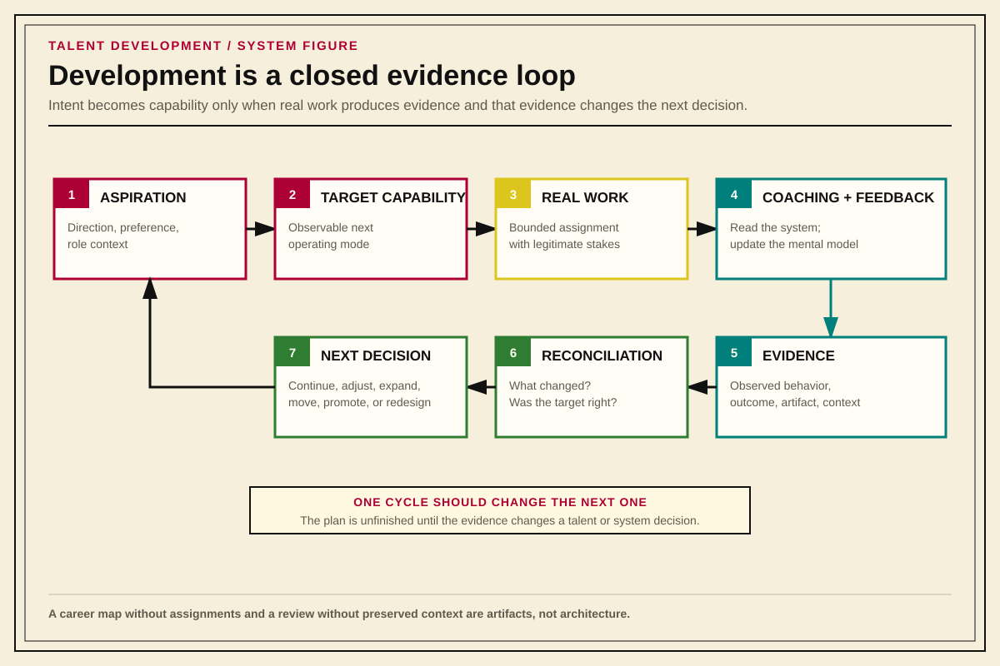{#fig-tda-development-loop}

---

The architecture identifies the loop and its records. Managers still need a recurring practice for producing evidence without turning feedback into character judgment or annual memory reconstruction.

<!-- Preview assembly source: Talent-Development-Architecture.md: Purpose, Core Model, boundaries, and implementation packet -->


\newpage

# Management Is Evidence Infrastructure

*Part V — Developing and Acquiring Capability*

A career ladder does not make people decisions fair. The judgment depends on the quality of the evidence, the language used to describe it, the incentives of the person reading it, and whether the organization created the work that could have produced the expected evidence in the first place.

> **Preview note — future edition**
>
> A future version will expand one-on-ones from a minimum operating requirement into the recurring management venue: cadence, preparation, agenda shape, confidentiality, constraint discovery, career alignment, coaching follow-up, evidence capture, and the boundary with formal performance management.

## Purpose

The Career Progression Guide is a measuring instrument. Like any instrument, it produces accurate readings only when used correctly, and most of the ways it is used incorrectly are not failures of the ladder — they are failures of feedback, of evidence, and of organizational design. This chapter addresses those three.

It is written for managers, calibration groups, and the engineers being calibrated. It assumes the reader has the seven dimensions of level — scope, complexity, autonomy, impact, influence, leverage, durability — already in hand.

Three principles organize it:

1. **Describe behavior, not character.** Feedback that names what a person *is* cannot be verified, disputed, or improved. Feedback that names what a person *did*, and what it caused, can be all three.
2. **Collect evidence continuously; never reconstruct it.** A rating assembled from memory at year-end is a lossy summary of the wrong data. The fix is an append-only record kept as the work happens.
3. **Separate the concerns one manager is asked to hold at once.** Advocacy, throughput, and outcome-ownership conflict inside a single role, and that conflict is the root cause of most miscalibration.

---

## Part 1 — Describe Behavior, Not Character

### The principle

Feedback must stay on **observable behavior and its impact against the expectation.** It must not cross into conclusions about the *drivers* of that behavior — personality, motive, disposition, or character.

> "Merged changes with failing tests three times in the quarter without flagging them" is a behavior. "Careless" is a verdict on the person.
>
> "Restated his objection three times after the group had moved on" is a behavior. "Can't compromise" is a verdict on the person.
>
> "Raised his voice and the conversation escalated" is a behavior. "Can't control his emotions" is a verdict on the person.

The left-hand versions describe the same situations as the right-hand versions. The difference is not severity or politeness. The difference is that the left can be confirmed, contested, and changed, and the right cannot.

### Why the line matters

Three reasons, in order of weight:

1. **Character claims are unfalsifiable, and therefore uncoachable.** "Not detail-oriented" describes no event. The person cannot point to a counter-example that disproves it, cannot dispute it without sounding defensive, and — critically — cannot *do anything tomorrow* to change it, because no specific behavior was named. A trait is a sentence, not a development plan.

2. **Character claims are where bias enters.** Inferred dispositions — "abrasive," "lacks confidence," "too aggressive," "not leadership material" — correlate far more strongly with the rater's demographic and affinity reactions than behavioral descriptions do. The same behavior is read as "assertive" in one person and "abrasive" in another. Holding feedback to observable behavior is not only an accuracy control; it is a fairness control. It removes the surface that bias attaches to.

3. **A surprising amount of "character" is actually unrecognized rigor or context.** A person who states conclusions confidently and lists the exceptions they already ruled out can look identical, from the outside, to someone who is closed-minded — when in fact they have done more of the work, not less. (See *The rigor/arrogance confusion*, below.) If you rate the surface impression, you will sometimes punish your most thorough people for being thorough.

### The translation drill

The skill is converting a trait claim into a behavioral one before it is ever written or spoken. The pattern:

| Trait claim (do not use) | Behavioral translation (use) |
|---|---|
| "He's not collaborative." | "In the X review, he re-argued his position after the group had decided, which extended the meeting and left two peers feeling unheard." |
| "She's not strategic." | "Her last three proposals optimized her own service without addressing the cross-team dependency that was the stated goal." |
| "He thinks he's always right." | "When challenged, he restates his original argument rather than engaging the specific objection raised." |
| "She lacks executive presence." | "In leadership reviews she presents implementation detail before the decision and recommendation, so the room loses the thread." |

Notice what the translation forces: a specific instance, the observable action, and the impact. If you cannot fill those in, you do not have feedback — you have an impression, and an impression is not calibration-grade evidence.

A useful test: **if the subject genuinely changed the named behavior, would the feedback be satisfied?** If yes, it is behavioral. If the feedback would still feel true after the behavior changed, it is a character claim, and it does not belong in a review.

### Delivering it verbally without it landing as an attack

The behavioral standard is hardest to hold in live conversation, where the trait version is faster and more vivid. Three moves:

- **Lead with the behavior and its impact, not the label.** "When the conversation escalated, the room stopped problem-solving" — not "you got defensive again."
- **Attribute impact, not intent.** You can observe that a peer felt unheard. You cannot observe that the person *meant* to dismiss them. Claiming the intent is mind-reading, and it invites a fight about motive that no one can win.
- **Separate the observation from the ask.** First the behavior and its effect; then the specific, different behavior you want next time. "Next time, when you've made your case once and the room leans another way, ask what they're weighing before restating" is coachable. "Be more collaborative" is not.

### The rigor/arrogance confusion

Calibrators should know one specific failure mode well, because it punishes good engineers. A person who reasons by trying to *falsify* their own conclusions — asking "under what condition is this wrong?" repeatedly until they can't break it — produces an output that looks, from the outside, almost identical to arrogance: confident, exception-laden, "I already considered that and ruled it out." The signature of exhaustive rigor and the signature of a closed mind are nearly the same shape when you only see the output.

The tell that distinguishes them is not in the delivery; it is in the response to a *new* objection. The rigorous person engages a genuinely new condition with interest, because finding a flaw is the goal. The closed mind restates. Before you write "thinks he's always right," check which one you actually observed. And if the person's confidence is the problem, the coaching is not "be less rigorous" — it is **externalize the search**: show the conditions you tried and failed to break it with, not just the verdict, so the humility in the method becomes visible and the confidence is not all that lands.

---

## Part 2 — The Evidence Ledger

### The problem it solves

Most ratings are produced the same way: at review time, the manager reconstructs a year of work from memory and compresses it into a level and a score. This is **lossy, recency-biased summarization.** The most recent two months are overweighted, the quietly durable work of the spring is forgotten, and the events that survive into the summary are the ones that were emotionally vivid — usually conflicts — rather than the ones that were consequential.

The ladder already names the consequence: *"the absence of stakeholder evidence in a packet is more often a failure of evidence collection than a failure of the engineer."* A person's apparent level can swing one or two full grades depending only on whether someone bothered to collect the evidence. That is not a property of the person. It is a property of the process, and it is fixable.

### The instrument

Do not summarize as the work happens. **Append.** Keep a running, append-only record — one entry per consequential event — and run the analysis at review time against the full record, not against memory.

Each entry is small and is written when the event occurs, not retrospectively:

- **Date**
- **Dimension(s)** touched — scope, complexity, autonomy, impact, influence, leverage, durability
- **What happened** — one or two behavioral sentences
- **Artifact** — link to the PR, ADR, dashboard, doc, incident record, or message thread
- **Before/after** — the metric that changed, where one exists (toil hours, failure rate, cost, lead time, blast radius)

Organized by the seven dimensions, the ledger becomes a standing answer to the calibration table in the ladder. At review time you are not remembering; you are reading.

### Why it serves both sides

- **For the engineer:** it removes dependence on whether anyone happened to be watching. The engineer who cannot advocate for themselves in a room — which is most engineers, and is itself unrelated to their level — is no longer penalized for it. The work is on the record as it happens.
- **For the manager:** it converts the year-end scramble into a read. The packet assembles itself. The manager stops reconstructing twelve months from the last three weeks.
- **For calibration:** it supplies exactly the artifact-linked, before/after, dimension-tagged evidence the ladder asks for, and it makes "I don't have evidence for that dimension" a visible gap to fill rather than a silent default to a lower level.

### Cadence

The ledger is maintained continuously — ideally the entry is made the day the event happens, when the detail and the metric are still at hand. A brief monthly pass keeps it honest. The one thing it must never become is a document created the week before a review; at that point it is just the old lossy summary wearing a new format.

---

## Part 3 — Separating the Concerns

### The structural conflict

A single line manager is typically asked to hold three jobs at once:

1. **Advocate** for the person's growth and advancement.
2. **Optimize** team process and throughput.
3. **Own** the outcomes of the work.

These three loyalties conflict, and the conflict is not occasional — it is structural. The manager who must hit a delivery date has an incentive to keep a strong engineer in their current, productive scope rather than stretch them into the next-level work that would prove a promotion. That same manager then judges whether the engineer demonstrated next-level scope. **The person who rations the opportunity is the person who scores its absence.** This is a conflict of interest in the precise sense, and it is the root cause of the "scope-starvation" miscalibration the ladder warns about: next-level scope withheld, then its absence cited as evidence the person is not ready.

It is also why evidence collection (Part 2) is chronically starved. Continuous evidence collection serves the *advocacy* concern, but it competes for the manager's time with the *throughput* concern — and throughput has a deadline while advocacy does not. The urgent crowds out the important, every cycle.

### The principle: one role should not own conflicting concerns

This is single-responsibility applied to management. When one role bundles concerns that pull in different directions, the role optimizes whichever concern has the nearest deadline, and the others decay. The fix is to give the conflicting concerns to different owners.

**Scrum is an existence proof that this decomposition is possible.** Scrum splits *what to work on* (the Product Owner, who owns prioritization) from *how the team works* (the Scrum Master, who owns process and facilitation), and it deliberately removes the manager from both. What Scrum conspicuously leaves out of scope is the third concern — *people and career development* — which is precisely why that concern, orphaned by the framework and bundled back onto an already-conflicted line manager, tends to be the one done worst. The lesson is not "adopt Scrum." The lesson is that the concerns *are* separable, and the people/career concern is the one most starved of a dedicated owner.

### The data analogy: stop summarizing, start sourcing

The reason the year-end rating is unreliable is the same reason an in-memory cache drifts from the truth: it is a **lossy summary recomputed from a decayed source.** The manager compresses a year of events into a single rating from whatever is freshest in working memory, and the compression throws away most of the signal.

The robust pattern is **event sourcing.** Do not store the summary; store the immutable stream of events as they occur, and compute the answer at read time from the full stream. The evidence ledger in Part 2 *is* that event log. Part 3 is what makes it usable: separating the concerns gives someone the time and the neutrality to read the log without judging their own scope-rationing decisions in the process. **The ledger is the log; role-separation is the unconflicted reader.** They are one system, not two ideas.

### What separation can look like

Full reorganization is rarely available, but the concerns can be separated in lighter ways:

- **Calibration by a body, not an advocate.** The promotion decision is read off written evidence by a group, per the *Read, do not pitch* rule — explicitly so the outcome does not depend on one conflicted manager's live advocacy.
- **A development owner distinct from the delivery owner.** A mentor, skip-level, or guild lead can own the growth/evidence concern even when the line manager owns delivery, so that advocacy has a dedicated owner who is not trading it against a deadline.
- **The ledger as shared infrastructure.** Because the evidence is on a standing record rather than in one manager's memory, any of these owners can read the same source, and a manager change does not erase the engineer's history.

---

## How the evidence practice relates to the ladder

The Career Progression Guide tells you *what* the levels are. The evidence practice protects the integrity of the *act of judging* against them:

- **Part 1** keeps the evidence clean — behavior, not character — so the judgment is fair and the development is possible.
- **Part 2** keeps the evidence complete — continuous, not reconstructed — so the judgment is accurate.
- **Part 3** keeps the evidence read by someone able to read it honestly — separated concerns — so the judgment is unconflicted.

Clean, complete, and honestly read. A rating that fails any one of the three is not a calibration; it is an impression with a number attached.

## Principle 4: Coaching Updates the Mental Model

Coaching is development. Sometimes development means expanding a strength. Sometimes it means correcting a mistake. Sometimes it means reducing scope temporarily so the person can reset, practice, or stop costing the team yards. A reprimand may accompany a coaching conversation when policy or severity requires it, but coaching and reprimand are separate mechanisms.

Coaching is a diagnostic conversation that starts from a concrete behavior or performance gap and surfaces the map the person was using when they made the decision. That map includes the signals they noticed, the signals they missed, the constraints they believed mattered, the outcome they thought they were optimizing for, and the action they believed those conditions called for.

Human learning is contextual. New information rarely updates every related belief at once. It updates the part of the mental model that is active in the moment, and later the correction has to be recalled when a similar-but-not-identical situation appears. Coaching works by attaching the correction to cues the person will actually see again: "when this signal appears, it usually means this condition exists, so these options become stronger and those options become weaker."

### Coaching vs Conversation
Conversations shift to coaching when this question is asked:

**What do you think would have made that situation a success?**

A conversation without that question, or its equivalent, is not really coaching. It may be feedback. It may be correction. It may be documentation. But coaching requires understanding the world as the person being coached saw it.

The manager is looking for defects in the person's mental model:

- Did they miss a signal?
- Did they read the signal incorrectly?
- Did they optimize for the wrong outcome?
- Did they misunderstand the priority?
- Did they lack context?
- Did the organization give them contradictory instructions?
- Did the system make the desired behavior harder than leadership realizes?

A sports analogy is useful here: a football coach does not say "you misread the defense; reading defenses is a requirement for this job, and you have to get better at that." A good coach explains what a defender's movement or action reveals about the defensive concept, how that informs where the exploitable space opens, which offensive player is expected to move through it, and the role the individual being coached is supposed to play in exploiting these weaknesses.

The lesson is not that every player should try to score on every play. The lesson is that every player should understand the position that gives the team the best chance to score. That difference separates excellent teams from mediocre ones: the team has a coherent operating concept, and each person understands the role they need to play for the system to work.

The business equivalent is teaching the person how to read systems: what signals reveal a resource constraint, dependency pressure, capacity issue, priority inversion, customer impact, or failure mode.

### A Coaching Conversation Shape

The exact language can vary by person, manager, culture, and severity. The conversation should have phases rather than a rigid script:

**Open with purpose and perspective.** Mentally begin from the reason the person was hired or trusted with the work. Assume there is a valid strength to preserve. Be plain about the concern, but establish immediately that their interpretation is integral to the outcome: "I want to talk about X because it caused Y. Before I go further, what is your read on what happened?"

**Listen and orient.** Coaching requires more listening than talking. Let the person describe the situation in their own terms, then ask questions that reveal how they were interpreting the system. You are trying to create the conditions for them to troubleshoot their own decision process the way they would troubleshoot code, analyze a business proposal, or inspect a financial sheet.

**Follow connected context; table unrelated context.** If they raise a different issue, listen long enough to determine whether it is connected. It may be the hidden dependency that explains the visible failure. If it seems unconnected, ask them to explain the material connection. If they cannot, table it respectfully and commit to returning to the other topic at a later time. The goal is not to dismiss the issue; the goal is to keep this coaching loop coherent.

**Name the gap clearly.** Once their perspective is on the table, state the concern as specifically as possible: what happened, what outcome it caused, and why the outcome matters. Stay with behavior, evidence, and impact. Do not turn the moment into a personality assessment.

**Update the mental model.** Ask what they think would have made the situation successful. Identify the missing signal, incorrect read, stale assumption, or conflicting instruction. Then attach the correction to future cues: "when you see this pattern again, consider whether it is evidence of the relevant condition, and adjust this way."

**Close with mutual commitments.** The close must say what the employee will change and what the manager or organization will do. If the conversation reveals a broken process, management owes a real response: fix the system, design a durable workaround, or explain why nothing can currently be changed. The point is not only to improve the person; it is to create a feedback loop that uncovers inefficiencies and risks throughout the organization.

If formal documentation is required, it should come after the coaching loop has produced a shared path forward. A clean version sounds like: "I think we are positioned to move forward from this. I do need to document what happened and what we agreed to, so there is a written record if the issue repeats. If we are not talking about this again in the next review period, it will not be treated as an ongoing concern." Documentation is a record-control mechanism, not the coaching mechanism itself.

Never lie, stretch, or massage facts in a coaching conversation. If notes are being taken, say why. If notes may be used in an incident document, performance record, or other formal artifact, say so.

Facts and stories are both useful, but they are not the same kind of material. The fact may be that a handoff was missed, an incident update was late, or a stakeholder left the meeting with the wrong expectation. The story is the explanation attached to that fact: carelessness, overload, unclear ownership, weak judgment, hidden dependency, or conflicting instruction. Coaching becomes more accurate when the manager labels which parts were observed, which parts were inferred, and which parts still need testing.

### Manager Readiness Questions

Before a manager assigns meaningful stretch, the manager has a preparation duty. These questions are not optional reflection prompts. If the manager has not asked them, the manager has not done the job.

- Did I do enough to prepare this person for the challenge I am putting in front of them?
- Am I sure they are ready?
- What are the consequences if I am wrong about their readiness?
- If this fails, what part of the failure belongs to me, what part belongs to the employee, and what part belongs to the system around them?
- What would reasonable struggle look like?
- What would unacceptable risk look like?
- If things begin to fail, what intervention options do I have?

> For consequential work, the manager should begin from the assumption that a preventable employee failure is a management failure unless proven otherwise. The manager should not treat failure as evidence that the employee was unfit until the manager can show that the assignment was bounded, the expectations were clear, the person was prepared, the support model existed, the risks were understood, and intervention options were available.

This matters because employee accountability is not abstract. Performance consequences affect income, reputation, family stability, health, confidence, and future opportunity. Sometimes an employee truly owns the failure, and sometimes termination or role removal is the right outcome. But a manager should be able to sleep at night knowing they did not put an unprepared person into a situation where failure was predictable, then let the person absorb the consequences alone.

A boxing analogy is useful here only if it is kept in the right frame. The lesson is not toughness or punishment. The lesson is preparation, mechanics, trust, readiness, and intervention. A trainer does not send someone into sparring because struggle sounds developmental. A trainer asks whether the person has practiced enough mechanics to face that level of intensity without unacceptable harm.

Managers owe the same kind of thinking in business terms. Stretch work should be challenging enough to build capability, but bounded enough that failure becomes evidence and learning rather than avoidable damage.

---

## One-on-Ones

One-on-ones are the primary venue for proactive Talent Utilization Review.

They are where career alignment, preference signals, constraints, coaching needs, hidden work, stretch proposals, and support gaps should surface before they become review-cycle surprises.

The current source material establishes the minimum operating requirement:

- one-on-ones are not status meetings
- one meaningful one-on-one per month is the floor
- higher frequency may be appropriate during forced stretch, role changes, performance regression, ambiguous work, or major scope changes
- the conversation should maintain an active picture of utilization, career direction, support, and evidence

If a manager cannot describe what an employee wants to grow toward, what work drains them, what work energizes them, and what constraints are currently shaping their output, the manager does not have enough signal to manage the person's development well.

One-on-ones are also where self assessment and manager calibration should meet. Self-reflection matters, but it is incomplete by itself. Manager judgment matters, but it becomes dangerous when it arrives as a unilateral verdict. The useful signal is often the difference between the two reads.

The employee's self assessment reveals their mental model. The manager's assessment reveals the organization's expectation. The one-on-one should inspect the gap without turning it into a personality trial. A competency gap is not the coaching conversation. It is the opening evidence for one.

People records should also label evidence. An observed behavior, self report, manager interpretation, secondhand claim, outcome measure, and assumption are not the same kind of fact. Narrative context is necessary in people decisions, but the organization should know which parts of the story were observed, which parts were inferred, and which parts still need testing.

---

## Two Levels of Evidence

The Performance Evidence Ledger preserves individual context. It records what a person was asked to do, what conditions shaped the work, what was observed, what changed, and what decision followed.

A **Behavioral Scoreboard** works one level above the ledger. It aggregates a deliberately limited set of patterns so the organization can tell whether development behavior is real or merely documented. It should help answer:

- Who receives stretch opportunities, and who repeatedly does not?
- Which managers consistently develop people, and which managers have developed no one?
- Are developmental reps distributed equitably?
- Do coaching, reconciliation, and assignment changes occur, or do the artifacts merely exist?
- Which capability gaps recur across teams?
- Where does the evidence point to a role, structure, or management problem rather than an employee problem?

The scoreboard is not a fifth employee-facing form, and it should not reduce individual development to a composite score. The ledger preserves the case. The scoreboard reveals the pattern. Accountable leaders still have to interpret the pattern and decide what to do.

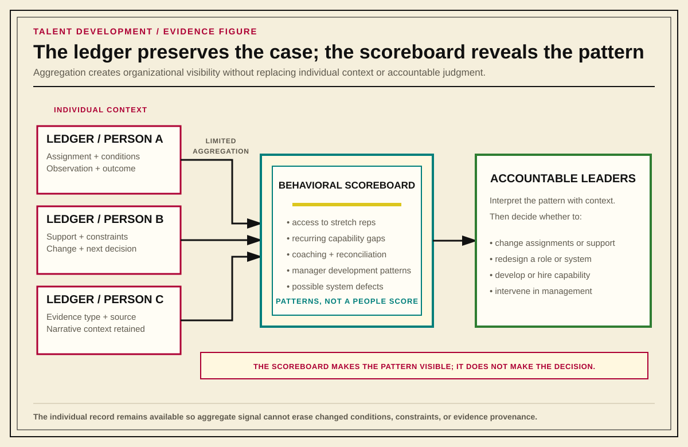{#fig-tda-evidence-levels}

---

Evidence can diagnose capability honestly only when the organization also examines opportunity. A person cannot demonstrate an operating mode the system never permits them to practice.

<!-- Preview assembly source: Coaching-and-Calibration-Guide.md: Purpose through ladder relationship; Talent-Development-Architecture.md: coaching, One-on-Ones, and Two Levels of Evidence -->


\newpage

# Create Safe Reps and Allocate Opportunity

*Part V — Developing and Acquiring Capability*

Development becomes real when the organization changes work allocation. Preference, stretch, and career direction only produce capability when they lead to legitimate practice under boundaries that protect both the person and the system.

## Principle 1: Preference Is Evidence, Not a Perk

Employee preference is operational signal.

What work energizes this person? What work drains them? What do they seek out without being asked? What do they avoid even when they are competent at it? What kind of problem causes their curiosity to turn on?

Those answers matter because preference predicts:

- quality of output
- durability of motivation
- learning rate
- burnout risk
- cost of forced stretch
- likely long-term fit
- where the organization can get disproportionate return from the person

Preference is not veto power. Sometimes the work is the work. A person on a team that owns both on-prem systems and cloud may need to support Terraform competently even if they hate writing it. Baseline competence matters, and nobody gets a role made entirely out of favorite tasks.

But sustained misalignment is waste. If the same person is happiest and strongest writing Ansible, Python, Bash, or working on-prem, a wise manager should bias their long-term assignment mix toward that fit when the business allows it. The goal is not indulgence. The goal is better output from the talent the organization already has. Some necessary work will still be unpleasant; preference is signal, not exemption.

Employees should be encouraged to discuss these preferences openly with their managers. Managers should treat the information as planning input, not as complaining.

Managers should also use disliked work as a learning opportunity when the exposure is genuinely necessary. If an engineer strongly prefers one tool or operating model over another, the coaching question is not only "can you do the required work?" It is also "can you explain why reasonable people prefer the alternative?" The point is not to force false enthusiasm. The point is to build the ability to operate from another perspective when the business context requires it.

A person who dislikes Terraform may still need to understand what Terraform users value: provider breadth, declarative workflow, common hiring market, ecosystem support, and familiar patterns across cloud teams. That same person may still prefer Ansible, Pulumi, Python, or another model after doing the work. That is fine. The development value is in learning to understand the opposing case well enough to apply the right tool in the narrow context where it is strongest, not in pretending every preference is equally aligned with every situation.

### Small Wins and Enjoyment Are Signal

Trying to have fun with the work is not childish, unserious, or separate from performance. Enjoyment is one way people stay connected to the work long enough to improve at it.

Managers should notice whether people still celebrate each other's wins. A resolved incident, a removed source of toil, a clean handoff, a useful runbook, a fast recovery, a better test, or a small automation improvement may not look like a major business milestone. But small wins compound into large outcomes, and celebration reinforces the behaviors that create them.

Lack of celebration is also signal. It may mean the team is exhausted, afraid to show enthusiasm, disconnected from the outcome, too siloed to notice each other's contributions, or operating in a culture where visible enjoyment is treated as unprofessional. That is a management problem. The goal is not performative cheerleading. The goal is a team that recognizes progress, learns from it, and wants to keep playing well together.


---

## Principle 2: Forced Stretch Has an Elastic Limit

Stretch work is necessary. Forced stretch work is sometimes necessary. But stretch is not free.

There is an elastic limit: the boundary between healthy forced stretch and damaging misalignment. Inside that boundary, the person can recover, learn, and become more capable. Beyond it, the organization creates brittleness, burnout, reduced elasticity, or failure.

The important distinction is not "liked work" versus "disliked work." The distinction is short-term exposure for baseline competence versus sustained assignment against durable strengths and preferences.

A useful test:

**Is this assignment helping the person become more capable, or is it consuming their capability faster than it builds it?**

If the answer is not clear, the manager needs more context before calling the assignment development.

---

## Principle 3: Diagnose Utilization Before Judging Performance

When performance regresses, do not start with the assumption that the person changed. Start like a systems engineer investigating degradation.

Did this used to work? What changed? Did load increase? Did priority conflict increase? Did a hidden workstream appear? Did another leader create side-channel work? Did the person lose support? Did the system around the person change while the visible assignment stayed nominally the same?

That diagnostic step is the **Talent Utilization Review**.

Use it proactively before major assignments and reactively when output drops below expectation.

The loop:

1. Map current assignments.
2. Expose hidden work.
3. Compare stated priorities.
4. Inspect constraints and dependencies.
5. Gather the person's context.
6. Reassess the visible performance signal.
7. Decide what changes: the person, the work, the priorities, the support, or the system around them.

In team-sport terms, the organization should ask whether it is putting the player in a position to succeed. Too many disparate assignments of equal priority will invariably lead to delayed outputs, reduced quality, or both. 

The sports-franchise mentality is to create conditions where talent can produce, not to conclude that the talent failed while the organization was asking it to win from an impossible position.

---

## Principle 5: Every Career Transition Gate Needs a Safe-Reps Path

The hardest jumps in a technical career are often not knowledge jumps. They are operating-mode jumps.

Common gates:

| From | To |
|---|---|
| Seeing a problem | Reporting it clearly |
| Reporting a problem | Helping fix it |
| Fixing a problem | Preventing its recurrence |
| Preventing one recurrence | Building reusable automation or standard work |
| Owning a task | Owning an outcome |
| Owning one outcome | Creating leverage for others |

If the organization requires experience before granting opportunity, it must also provide bounded ways to gain that experience. Otherwise early and mid-career development depends on luck, off-book initiative, or unusually generous coworkers.

A **Safe-Reps Path** is a bounded way to practice the next operating mode without unacceptable risk.

Competency language is useful only when it becomes this kind of gate. A rubric that says someone needs "strategic thinking," "ownership," or "cross-functional influence" does not help much by itself. The useful version names observable stages: awareness, routine execution, independent execution, broader coordination, and system-level ownership. Then the organization can ask which stage the person has demonstrated, which stage the next role requires, and what bounded work would let them practice the difference.

Examples:

- A helpdesk employee spends four hours a week migrating low-risk scripts from Python 2 to Python 3.
- A junior operator shadows incident remediation, then owns a read-only diagnostic step, then owns a reversible fix under supervision.
- A systems administrator refactors repetitive conditional logic into a data structure with tests and review.
- A cloud-curious on-prem engineer contributes to a Terraform 0.x to 1.x migration in a constrained module.
- A strong implementer writes the runbook, then the checklist, then the automation for a recurring issue.

The point is not the specific technology. The point is legitimate reps across the gate.

Development plans should make those reps visible. A useful plan does not treat training completion as proof of readiness. Training is input. Readiness comes from observed behavior under realistic conditions.

| Development Need | Real Work Rep | Feedback Source | Formal Support | Evidence |
|---|---|---|---|---|
| What the person is trying to build | The bounded assignment where the skill will be practiced | Manager, mentor, peer, work owner, or community | Course, reading, lab, certification, or reference material | What will show that the person has actually improved |

{#fig-tda-safe-reps-path}

---

## Stretch Proposals

A **Stretch Proposal** is an employee-initiated request for a bounded development opportunity that moves them toward a desired skill, responsibility, or domain.

It should be normal career-development language, not an exception or a favor.

A good Stretch Proposal answers:

- What do I want to learn or practice?
- What real problem would this help solve?
- Who owns the work?
- How much time am I asking for?
- What is the expected value?
- What is explicitly out of scope?
- What can I do read-only?
- What actions require approval before I make changes?
- What is the risk if I make the situation worse?
- What evidence will show whether this was useful?

For cross-team proposals, manager-to-manager coordination is required. The employee's manager, the receiving team's manager, and the work owner should agree on time box, priority impact, supervision, risk boundaries, and success criteria.

This matters because self-directed stretch work is often how people become capable of the next thing. But unmanaged stretch work can become hidden risk. The formal version should preserve initiative while making the work visible, bounded, and legitimate.

---

## The Internal Farm System

The sports-franchise analogy is strongest here. Strong franchises do not merely acquire talent. They scout, draft or sign, assign level-appropriate reps, coach specific skills, observe performance, move people through levels of competition, and build succession pipeline before a role becomes urgent. In MLB, this is called a team's "farm system." Players develop through Minor League A, AA, and AAA, and the most capable eventually get called up to the major-league roster. The corporate equivalent is the rare Fellow-level individual contributor role.

**Businesses need the same pattern.**

An *Internal Farm System* is the practice of coordinating small, useful stretch assignments across teams so people can develop toward real organizational needs.

It creates three kinds of value at once:

1. The employee gets meaningful reps in a desired skill or domain.
2. The receiving team gets real work done.
3. The organization builds succession pipeline before it is forced to need it.

This should not depend on a heroic employee finding after-hours work and hoping someone says yes. Employees should be encouraged to talk to people on other teams, compare patterns, and notice where one team's approach might apply to another team's problem. But when the work becomes real, it should move onto the books.

Four hours a week can matter. It can be enough to give someone a path from support into systems work, from systems work into automation, from implementation into design, or from team-local work into cross-team influence.

The farm system also needs a portable internal talent packet. That packet should not be a self-marketing deck or a popularity contest. It should help managers and receiving teams discuss readiness, fit, supervision, and risk from shared evidence:

- current role and scope
- demonstrated accomplishments
- current operating level
- desired next operating mode
- strengths to preserve
- gaps to close
- experiences needed
- systems or domains to learn
- proposed assignments
- manager or panel assessment

---

## Career Pathing Needs Architecture

"Own your career" is useful advice only when the organization exposes enough map for the employee to navigate. Without guidance on actual departments, roles, skill sets, decision rights, and available development paths, career ownership becomes guesswork.

A real career map explains more than promotion. People need several kinds of movement:

- **Move upward:** increased scope, responsibility, complexity, or decision rights.
- **Move sideways:** broader experience at a similar level.
- **Build in place:** new responsibility inside the current role.
- **Discover:** short-term exposure used to test interest, fit, and usefulness.

A generic career tool does not solve that. If a "career compass" produces abstract advice, points toward roles that do not exist, or suggests paths the organization has not actually made available, it is not a development system. It is career-pathing theater: the organization appears to offer mobility while leaving employees to invent the path themselves.

That creates several risks:

- employees leave to get the experience the organization could have helped them build
- employees form shadow development networks to discover work the official system does not surface
- stretch work happens through side channels instead of visible coordination
- people try unsafe tooling shortcuts to create opportunities for themselves
- managers lose sight of where capability and interest already exist inside the company

The Internal Farm System is the formal answer. Employees should absolutely talk to people on other teams, compare patterns, and notice where their interests might create value. But the organization has to turn that curiosity into visible, bounded, legitimate work. A competent development system does not merely tell people to pave their own career. It shows them the roads that exist, the roads the company needs built, and the safe-reps paths for helping build them.

---

## Career-Stage Development

TDA should reuse the Career Progression Guide's existing tiers rather than inventing a second leveling model.

### Earlier and Mid-Career

The development focus is safe reps across transition gates.

The organization should ask:

- What next operating mode is this person trying to learn?
- What bounded work would let them practice it?
- What support or supervision keeps the risk acceptable?
- What evidence would show readiness for more responsibility?

This is where development culture matters most. Coaching, practice, feedback, and bounded stretch should be normal expectations of the company, not special events. Continuing the sports analogy, people in this stage of their career are the team's most recent draft class. Successful sports teams have staff dedicated to developing draft picks. Many companies will not staff this as a dedicated role, so it must be an explicit portion of any people manager's time.

### Senior

The development focus is scope fit, durable ownership, and leverage.

The organization should ask:

- Is this person assigned work that matches their durable strengths?
- Are they owning outcomes rather than only tasks?
- Are they building systems, standards, runbooks, automation, or practices that outlast their direct effort?
- Are they being given scope that can demonstrate the next level if the organization needs that level?

Senior development is not just harder tickets. It is better placement against outcomes.

### Staff+

The development focus is cross-team capability, succession, strategic placement, and organizational leverage.

The organization should ask:

- What capability is missing across teams?
- Who can create it?
- Who can be developed behind them?
- What work creates leverage through other engineers?
- Is the missing capability developable internally, or does the organization need free-agent hiring?

External hiring becomes more like sports free-agency as you move higher up the ladder, especially when the company lacks principal or Staff+ capability in-house. That is not a failure by itself. It is a different tool. The failure is pretending external hiring is a substitute for a development culture at every level.

---

## Leadership Discovery and Development

Leadership is a distinct craft. Technical excellence, ambition, seniority, visibility, reliability, and willingness to accept a promotion do not prove that someone wants to develop people.

The first leadership-development question is therefore not "could this person manage?" It is "does this person actually want to be accountable for other people's growth and success?"

Leadership discovery should use the same architecture as any other career transition:

> interest → exposure → education → bounded leadership practice → feedback → evidence → informed decision

Useful discovery reps may include mentoring, facilitation, project leadership, temporary leadership assignments, participation in planning or calibration, and carefully bounded exposure to coaching, hiring, and people-development work.

The process must allow someone to conclude, "I enjoy technical leadership, systems leadership, or project leadership, but I do not want people management." That is successful discovery, not failure. A permanent, respected IC path is what makes the answer honest. Without that path, leadership discovery becomes a forced march toward the only promotion the organization appears to value.

### Development Is Recursive

Managers should be developed by their own managers and leadership chain through the same underlying model they are expected to provide for everyone else. The work is self-similar:

- **70 percent real work:** coaching people, allocating developmental reps, handling calibration, facilitating decisions, and learning through actual management responsibility
- **20 percent learning from others:** mentoring, observation, peer discussion, and structured exploration with other leaders
- **10 percent formal support:** reading, courses, case studies, and other structured study

The ratios are still design guidance rather than accounting. The important point is that managers need real practice, useful feedback, and deliberate opportunities to update their own mental models. Promotion into management does not complete leadership development. It creates a new development obligation one layer up.

### Socratic Leadership Seminar

The **Socratic Leadership Seminar** is one mechanism for the leaders' 20 percent. A voluntary group of current or prospective leaders reads credible leadership and management research, then meets periodically to explore what the material reveals, where it contradicts experience, and which questions remain unresolved.

The seminar is not a class, a change initiative, or a disguised planning meeting. Facilitation rotates so participants practice selecting material, asking useful questions, making disagreement productive, and holding a room without forcing it toward the facilitator's preferred conclusion. The discussion produces no required action items. Its purpose is to create a recurring place where leadership thinking happens.

That makes the seminar a deliberately unmeasured input. Attendance and worksheets would prove compliance, not learning. Its downstream effects may eventually appear in better coaching, better allocation of developmental reps, stronger mental-model updates, and leaders voluntarily returning to ideas from earlier sessions. The seminar itself should not claim credit for those outcomes.

See the [Socratic Leadership Seminar implementation guide](docs/Socratic-Leadership-Seminar.html) for cohort design, source selection, facilitation, meeting structure, the use of ELMO, and the limited role of the whiteboard.

---

## Organizational Learning From Talent Evidence

Individual development evidence becomes organizationally useful when recurring patterns can be seen without stripping away the context that made the evidence honest.

The loop is:

> individual evidence → recurring pattern → organizational visibility → accountable leader decision

Patterns worth surfacing may include:

- the same capability gap appearing across many teams
- high performers repeatedly lacking appropriate scope
- promotion evidence existing without matching roles
- employees repeatedly seeking a career path the organization has not created
- some managers routinely developing internal talent while others rely on external hiring
- strong people repeatedly leaving the same management chain
- invisible work accumulating around a small number of people
- managers being unable to identify safe developmental assignments
- developmental reps being concentrated among already-visible or well-connected employees

TDA should make those patterns visible. It should not pretend to own every response. A repeated capability gap may require training, hiring, role redesign, or a strategic decision. Uneven access to stretch work may require management intervention. Promotion evidence without available scope may require workforce planning or organization design. The evidence should reach someone accountable for the decision instead of disappearing because the response belongs to another discipline.

Not every useful input can or should receive a direct metric. **Unmeasurable is not unfalsifiable.** Some practices, including the Socratic Leadership Seminar, are better evaluated through downstream behavior and revealed preference than through an activity score. The goal is not to measure everything. It is to know what is measured, what is deliberately unmeasured, and where evidence should eventually appear if the system is healthy.

---

Internal development is one answer to a capability gap. External hiring is another. The organization needs to know which capability it lacks, whether it can create that capability in time, and what evidence should survive whichever path it chooses.

<!-- Preview assembly source: Talent-Development-Architecture.md: preference, forced stretch, utilization, safe reps, opportunity systems, career stages, and organizational learning -->


\newpage

# Future Edition: Hiring Capability {.unnumbered}

*Part V — Developing and Acquiring Capability*

Hiring is external talent intake. It should begin with the capability the organization needs, preserve what selection evidence actually showed, and deliver likely support or development needs into onboarding rather than discarding them after the offer.

The current reader-facing corpus establishes that relationship but does not yet supply a hiring system. TDA distinguishes hiring from internal development and succession, and it requires the evidence gathered during selection to become manager context and safe-reps planning. That is enough to locate hiring in the book. It is not enough to tell a reader how to evaluate an application or run a valid AI-era interview.

> **Preview note — future edition**
>
> A future version will add the Hiring Guide. Its working argument begins with an advertised quality contract: candidates should know that the application is their first submitted work artifact, that AI-assisted review tools are permitted, and that they remain accountable for the truth and quality of the result.
>
> The interview material will evaluate the work the job now requires: decomposition, tool direction, verification, correction, security judgment, and explanation of why the result is trustworthy. It will also identify where foundational unaided knowledge still matters and prevent AI assistance from hiding incompetence.
>
> The final hiring loop will preserve the original capability need, application evidence, interview claims, work-sample evidence, assumptions, selection rationale, post-hire support needs, and a later reconciliation against actual performance and organizational support.

## Hiring and Free Agency {.unnumbered .unlisted}

TDA does not mean every capability must be grown internally, nor does it mean perfect employee retention.

At all levels, external hiring can be the right move. If the organization does not have principal-level technical leadership, or lacks a specific senior capability, hiring externally may be the fastest honest path. This is the business equivalent of free agency.

But the higher-level free-agency model should not erase the internal development expectation for earlier and mid-career employees. An organization that stops building people eventually becomes dependent on the external market for every meaningful capability gap.

> Fundamentally, all economies are human economies: the organization with the strongest capability for growing and developing good people will have the best long-term outcomes.

Hiring and internal development are two answers to the same capability question. Hiring is external capability acquisition. Development is internal capability creation. Both should preserve evidence about the decision: what capability was needed, what assumptions were made, what signals were observed, what gaps remained, and what support the person will need after the decision.

If an interview process discovers likely development needs, those needs should not disappear after the offer. They should become early manager context, onboarding support, and safe-reps planning. Otherwise the organization pays to acquire talent, throws away the evidence it gathered, and asks the new hire to rediscover the support model alone.

Hiring, development, and succession should answer different questions:

- **Hiring:** what capability do we need that we do not have, or cannot grow in time?
- **Development:** what capability can we create through coaching, reps, and placement?
- **Succession:** what future responsibility should someone be preparing to take before we urgently need them to take it?

---

Hiring acquires capability through a person. Vendor selection acquires capability through a commercial and technical relationship. The ethical, legal, and developmental obligations differ, but both decisions expose how easily an organization can confuse a persuasive claim with proof.

<!-- Preview assembly source: Talent-Development-Architecture.md: Hiring and Free Agency; future scope from 0.Organizational-Excellence-Book-Gaps.md -->


\newpage

# Selecting External Capability

*Part V — Developing and Acquiring Capability*

An RFP is external work intake. It is the same evidence-and-authorization system used for internal proposals after the request crosses a commercial trust boundary.

The need must still be authenticated. Claims must still be preserved. Distinct authorities must still review the consequences they own. Unknowns must still become bounded proof. Capacity, risk, and acceptance must still be explicit. The result must still be reconciled against the original claim. What changes is the posture toward the claimant.

## One intake system, two trust boundaries

Internal intake is cooperative even when it is contentious. The requester, sponsor, reviewers, and receiving teams remain accountable to the same enterprise. Their incentives may conflict locally, but each has a duty to help the organization reach a valid decision and expose facts that could change it.

External intake is adversarial. That does not mean every vendor is dishonest or that the buyer should behave with hostility. It means the counterparty is paid when the buyer says yes. For control-design purposes, assume that making the sale is the vendor's dominant objective and that fit, implementation burden, long-term support, and the buyer's exit problem are secondary until the agreement makes them material.

The vendor is therefore an interested claimant, not an authority on whether its own claim has been proved. A polished demonstration is testimony. A benchmark selected and run by the seller is seller-supplied evidence. A reassuring relationship with one sales representative is not a durable operating control: the people involved in the sale may not own implementation, support, renewal, or the consequences years later. The record and the contract must survive everyone in the room.

The lifecycle does not change:

| Decision function | Internal work intake | External intake / RFP |
|---|---|---|
| Establish the need | Authenticated Work Proposal and sponsor | Buyer-owned capability statement and accountable sponsor |
| Preserve the claim | Requester facts, assumptions, target condition | Vendor response, exceptions, assumptions, and claim register |
| Route authority | Architecture, Security, Finance, operations, portfolio, and delivery reviews | The same internal authorities plus Procurement and Legal |
| Resolve uncertainty | Bounded discovery or Conditional Approval | Buyer-controlled demonstration, benchmark, reference check, or proof of concept |
| Authorize commitment | Authorized Work Proposal plus accepted delivery capacity | Award decision, negotiated obligations, funding, and implementation authority |
| Prove completion | Delivery evidence against acceptance conditions | Layered acceptance, burn-in, remedies, and payment gates |
| Reconcile | Baseline and forecast against delivered outcome | Original need and vendor claims against production operation |

The adversarial boundary changes the burden of proof. Internally, missing evidence may be repaired through shared discovery because the participants are working for the same outcome. Externally, an unsupported claim remains the seller's burden, proof conditions belong to the buyer, and ambiguity that survives into the contract usually becomes the buyer's cost.

This is the book's main rule crossing a trust boundary. The RFP does not introduce a separate procurement philosophy. It makes the intake philosophy easier to see because sales incentives punish every missing control.

## Why RFPs Exist

Organizations do not need formal RFPs because buying things is inherently complicated. They need formal RFPs because important purchases create commitments the organization will have to live with after the sales cycle ends.

A technology purchase can commit the organization to:

- an architecture
- an operating model
- a support relationship
- a security posture
- a migration path
- a cost structure
- a staffing model
- a vendor roadmap
- a failure mode
- an exit problem

Those commitments often last longer than the people who approved the purchase. If the original reasoning is not preserved, later teams inherit a system without the answer key. They may know what was bought, but not why it was chosen, what alternatives were rejected, what risks were accepted, what claims were made, or what outcomes the organization expected.

The RFP exists to prevent that loss of context.

At its best, an RFP does five jobs:

1. It defines the operational capability the organization needs.
2. It forces requirements, constraints, and decision criteria into the open before vendor preference hardens.
3. It turns vendor claims into records that can be verified later.
4. It ties selection, implementation, acceptance, and payment to evidence.
5. It leaves behind a decision record the organization can reconcile against actual outcomes.

This is the same closed-loop pattern that applies to work items, architecture decisions, process improvement, coaching, and talent development. The organization records a judgment when it is made, preserves the evidence and assumptions around it, routes the artifact through the people who must rely on it, then reconciles the original claim against what actually happened.

An RFP is that loop applied to external capability acquisition.

---

## The Failure Mode: Buying Activity Instead of Capability

Weak procurement processes tend to optimize for purchase completion:

- quote received
- budget approved
- purchase order cut
- contract signed
- hardware delivered
- license provisioned
- vendor installed it
- dashboard green for one afternoon

That sequence can produce the appearance of success while leaving the organization with an unproven production system. The vendor may have delivered equipment, labor, or access, but the buyer has not yet proven that the capability works in the environment where it matters.

For a storage cluster, "done" does not mean that racks arrived, disks are visible, and the admin UI loads.

For an HPC cluster, "done" does not mean that users can log in, a sample job runs, and the vendor benchmark looks impressive.

For an identity platform, "done" does not mean that authentication succeeds in a lab tenant.

For a backup system, "done" does not mean that backup jobs completed once.

The operational question is different:

**Does the system deliver the agreed capability, under agreed conditions, with known failure behavior, known support paths, known operating procedures, and evidence strong enough to trust it in production?**

A stronger RFP process optimizes for production readiness. It defines what must be true before selection, implementation, payment, handoff, and final acceptance can proceed.

The vendor should be accountable for the operational outcome, not merely the shipment of expensive parts.

---

## RFP as Operational Risk Transfer

Every technology purchase leaves some risk with the buyer and transfers some risk to the vendor. A mature RFP process makes that allocation explicit.

Some risks should remain internal:

- the business need
- the priority of the capability
- internal stakeholder alignment
- internal operating model choices
- site readiness
- data classification
- internal staffing
- internal change management
- organizational willingness to retire old systems

Some risks may be transferred to the vendor:

- whether the proposed design can meet stated requirements
- whether the product can achieve agreed performance targets
- whether integration assumptions are valid
- whether installation and configuration follow agreed standards
- whether support paths work under defined severity conditions
- whether failures trigger remediation, replacement, credit, or rejection

An RFP is how the organization decides which risks sit where.

If the buyer only asks for a bill of materials, most risk stays with the buyer. The vendor can say, "We delivered what you asked for." If the system later fails to meet throughput, resilience, operability, or support expectations, the organization may discover that those expectations were never converted into obligations.

If the buyer defines operational outcomes, acceptance tests, implementation gates, burn-in criteria, remedies, and support obligations, the risk picture changes. The vendor still cannot own everything. No vendor can fix an organization that failed to define its workload, prepare its site, assign operators, or approve required network changes. But the vendor can be held accountable for the claims it made and the outcomes it agreed to deliver.

That is operational risk transfer:

**The organization converts uncertain future pain into testable, enforceable vendor obligations before the system becomes too embedded to reject.**

This is not anti-vendor. Good vendors benefit from clear requirements, explicit assumptions, known acceptance criteria, and realistic buyer obligations. Ambiguity helps weak sales motions more than strong delivery teams.

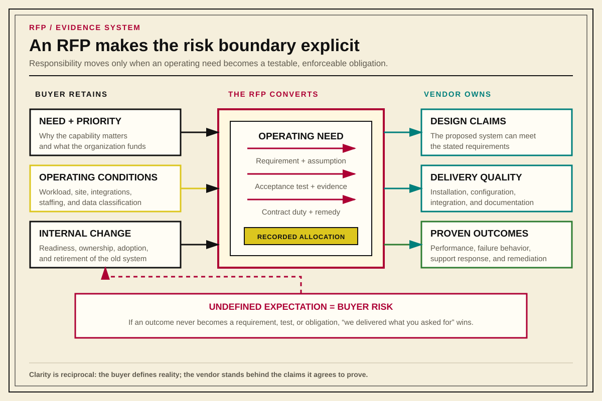{#fig-rfp-risk-allocation-boundary}

---

## Before the RFP

The RFP process starts before the RFP document exists.

The organization first needs to define the problem well enough that vendors are responding to the same need. Without that pre-work, the vendor market will define the problem for the buyer. Sometimes that reveals useful information. Sometimes it turns a real operational need into a contest between sales narratives.

Before issuing an RFP, capture:

- the problem statement
- current-state pain
- target capability
- stakeholders and accountable reviewers
- non-goals
- constraints
- dependencies
- operating model
- integration assumptions
- security and compliance requirements
- performance expectations
- support expectations
- migration expectations
- reversibility or exit strategy
- budget and timeline realities
- known risks
- decision gates
- evidence needed for acceptance

This pre-work records what the organization believed it needed before vendors had a chance to reshape the question.

Market research or an RFI can happen before the formal RFP. The purpose is not to let vendors write the requirements. The purpose is to learn what the market can actually provide, where similar deployments fail, what assumptions matter, what vendors will and will not guarantee, and what testing they consider meaningful.

A vendor refusing to guarantee something can be more useful than a vendor promising everything. The refusal tells the buyer where risk may remain internal, where the requirement may be unrealistic, or where the contract needs sharper language.

---

## RFP Document Anatomy

The RFP document should make the evaluation path visible. A vendor should be able to understand the environment, the target capability, the response format, the decision process, and the acceptance bar without reverse-engineering the buyer's intent from scattered conversations.

A strong infrastructure RFP usually has this shape:

1. Executive summary
2. Department or business-unit overview
3. Current environment
4. RFP response instructions
5. Vendor qualifications
6. Hardware requirements
7. Networking requirements
8. Capacity requirements
9. Data-center requirements
10. Software and client requirements
11. Data protection requirements
12. Benchmark requirements
13. Documentation requirements
14. Warranty and support requirements
15. Acceptance test
16. Attachments

The current-environment section should be specific enough for vendors to design against reality. For a storage platform, that may include the existing parallel storage environment, current filesystem architecture, storage nodes, disk shelves or JBODs, protocol or gateway nodes, management nodes, network fabric, application layer, observed performance, storage profile, and the procurement context for the replacement.

The conditions-of-participation section is where the buyer defines the rules of engagement. It should cover:

- general terms
- eligibility to participate
- formal contact information
- proposal submission
- electronic proposal requirements
- large-file, hard-copy, or physical-media submission rules
- ownership and confidentiality of proposals
- clarity expectations
- supporting material
- vendor briefing
- proposal response requirements
- proposal-validity period
- language and measurement
- vendor responsibility
- required documentation
- options and alternates
- evaluation methodology
- partial or noncompliance
- vendor contact information
- target schedule and delivery
- definitions
- requirements structure

The technical requirements should then be organized by the operating surfaces the buyer must live with after award. For a storage RFP, that means storage hardware, networking, capacity, data center, software and clients, data protection, benchmarks, documentation, support, and acceptance. For another domain, the headings will change, but the logic should not: describe the environment first, define how vendors must respond, then state the requirements in the same categories operators will later use to validate and run the system.

The definitions section matters more than it looks. Terms such as "available," "supported," "integrated," "real time," "high performance," "production ready," "turnkey," and "accepted" are not self-executing. If the RFP does not define language and measurement, the vendor response will define them implicitly.

The response format is also a control surface. Vendors should be told how to answer requirements, how to identify exceptions, how to attach assumptions, how to price options, how many alternates they may submit, and which claims require supporting evidence. Without that discipline, comparison becomes a writing contest between sales teams.

The formal contact should usually be detached from the project team. That does not mean technical people stop talking to vendors. It means official questions, answers, schedule changes, requirement clarifications, and addenda flow through a controlled channel so one vendor does not receive private guidance that others never see.

---

## Requirements Structure

RFP requirements should describe what must be true in production, not merely which equipment or product the buyer thinks might make it true.

Do not only say:

> Provide a storage cluster with N nodes and X capacity.

Say:

> Provide a storage capability that supports these workloads, these throughput and latency requirements, these failure modes, these recovery expectations, these protocol requirements, these operational integrations, and these acceptance tests.

Design requirements are still valid when they are real constraints. Rack density, power, cooling, network topology, supported protocols, operating-system compatibility, encryption, FIPS posture, backup integration, identity integration, and datacenter limits may all be legitimate requirements.

The distinction is not outcome requirements versus design requirements. The distinction is whether the requirement represents a real operating condition or merely a guessed solution.

Useful requirement categories include:

- functional requirements
- non-functional requirements
- operational requirements
- security requirements
- integration requirements
- reporting and audit requirements
- performance requirements
- resilience requirements
- support and lifecycle requirements
- migration requirements
- exit requirements
- documentation and training requirements
- acceptance requirements

One useful requirement notation is to distinguish facts, requirements, and goals:

- `will` statements describe current facts, buyer constraints, or environmental conditions
- `shall` statements define mandatory requirements that must be met and verified
- `should` statements define goals, preferences, or non-mandatory provisions that vendors must address but that may not be formally verified

This keeps the RFP from treating every sentence as the same kind of obligation. It also gives evaluators a way to reference requirements later. For example, a requirement can be referenced as `Requirement 7[3]`, meaning the third `shall` statement in section 7. An option can be referenced as `Option 7[2]`, meaning the second `should` statement in section 7.

Examples:

- The proposed platform `will[1]` be installed in the buyer's primary production data center.
- The buyer `will[2]` provide rack space, network drops, power, and identity-provider access according to the site-readiness plan.
- The vendor `shall[1]` provide a concise architecture summary that identifies each major component, its role, and its relationship to the rest of the system.
- The vendor `shall[2]` include any auxiliary systems required for user access, orchestration, management, monitoring, or normal operation.
- The proposed design `shall[3]` allow routine service of individual components without interrupting the full platform, except where an exception is explicitly identified and accepted.
- The proposal `shall[4]` identify the model, configuration, firmware or software baseline, and support status of all major components.
- The vendor `shall[5]` provide current administrator documentation, troubleshooting documentation, configuration guidance, and update procedures electronically.
- The vendor `shall[6]` describe the warranty, maintenance, escalation, and software-update model for the full proposed solution.
- The vendor `should[1]` describe any design option that would improve resilience, observability, serviceability, or long-term expansion without changing the core scope of the purchase.

The requirement package should also identify disqualifiers. If the system cannot integrate with the identity provider, cannot meet encryption requirements, cannot support the expected operating system, cannot fit in the site power envelope, or cannot be supported in the required geography, the organization should know that before the vendor becomes the favorite.

The goal is not to make the requirements long. The goal is to make them real.

---

## Process Stages

A high-risk technology purchase should move through stages. Each stage produces evidence and gives the organization a chance to correct course before exposure increases.

A strict model looks like this:

1. Problem definition
2. Market research or RFI
3. Acquisition strategy
4. Requirements package
5. Evaluation model
6. RFP release
7. Vendor questions and clarifications
8. Response intake
9. Compliance screening
10. Scored evaluation
11. Demonstrations or proof of concept
12. Vendor claim register review
13. Selection decision record
14. Contracting and statement of work
15. Design review
16. Site-readiness review
17. Delivery
18. Installation
19. Baseline configuration
20. Integration
21. Functional validation
22. Performance validation
23. Failure-mode validation
24. Operational handoff
25. Burn-in
26. Final acceptance
27. Warranty and support lifecycle
28. Post-implementation review
29. Lessons learned

Most organizations will not need every stage for every purchase. That is fine. The important habit is that omitted stages are consciously omitted because the risk is low, not accidentally omitted because nobody had a complete model.

The public-facing RFP schedule should also protect fairness and decision quality. A practical sequence is:

1. RFP issued
2. vendors submit written questions
3. buyer publishes a shared FAQ or addendum
4. vendor briefing held so vendors understand the buyer's environment
5. final written question round
6. RFP closes
7. compliance screen completed
8. proposal clarification meetings held with individual vendors
9. scoring, demos, POCs, and selection proceed from the recorded responses

The vendor briefing is not a substitute for requirements. Its purpose is to help vendors understand the environment well enough to respond accurately. The shared FAQ is what keeps that understanding from becoming uneven private context.

For foundational infrastructure, the strict model is often appropriate because the cost of late discovery is high. Storage, HPC, virtualization, backup, identity, and network core purchases can reshape operations for years. They deserve a lot more than quote comparisons and vendor lunches.

---

## Scoring and Evaluation Principles

The evaluation model must exist before responses are scored.

That rule matters because people form preferences early. A persuasive vendor, familiar brand, strong incumbent relationship, impressive demo, or attractive price can quietly become the answer before the organization has agreed on the question. Once that happens, evaluation criteria often become decoration.

The scorecard should be visible to evaluators before vendor responses arrive. It should identify must-have gates, disqualifiers, weighted criteria, and risk factors.

Separate musts from wants.

Musts are pass/fail conditions. If a vendor cannot meet them, the proposal is noncompliant or the organization must explicitly rewrite the requirement and notify the field. Wants are comparative criteria. They distinguish acceptable proposals from stronger ones.

That distinction keeps the evaluation honest. A vendor should not be able to compensate for a failed hard requirement with a beautiful demo, a discount, or a pile of attractive extras. Likewise, a preference should not be smuggled into the process as if it were a non-negotiable constraint.

Useful evaluation categories include:

- technical fit
- requirement compliance
- implementation credibility
- performance evidence
- operational support model
- migration plan
- integration complexity
- acceptance-test credibility
- similar deployment history
- security and supply-chain posture
- lifecycle cost
- staffing impact
- operational burden
- support burden
- warranty and support terms
- vendor maturity
- roadmap risk
- reversibility
- contractual accountability
- commercial risk

Price matters. It should not be ignored, and a framework that pretends cost is secondary to every technical preference will lose credibility quickly. But price should be evaluated alongside lifecycle cost, operational burden, support quality, implementation risk, and the cost of being wrong.

For high-stakes decisions, the weights themselves should be decided before scoring and stress-tested for outliers. One useful method is a lightweight Band Delphi:

1. Evaluators privately assign each criterion a weight, such as 1-5.
2. A neutral facilitator gathers the weights.
3. Outliers on either side explain their reasoning.
4. Evaluators revote after hearing the rationale.
5. The final weights are recorded before vendor scores are applied.

Neutral does not mean senior, adjacent, or willing to claim objectivity. The facilitator should be detached from which solution wins. In many organizations, that means someone from procurement, legal, HR, finance, or another governance function whose job is to protect process integrity rather than win the technical argument. Procurement may be tightly coupled to budget rules, approval thresholds, and purchasing policy, but it should not care whether the systems team buys one storage platform over another except where cost, compliance, or process rules require a yes, no, or additional approval. If a systems engineering team is buying a storage cluster, the CTO is not neutral, the director of front-end engineering is not neutral, and an IC from the virtualization team is not neutral. Each may have useful judgment, but each is attached to the operating, political, or architectural consequences of the decision.

The same pattern can be used for value scores. The point is not to remove judgment. The point is to surface judgment before vendor preference hardens.

A simple scoring model can then separate technical merit from cost:

- score each vendor against the weighted criteria
- total the weighted merit score
- normalize merit across vendors
- normalize cost across vendors
- combine normalized merit and normalized cost using the agreed formula
- preserve any narrative override or accepted risk in the decision record

The highest combined score should create a strong presumption, not an automatic purchase order. A scorecard can show that a vendor performed best against the model. It cannot by itself prove that the model captured every material risk. That is why the final decision still needs a written record.

The selected vendor should not merely have the best sales motion. It should have the strongest case that it can deliver the required capability under the buyer's actual operating conditions.

Where possible, separate scoring from narrative judgment. The scorecard records how the vendor performed against known criteria. The narrative records why the organization believes the score does or does not tell the whole story.

Both matter. A numeric score without explanation hides judgment. A narrative without scoring invites memory drift.

---

## Vendor Demonstrations and Proofs of Concept

A demo is not evidence by default.

A good demo can clarify workflow, expose product assumptions, reveal support maturity, and help operators understand how the system behaves. A vendor-controlled path through a happy-case environment with no realistic load, no buyer data, no integration pressure, no failure mode, and no operational handoff can be useful during discovery (RFI), but remains insufficient for the RFP process.

Before a demo, define what the demo is supposed to prove. If the organization does not know what the demo is supposed to prove, it may be operating in the wrong stage.

This is where RFI, RFP, and POC work often get compressed into one ambiguous word: demo. In an RFI, a broad vendor demo can be legitimate discovery. It helps the buyer learn the market, sharpen language, and understand what a category of products can do. In an RFP, the demo should be evidence against stated requirements. In a POC, the demonstration should give way to direct contact with the buyer's workload, environment, operators, and failure modes.

Stage confusion matters because it changes the meaning of the evidence. A discovery demo can inform requirements. It should not become proof of production readiness.

At minimum, record:

- which requirements the demo addresses
- which requirements it does not address
- what environment the demo uses
- what data, workload, or scale is represented
- which assumptions the vendor is making
- who must attend
- who is responsible for capturing claims
- what questions must be answered
- what would count as a concern
- what evidence must be supplied afterward

A proof of concept should be even tighter. It should not be a sales demo with engineering labor attached.

Any meaningful platform, vendor, or open-source selection should include a live proof of concept unless the cost of doing so is clearly disproportionate to the decision. Research narrows the field. Demos explain the promise. POCs expose the operating reality.

For serious technology selections, the organization should prefer competing live POCs over paper comparison alone. If research identifies three plausible candidates, stand up the candidates, drive representative workload through them, observe how they behave, and record the tradeoffs. The point is not to create a perfect laboratory. The point is to replace sales motion, popularity, and assumption with contact against reality.

A POC should define:

- what claim it is testing
- what success means
- what failure means
- what inconclusive means
- what data and scale are realistic
- what representative workload, data volume, or workflow will be exercised
- who runs it
- who observes it
- which buyer systems are involved
- which vendor systems are involved
- what support model is exercised
- what assumptions remain afterward

The closed-loop rule is that demonstrations and POCs produce evidence against pre-stated claims.

If the vendor says a storage platform can sustain a required workload, the POC should preserve what workload was tested, what scale was used, what results were observed, what tuning was required, and what remains unproven.

If the vendor says an HPC cluster can support a workload profile, the POC should distinguish a vendor benchmark from a buyer workload benchmark. A benchmark can be useful, but it is not the same as proof that the buyer's scheduler, filesystem, identity integration, monitoring, and user environment will work.

If the organization is replacing an internal system, the POC should test the candidate against the operating burden that caused replacement to be considered in the first place. A metrics platform replacement, for example, should not be evaluated only by feature checklist. It should be tested with representative metrics volume, retention expectations, query patterns, ingestion behavior, operational architecture, failure modes, and the team's ability to run it. The selected solution may still require redesign later; evidence does not eliminate risk. It makes the decision educated enough to learn from.

The demonstration should never become the whole evaluation. It is one evidence source.

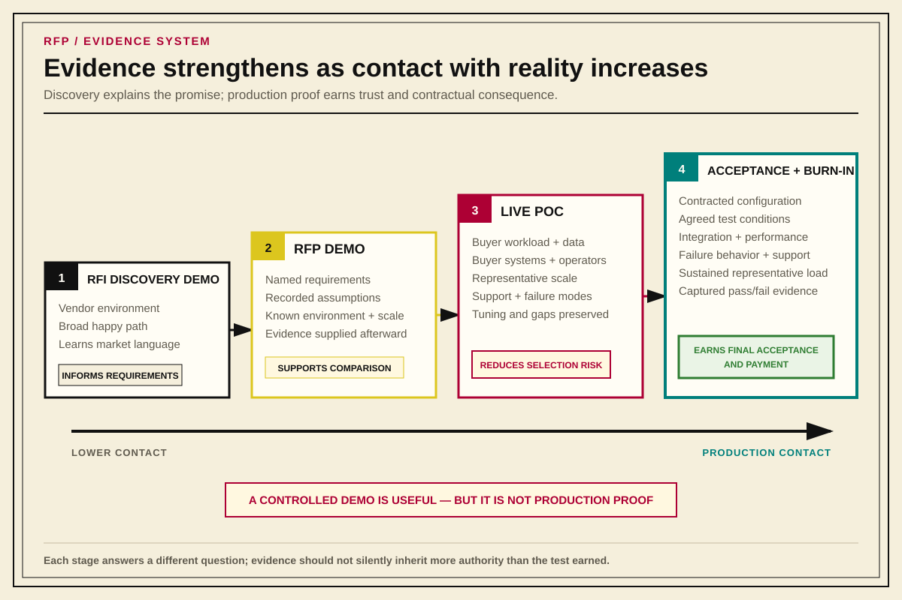{#fig-rfp-evidence-escalation}

### Benchmark and Workload Selection

Benchmarks are useful only when they match the decision being made. A benchmark that proves one kind of capability can be noise, or even misdirection, for another.

For HPC-style parallel filesystems, IO500, IOR, and mdtest can provide useful evidence because the workload shape is massively parallel metadata and throughput behavior. They still need to be tied to the buyer's scheduler, filesystem layout, identity integration, monitoring, user environment, and representative job profile.

For enterprise NVMe block storage or transactional storage, FIO and VDBench are often more useful. The test should define block size, read/write mix, queue depth, random versus sequential access, working set size, test duration, IOPS, throughput, and latency percentiles. SPC-1 and SPC-2 may also provide useful industry-standard context. For latency-sensitive NVMe purchases, queue-depth-1 latency and p99.9 tail latency under sustained load may matter more than peak IOPS.

For latency-deterministic compute, the workload should emphasize jitter, tail spikes, cache behavior, NUMA locality, and single-thread performance instead of aggregate throughput alone. STAC-M3, STAC-A2, network jitter tests, PTP-synced round-trip timing, Intel MLC, and core-pinned synthetic tests may be more relevant than generic compute benchmarks.

For cloud-vendor comparisons, the buyer is not comparing like-for-like hardware. The test should focus on service behavior: provisioning tiers, noisy-neighbor exposure, network paths, scale-up time, cold-start behavior, cost under load, and the actual workload. Load replay through tools such as k6, Locust, or JMeter may be more meaningful than a synthetic benchmark. Database-shaped workloads may justify TPC-C, TPC-H, or TPC-DS. Raw storage and network numbers from FIO and iperf3 still help, but they should be normalized by cost because instance, storage, and network tiers rarely map cleanly across providers.

The buyer should also ask vendors for their own system-exercise tools. If the vendor has a burn-in harness, diagnostic suite, workload generator, or validation procedure, the RFP should require it to be disclosed and made available for acceptance testing when appropriate. A vendor's preferred test is not automatically sufficient, but it is useful evidence about what the vendor believes stresses the system.

### Application to Open Source Tooling
This matters for open-source tools as much as vendor products. A free license does not make a tool low-risk. The organization may still be choosing an operating model, a staffing profile, an integration burden, a support path, an upgrade lifecycle, a state-management problem, and a future migration cost. No serious platform decision should be made only because the tool is popular, widely adopted, well-marketed, or already common in large companies.

Tool adoption should distinguish between reducing accidental complexity and relocating it. A tool that replaces bespoke automation may still impose a new operating model, hiring profile, workflow, state-management burden, and ecosystem dependency. The question is not only "does this tool have market adoption?" The question is "what complexity does it remove, what complexity does it introduce, and is the organization prepared to operate the model it requires?"

Jane Street's Mailcore story is a useful example. The firm had been using a widely deployed open-source mail server that could perform the required work, but its bespoke configuration language made critical compliance behavior hard to reason about, hard to test in smaller units, and dependent on specialist knowledge. Building a replacement in OCaml was not a rejection of external tools on principle. It was a decision that the real long-term cost sat in operability, staffing, testability, and change safety. The replacement still required evidence: they shadowed the old and new systems, diffed real mail behavior for months, found classes of mismatches, and migrated users gradually.

---

## The Vendor Claim Register

Every important vendor claim should become a durable row.

Vendor claims often arrive through calls, emails, slide decks, hallway comments, demos, sales engineering sessions, contract redlines, and support conversations. If those claims are not captured, the organization later has to reconstruct what it thought it heard.

A vendor claim register should record:

- vendor
- claim
- date and source
- who heard or received it
- requirement or risk related to the claim
- condition or assumption attached to the claim
- evidence supplied
- verification method
- owner responsible for verification
- status: unverified, verified, contradicted, accepted risk, or not tested
- later implementation result

This is not about trapping vendors with gotcha notes. It is about preserving the operating memory of the selection.

If a claim is important enough to influence the decision, it is important enough to verify, contract, or explicitly accept as risk. If it cannot be verified and cannot be contracted, it should not quietly become a reason to buy.

The claim register is the RFP equivalent of an evidence ledger. It connects selection to implementation and implementation to post-implementation review.

---

## Decision Records

The final selection should leave behind a decision record.

The decision record should preserve:

- why this vendor was selected
- why the other vendors were not selected
- which requirements were fully met
- which requirements were partially met
- which tradeoffs were accepted
- which risks were accepted
- which assumptions must be revisited
- which vendor claims became commitments
- which vendor claims remained unverified
- what the organization expects to be true after implementation
- who owns follow-up
- when the decision should be reviewed

This record is not a press release for the chosen vendor. It should not pretend the choice was perfect. The best decision records are often plain about the compromise:

> We selected Vendor A because it met the operational requirements with the strongest support model and lowest integration risk. Vendor B had a stronger roadmap, but the missing identity integration would have created unacceptable implementation risk. Vendor C was cheaper, but the support model did not meet the required severity expectations. We accepted Vendor A's higher three-year cost because the operational burden was lower and the migration plan was more credible.

That kind of record gives future operators something to reconcile. If Vendor A later fails on support, the organization knows which assumption broke. If Vendor B later ships the missing integration, the next evaluation starts smarter. If Vendor C proves reliable elsewhere, the organization can revisit whether its concern was correct.

Without the decision record, later teams inherit folklore.

---

A strong selection record preserves the need, the claims, the comparison, and the accepted risks. The capability still does not exist. Delivery, burn-in, acceptance, payment, and later operation must grade the selected claim against reality.

<!-- Preview assembly source: Book-level synthesis connecting Work Intake to external acquisition; RFPs-and-Vendor-Selection-as-Evidence-Systems.md: Why RFPs Exist through Decision Records -->


\newpage

# Proving and Accepting External Capability

*Part V — Developing and Acquiring Capability*

Procurement ends too early when delivery, installation, or a green dashboard becomes evidence that the organization received the capability it intended to buy. Acceptance must remain attached to the requirements, failure conditions, operational handoff, support obligations, and proof defined before production pressure made rejection politically expensive.

> **Preview note — future edition**
>
> A future version will make the shared intake lifecycle even more explicit with a paired internal/external example: the same need, claim, review, proof, authorization, acceptance, and reconciliation decisions shown on both sides of the trust boundary. The implementation detail will remain inline because the reader must be able to derive the method from a complete example, not merely be told to choose appropriate requirements or metrics.

## Acceptance, Burn-In, and Payment

Acceptance criteria are not ceremony. They are the buyer's defense against ambiguity.

If the RFP does not define how success will be tested, success becomes whatever the vendor can persuade the buyer to accept.

Acceptance should be planned before award and finalized before implementation. It should not be improvised after the system starts failing.

Useful acceptance layers include:

- delivery acceptance: the contracted items arrived
- installation acceptance: the system is racked, cabled, powered, installed, and configured according to the statement of work
- functional acceptance: the system performs required basic functions
- integration acceptance: required connections to identity, monitoring, backup, network, ticketing, logging, or other systems work
- performance acceptance: the system meets agreed performance targets under agreed test conditions
- failure-mode acceptance: expected component, path, node, controller, or dependency failures behave within agreed limits
- operational acceptance: documentation, runbooks, escalation paths, monitoring, alerting, training, and support handoff are complete
- production acceptance: the system survives a defined burn-in period under real or representative load

For infrastructure purchases, a minimal acceptance sequence often has three practical phases:

1. Validate connectivity and required integrations.
2. Validate the agreed benchmarks or workload tests.
3. Run burn-in under sustained load and resolve defects before final acceptance.

The details depend on the system. A storage platform may need protocol, multipath, metadata, throughput, rebuild, failover, and client-behavior tests. A GPU or HPC platform may need HPL, GPU burn, scheduler integration, filesystem behavior, thermal observation, and power observation under load. A network or latency-sensitive platform may need jitter testing, failover timing, packet-loss behavior, and clock-synchronization validation.

The acceptance plan should state who runs each test, what evidence is captured, who signs off, what constitutes failure, how failed hardware is replaced, and whether replacement or remediation restarts any portion of burn-in.

A burn-in period is the bridge between "it passed the demo" and "we trust it in production."

The burn-in period should define:

- duration, such as 30, 60, or 90 days depending on criticality
- workload type: real, synthetic, or representative
- performance thresholds
- defect severity levels
- uptime expectations
- allowed maintenance windows
- environmental observations such as heat, power, and throttling under load
- what resets the burn-in clock
- what defects delay acceptance
- what failures trigger vendor-funded remediation
- what failures trigger replacement, credit, rejection, or termination

Final payment should follow final acceptance, not vendor optimism.

Invoicing should not be treated as complete merely because delivery occurred. Delivery proves that the buyer received the contracted items. It does not prove that the buyer received the contracted capability.

Payment structure is one of the strongest ways to assign risk. For well-defined infrastructure purchases, milestone-based payment is often more appropriate than paying the full amount when equipment arrives.

Milestones may include:

- design accepted
- equipment delivered
- installation complete
- baseline configuration complete
- integration complete
- functional acceptance passed
- performance acceptance passed
- operational handoff complete
- burn-in complete
- final acceptance signed

The contract should also define remedies when the vendor fails to deliver the promised thing. Possible remedies include a cure period, escalation path, withheld payment, service credits, vendor-funded remediation, replacement obligations, extended warranty or support, delayed final acceptance, right to reject, right to terminate, refund terms, and post-acceptance defect obligations.

The exact remedy language belongs with procurement and legal counsel. The operating principle belongs in the RFP: the organization should know what happens if the promised capability does not arrive.

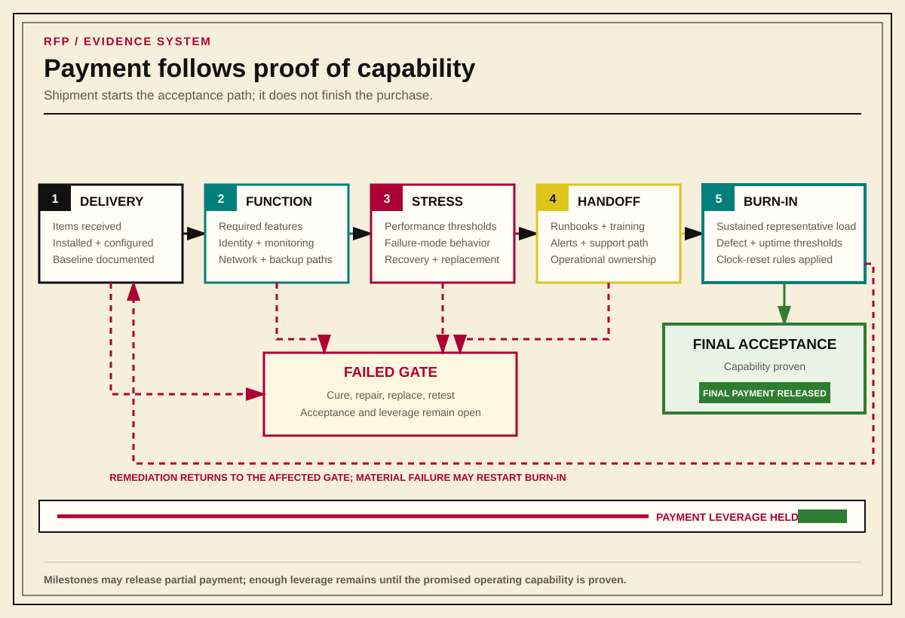{#fig-rfp-acceptance-payment-gates}

---

## What to Strip Down Under Lower-Risk Conditions

Not every purchase needs the full process.

The lightweight process should be a conscious reduction of the strict process, not a guessing game about what might matter.

### Tier 1: Low-Risk Purchase

Examples include small non-critical tools, easily reversible purchases, and purchases where failure creates limited operational impact.

Minimum process:

- define the need
- confirm basic requirements
- compare reasonable options
- document the decision
- verify delivery
- preserve receipts, terms, and renewal dates

Usually stripped down:

- formal RFI
- formal RFP
- weighted scorecard
- detailed vendor claim register
- proof of concept
- staged payment
- long burn-in
- post-implementation review

The decision still needs a record, but the record can be short.

### Tier 2: Moderate-Risk Technology Purchase

Examples include team-level infrastructure, non-critical storage, monitoring tools, limited-scope platforms, and tools that affect a bounded user group.

Minimum process:

- define the operational capability
- document requirements
- compare vendors
- define acceptance criteria
- require an implementation plan
- verify integration
- complete a short burn-in
- document handoff
- record the selection decision

Usually stripped down:

- broad market RFI (in practice, this is frequently senior+ engineers researching capabilities)
- highly formal source-selection procedure
- extensive contract remedies
- 60- or 90-day burn-in
- heavy executive governance

The buyer should still preserve vendor claims that materially affect the decision.

### Tier 3: High-Risk Foundational Infrastructure

Examples include production storage clusters, HPC clusters, virtualization platforms, backup systems, identity platforms, major network infrastructure, and systems whose failure would create business continuity, security, or large operational risk.

Use the strict model:

- acquisition planning
- market research or RFI
- formal RFP
- scored evaluation
- vendor claim register
- milestone-based payment
- design review
- site-readiness gate
- implementation gates
- functional acceptance
- performance acceptance
- failure-mode testing
- operational handoff
- 30- to 90-day burn-in
- final acceptance
- remedies for failure
- post-implementation review
- lessons learned

The stricter process exists because late discovery is expensive. Once a foundational system is wired into production, rejected alternatives become harder to recover, vendor leverage changes, and the organization may start accepting defects because backing out feels impossible.

---

## Common Failure Modes

### The Organization Cannot State the Need

The RFP starts with a preferred product, architecture, or vendor rather than a capability need. Vendors respond to the buyer's guessed solution instead of the operating problem.

### Requirements Are Written as Preferences

The buyer turns familiar mechanisms into requirements without proving they are non-negotiable. This can exclude better solutions or hide the real constraint.

### Evaluation Criteria Arrive Too Late

The organization decides what matters after it already knows which vendor it wants. The scorecard becomes a justification artifact instead of a selection tool.

### Demos Are Mistaken for Evidence

The vendor demonstrates a happy path in a controlled environment, and the organization treats that as proof of production readiness.

### Consensus Replaces Live Proof

Credible people agree that a credible tool is the right choice, but nobody proves the tool against representative workload, real operating constraints, or the team's ability to run it. The organization mistakes agreement for evidence.

### Adoption Gravity Is Mistaken for Fit

The selected tool is popular, common in large companies, or strongly recommended by vendors and peers, so the organization assumes it is architecturally fit. Popularity may reduce some risks, but it does not prove the tool matches the workload, skill base, operating model, or failure modes the buyer actually has.

### Vendor Claims Are Not Preserved

Important promises remain trapped in meetings, emails, slide decks, and memory. During implementation, nobody can prove what was claimed, what was assumed, or what was accepted as risk.

### Procurement, Engineering, Security, Finance, and Operations Evaluate Different Realities

Each function focuses on a different part of the purchase. Procurement sees terms, engineering sees technical fit, security sees control gaps, finance sees cost, and operations sees future toil. The RFP process fails when those realities are never reconciled into one decision.

### Delivery Becomes Acceptance

The organization treats arrival, installation, or initial login as success. The vendor exits before performance, resilience, monitoring, documentation, training, and support paths are proven.

### Payment Rewards Activity Instead of Proof

The contract pays for shipment, installation, or effort without holding enough leverage for acceptance, burn-in, and remediation.

### Operational Burden Is Left Out of the Decision

The selected tool works, but only by creating staffing load, alert fatigue, manual maintenance, upgrade risk, or support complexity that was not included in the evaluation.

### No One Owns Reconciliation

The purchase is approved, implemented, and forgotten. Nobody compares actual outcomes against the original problem statement, scorecard, vendor claims, cost model, implementation plan, and operator experience.

That final failure is the most important one. Without reconciliation, every RFP starts from organizational amnesia.

---

## Post-Implementation Review

The post-implementation review closes the loop.

After implementation, compare actuals against:

- original problem statement
- RFP requirements
- evaluation scorecard
- vendor claim register
- demonstration and POC findings
- implementation plan
- cost model
- support model
- reliability expectations
- operability expectations
- user experience
- operator experience
- accepted risks
- final acceptance criteria

The purpose is not to punish the selection team. The purpose is to make the next RFP smarter.

Useful questions:

- Did the system solve the problem we said it would solve?
- Which requirements mattered most in practice?
- Which requirements were unnecessary?
- Which vendor claims were verified?
- Which vendor claims failed, shifted, or became irrelevant?
- Which assumptions were wrong?
- Which risks were accepted knowingly?
- Which risks appeared without being captured?
- Did the support model work?
- Did the implementation plan match reality?
- Did the operating burden match the evaluation?
- Did the payment and acceptance structure preserve enough leverage?
- What should the next RFP do differently?

This review should feed back into requirement templates, scorecards, contract language, demo rules, POC design, acceptance criteria, and the vendor claim register.

The organization is allowed to learn. The system should make learning hard to lose.

---

Each domain now has some form of reconciliation: work, systems, talent, and vendors. Enterprise learning begins when those local reviews change portfolio and executive decisions without destroying the context that made the evidence honest.

<!-- Preview assembly source: RFPs-and-Vendor-Selection-as-Evidence-Systems.md: Acceptance through Post-Implementation Review; tools moved to Appendix E -->


\newpage

# Part VI: Reconciling the Enterprise {.part .unnumbered}

Local reviews become organizational learning only when their evidence changes portfolio and executive decisions without losing the context that made the evidence trustworthy.


\newpage

# Future Edition: Reconciling the Enterprise {.unnumbered}

*Part VI — Reconciling the Enterprise*

Local loops do not automatically produce organizational learning. A team can reconcile a delivery forecast, a selection group can grade vendor claims, a manager can preserve development evidence, and a retirement owner can track remaining dependencies while the enterprise continues making the same class of decision from scratch somewhere else.

The enterprise layer has two obligations that pull in opposite directions. It must move enough evidence across boundaries for repeated patterns to change funding, policy, staffing, and governance. It must also preserve enough local context that the aggregate does not turn unlike cases into one clean but misleading score.

The current sources contain the pieces. Work Intake preserves an Approved Delivery Baseline and a changing Delivery Forecast. RFPs connect claims to acceptance and operating outcomes. Managed Runoff compares lifecycle intent with actual dependencies and exceptions. TDA separates the individual ledger from the aggregate Behavioral Scoreboard. Process Improvement distinguishes internal instrumentation from the narrow number leadership may need. What is missing is the rule for combining them.

> **Preview note — future edition**
>
> A future version will define benefits realization across projects and portfolios, the executive translation layer, evidence-retention and data-quality rules, and the boundary between local learning records and upward reporting.
>
> It will specify which claims roll up, which artifacts remain protected, who owns interpretation, what decision the aggregate evidence is meant to change, and how a person affected by a correction can distinguish a revised record from rewritten history.
>
> It will also address opportunity capture alongside risk capture. An evidence system designed only to prevent loss will teach the organization to see danger more clearly than possibility.

## The current enterprise rule {.unnumbered .unlisted}

The strongest rule the current material can support is this:

> Aggregate a claim only to the level required by the decision it is meant to change, and preserve the case-level evidence needed to challenge the aggregate.

That rule prevents several familiar failures. A performance rating cannot replace the assignments, constraints, and observed behavior behind it. A project status cannot replace the baseline, forecast history, and expected benefit. A vendor score cannot replace the claims, proof conditions, and operating burden. An executive number may direct attention; it cannot explain the system by itself.

Enterprise reporting should therefore begin with the decision, not the dashboard. Who can act? What evidence would change the action? Which comparison is legitimate? What context would make the number misleading? When will the decision be reviewed again? A report that cannot answer those questions is another box score detached from the game.

The enterprise evidence problem becomes sharper when AI can produce, summarize, and recombine organizational artifacts at very low cost. Cheap documentation can close loops, or it can make loop theater cheaper.

<!-- Preview assembly source: 0.Organizational-Excellence-Book-Gaps.md synthesis from Work Intake, RFPs, Managed Runoff, TDA, and Process Improvement -->


\newpage

# Future Edition: AI, Context, and Organizational Leverage {.unnumbered}

*Part VI — Reconciling the Enterprise*

AI changes the economics of work whose value arrives later than its cost. Decision records, reconciliations, evidence ledgers, structured intake, runbook drafts, and context maintenance often fail because the person doing the work pays now while an unknown future reader receives the benefit. Lowering the activation energy can make those artifacts economically possible.

That does not make every generated artifact useful. AI can produce forms, summaries, dashboards, policies, and meeting records faster than an organization can create a reason for anyone to read them. The same tool that makes context preservation cheaper also makes procedural theater cheaper.

> **Preview note — future edition**
>
> A future version will develop the context-control-plane argument: how an organization reconstructs the right context for a decision, aligns tools with its cognitive capital, preserves authority boundaries, and prevents generated synthesis from replacing accountable judgment.
>
> It will distinguish high-value stranded toil from work whose difficulty is itself the control. It will also define verification, provenance, access, retention, correction, and review expectations for AI-produced organizational artifacts.

## Technology Cannot Substitute for Development Architecture {.unnumbered .unlisted}

Organizations often try to use technology to compensate for missing development architecture: career tools, skills platforms, workflow systems, dashboards, AI assistants, and intake portals. Those tools can augment well-designed behavior. They can make information easier to find, reduce administrative friction, and make patterns visible. They cannot create the underlying management behavior by themselves.

Technology can support a process, but it cannot make a broken process healthy. A tool that routes work through a bad operating model mostly makes the bad operating model faster, more expensive, or harder to see. AI does not change that. Using LLMs to push through bad process may feel productive locally, but the cost can become invisible to the person authorizing the usage and difficult for the company to distinguish from legitimate work.

This matters for TDA because career development is not solved by a portal that emits generic recommendations. The system still needs actual roles, actual skill needs, actual managers coordinating work, actual safe-reps paths, actual coaching, and actual evidence. The tool can help people navigate the architecture. It cannot replace the architecture.

---

## The operating test {.unnumbered .unlisted}

AI should enter a closed loop as labor, not authority.

It may reconstruct context, identify missing fields, compare a forecast with an outcome, draft a discussion artifact, surface contradictory records, or make deferred-payoff documentation cheaper. The accountable actor still decides what is true, what risk is accepted, what action follows, and what evidence would cause the decision to change.

If generated work is not routed to someone required to read it and no later decision is reconciled against it, the organization has automated document production rather than organizational learning.

A book about operating systems should end by showing how to begin without installing the whole system at once. Adoption has its own capacity cost, evidence requirements, and failure modes.

<!-- Preview assembly source: Talent-Development-Architecture.md: Technology Cannot Substitute for Development Architecture; future scope from gap map -->


\newpage

# An Implementation Roadmap

*Part VI — Reconciling the Enterprise*

The complete system is not a responsible starting point. Every new artifact creates maintenance, every review consumes attention, and every metric creates an incentive whether the designer intended one or not. Adoption should begin with the smallest set of controls that makes a real failure visible and produces evidence for the next change.

The current source material supports a sequence:

1. Make work visible.
2. Standardize the front door and work types.
3. Define completion conditions.
4. Record important decisions and assumptions.
5. Add a risk-find path with an urgent exception route.
6. Add post-implementation reconciliation.
7. Add people-system evidence loops.
8. Add aggregate leverage metrics only after the capture layers produce trustworthy data.

The order is causal. Metrics arrive after records. Enterprise synthesis arrives after local reconciliation. Automation arrives after the work is understood well enough to know which behavior should become repeatable.

> **Preview note — future edition**
>
> A future version will define how process assets are versioned, tailored, reviewed, corrected, and retired. A process that can only be added is another managed-runoff problem waiting to happen.
>
> The Risk Find step remains unresolved. Future work must define structured triage, urgency, ownership, escalation, and the conditions under which a significant issue bypasses normal operating cadence. Until that work is complete, the sequence names the missing control without pretending to supply a reader-facing standard.

## Start with one closed loop

Do not begin by rolling out the book. Begin with one recurring organizational failure whose cost is already visible to the people doing the work.

A responsible pilot needs six things before it starts:

| Pilot element | Minimum answer |
|---|---|
| **Observed failure** | The repeated condition the organization wants to change, stated without prescribing the solution |
| **Baseline** | What happens now, how often, under which conditions, and how trustworthy the current measurement is |
| **Owner** | The actor accountable for the outcome and the actors who own affected risk, capacity, and acceptance |
| **Outcome** | The observable condition that would justify calling the intervention successful |
| **Evidence path** | Which fields, artifacts, tests, and observations will supply the answer, and who must read them |
| **Review point** | The date or event that forces a decision to continue, change, scale, stop, or investigate further |

The pilot is not funded merely because the table exists. Leadership must also say what stops or receives less capacity while the team builds the new records, learns the workflow, and performs the review. If nothing stops, the pilot is spare-time work with executive branding.

## A tracer-bullet implementation

Return to the registration example from the work-item chapter. Over a rolling ninety days, the demand queue shows twenty-three incidents caused by manual registration re-runs after endpoint certificate rotation. The incidents consumed approximately thirty-one staff-hours.

The registration failure is a defect because required automatic behavior failed. The first occurrence created the corrective obligation; the twenty-three incidents and thirty-one hours quantify exposure and cost. A single occurrence with sufficiently severe consequences could have required immediate correction. This evidence is enough to justify attention. It is not enough to justify a favorite solution. The implementation proceeds through the same loop the book has applied everywhere else.

### Make the demand observable

The incident type requires a closed, resolution-gated cause field. One allowed cause is **manual registration re-run after endpoint certificate rotation**. Time comes from the worklog rather than a hand-entered estimate. The first review checks classification quality as well as incident count; a precise total built from optional or inconsistently used fields is false confidence.

The initial baseline records:

- 23 matching incidents in 90 days;
- approximately 31 staff-hours of recorded handling time;
- the number of certificate rotations during the same period;
- the environments and endpoint regions affected;
- time to restore registration;
- how many records lack a valid cause or worklog; and
- any customer-visible or security consequence.

This is not measurement theater. Each field answers a later decision. Incident count establishes recurrence. Hours estimate capacity cost. Rotation count supplies the denominator that distinguishes a frequent trigger from a generally unreliable system. Region and environment expose scope. Restore time and consequence protect against optimizing labor while making recovery or risk worse. Missing-field rate states how much confidence the organization should place in the baseline.

### Authorize discovery before authorizing a build

The discovery package asks why certificate rotation requires manual registration, which systems own certificate issuance and registration, whether the behavior differs by region, what failure and recovery paths exist, and which constraints a safe change must preserve.

Its completion condition is a decision-ready artifact: the observed failure mechanism, viable options, non-goals, affected owners, proof conditions, and a recommendation. A responsible result may be that the apparent pattern combines several causes and should not become one corrective work item. That is useful company work. Discovery prevented the organization from automating a false category.

### Define the outcome before choosing the metric

Assume discovery confirms one correctable defect. The governing Epic receives this outcome:

> No host requires a manual registration re-run after certificate rotation, verified by zero demand incidents with this cause for ninety consecutive days after rollout and successful automated re-registration observed across at least two regional endpoints.

The metric follows from the claim:

| Role | Metric | Why it exists |
|---|---|---|
| **Primary outcome** | Matching incidents per rolling 90 days | Directly tests whether the demand source disappeared |
| **Capacity consequence** | Staff-hours spent on the matching cause | Tests whether the change reclaimed effort rather than relabeling it |
| **Exposure denominator** | Certificate rotations and affected hosts | Prevents a quiet period with no rotations from looking like success |
| **Leading implementation evidence** | Successful automated re-registration tests across two regions | Shows that the mechanism exists before the full outcome horizon passes |
| **Data-quality control** | Percentage of relevant incidents with valid cause and worklog | States whether the outcome metric can be trusted |
| **Guardrails** | Failed registrations, restore time, security exceptions, and manual-override success | Prevents local labor reduction from exporting greater operational risk |

Velocity is not the outcome. Scripts written is not the outcome. Tickets closed is not the outcome. Automation coverage may describe the intervention, but the intervention earns its value only if the original demand falls without violating the guardrails.

The team did not “decide which metrics are relevant” in the abstract. It wrote a falsifiable outcome, identified the ways that outcome could appear true while the system remained bad, and chose the smallest set of measures that expose those failure modes.

### Build through bounded work

The authorized Epic can now decompose into discovery already completed, implementation work packages, tests, deployment, documentation, and operational handoff. Each child item gets its own acceptance criteria. Standing workmanship gates still apply. Closing every child does not close the Epic if matching demand continues.

The team keeps a manual recovery path until the acceptance authority has seen successful behavior under representative rotation conditions. If implementation changes the failure model, risk owner, operational burden, or expected horizon, the delivery forecast changes and the affected authority receives the new decision. The original baseline remains unchanged.

### Review at the cadence required by the evidence

The board may be reviewed weekly for flow and blockage. Automated re-registration evidence is reviewed after each representative certificate rotation. Data quality is checked while incidents are still being classified. The outcome cannot be reconciled until the ninety-day horizon has passed under enough actual exposure to make the result meaningful.

Those are different reviews because they answer different questions. Combining them into one generic status meeting would either delay operational decisions or pretend the outcome is known before reality has had time to answer.

### Reconcile before scaling

At the review point, the owner compares the original baseline, discovery claims, forecast history, implementation evidence, outcome metric, and guardrails. The decision is not automatically “roll this process out everywhere.”

Possible results include:

- the cause disappeared and the approach is safe enough to standardize;
- the cause declined but the remaining cases reveal another problem class;
- handling time fell while operational risk rose, requiring correction or rollback;
- the automation works but the capture system is too incomplete to support the claim;
- the intervention failed and should stop; or
- discovery and measurement produced a better target than the one the pilot began with.

The pilot succeeds organizationally when it produces a better next decision. A technically successful automation with no preserved baseline, no guardrails, and no later review may save time, but it does not yet prove the operating system.

## Scale the mechanism, not the ceremony

After one complete loop works, reuse only what proved necessary: the classification field, decision record shape, review boundary, acceptance evidence, metric logic, or escalation path. Do not copy every meeting and artifact into a domain with different risk.

The next pilot should begin with another costly open loop, not with a mandate that every team adopt the template. The reusable object is the causal pattern: claim, context, owner, evidence, review, reconciliation, next decision. The implementation remains accountable to local conditions.

The preview ends where implementation begins: with an operating hypothesis small enough to test, evidence strong enough to grade it, and a review point that forces the next decision.

<!-- Preview assembly source: Book-level synthesis from Process Improvement adoption guidance, Work Intake, Writing Work Items, and the gap-map implementation sequence -->


\newpage

# Reusable Instruments and References {.unnumbered}

\appendix

The narrative explains why each instrument exists. The appendices preserve the fields, prompts, and reference structures needed to use the operating model without forcing the main argument to carry every implementation detail.


\newpage

# Appendix A: Framing and Work-Item Tools

*Part Appendices*

These instruments support the transition from ambiguity to a reviewable frame and from an authorized outcome to executable work.

## Discovery Package Template

Use this template for ambiguous pre-design work.

**Name:**<br>
Short, outcome-oriented noun phrase

**Intent:**<br>
Discovery / Enablement / Migration / Redesign / Optimization

**Objective:**<br>
The question this work answers

**Non-Goals:**<br>
What it explicitly does not decide

**Inputs Required:**<br>
Who must be involved and what information must exist

**Output Artifact:**<br>
The thing that proves the package is done

**Downstream Enabled:**<br>
The work or decision that can now proceed without reconstructing the reasoning

### Stable discovery categories

The exact questions vary, but the categories remain fairly stable.

#### Operational impact

- What happens when this system is unavailable?
- What is the tolerated duration of failure?
- Who is paged, and with what context?

#### Lifecycle and change

- How often does this system change?
- Which other systems' changes invalidate work here?
- What must be retested when this changes?

#### Coupling and dependencies

- What other systems assume this "just works"?
- What hidden contracts exist around timing, identity, naming, or availability?

#### Failure and recovery

- How do we recover from partial failure?
- What is the slowest acceptable recovery path?
- What breaks if recovery exceeds that window?

#### Ownership and authority

- Who decides when change is allowed?
- Who can pause a rollout?
- Who owns risk acceptance?

### Refactor vague discovery epics

Backlog epics filled with "determine X" or "research Y" usually show that task-based thinking has been applied to discovery. They feel weak because they do not make progress visible and do not tell reviewers what artifact will exist at the end.

Instead of:

- Determine IAM requirements
- Research AWS authentication options
- Figure out directory structure

Use:

**Epic: Platform Identity Discovery**

Discovery packages:

- **Identity Surface Inventory**<br>
  Output: documented list of identity consumers
- **Authorization Verbs Definition**<br>
  Output: capability list of verbs rather than group names
- **Trust Boundary Definition**<br>
  Output: written trust model and escalation paths

Each package has a finish line, creates a reviewable artifact, and can be marked done without debate. Progress becomes visible, discovery stops pretending to be execution, and stakeholders can review outcomes rather than activity.

### Example: identity framing before design

Instead of creating tasks such as:

- Design IAM roles
- Configure SSO

Create a discovery package:

**Define identity types and lifecycles across platform systems**

- **Output:** documented taxonomy of human, service, and workload identities
- **Non-goal:** selecting tooling or access policies

The resulting taxonomy allows downstream design to proceed without re-litigating the basic identity model.

{#fig-design-gate-convergence}

---

## Design-Informing Example: A DNS Service

If the problem is "design a new DNS service," the following questions should be answered before solution selection.

### How will people consume the service?

Will users interact through:

- a user interface;
- an API; or
- GitOps or infrastructure as code?

Also ask:

- Are different consumption models supported for different users?
- Does the model encourage safe, repeatable change?
- Does it require deep DNS expertise from every user?

### Who will manage DNS, and how?

Will DNS be managed by:

- one team through service requests;
- a shared service with enforced boundaries; or
- a self-service model for application teams?

For any model:

- What boundaries exist?
- How are they enforced?
- Is enforcement procedural, technical, or both?
- How does the model scale as the organization grows?

For shared-service or self-service models:

- Which record types may a typical user modify?
- Which record types remain centrally managed?

MX, NS, and SOA records may require central management.

### Who owns each record?

The design must ensure:

- only approved users can modify a record; and
- Team A cannot change records owned by Team B.

That raises additional questions:

- Does ownership affect the domain structure?
- Should ownership be delegated through subdomains?
- How are ownership and changes audited?

The answers determine the authorization model, delegation boundaries, operational workflow, and evidence the system must preserve. Choosing a DNS product before answering them would convert the product's defaults into organizational policy without an explicit decision.

---

## Templates

Copy-paste these. **Bold fields are required.** Delete the guidance in *italics*.

### 9.1 Epic template

```markdown
**Summary:** <Area> | <Capability or change, stated as a noun phrase>

**Outcome / Exit Condition (REQUIRED - the epic is done when this is true):**
When this is done, <capability now possible / failure mode now impossible>,
measured by <metric or specific verification>, by <horizon>.

**Why now / Context:**
<What's driving this. If spawned from demand-driven work (Section 6), link the incidents it retires and the cause-category baseline.>

**Definition of Done (inherited from the TEAM DoD - restated here, not invented per epic; NOT the outcome):**
*This is the team-wide quality bar that already applies to every task of this kind; list it (or link it) so authors see it - don't author a new one. Add an epic-specific item only if this epic genuinely needs one beyond the standard.*
- <e.g. tracked in the relevant repo>
- <e.g. has logging>
- <e.g. has a regression/validation test>
- <complies with applicable governing standards, or links a documented non-applicability determination>

**In scope / Out of scope:**
- In: <...>
- Out: <...>   ← name what this epic deliberately does NOT cover

**Linked work:** <related epics, dependencies>
```

#### Filled example - the Example Epic, corrected

```markdown
**Summary:** Base image | one image, multiple runtimes

**Outcome / Exit Condition:**
When this is done, a single base image provisions Linux hosts across two runtime
types with ZERO manual post-build steps, verified by >=20 consecutive automated
builds passing post-build validation, and the legacy build path is
decommissioned. Target: end of Q3.

**Why now / Context:**
Manual, per-runtime builds are slow and error-prone. (Link recurring build
incidents here.)

**Definition of Done (inherited from the team DoD - binary, universal, substitutable invariants only):**
- Image content tracked in version control in the image-build repo
- Scripts have logging
- Each config has a regression/validation test in the post-build step
- Complies with the team's applicable governing standards, or links a documented non-applicability determination
*(Dropped from the original ticket: "environment-specific conditional" - a base image holds only what all systems need, so environment divergence belongs in layering or runtime metadata, not the DoD; "modular" - an architecture choice for design review, not a requester-owned DoD bar. See [Section 5](#three-things-people-confuse-dod-vs-acceptance-vs-outcome).)*

**In scope:** image content & configuration.
**Out of scope:** provisioning automation / self-service pipeline (separate epic).
```

### 9.2 Story / Work Package template

```markdown
**Summary:** <Outcome-oriented noun phrase>

**Intent (pick ONE - if you need two, it's two work packages):**
Discovery / Migration / Redesign / Enablement / Optimization

**Objective:** <What question this answers / what outcome it delivers.>
  (For Optimization/Enablement, name the Automation Ladder transition, e.g. "L1 -> L3".)

**Non-Goals (REQUIRED - what this explicitly does NOT decide/cover):**
<If a reviewer could plausibly expect an adjacent change here, say yes or no to it.>

**Pre-conditions (what must be true on day 1 before anyone starts):**
<Constraints, not solutions: security sign-off, access-policy access, a vendor decision, an upstream API.>

**Acceptance Criteria (REQUIRED - story is done when these pass):**
Given <context>, when <action>, then <observable result + how it's verified>.
- [ ] <one line PER measurable variable - don't lump latency+concurrency+scope together>
  ✗ Do NOT write "PR submitted" / "script written" - those are outputs, not behavior.
  ✗ Do NOT compound ("build X, then migrate Y to X") - that's two work packages.

**Output Artifact (the thing that proves it's done):** <not "running code" for Discovery>
**Downstream Enabled:** <what work can now proceed without rework>
**Parent epic:** <KEY>
```

> **Why the extra fields vs. a bare user story:** these come from our Work Package model - a work package is *outcome-oriented and independently estimable*, so it needs **one intent**, an explicit **Non-Goals** line (the #1 source of mid-sprint scope drift), and **Pre-conditions** (the reason "clean-looking" stories silently rot - they were never actually startable). A story missing **Non-Goals** fails readiness when the work touches anything cross-team (base image, access-policy, provisioning).

#### Filled example - the delivery story extracted from the Example Task

```markdown
**Summary:** Instances auto-register to the correct regional endpoint on first boot

**Intent:** Enablement (one base image usable across environments without rework)

**Objective:** A launched instance registers itself against the registration endpoint and token for its own region, so one base image works across environments with no per-environment edits.

**Non-Goals:** the metadata-source decision (settled in the preceding Discovery WP); creating the
per-region secret and access-policy grant (separate tasks).

**Pre-conditions:** per-region registration secret exists; instance role can read it.

**Acceptance Criteria:**
Given an instance launches in region-X, when startup configuration runs on first boot, then it
registers against the region-X endpoint using the region-X registration token, and
the registration status check succeeds.
- [ ] Region determined from instance metadata; no hard-coded values
- [ ] Registration endpoint URL and registration token fetched from the per-region secret
- [ ] Verified end-to-end in at least 2 regions
- [ ] Secret-fetch failure fails the build loudly (logged, non-zero exit)

**Output Artifact:** merged, version-controlled startup registration script and the
2-region verification evidence.
**Downstream Enabled:** base image can be shared to other environments with only secret and access-policy configuration.
**Parent epic:** Example Epic
```

### 9.3 Task template

```markdown
**Summary:** <Concrete deliverable, e.g. "Create per-region registration secret">

**Deliverable (done when this objectively exists):**
<The merged code / created resource / applied config.>

**Parent story/WP:** <KEY>
**Notes / how-to:** <links, snippets, gotchas>
```

### 9.4 Discovery work package template

*Use this when the unknown is "how" - a decision must be made before the build can be specified. It's a Story/WP with the **Discovery** intent; its deliverable is a recorded decision, not code.*

```markdown
**Summary:** <the question to answer, e.g. "Decide how an instance determines its region and registration endpoint">

**Intent:** Discovery

**Question:** <What decision must we make?>
**Done when:** a decision is recorded (in a comment / linked doc) - NOT when code merges.
**Scope / time-box:** <keep it small, e.g. 1 day>
**Output feeds:** <which story this unblocks>
```

---

## Quick reference

Pin this.

**The one rule:** *An epic is not done when its child tickets close. It's done when its **outcome** is true.*

**Pick the level by completion condition:**
- **Epic** -> done when its **outcome** (measured change) is true -> write the Outcome / Exit Condition (one or more checkable conditions)
- **Story/WP** -> done when **acceptance criteria** (observable behavior) pass
- **Task** -> done when a **deliverable** objectively exists
- **Discovery WP** -> done when a **decision** is recorded

**Where to split (and which way):**
- *Diverges across "ands" but worthless apart?* -> **still one epic.** Epics are meant to diverge.
- *A piece delivers value alone, independent of its siblings?* -> it's its **own epic**.
- *A work package carries two intents (decide + build, build + migrate)?* -> **two work packages.** The single-intent rule lives at the story layer, not the epic layer.

**Three fields people confuse:**
- **DoD** = workmanship bar, same for every item (includes **standing gates**)
- **Acceptance** = does *this* item behave as promised
- **Outcome** = did the *epic* change what we wanted

**Standing gates (anti-weasel - on by default, every item):** security-compliant *or* approved+documented exception · test bar met · observability · docs updated. "It wasn't in the AC" is not a defense.

**Banned acceptance criteria:** "PR submitted," "code written," "script created." Describe the **behavior**, not the **artifact**.

**Outcome formula (use either form - qualitative is the common case for ops):**
> *Quantitative:* We'll know this is done when [metric/state] moves from [baseline] to [target], measured by [method], by [horizon].
> *Qualitative:* When this is done, [capability] is now possible / [failure mode] is no longer possible, verified by [specific check].

**Demand-driven work (Section 6):** capture it by **work type** (not a removable tag) + a resolve-gated **cause** + time. When a cause category crosses the threshold -> **spawn a roadmap epic to retire it, with its outcome measured back against the demand data.** That is the loop leadership needs to see. Roadmap vs demand is a clean two-way split; change/CAB is an audit overlay, not a third bucket.

**Three modes (author effort scales with uncertainty):** roadmap/bespoke -> full machinery · demand/reactive -> light, just enough to stay countable · repeatable/request -> machinery frozen into the work type.

**Definition of Ready (don't start until):** one intent · acceptance criteria written · Non-Goals written · standing gates satisfiable · vertical slice · dependencies known · unknowns resolved up front · linked to an epic that has a real outcome.

<!-- Preview assembly source: Framing-Technical-Work-Before-Design.md: Discovery Package Template and DNS example; Writing Work Items - Epics, Stories, and Tasks.md: Templates and Quick reference -->


\newpage

# Appendix B: Conversation Planner

*Part Appendices*

Use this worksheet before a difficult, high-stakes, or emotionally loaded conversation. It supports the management-evidence chapter without converting the worksheet itself into narrative.

Use this as a working worksheet before a difficult, high-stakes, or emotionally loaded conversation.

## What are the relevant facts, feelings and context for this conversation?

1.


## What may be important to the other person in this conversation?

2.


## What is my desired outcome for this conversation?  
### My purpose

3.


## What are the possible areas of alignment / misalignment for this conversation?

4.


## How am I going to open this conversation?  
### Opening statements

5.

<!-- Preview assembly source: Conversation Planner.md, complete worksheet -->


\newpage

# Appendix C: Talent Development Workbook

*Part Appendices*

The four instruments form one loop: personal context becomes competency calibration, calibration becomes a real-work development plan, and the resulting evidence feeds the next decision.

## TDA Personal Development Plan

This template is the employee-facing entry point into Talent Development Architecture. It gives the employee and manager one clean place to discuss role context, career direction, preferences, constraints, demonstrated strengths, development needs, and the work that should become the person's next safe reps.

The purpose is not to produce a polished career narrative. The purpose is to create a shared operating picture.

### Use

1. The employee completes the first draft.
2. The manager adds calibration notes, organizational context, and missing evidence.
3. The employee and manager review it in a one-on-one.
4. The agreed development targets move into the TDA 70-20-10 Development Plan.
5. The plan is reviewed at least quarterly, and after major stretch assignments, role changes, or performance regressions.

### Personal And Role Context

| Field | Response |
|---|---|
| Employee |  |
| Current role |  |
| Role family or discipline |  |
| Team or work group |  |
| Manager |  |
| Date in current role |  |
| Current level or operating mode |  |
| Date plan agreed |  |
| Review cadence |  |

### Current Role And Scope

What is the person currently accountable for?

| Accountability | Expected Outcome | Current Evidence | Notes |
|---|---|---|---|
|  |  |  |  |
|  |  |  |  |
|  |  |  |  |

What work has the person actually been doing that is not visible in the formal role description?

| Hidden Or Informal Work | Why It Exists | Impact On Capacity | Keep, Stop, Or Formalize? |
|---|---|---|---|
|  |  |  |  |
|  |  |  |  |

### Career Direction

Short term, one to two years:

Mid term, three to six years:

Long term, six or more years:

Desired movement type:

- [ ] Move upward: increased scope, responsibility, complexity, or decision rights.
- [ ] Move sideways: broader experience at a similar level.
- [ ] Build in place: new responsibility inside the current role.
- [ ] Discover: short-term exposure used to test interest, fit, and usefulness.

Roles, domains, systems, or operating modes the person wants to explore:

| Target | Why It Matters | Time Horizon | Business Need Or Useful Work |
|---|---|---|---|
|  |  |  |  |
|  |  |  |  |

### Preferences, Constraints, And Energy

Preference is operational signal, not veto power. Capture it honestly so the manager can place talent more accurately.

| Signal | Employee Notes | Manager Notes |
|---|---|---|
| Work that creates energy |  |  |
| Work that drains energy |  |  |
| Work the person seeks out |  |  |
| Work the person avoids despite competence |  |  |
| Constraints affecting output |  |  |
| Conditions that help the person learn |  |  |
| Conditions that make learning harder |  |  |

### Current Capability Snapshot

| Capability, Skill, Domain, Or Behavior | Evidence Already Demonstrated | Confidence Level | Notes |
|---|---|---|---|
|  |  |  |  |
|  |  |  |  |
|  |  |  |  |

Completed education, training, certifications, labs, or self-study:

| Learning Completed | Why It Matters | Has It Been Applied In Real Work? | Evidence |
|---|---|---|---|
|  |  |  |  |
|  |  |  |  |

### Development Needs

Development needs should be stated as observable gaps, not personality traits.

| Development Need | Current Evidence | Target Evidence | Why It Matters |
|---|---|---|---|
|  |  |  |  |
|  |  |  |  |
|  |  |  |  |

Stop doing:

Continue doing:

Start doing:

### Proposed Development Targets

Choose a small number of targets. A plan with fifteen goals is usually a wish list, not an operating plan.

| Target | Transition Gate | Safe-Rep Opportunity | Manager Support Needed | Evidence Of Progress |
|---|---|---|---|---|
|  |  |  |  |  |
|  |  |  |  |  |
|  |  |  |  |  |

### Manager Calibration

What does the manager agree with?

What does the manager see differently?

What organizational context does the employee need?

What opportunities can the manager realistically create or negotiate?

What support will the manager provide?

What support is not currently available?

### Next Decisions

- [ ] Move one or more targets into the TDA 70-20-10 Development Plan.
- [ ] Complete or refresh the TDA Competency Calibration.
- [ ] Create a stretch proposal.
- [ ] Adjust current assignment mix.
- [ ] Add mentoring, coaching, shadowing, or peer review.
- [ ] Capture evidence in the TDA Performance Evidence Ledger.

## TDA Competency Calibration

This template turns competency language into evidence. It is not a personality assessment and it is not a performance rating. It is a shared calibration tool for answering one question:

What can this person currently demonstrate, what does the next operating mode require, and what safe reps would close the gap?

### Use

1. Select the current role, target role, target scope, or next operating mode.
2. Identify the competencies that actually matter for that target.
3. Define each competency in observable behavior.
4. The employee completes a self assessment with evidence.
5. The manager completes calibration with evidence.
6. The employee and manager discuss the difference between the two interpretations.
7. Confirm development targets and move them into a 70-20-10 plan.

### Proficiency Stages

Use stages that describe observable work. Rename them if the organization already has a level model, but keep the evidence discipline.

| Stage | Meaning | Evidence Pattern |
|---|---|---|
| Awareness | Understands the concept and can recognize it in context. | Can explain the idea, identify examples, and ask useful questions. |
| Guided execution | Can perform the work with support, review, or close supervision. | Completes bounded tasks when expectations, examples, and review are available. |
| Independent execution | Can perform the work reliably inside normal scope. | Delivers the work without unusual support and handles routine tradeoffs. |
| Broader coordination | Can coordinate the work across people, systems, or teams. | Anticipates dependencies, negotiates tradeoffs, and helps others execute. |
| System ownership | Can improve the operating system around the work. | Changes standards, processes, tooling, or strategy in ways that create leverage beyond direct execution. |

### Calibration Header

| Field | Response |
|---|---|
| Employee |  |
| Manager |  |
| Current role |  |
| Target role, scope, or operating mode |  |
| Date started |  |
| Date reviewed |  |
| Calibration cadence |  |

### Competency Calibration Table

| Competency | Observable Definition | Target Stage | Employee Self Stage | Employee Evidence | Manager Stage | Manager Evidence | Gap To Close | Safe-Rep Path |
|---|---|---|---|---|---|---|---|---|
|  |  |  |  |  |  |  |  |  |
|  |  |  |  |  |  |  |  |  |
|  |  |  |  |  |  |  |  |  |
|  |  |  |  |  |  |  |  |  |

### Calibration Conversation

Where did the employee and manager agree?

Where did the employee rate themselves higher than the manager did?

Where did the manager rate the employee higher than the employee did?

What evidence changed either person's view?

What was based on observed behavior?

What was based on self report?

What was based on interpretation or assumption?

Which gaps matter for the current role?

Which gaps matter only for a future role?

### Development Target Selection

Select the few gaps that matter most.

| Selected Gap | Why This Gap Matters | Development Target | Evidence Required Before Increasing Scope |
|---|---|---|---|
|  |  |  |  |
|  |  |  |  |
|  |  |  |  |

### Manager Commitments

What work, access, feedback, coaching, or review will the manager provide?

What risks must stay bounded?

What work is explicitly out of scope until readiness improves?

What will trigger a checkpoint before the next scheduled review?

## TDA 70-20-10 Development Plan

This template translates development needs into work. The ratio is not accounting. It is a design principle:

- 70 percent: real work, stretch assignments, shadowing, projects, process improvement, ownership reps, and other experience-based learning.
- 20 percent: coaching, mentoring, peer feedback, communities of practice, reviews, and learning from people who already perform the capability well.
- 10 percent: formal training, courses, reading, labs, certifications, reference material, or structured study.

The important rule is this: training is not evidence of readiness. Training supports readiness. Evidence comes from observed behavior under realistic conditions.

### Use

1. Start from a Personal Development Plan or Competency Calibration.
2. Choose one to three development objectives.
3. Define real work reps first.
4. Add feedback sources.
5. Add formal support.
6. Define risk boundaries and evidence.
7. Review progress at least quarterly.

### Plan Header

| Field | Response |
|---|---|
| Employee |  |
| Manager |  |
| Current role |  |
| Target role, domain, or operating mode |  |
| Date agreed |  |
| Review cadence |  |
| Next checkpoint |  |

### Objective Design

Write objectives that are specific, measurable, attainable, relevant, and time bounded. Do not turn the plan into a vague aspiration list.

| Development Objective | Transition Gate | Why It Matters | Desired Evidence |
|---|---|---|---|
|  |  |  |  |
|  |  |  |  |
|  |  |  |  |

### 70 Percent: Learning Through Real Work

Choose work that creates legitimate reps without hiding risk or turning development into unsupervised production work.

Possible real-work reps:

- complete a bounded stretch assignment
- shadow a higher-risk workflow, then own a read-only step
- own a reversible change under review
- join a project team with clear scope
- lead a small process improvement
- document a recurring problem, then improve the workflow
- teach another person a task to test understanding
- present a technical or operational finding to the team
- support another team for a defined time box
- run a post-incident improvement item
- build a runbook, checklist, test, automation, or standard work artifact

| Objective | Real Work Rep | Boundaries | Risk If It Starts To Fail | Intervention Plan | Start | End |
|---|---|---|---|---|---|---|
|  |  |  |  |  |  |  |
|  |  |  |  |  |  |  |
|  |  |  |  |  |  |  |

### 20 Percent: Learning From Others

Feedback should exist before, during, and after the rep. Do not wait until the end to discover that the person practiced the wrong capability.

Possible feedback sources:

- manager coaching
- mentor or coach input
- peer review
- work owner review
- incident review
- design review
- code, document, ticket, or runbook review
- community of practice discussion
- customer, stakeholder, or receiving-team feedback
- shadowing debrief

| Objective | Feedback Source | Feedback Moment | Question To Ask | Evidence To Capture |
|---|---|---|---|---|
|  |  | Before / During / After |  |  |
|  |  | Before / During / After |  |  |
|  |  | Before / During / After |  |  |

### 10 Percent: Formal Support

Formal learning should prepare the person for a rep or help them make sense of a rep they already attempted.

Possible formal support:

- course
- lab
- certification path
- reading
- vendor or platform documentation
- internal guide
- recorded session
- workshop
- conference session
- reference implementation

| Objective | Formal Support | Why This Support Matters | How It Will Be Applied | Completion Evidence |
|---|---|---|---|---|
|  |  |  |  |  |
|  |  |  |  |  |
|  |  |  |  |  |

### Progress Check

Use these questions at each checkpoint.

What is different about the person's work now compared with the last review?

What evidence shows improvement?

What evidence shows the gap remains?

What barriers appeared?

What support was missing?

Did the assignment create the intended rep?

Was the risk boundary correct?

Does the plan need to change?

What is the next safe rep?

### Reconciliation

| Objective | Evidence Produced | Capability Built? | Next Decision |
|---|---|---|---|
|  | Yes / No / Partly |  | Continue / Adjust / Add Support / Increase Scope / Change Path |
|  | Yes / No / Partly |  | Continue / Adjust / Add Support / Increase Scope / Change Path |
|  | Yes / No / Partly |  | Continue / Adjust / Add Support / Increase Scope / Change Path |

## TDA Performance Evidence Ledger

This template prevents annual review from becoming memory reconstruction. It connects accountabilities, measures, changed conditions, development actions, employee reflection, manager observation, and next decisions into one evidence record.

The ledger is not a surveillance file. It is a reconciliation tool. It should preserve useful evidence without turning every developmental conversation into a disciplinary artifact.

### Use

1. Define accountabilities and expected evidence early.
2. Update the ledger when meaningful work, feedback, scope changes, or development reps occur.
3. Label evidence types.
4. Reconcile evidence at mid-cycle and end-cycle.
5. Feed the result into the next Personal Development Plan, 70-20-10 plan, assignment decision, promotion decision, or support change.

### Evidence Labels

| Label | Meaning |
|---|---|
| Observed behavior | Something directly seen in work, meetings, incidents, artifacts, delivery, or collaboration. |
| Outcome measure | A metric, target, service level, completion record, quality result, or other measured result. |
| Work artifact | A runbook, document, design, automation, ticket, test, project output, or other created object. |
| Self report | The employee's account of what happened, what they intended, or what they learned. |
| Manager interpretation | The manager's read on what the evidence means. |
| Peer or stakeholder input | Feedback from someone affected by, or close to, the work. |
| Assumption | A claim that still needs confirmation. |

### Plan Header

| Field | Response |
|---|---|
| Employee |  |
| Manager |  |
| Role |  |
| Review period |  |
| Date created |  |
| Mid-cycle review date |  |
| End-cycle review date |  |

### Accountabilities And Measures

| Accountability | Expected Measure Or Observation | Evidence Source | Notes |
|---|---|---|---|
|  |  |  |  |
|  |  |  |  |
|  |  |  |  |

### Evidence Log

| Date | Accountability Or Development Target | Evidence Label | What Happened | Impact | Follow-Up |
|---|---|---|---|---|---|
|  |  |  |  |  |  |
|  |  |  |  |  |  |
|  |  |  |  |  |  |

### Changed Conditions

Use this section when the assignment changed, load changed, priorities conflicted, support disappeared, a hidden workstream appeared, or the system around the person changed.

| Change | Date | Effect On Work | Management Response |
|---|---|---|---|
|  |  |  |  |
|  |  |  |  |

### Development Evidence

| Development Target | Real Work Rep | Feedback Source | Evidence Produced | Next Safe Rep |
|---|---|---|---|---|
|  |  |  |  |  |
|  |  |  |  |  |

### Mid-Cycle Reconciliation

Employee view:

Manager view:

Evidence both agree on:

Evidence still unclear:

Support or scope changes needed:

### End-Cycle Reconciliation

What did the person deliver?

What capability became visible?

What capability still needs reps?

What changed around the person or the work?

What should the next plan preserve?

What should the next plan change?

### Next Decision

- [ ] Continue current plan.
- [ ] Adjust assignment.
- [ ] Add support.
- [ ] Create a new safe-reps path.
- [ ] Move the person.
- [ ] Promote the person.
- [ ] Hire externally.
- [ ] Change the system because the blocker is not the person.

<!-- Preview assembly source: TDA-Personal-Development-Plan-Template.md; TDA-Competency-Calibration-Template.md; TDA-70-20-10-Development-Plan-Template.md; TDA-Performance-Evidence-Ledger-Template.md -->


\newpage

# Appendix D: Career Progression Reference

*Part Appendices*

This preview includes the book-level portions of the career framework: the progression model, scope and opportunity distinctions, management crosswalk, calibration operating model, and promotion evidence. The complete level-by-level ladder remains available as a companion source document.

> **Preview note — future edition**
>
> A future assembly decision will determine whether the full IC1–IC9 and MGR4–EX11 ladder belongs inside the book or remains a separately published companion reference. This preview keeps the narrative moving while preserving the framework needed to understand the people chapters.

## Purpose

This guide translates an IC1–IC9, MGR4–MGR8, and EX9–EX11 grade scale into observable expectations that can be applied across roles.

The grade reflects the **scope, ambiguity, autonomy, influence, and durable impact** of the work a person consistently performs. It is not determined by tenure, ticket volume, technical trivia, or title.

Higher levels are not simply “more difficult engineering.” Progression increasingly means:

- moving from assigned tasks to independently defined outcomes;
- moving from one system to multiple teams, domains, or business functions;
- moving from solving incidents to preventing classes of problems;
- moving from personal execution to standards, systems, and decisions that multiply the work of others;
- moving from technical correctness to business-relevant technical judgment.

The example titles and technical situations are deliberately systems-engineering focused. Other specializations may adapt them without changing the grade expectations.

This document is a **shared scope-and-impact ladder across roles**, not a universal technical-skills checklist. Each specialization should maintain a concise competency appendix for its own tools, practices, and domain knowledge while preserving the common grade boundaries. People at the same grade may demonstrate different technical or functional depth, but they should operate at comparable scope, autonomy, influence, and impact.

---

## Executive Summary

The full guide is reference material. The points below are the operating system. A reader who absorbs only this section should still calibrate consistently with the rest of the document.

**Four separate judgments, never one label.** Career level (the scope and operating model expected of the role), period performance (how effectively the person met current-level expectations), growth trajectory (direction and pace of development), and opportunity (whether the role provides scope at the target level). Collapsing these into a single rating produces the most common calibration failures.

{#fig-four-separate-judgments}

**Seven dimensions of level.** Every calibration question, every promotion packet, and every escalation reduces to: scope, complexity, autonomy, impact, influence, leverage, durability. The progression model, scope horizons, and evaluation rubrics elsewhere in this guide are views of these same seven dimensions applied to different questions.

**IC5 is a complete career level.** Progression beyond IC5 is optional and reflects an organizational need for cross-team technical leadership, scope creation, and leverage through other engineers. It is not the default reward for sustained excellence at IC5.

**Promotion is lagging recognition.** The next level should already describe how the person normally operates. Promotion does not authorize attempting next-level work; demonstration precedes recognition. Scope must be agreed in advance and evidence must be sustained.

**Calibrate against the ladder, not against people.** Read the written case before discussion. Compare evidence to documented expectations. Record which expectations were demonstrated, which were not, and whether the remaining gap is capability, opportunity, or organizational need.

**Common failure modes.** Tenure inflation, execution substitution, scope-by-headcount, manager-advocacy bias, invisible-work erasure, network-blindness, scope starvation, level-performance conflation, and curve enforcement. The full list with definitions is in *Common Miscalibrations*.

**The promotion packet must show causation.** Activity, attendance, relationships, and effort are not impact. The packet must make the causal narrative legible to a calibration group that has never observed the candidate's daily work.

---

## How to Use the Ladder

A person should be calibrated at the level where the expectations below describe their **normal, sustained contribution**, not their best isolated project.

Career level, period performance, and growth trajectory are separate judgments:

- **Career level** describes the scope and operating model expected of the role.
- **Performance** describes how effectively the person met the expectations of their current level during a defined review period.
- **Trajectory** describes the direction and pace of development, including whether appropriate growth opportunities exist.

These should not be collapsed into one label. Exceptional performance at the current level deserves recognition but is not automatically evidence of the next level. Likewise, one next-level assignment does not erase weak or incomplete performance in the person’s established responsibilities.

Promotion requires repeated evidence that the person is already operating at the next level. Potential, effort, tenure, and indispensability may support a development plan, but they do not substitute for demonstrated scope and impact.

No single artifact proves a level. Strong calibration weighs the **seven dimensions of level** used throughout this guide:

| Dimension | Calibration question | Useful evidence |
|---|---|---|
| Scope | How many systems, teams, functions, or business processes were affected? | Ownership maps, project charters, architecture diagrams, stakeholder lists |
| Complexity | Was the work routine, variable, ambiguous, novel, or strategically uncertain? | ADRs, incident analyses, tradeoff documents, design proposals |
| Autonomy | Who defined the problem, objective, approach, and success criteria? | Initiative briefs, planning records, decision history |
| Impact | What changed in reliability, cost, speed, risk, capacity, or customer experience? | Before/after metrics, SLOs, savings, reduced toil, reduced failure rate |
| Influence | Did other engineers, teams, or leaders adopt the direction? | Standards, approvals, roadmap changes, cross-team adoption |
| Leverage | Did the work make others more effective? | Reusable tooling, self-service, documentation, mentoring, paved roads |
| Durability | Did the result survive beyond the initial implementation or individual? | Operational ownership, maintenance model, follow-up results, handoff evidence |

These seven dimensions are the canonical vocabulary of this ladder. The tables that follow—the progression model, the scope horizons, and the candidate-scope evaluation—are views of these same dimensions applied to different questions, not separate or competing criteria.

### Career level versus leadership level

IC5 is a complete, successful career level for a fully autonomous senior engineer. Sustained, high-quality contribution at IC5 is a legitimate end-state career, not a holding pattern.

Progression beyond IC5 is optional and represents a change in operating model—not simply greater technical difficulty, longer tenure, or higher current-level performance. IC6+ roles require recurring organizational need for cross-team technical leadership, scope creation, and leverage through other engineers. If the organization has no such recurring need, IC6+ promotions should not be invented to retain or reward strong IC5 performers; the right response in that case is compensation, recognition, or scope expansion within the IC5 role.

Conversely, when the organization does have that need and a person is already operating at the higher level, withholding the promotion on the basis that "IC5 should be enough" is a form of scope-starvation rather than principled calibration.

### Promotion is recognition, not permission

Promotion is a **lagging recognition** that the next level already describes the person’s normal operating model. It should not be granted merely because someone appears ready to attempt next-level work.

The evidence period must be long enough to show repeatability through planning, delivery, production operation, and follow-through. Lower-level progression may be demonstrated through one complete work cycle; higher-level progression generally requires multiple outcomes, broader stakeholder evidence, and proof that the influence survives beyond a single project.

A manager and employee should align on the intended scope and expected evidence **before** the work begins. Perfect execution of current-level assignments does not become next-level performance merely through volume or effort.

### The progression model

The clearest distinction between levels is the unit of ownership and how the engineer creates results. This table is the canonical dimensions read across tiers—each row maps to one of the seven (shown in parentheses):

{#fig-operating-model-progression}

| Dimension | Earlier levels | Senior levels | Staff+ levels |
|---|---|---|---|
| Unit of ownership *(Scope)* | Task, procedure, or component | Project, service outcome, or team roadmap | Cross-team capability, strategic portfolio, or enterprise direction |
| Problem definition *(Autonomy)* | Receives the task and follows a known path | Chooses the approach and defines the delivery plan | Identifies the problem, establishes why it matters, and creates the workstream |
| Execution model *(Influence)* | Completes assigned work | Leads projects and coordinates contributors | Achieves outcomes through influence, delegation, standards, and other leaders |
| Production responsibility *(Impact and Durability)* | Makes the requested change safely | Owns health, observability, lifecycle, and follow-up | Changes the mechanisms by which multiple teams operate reliably |
| People leverage *(Leverage)* | Learns from others | Mentors engineers and raises team practice | Develops senior engineers and multiplies organizational technical leadership |

### Typical scope horizon

These horizons are descriptive—not quotas or promotion checklists. A project can be higher-level because of ambiguity, complexity, business consequence, or influence even when its calendar duration is shorter.

| Grade | Typical unit of ownership | Typical reach and horizon |
|---|---|---|
| IC1 | A step or routine task | One procedure; hours to days |
| IC2 | A defined task or small change | One component; days to weeks |
| IC3 | A complete service change or small project | One service or known dependency set; several weeks |
| IC4 | A bounded technical initiative | A subsystem or team; weeks to a quarter |
| IC5 | A team/domain outcome or roadmap of related initiatives | A team and its dependencies; one or more quarters |
| IC6 | A major cross-team capability or workstream | Multiple teams and engineers; multiple quarters |
| IC7 | A critical organizational capability spanning several domains | Several domains or functions; multi-year consequences |
| IC8 | A strategic technical roadmap | Multiple functions or business units; multi-year direction |
| IC9 | Enterprise technical direction | Company-wide and externally consequential; long-range strategy |

### Time-in-level guidance

Time is neither necessary nor sufficient for promotion. The guardrails below are illustrative anchors at the larger operating-model shifts (entering the senior, Staff+, and strategic tiers), not a complete schedule; the omitted levels follow the same principle and are not exempt from it:

- **IC4:** commonly follows roughly two years of demonstrated IC3-level work, or equivalent competency.
- **IC6:** commonly follows roughly three years of demonstrated senior-level work across IC4–IC5, or equivalent competency.
- **IC8:** commonly follows roughly five years of demonstrated Staff/Senior Staff-level scope, or equivalent competency.

Exceptional evidence may justify faster progression. Long tenure without next-level evidence does not.

---

## Individual Contributor Ladder at a Glance

| Grade | Level | Example title | Center of gravity |
|---|---|---|---|
| IC1 | Entry | Junior DevOps Engineer | Learns and safely performs routine work with close guidance |
| IC2 | Developing | DevOps Engineer I | Independently completes defined tasks using established procedures |
| IC3 | Proficient | DevOps Engineer II | Owns complete service changes, including delivery and production health |
| IC4 | Skilled | Senior DevOps Engineer I | Leads bounded projects and solves unfamiliar problems within a domain |
| IC5 | Advanced | Senior DevOps Engineer II | Owns team/domain outcomes, roadmaps, and team-level technical influence |
| IC6 | Expert | Staff DevOps Engineer | Creates cross-team scope and delivers major outcomes through influence |
| IC7 | Advisor | Senior Staff DevOps Engineer | Resolves critical business-facing technical issues and broad design matters |
| IC8 | Strategist | Principal DevOps Engineer | Owns a strategic technical roadmap across multiple teams or functions |
| IC9 | Thought Leader | DevOps Engineering Fellow | Shapes company-wide technical direction with VP-equivalent impact |

---

## Staff+ Operating Archetypes

The IC6–IC9 expectations define **scope, impact, autonomy, and influence**; they do not require every Staff+ engineer to perform the same kind of work. Staff+ contributions commonly cluster into several operating archetypes. An archetype is a work pattern, not a grade or title: engineers below IC6 may display some of these behaviors, and the same archetype can exist at different grades depending on reach and consequence.

| Archetype | Primary contribution | Strong evidence | Common failure mode |
|---|---|---|---|
| **Tech Lead** | Guides the technical approach and execution of a team or focused cluster of teams; carries context, coordinates dependencies, and delegates complex work. | A coherent team roadmap, stronger execution through other engineers, resolved dependencies, and improved production outcomes. | Becoming a project coordinator or remaining the coding hero instead of increasing team leverage. |
| **Architect** | Owns the direction, quality, and evolution of an enduring technical domain by integrating business needs, user needs, and technical constraints. | Adopted principles, standards, migration paths, and decisions that create coherence across multiple systems or teams. | Producing designs in isolation without adoption, implementation partnership, or operational accountability. |
| **Solver** | Goes deep on a critical, unusually complex, or execution-risky problem until a credible path forward exists. | The problem is contained or resolved, uncertainty is reduced, knowledge is transferred, and durable ownership is established. | Serial rescue work that leaves the underlying mechanism, documentation, or ownership unchanged. |
| **Right Hand** | Extends a senior leader’s attention across problems where technology, business, people, process, and organizational design intersect. | Important decisions accelerated, ambiguous problems reframed, execution delegated to the right owners, and senior leadership capacity expanded. | Treating executive proximity, meeting access, or borrowed authority as impact; operating out of alignment with the leader being extended. |
| **Connector** | Operates at the intersection of business, technology, and execution: connecting teams, removing friction, securing commitment, preventing duplication, and accelerating critical work. | Blocked decisions resolved, virtual teams or programs formed, duplicated investment avoided, adoption accelerated, or cross-functional lead time reduced. | Vague “glue work,” introductions, or meeting volume without a demonstrable causal effect on outcomes. |

### Archetype and grade

- **IC6** commonly operates as a team-cluster Tech Lead, domain Architect, organizational Solver, or cross-team Connector.
- **IC7** performs these patterns across critical organizational capabilities and may operate as a Right Hand when the organization is large and complex enough to require one.
- **IC8** usually blends several archetypes while owning a strategic domain and portfolio.
- **IC9** operates at enterprise scale and should not be constrained to a single archetype.

The Right Hand pattern is structurally uncommon in smaller organizations because there may be insufficient executive scope to extend. The Architect pattern likewise requires a domain that is both enduring and central enough to justify dedicated strategic ownership. The ladder should not invent Staff+ roles where the organization has no recurring need for them.

### Making invisible work legible

Connector and Right Hand work often occurs before a project appears in a delivery system: shaping the problem, aligning incentives, obtaining funding, preventing duplicated effort, selecting owners, or unblocking a stalled decision. That work is legitimate, but it still requires evidence. The promotion case should identify the causal chain from intervention to result, using measures such as decision time reduced, work avoided, investment redirected, risk retired, adoption increased, or an initiative successfully chartered and transferred to durable owners.

Meeting attendance, access to executives, broad relationships, and being “helpful everywhere” are not sufficient by themselves. The evidence must show that the organization moved differently and achieved a better outcome because of the contribution.

---

## Finding and Creating Next-Level Scope

Execution quality and scope are separate dimensions. An engineer can perform exceptionally while remaining within the same level because the work does not require the scope, complexity, autonomy, or influence of the next grade.

### Two sources of scope

**Top-down scope** begins with an acknowledged organizational priority. Managers and senior leaders identify a major problem, and the engineer is entrusted to frame and lead the response. This path has early alignment on importance, but it still requires the engineer to define a credible approach and deliver the outcome.

**Bottom-up scope** begins with technical evidence or domain insight. The engineer discovers a structural problem or opportunity, demonstrates why it matters, builds support, and creates the workstream. This path carries more risk because the engineer must establish both the value of the problem and the solution—but it is especially strong evidence of Staff+ scope creation.

### Evaluating candidate scope

A proposed workstream should be assessed against the same seven dimensions of level, now phrased as forward-looking questions about the work being scoped. These are not a checklist; exceptional strength in one dimension may outweigh a smaller footprint in another.

| Dimension | Questions |
|---|---|
| Scope | Is the outcome confined to one component, or must multiple teams, functions, or leaders change behavior? |
| Complexity | Does the work require judgment or expertise beyond what normally exists on the immediate team, and is the solution known or must the engineer first define the problem, objective, and decision framework? |
| Autonomy | Does the outcome require the engineer to create a roadmap, sustain coordination, and direct meaningful work by other engineers, rather than execute a defined plan? |
| Impact | Does it materially affect reliability, risk, cost, capacity, delivery, customers, or company strategy? |
| Influence | Does success depend on aligning teams or leaders and securing adoption the engineer cannot mandate? |
| Leverage | Does the result make many other people or systems more effective? |
| Durability | Will the outcome persist through ownership, standards, tooling, and developed successors? |

### Capability gaps and opportunity gaps

A person may be capable of next-level work while their assigned role contains no next-level scope. Managers and calibration groups must distinguish:

- a **capability gap**, where the person has access to appropriate work but has not yet demonstrated the required operating model; and
- an **opportunity gap**, where the organization has not provided or permitted work at the required scope.

{#fig-scope-gap-diagnostic}

An opportunity gap should lead to a concrete scope plan, role redesign, transfer, or an explicit acknowledgment that the current position cannot support further progression. It should not be disguised as an indefinite performance deficiency.

---

## Management and Executive Track Crosswalk

The management track is parallel to the IC track. Moving into management is a change in profession—from leading primarily through technical work to leading through people, organizational systems, resources, and accountability. It is not the default reward for technical excellence.

| Grade | Management / executive level | Example title | Primary accountability |
|---|---|---|---|
| MGR4 | Team Lead | DevOps Engineering Lead | Output, coordination, and development of a defined team or sub-team |
| MGR5 | Manager | Manager, DevOps Engineering | Results, staffing, priorities, and processes for a team or department |
| MGR6 | Senior Manager | Senior Manager, DevOps Engineering | Multiple teams or departments; strategy, staffing, cost, and execution |
| MGR7 | Director | Director, DevOps & SRE | A broad function through managers; planning, budget, methods, and outcomes |
| MGR8 | Senior Director | Senior Director, DevOps & SRE | Multiple functional or service areas through senior managers; policy and strategy |
| EX9 | Vice President | Vice President of DevOps & SRE | Vision, investment, and results for a complete function |
| EX10 | Senior Vice President | Senior Vice President of Technology / Platform | Multiple significant functions or business units led by executives |
| EX11 | C-Level | Chief Technology Officer | Company-wide technology vision and strategy for the highest corporate priorities |

The example titles deliberately broaden with grade: the DevOps/SRE function named at MGR-level scope widens to Technology/Platform and ultimately company-wide technology at the executive tiers. The domain rename reflects expanding accountability, not a change in track.

### Grade alignment

| Grade | IC track | Management equivalent |
|---|---|---|
| 4 | Senior DevOps Engineer I | Team Lead |
| 5 | Senior DevOps Engineer II | Manager |
| 6 | Staff DevOps Engineer | Senior Manager |
| 7 | Senior Staff DevOps Engineer | Director |
| 8 | Principal DevOps Engineer | Senior Director |
| 9 | Engineering Fellow | Vice President |

Equivalent grade does not mean identical authority, compensation mechanics, or daily work. It indicates broadly comparable organizational scope and expected impact.

A move to management should require evidence of coaching, judgment, prioritization, conflict resolution, accountability, and team development—not merely being the strongest engineer. Conversely, an IC should not need direct reports to demonstrate organization-level leadership.

---

### Technical Lead, Team Lead, and Hybrid TLM Roles

A **technical lead** is an IC responsibility, not automatically a management grade. The person owns technical direction, coordination, delivery, and development of other engineers, but does not necessarily conduct performance management or hold formal people authority. The appropriate IC grade depends on the scope of the work.

A **MGR4 Team Lead** is a formal supervisory role. It includes accountability for work assignment, feedback, performance, development, and team results under established management processes. Being the strongest engineer is not sufficient evidence for this role.

A hybrid **Tech Lead Manager (TLM)** role combines a substantial IC workload with a small number of direct reports. It should be used deliberately rather than as an ambiguous default. Every hybrid role must define:

1. the primary career track and promotion bar;
2. expected time allocation between IC and management work;
3. the number of direct reports and who owns formal performance decisions;
4. which outcomes will be credited as IC impact versus management impact;
5. the intended duration and exit path into a full IC or management role; and
6. capacity expectations that do not assume full-time output in both professions.

Without that clarity, hybrid roles tend to create hidden workload, confused accountability, and inconsistent calibration.

---

## Performance Management and Calibration Operating Model

The ladder is the foundation of the performance system, but it is not the entire system. A usable process combines explicit level expectations, period-specific performance judgments, written evidence, and calibration across teams.

### Review inputs

A complete review should use several perspectives:

1. **Self-review:** compares the person’s work directly with the expectations of their current level and, when relevant, the proposed next level. A continuously maintained evidence or “brag” document is preferable to reconstructing the year from memory.
2. **Peer review:** captures cross-team influence, mentoring, technical leadership, and collaboration that the direct manager may not observe.
3. **Upward review:** for people managers, captures the experience and outcomes of the people they lead.
4. **Manager review:** synthesizes the evidence, distinguishes activity from impact, and makes the written case against the ladder.

The manager review should not become a substitute for missing evidence. Stakeholder reputation and manager advocacy may guide investigation, but they should not determine the result.

### Calibration method

Calibration should follow these rules:

- **Read, do not pitch.** Reviewers should read the written case before discussion. The candidate’s outcome should not depend primarily on the manager’s skill at live advocacy.
- **Describe behavior, not character.** Evidence and discussion should stay on observable behavior and its impact against the expectation, never on inferred personality, motive, or disposition. “Merged changes with failing tests three times without flagging them” is calibratable; “careless” or “not detail-oriented” is a verdict on the person that cannot be demonstrated, disputed, or developed. Trait language is also where bias most easily enters, so the behavioral standard is a fairness control as well as an accuracy one.
- **Compare against the ladder, not against coworkers.** Relative comparisons create false equivalencies and make the standard drift with the available population.
- **Treat calibration as shared inquiry.** The goal is the most accurate and consistent judgment, not defending the provisional rating brought into the room.
- **Inspect distributions; do not force them.** Differences across teams can reveal inconsistent interpretation, but fixed curves and stack ranking should not override evidence.
- **Record the rationale.** The final decision should identify which expectations were demonstrated, which were not, and whether the remaining gap is capability, opportunity, or organizational need.
- **Use the written ladder as the source of truth.** If a decision requires unwritten precedent or tribal knowledge, the ladder should be revised so the distinction is explicit for the next person.

Performance designation and promotion should be discussed together when useful but decided separately. A person can be performing exceptionally at their current level without meeting the next-level scope, or can demonstrate some next-level behaviors while still needing to improve consistency at their current level.

### Cadence and feedback

Formal reviews commonly occur annually or twice yearly, but feedback and career coaching must be continuous. Managers should not wait for a performance cycle to surface weak performance, changed expectations, or a scope problem. The formal cycle is a consistency backstop, not the first delivery mechanism for consequential feedback.

When the process or ladder changes, managers and calibrators should complete a practice round using sample or prior cases. The system should then remain stable long enough for people to learn it; changing the rules every cycle creates apparent precision without consistent application.

---

## Promotion Calibration Rules

### Promotion recognizes demonstrated performance

As established under *Promotion is recognition, not permission*: the next level should already describe how the person normally operates. Promotion recognizes demonstrated capability and impact; it is not a license to begin attempting that work afterward.

### Align scope before execution

The employee, manager, and—where practical—the calibration body should agree in advance that the proposed work can demonstrate the target level. This both prevents someone from learning after delivery that the assignment was never considered large enough and prevents routine work from being retroactively inflated into next-level scope.

### Evidence should be sustained

A single major incident, migration, or successful project can demonstrate capability, but promotion should reflect a repeated pattern. Evidence should cover enough of the work lifecycle to show planning, execution, adoption, production results, and follow-through. The burden of evidence should increase as levels become broader and more ambiguous.

### Current-level excellence is not next-level scope

Exceptional quality, velocity, or volume on current-level work merits recognition, but it does not by itself prove the broader ownership, influence, scope creation, or leverage required at the next level.

### Scope must be real

Participation in a cross-team meeting is not cross-team impact. Advising leadership is not the same as changing a decision. Writing a roadmap is not the same as securing adoption and producing outcomes.

### Impact matters more than activity

Ticket counts, code volume, meeting volume, and hours worked are weak evidence by themselves. Strong evidence shows that the work improved reliability, delivery capacity, security, cost, risk, customer experience, or organizational effectiveness.

### Influence does not require authority

Higher-level ICs are expected to create alignment without direct control. Their evidence should show that others adopted the direction because it was credible, useful, and connected to shared goals.

### Heroics are not the goal

Repeatedly rescuing fragile systems may demonstrate expertise, but the higher-level contribution is eliminating the dependency, reducing the failure mode, and making the capability operable by others.

### Opportunity and organizational need matter

As distinguished under *Capability gaps and opportunity gaps*, a person may be capable of higher-level work while their current role does not provide sufficient scope; development planning should separate the two and act on an opportunity gap rather than recording it as a performance deficiency. IC8–IC9 roles additionally require an enduring organizational need for that level of strategic technical ownership.

---

## Common Miscalibrations

- **Tenure inflation:** assuming years of experience automatically imply seniority.
- **Volume inflation:** equating more tickets, changes, code, or hours with greater level.
- **Execution substitution:** treating flawless current-level delivery as proof of next-level scope.
- **Hero inflation:** rewarding repeated emergency intervention without durable prevention.
- **Title inheritance:** treating a previous employer’s title as proof of current scope.
- **Knowledge inflation:** equating deep technical knowledge with organization-level impact.
- **Meeting inflation:** treating attendance with senior leaders as evidence of influence.
- **Coordination inflation:** equating scheduling, status collection, or meeting facilitation with technical leadership of an outcome.
- **Project inflation:** treating one high-profile project as sustained next-level performance.
- **Scope-by-headcount:** assuming a project is higher-level merely because many people participated.
- **Management bias:** assuming people management is inherently above technical leadership.
- **Hybrid-role double counting:** expecting full IC output and full management output from the same allocation of time.
- **Indispensability bias:** rewarding undocumented ownership that creates organizational dependency.
- **Scope starvation:** withholding next-level opportunities and then using the lack of evidence as proof that the person is not ready.
- **Archetype rigidity:** expecting every Staff+ engineer to look like the same Tech Lead or Architect regardless of the organization’s needs.
- **Invisible-work erasure:** ignoring consequential alignment, problem framing, or cross-functional acceleration because it did not appear as a ticket or code change.
- **Network-blindness:** assuming an engineer is not creating organizational influence because the calibrating manager does not personally observe the working relationships. Distinct from invisible-work erasure: invisible-work erasure dismisses a category of work; network-blindness is a vantage-point limitation that should be addressed by collecting stakeholder evidence from outside the manager's direct line of sight, not by defaulting to a lower level.
- **Connector inflation:** crediting relationships, facilitation, or meeting volume without proving that they changed decisions or outcomes.
- **Manager-advocacy bias:** allowing the strongest live presenter to secure a better result than the strongest written evidence supports.
- **Peer-comparison drift:** judging candidates against whichever coworkers happen to be in the room rather than against the documented level.
- **Curve enforcement:** forcing ratings or promotions into a predetermined distribution rather than investigating why distributions differ.
- **Level-performance conflation:** treating high performance at the current level as automatic promotion, or treating an incomplete promotion case as evidence of poor current-level performance.
- **Character substitution:** rating the person instead of the evidence—replacing observed behavior and impact with conclusions about personality, motive, or disposition (“abrasive,” “not strategic,” “a natural leader”). Such claims are unfalsifiable, uncoachable, and the most common vector for affinity and demographic bias; the corrective is to restate them as specific behavior measured against the ladder, or to drop them.

---

## Promotion Packet Template

A promotion case should be concise, causal, and evidence-based. The sections below organize the same evidence the calibration table in *How to Use the Ladder* calls for (scope, complexity, autonomy, impact, influence, leverage, durability) into the form a calibration group reads:

1. **Proposed grade and role**
2. **Operating pattern, when useful** — the Staff+ archetype or blend of archetypes that best explains how the person creates value; this is descriptive, not a separate promotion criterion
3. **Agreed target scope** — what work was expected to demonstrate the proposed level and when that expectation was established
4. **Current scope** — systems, teams, functions, and business processes affected
5. **Three to five representative outcomes**, each showing:
   - the original problem and why it mattered;
   - how the candidate defined or shaped the objective;
   - the candidate’s decisions, leadership, and unique contribution;
   - the engineers, teams, or leaders influenced;
   - the delivered result and measurable business or operational consequence;
   - adoption, durability, and what continued after the candidate stepped away
6. **Autonomy evidence** — who defined the problem, success criteria, and approach
7. **Influence evidence** — decisions, teams, standards, operating mechanisms, or roadmaps changed
8. **People-leverage evidence** — engineers mentored, ownership distributed, and capability created in others
9. **Invisible-work evidence, when applicable** — blocked decisions resolved, duplication prevented, investment secured, ownership established, or lead time reduced
10. **Stakeholder evidence** — concise feedback from people who observed the work from outside the immediate reporting chain
11. **Level comparison** — why the evidence exceeds the current level and matches the proposed level’s operating model
12. **Remaining gaps** — expectations not yet demonstrated and whether they reflect capability, opportunity, or organizational need

{#fig-promotion-evidence-chain}

The packet should make this causal narrative legible. A calibration group unfamiliar with the candidate’s daily work should be able to understand the scale and consequence of the contribution without relying on reputation, advocacy, or raw activity counts.

### What stakeholder and influence evidence looks like

Influence and network creation are among the most frequently misunderstood expectations in this ladder. Calibrating managers commonly say they are "not sure if the person creates networks" or "cannot tell whether senior leaders relied on the engineer's judgment." That uncertainty almost always reflects a gap in the evidence collected, not a gap in the engineer's actual contribution.

Strong influence and network evidence is **specific, attributable, and causal**. It identifies who the stakeholder was, what decision or outcome was at stake, what the engineer contributed, and what changed as a result. Examples of evidence that meet this bar:

- A named senior leader (director, VP, executive, or peer-organization owner) requested the engineer's involvement on a consequential decision, and a written record exists of the request, the engineer's input, and the resulting decision or direction.
- A standard, framework, runbook, architecture, or operating model authored by the engineer was formally adopted outside the home team, with an attributable adoption decision and a record of who adopted it.
- A funded program, charter, or cross-team initiative exists primarily because the engineer framed the problem, secured commitment, or established ownership; a calibration reader can trace the program to the engineer's framing.
- A senior leader changed an investment, prioritization, sequencing, or risk decision after the engineer presented technical evidence or judgment, and the leader will confirm the causal connection in written feedback.
- The engineer is the requested or de facto owner of a capability that crosses team boundaries, with documented working relationships in two or more functional organizations.
- Peer or upward feedback from outside the home team confirms specific instances of decision influence, problem reframing, or program acceleration—not general praise.

Examples of evidence that **do not** meet this bar, even though they are sometimes presented as if they do:

- Attendance at meetings with senior leaders, however frequent.
- Broad relationships, friendly working dynamics, or general visibility.
- "The engineer is well-respected across the organization" without an attached decision or outcome.
- Roadmaps, designs, or proposals authored by the engineer that were not adopted.
- Volume of cross-team conversations, introductions, or facilitation without a documented change in decisions or outcomes.

Calibration groups and managers should request the specific, attributable form when they are uncertain. The absence of stakeholder evidence in a packet is more often a failure of evidence collection than a failure of the engineer; the correct response is to gather it, not to default to a lower level.

<!-- Preview assembly source: Career-Progression-Guide.md, selected reference sections; detailed grade descriptions omitted from preview -->


\newpage

# Appendix E: Vendor-Selection Tools

*Part Appendices*

These templates make the acquisition evidence system reusable without forcing the narrative chapters to carry every row, scorecard, participation condition, and acceptance-test field.

## Appendix: Lightweight Templates

These templates are intentionally plain. Real organizations already have forms, master purchase agreements, universal terms and conditions, NDAs, insurance requirements, approval workflows, and legal language that should not be recreated in an RFP philosophy document. The purpose here is to show the shape of the evidence, not to replace procurement, legal, finance, security, or contract specialists.

### Sample Vendor Claim Register

| Vendor | Claim | Source | Related Requirement | Assumption or Condition | Evidence Required | Verification Owner | Status | Implementation Result |
|---|---|---|---|---|---|---|---|---|
| Vendor A | Platform supports required client OS versions. | Written proposal | Client compatibility | Buyer maintains supported patch levels. | Compatibility matrix and test result | Engineering | Unverified | TBD |
| Vendor A | System can meet target throughput under representative workload. | Demo and proposal | Performance | Workload profile matches supplied test plan. | Benchmark report and buyer-run POC | Engineering | Verified | TBD |
| Vendor B | Support responds within required severity window. | Contract response | Support | Buyer uses named escalation path. | SLA language and reference check | Operations | Accepted risk | TBD |
| Vendor C | Migration can complete within planned window. | Proposal | Migration | Required network changes complete first. | Migration plan and dependency list | Project owner | Unverified | TBD |

Useful status values include: unverified, verified, contradicted, accepted risk, not tested, superseded, and converted to contract obligation.

### Sample Selection Decision Record

Use this as a lightweight decision record, not a ceremony.

- Decision title:
- Date:
- Decision owner:
- Evaluators:
- Procurement or process facilitator:
- Business need:
- Operational capability being purchased:
- Vendors considered:
- Vendors rejected before scoring and why:
- Must-have gates:
- Scored criteria:
- Selected vendor:
- Why this vendor was selected:
- Why the other finalists were not selected:
- Major tradeoffs accepted:
- Major risks accepted:
- Vendor claims converted to obligations:
- Vendor claims accepted without verification:
- Required implementation gates:
- Acceptance criteria:
- Payment or invoicing dependencies:
- Follow-up owner:
- Review date:

The decision record should be short enough that people will actually write it and specific enough that future operators can reconcile the choice against reality.

### Sample Evaluation Scorecards

The numbers below are examples, not doctrine. Criteria, weights, and gates should be changed for the purchase in front of the organization.

**Storage Cluster**

| Criterion | Type | Example Weight |
|---|---|---:|
| Meets required capacity and growth profile | Must | Pass/fail |
| Meets required protocol and client support | Must | Pass/fail |
| Fits data-center power, cooling, and rack constraints | Must | Pass/fail |
| Meets security and authentication requirements | Must | Pass/fail |
| Performance under representative workload | Want | 5 |
| Failure-mode behavior and rebuild impact | Want | 5 |
| Operational support model | Want | 4 |
| Management, alerting, and reporting quality | Want | 3 |
| Migration plan credibility | Want | 4 |
| Lifecycle cost | Want | 4 |
| Vendor maturity and references | Want | 3 |
| Exit or expansion flexibility | Want | 2 |

**HPC or GPU Compute Platform**

| Criterion | Type | Example Weight |
|---|---|---:|
| Meets required accelerator, CPU, memory, and interconnect constraints | Must | Pass/fail |
| Integrates with scheduler, identity, storage, and monitoring | Must | Pass/fail |
| Fits data-center power, cooling, and serviceability constraints | Must | Pass/fail |
| Meets support geography and response requirements | Must | Pass/fail |
| Performance on representative workloads | Want | 5 |
| Latency, jitter, NUMA, or cache behavior where relevant | Want | 4 |
| Burn-in and hardware replacement plan | Want | 4 |
| Management and firmware lifecycle | Want | 3 |
| User environment compatibility | Want | 3 |
| Operational handoff quality | Want | 4 |
| Lifecycle cost | Want | 4 |
| Comparable deployments and references | Want | 3 |

**Lower-Risk SaaS Tool**

| Criterion | Type | Example Weight |
|---|---|---:|
| Meets security, privacy, and data-handling requirements | Must | Pass/fail |
| Supports required identity and access model | Must | Pass/fail |
| Meets budget and purchasing constraints | Must | Pass/fail |
| Satisfies core workflow requirement | Must | Pass/fail |
| Ease of adoption | Want | 4 |
| Administrative burden | Want | 4 |
| Reporting and auditability | Want | 3 |
| Support quality | Want | 3 |
| Integration effort | Want | 3 |
| Renewal and exit terms | Want | 4 |
| Total cost over expected use period | Want | 4 |

### Sample Conditions of Vendor Participation

This section should be reviewed by procurement and legal before use. The point is to make the participation rules explicit, not to invent contract language from scratch.

**General terms**

- The RFP is a request for proposals, not an offer to contract.
- The buyer is not obligated to reimburse vendors for proposal preparation costs.
- Submitted materials become the property of the buyer and may be copied or retained for RFP-related purposes.
- Proposal statements, supplemental submissions, and negotiation materials may be treated as binding on the selected vendor if incorporated into the final agreement.
- Price changes after award require documented justification and may be considered during renewal or extension review.
- The selected vendor must satisfy required insurance, compliance, and contracting conditions before execution.
- If contract documents conflict, the final agreement takes precedence over the RFP, and the RFP takes precedence over purchase-order or invoice terms unless the agreement says otherwise.
- The vendor acts as an independent contractor, not as an employee, agent, or managed extension of the buyer.

**Eligibility and formal contact**

- State who is eligible to participate.
- Require non-invited vendors to request permission through the formal contact.
- Reserve the buyer's right to decide whether to invite additional vendors.
- State that adding a vendor does not automatically change deadlines.
- Require all official questions, clarifications, addenda, and submission issues to flow through the formal contact.

**Proposal submission**

- State the closing date, closing time, timezone, and submission destination.
- Make vendors responsible for ensuring complete proposals are received before the deadline.
- State whether late proposals may be rejected without review.
- State the maximum number of proposals, alternates, or options a vendor may submit.
- Define electronic submission requirements.
- Define large-file, physical-media, or hard-copy submission requirements if needed.
- State that corrupted, unreadable, unavailable, or incorrectly linked materials may be excluded from evaluation if not corrected promptly on request.

**Ownership, confidentiality, and clarity**

- State that RFP materials are confidential and may be used only to prepare a response.
- Require vendors to mark any confidential portions of their proposal.
- State whether the buyer may copy and distribute proposal materials internally for evaluation.
- Make vendors responsible for removing ambiguity from their responses.
- State that the buyer is not responsible for discovering or correcting unclear vendor language.
- Require supporting material to be directly relevant, clearly referenced, and tied to the formal proposal.

**Vendor briefing**

- State whether the briefing is optional or mandatory.
- Require preregistration through the formal contact.
- State whether summaries, recordings, or written addenda will be provided afterward.
- Keep authoritative clarifications in written addenda or shared FAQ form so the briefing does not create uneven private context.

**Proposal response**

- State how long proposals must remain valid.
- State when and how proposals may be withdrawn.
- Require responses, attachments, and supporting materials to use the required language and measurement system.
- Make vendors responsible for understanding the RFP and promptly seeking clarification when requirements are unclear.
- State how RFP amendments will be acknowledged.
- Require vendors that decline to bid to notify the formal contact if that matters to the process.

**Required documentation**

Typical required documents include:

- formal proposal addressing the requirements
- line-item costs detailed enough to support a negotiated larger or smaller purchase
- administration, operations, and support documentation for the proposed solution
- RFP acknowledgment or intent-to-bid form
- comments or redlines to the master agreement, if requested
- confidentiality or NDA documents, if required
- company background survey
- exceptions, assumptions, and noncompliance list

**Options and alternates**

- Require options to be clearly identified as options.
- Require the vendor to state the benefit of each option.
- Require each option to meet the scope and functional intent of the relevant requirement.
- Require pricing, assumptions, and acceptance impact to be explicit for each option.

**Evaluation**

- Identify the review group or evaluation authority at the right level of abstraction.
- Reserve the buyer's right to reject noncompliant proposals.
- Reserve the buyer's right to accept or reject responses even when stated requirements are met.
- Disqualify attempts to bypass the formal contact or privately influence evaluators.
- State how and when vendors will be notified of selection status.
- State whether the selected vendor, scores, or evaluation details will be disclosed.

**Partial or noncompliance**

- Require proposals to address the entire RFP.
- State that partial or noncompliance may make a proposal ineligible.
- Require conditional, partial, alternate, or noncomplying responses to be identified explicitly.
- Require vendors to explain why an alternate approach satisfies the intent of a requirement.

**Target schedule and delivery**

The schedule should identify, at minimum:

- RFP issued
- intent to bid due
- confidentiality documents due, if required
- initial questions due
- vendor briefing
- final questions due
- RFP closes
- demonstrations or POCs for shortlisted vendors
- preferred vendor notified
- target delivery date

The buyer can provide the schedule in good faith without promising that every date is immovable. The selected vendor should still be required to nominate a firm delivery date once the implementation plan is known.

**Definitions and requirement notation**

Useful definitions include business day, closing time, timezone, measurement conventions, byte-versus-bit notation, acceptance period, and formal contact. The RFP should also define how requirement statements are interpreted, especially if it uses `will`, `shall`, and `should` notation.

### Sample Acceptance Test Structure

Acceptance testing should prove that the buyer received the contracted capability, not merely the delivered equipment. The exact test belongs in the RFP, statement of work, or implementation plan, but a useful acceptance structure often looks like this:

- The selected vendor shall submit an acceptance-test plan that maps each test to the agreed requirements.
- The buyer shall approve, reject, or request changes to the plan using the stated acceptance criteria.
- Release of final payment should be tied to successful completion of the approved acceptance test.
- The buyer should execute, witness, or control acceptance testing, with vendor support available during the test window.
- The acceptance test shall demonstrate that all delivered equipment, software, licenses, services, and supporting components needed for normal operation are functional and reliable.
- Phase 1 shall validate integration with the buyer environment, including required network, identity, management, monitoring, logging, and support-path dependencies.
- Phase 2 shall validate that the system meets or exceeds the proposed performance under the agreed workload or benchmark conditions.
- Phase 3 shall validate stability under sustained real or representative load for the agreed burn-in period.
- The vendor shall provide tools, procedures, or workload generators sufficient for the buyer to exercise the system during stability testing.
- The stability period will begin when the system is operational and ready for buyer testing, subject to the site-readiness assumptions in the implementation plan.
- The acceptance plan shall define what failures pause, extend, or restart the test window.
- The acceptance plan shall define what failed hardware, failed software, missing licenses, unavailable components, or unstable dependencies mean for acceptance.
- The agreement should define the buyer's remedy if acceptance is not completed within the agreed cure period.

Availability language should be precise. If one failed component makes another component unusable, degraded, or unstable, the acceptance plan should say whether both count as unavailable. If site infrastructure failure, buyer-caused misconfiguration, planned maintenance, or approved vendor remediation is excluded from uptime calculations, those exclusions should be written down before testing begins.

### Sample Company Background Survey

Ask only for information that is relevant to the purchase, risk level, and contracting process. A low-risk SaaS purchase does not need the same company survey as a foundational infrastructure purchase.

**About the respondent**

1. Provide your name, company address, email address, phone number, and role.
2. Are you the primary contact for technical questions? If not, identify the appropriate technical contact or contacts.
3. Are you the primary contact for commercial, contracting, or legal questions? If not, identify the appropriate contact or contacts.

**About the company**

1. Provide the full legal company name.
2. Provide the location of company headquarters.
3. Provide relevant business registry, tax, or commercial credit identifiers, if applicable.
4. State the company's fiscal year.
5. State whether the company is publicly traded. If so, provide the exchange symbol and most recent public annual report.
6. State whether the company is a subsidiary, division, or brand of a larger entity. If so, describe the ownership structure.
7. Provide the current number of full-time-equivalent employees for the relevant division and the overall company.
8. List current office locations, excluding partner offices.
9. List planned office locations or major geographic expansions, if relevant.
10. Provide revenue for the last three fiscal years, if disclosure is permitted.
11. Provide annual revenue for the relevant product or service category, if disclosure is permitted.
12. Describe projected growth over the next three years.
13. Describe experience with customers similar to the buyer in scale, operating model, regulatory posture, technical complexity, or mission criticality.
14. Provide three relevant customer references, including contact name, organization, phone number, and email address.
15. Identify comparable deployed systems, customers, or public reference architectures that demonstrate experience with this class of solution.
16. Identify any recognized benchmark lists, certification programs, reference programs, or industry validations relevant to this purchase category.
17. State how many customers currently use the proposed solution category, distinguishing between production deployments, pilots, and discontinued deployments where possible.

### Organizational Ownership Boundary

An RFP does not need to explain how to run the whole enterprise. It should name the interfaces where the purchase depends on other parts of the organization.

For many purchases:

- procurement owns the purchasing process, supplier intake, bid handling, policy compliance, and commercial process integrity
- legal owns contract language, liability, indemnity, IP, data-use terms, NDAs, and enforceable remedies
- security owns security requirements, risk review, data classification, identity, access, auditability, and supply-chain concerns
- engineering owns technical fit, architecture, performance, integration, and implementation feasibility
- operations owns runbooks, monitoring, support paths, incident response, handoff, maintenance, and day-two burden
- finance owns budget availability, capitalization or expense treatment, payment timing, renewal exposure, and long-term cost visibility
- executive sponsors own priority, risk acceptance, funding escalation, and organizational commitment

The RFP does not have to teach each function its profession. It has to make sure the purchase cannot silently pass through gaps between them.

<!-- Preview assembly source: RFPs-and-Vendor-Selection-as-Evidence-Systems.md: Appendix: Lightweight Templates -->


\newpage

# Appendix F: Socratic Leadership Seminar

*Part Appendices*

This implementation guide is a bounded example of leadership development that deliberately refuses compliance metrics. It remains useful as a complete companion practice, but its specialized procedure does not need to interrupt the main talent-development argument.

*An implementation guide for creating a recurring place where leadership thinking happens.*

## Purpose

The Socratic Leadership Seminar is a leadership reading group, not a class, a change initiative, or a disguised planning meeting.

Participants read credible leadership and management research, then meet periodically to explore what the material reveals, where it contradicts their experience, and which questions remain unresolved. The seminar does not attempt to force agreement or produce an action plan. It creates repeated opportunities for leaders to encounter serious ideas, test those ideas against experience, and update their mental models over time.

The fixing, if it happens, is a byproduct.

## Where It Fits in Talent Development Architecture

Talent Development Architecture treats growth as a combination of real work, learning from other people, and formal support. For leaders, the seminar is one mechanism for learning from others:

- **70 percent real work:** coaching people and carrying actual management responsibility
- **20 percent learning from others:** peer exploration, mentoring, observation, and the seminar
- **10 percent formal support:** reading, courses, case studies, and other structured study

The ratios are design guidance, not timekeeping requirements.

The seminar cannot replace real management practice or direct coaching. It gives leaders a place to examine the mental models they bring to that work.

## Cohorts

Begin with a voluntary group. A useful starting cohort may be current directors and senior leaders, prospective managers, or another leadership population appropriate to the organization.

Current and prospective leaders do not have to be placed in the same cohort. Established-leader seminars can draw heavily on management experience. Leadership-discovery cohorts can help people test whether facilitation, coaching, and the development of others are work they genuinely enjoy.

As participation grows, multiple groups can operate in parallel. Participants should be able to move among compatible groups rather than becoming permanently assigned to one circle.

## Source Selection

The material should come from credible sources: peer-reviewed research, university departments, established research organizations, serious management publications, or well-documented organizational case studies.

Source credibility does not require agreement. A polished article may overstate its evidence. A widely used framework may collapse under lived experience. Those tensions are discussion material.

The group should agree on:

- the meeting cadence
- a realistic reading load
- the standard for acceptable sources
- who selects each session's material
- how far in advance the material must be distributed

Two weeks is a useful minimum for distributing the reading. The reading load should be small enough that preparation remains realistic for the full group.

## Rotating Facilitation

One participant facilitates each session, with responsibility rotating through the group.

The facilitator selects and distributes the material, opens the discussion, notices connections, surfaces tensions, and protects the purpose of the meeting. Rotation serves two purposes: everyone has to stretch their leadership thinking far enough to choose material worth discussing, and everyone receives practice facilitating a room.

The facilitator is a co-explorer, not a guide leading the group toward a predetermined conclusion.

A useful opening sounds like:

> These articles challenged some assumptions I had about change communication. I am curious what everyone else made of them.

The wrong opening is a disguised argument:

- "I found research that proves my view."
- "Let us decide how to apply this."
- "Here is what everyone should take away."

## Session Shape

A 60-minute session is a useful default. Extend it only when group size and discussion quality justify the additional time.

### Open with genuine curiosity

Spend the first few minutes asking what struck people, what seemed true, what felt overstated, and what created disagreement.

Useful prompts include:

- What jumped out at you?
- Did anything surprise you?
- Where do you disagree?
- Does this match your experience or contradict it?

Do not organize the answers too early. Let the group's first reactions reveal where the energy is.

### Let the discussion find its energy

The facilitator should:

1. **Notice connections.** Bring earlier comments back when two participants appear to be describing related ideas.
2. **Surface tensions.** Make competing interpretations visible without rushing to resolve them.
3. **Invite lived experience.** Ask where participants have seen the idea play out without turning one person's experience into a referendum on the whole organization.
4. **Return to the research.** Introduce a provocative claim, method, or finding when the discussion loses energy.
5. **Let disagreement breathe.** Ask people to explain what they do not accept instead of defending the material.

Real workplace examples are welcome when they deepen the discussion. One person's current problem should not take over the session or turn the group into an ad hoc working meeting.

### Close with an open question

Do not end by asking what everyone will do differently.

Ask instead:

- What are you still thinking about?
- What question did we leave unresolved?
- Which idea became less clear after discussing it?

The seminar succeeds when participants leave with a better question, a productive disagreement, or an idea that returns to them later.

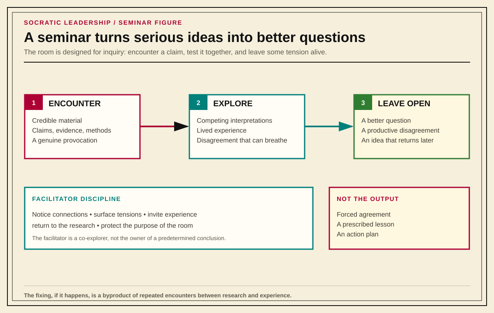{#fig-socratic-session-shape}

## ELMO: Enough, Let's Move On

It is a sign of success when participants begin imagining practical applications. It is also the point where the seminar can accidentally become a planning meeting.

Any participant may say **ELMO: Enough, Let's Move On** when the discussion has moved from exploring the material into designing a solution. ELMO is not used to suppress disagreement or prevent real examples. It protects the seminar from being consumed by implementation work that belongs somewhere else.

If someone wants to try an idea, the facilitator can ask what they imagine trying. The group does not have to design the experiment during the seminar.

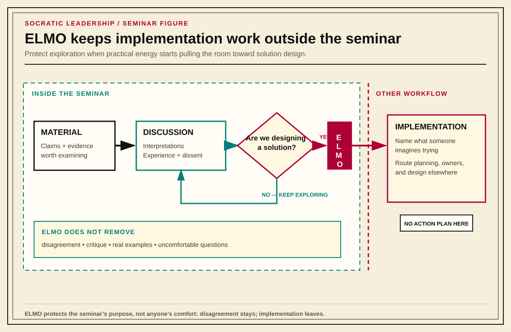{#fig-socratic-elmo-boundary}

## The Whiteboard

Use the whiteboard minimally. Its purpose is to hold threads of thought while the conversation unfolds.

Useful entries include:

- themes participants notice
- questions that surface
- tensions or contradictions
- brief examples from experience
- a parking lot for important topics that do not fit the session

The board should not drive toward decisions, owners, deadlines, or action items. At the end of the session, it is evidence of thinking, not a plan.

A photograph of the board may be shared with the next session's topic. No additional artifact is required.

## Facilitator Discipline

The hardest facilitation requirement is genuine curiosity. The facilitator must be willing for experienced leaders to reject the material, interpret it differently, or reach no conclusion at all.

The useful stance is not "these people need to learn this." It is "these people have experience the research may not capture; I want to understand what happens when the two meet."

Questions that preserve that stance include:

- What systemic pressure makes the recommended behavior difficult?
- What does lived experience reveal that the research does not?
- Why might a reasonable leader choose the apparently weaker approach?
- Which assumption does the disagreement expose?

## Measurement Boundary

The seminar is a deliberately unmeasured input. Attendance proves presence. A worksheet proves that a worksheet was completed. Neither proves that a leader's mental model changed.

That does not make the seminar unfalsifiable. Its effects, if any, should eventually appear downstream: better coaching behavior, more thoughtful allocation of developmental reps, stronger facilitation, useful references to earlier discussions, or participants voluntarily requesting the next reading.

Do not attribute those outcomes directly to the seminar. The causal claim would be stronger than the evidence. The honest signal is that ideas return without being forced.

The failure mode is not that the seminar lacks a score. The failure mode is measuring everything so aggressively that the organization stops investing in forms of learning that do not measure cleanly.

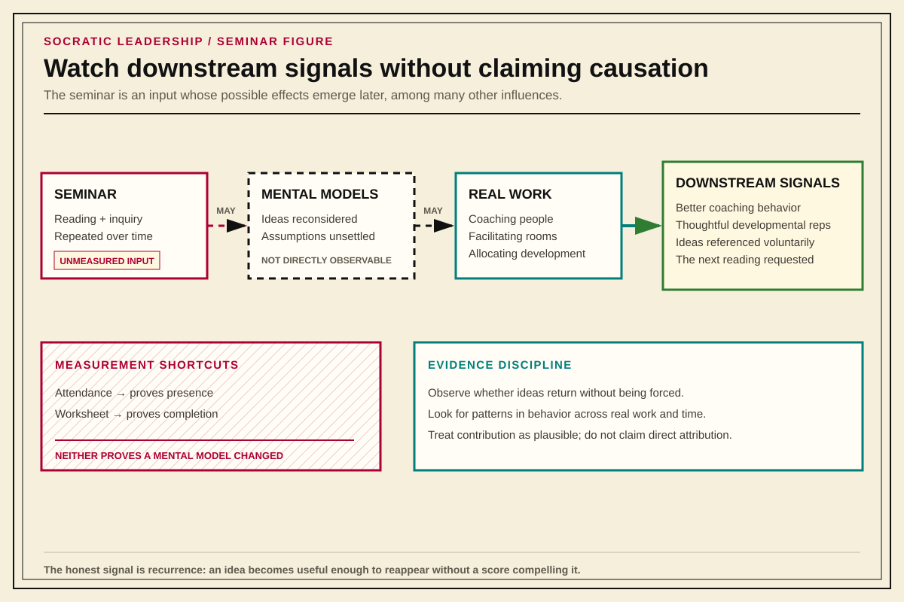{#fig-socratic-signals-not-scores}

## The Long Game

The value compounds across sessions.

After several meetings, participants may begin connecting new material to earlier conversations. Later, they may bring their own research, test an idea in real work, or recognize a management pattern they previously lacked language for.

The seminar does not exist to fix leaders. It creates a recurring place where leadership thinking happens. That is enough work for one room.

<!-- Preview assembly source: Socratic-Leadership-Seminar.md, complete article -->
